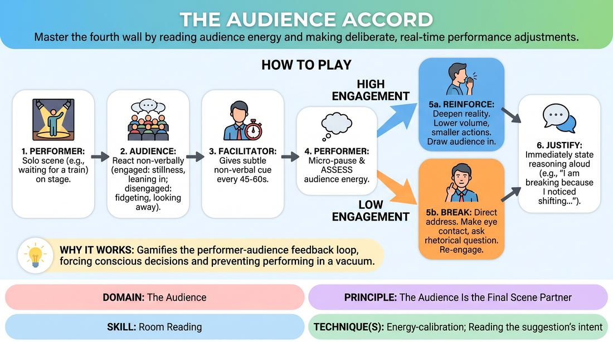

# 🎲 Drill B — under load — The Fourth Wall Accord

{ .infographic }

> Master the fourth wall by reading audience energy and making deliberate, real-time performance adjustments.

`Players 3–99` · `~25 min` · `Complexity 3/5` · `Energy medium` · `Contact none` · `Props: none`

⬅️ [Back to the Week 07 run-sheet](../week-07.md)

## Why this activity, here

Week 7 is match play, and the room stops being a rehearsal space and becomes an audience. Drill A warms the short-form muscle; this block isolates the read itself before the format games in the second half, where reading and playing happen at once. It feeds the tag-team rounds later: performers who can name what the room is doing will stop chasing laughs and start taking what is offered.

## What students actually learn

- They stop guessing what the room feels and start pointing at evidence — a shifting shoulder, a held breath, three people leaning.
- They discover that dropping volume can pull an audience in harder than pushing.
- They separate noticing from panicking; the cue gives them a legal moment to look up instead of flailing mid-line.
- They feel the difference between earning attention and asking for it.

## Setup

Clear a playing area about three metres wide against one wall. Seat everyone else in a shallow arc facing it, close enough that facial detail reads. Chairs only, no tables. You stand at the side of the audience where the performer can see you without turning. No props needed; mime everything. Have a list of eight low-action premises on a card so you never stall. If the room is over seventeen, mark a second playing area at the far end and brief a second cue-giver before you start.

## How to run it — 25 minutes

| Min | What you do |
|---:|---|
| 3 | Frame it. Two moves only: Reinforce or Break. Demonstrate the nod cue yourself, then demonstrate one micro-beat read so they see how short it is. Say the cue: earn it, never beg. |
| 2 | Calibrate the audience. Call "engaged" and "drifting" alternately while they practise showing it in the body. Point out what actually reads from the stage and what does not. |
| 4 | First performer. Give a premise. Cue at 45–60 seconds, three times. Side-coach openly during this one so everyone learns the shape. Ten seconds of notes at the end. |
| 4 | Second performer. Same structure, four cues, less coaching from you. Ask the audience afterwards whether the read matched what they were doing. |
| 4 | Third performer. Add the constraint that at least one cue must be answered with Reinforce. Watch for volume dropping rather than energy dropping. |
| 4 | Fourth performer. Add the constraint that a Break must last no more than two sentences before returning to the world. No apologising to the audience. |
| 4 | Final performer, cues at 30 seconds. Faster reads, shorter reasoning — three words maximum. Cut on the last cue and hold the room silent for five seconds before debrief. |

## Side-coaching script

| When | Say |
|---|---|
| Audience over-acts disengagement in the first minute | *"Real reactions only. Don't perform boredom."* |
| Performer freezes on the first cue | *"Look up. One thing you can see."* |
| The read takes too long and the scene dies | *"Micro-beat. Take it and go."* |
| Performer chooses Reinforce | *"Quieter. Make them come to you."* |
| Performer chooses Break and starts pleading | *"Talk to them, don't ask them for anything."* |
| Reasoning turns into an explanation | *"Name the evidence. Six words."* |
| After any adjustment | *"Straight back in. No reset."* |
| Performer starts adding jokes to win the room | *"Earn it. Never beg."* |

!!! success "What good looks like"
    The performer keeps playing while their eyes do the work. The micro-beat is a beat, not a stop. Reinforce actually goes quieter and the audience physically leans forward — you will see it happen. Breaks are direct and unbothered, two sentences, then gone. The reasoning is a flat statement of fact, not a defence. Audience reactions stay honest enough that the performer's read is usually correct, and when it is wrong, someone says so cheerfully afterwards.

## When it goes wrong

| You see | What's causing it | The fix |
|---|---|---|
| The audience hams up boredom — exaggerated yawns, theatrical slumping — and everyone laughs. | They have found the funnier game. Fake signals make the drill unreadable. | Stop the scene. Reset the rule: react as you genuinely are, and if you are genuinely engaged, show that. Restart with the same performer so they get a clean read. |
| Every cue produces a Break. Reinforce never gets chosen. | Breaking feels active and safe; staying in the world feels like doing nothing. Also, performers assume any silence means failure. | Mandate Reinforce on the next two cues. Tell them silence and stillness are the strongest engagement signal in the room, not the weakest. |
| The spoken reasoning becomes a monologue about their own performance. | Self-consciousness leaking out; the drill has become a confession booth. | Cap it at six words. Model one yourself: "Reinforcing; back row is still." Then call "go" hard so they cannot linger. |
| Breaks turn into desperate joke attempts and the performer keeps checking your face. | They are reading you, not the room, and treating Break as permission to entertain. | Move to where they cannot see you easily. Restate the cue: a Break is contact, not a bid. Give one performer a Break that must be a plain statement of what they want. |

## Scaling

| Class size | What changes |
|---|---|
| **10–13** | One playing area. Five performers get a turn at four minutes each; the rest are audience throughout. Cue every 60 seconds so the smaller audience has time to shift visibly. Tell the audience their signals matter more here — with twelve bodies, one person leaning in changes the read. |
| **14–17** | One playing area, five performers, four minutes each as written. Cue at 45 seconds. Seat the audience in two shallow rows so the performer must read depth as well as width. Name a front-row watcher whose only job is to report afterwards whether the reads were accurate. |
| **18–20** | Split into two groups of nine or ten at opposite ends of the room, facing away from each other. Brief a cue-giver in each — a participant with the nod cue and a watch. Each group runs four performers at four minutes. You float, side-coach one group at a time, and pull both groups together for the last four minutes to watch one performer at 30-second cues. |

## Variations

**Called Reads** — Instead of choosing, the performer only names what they see on each cue — "three people still, one looking at the door" — and carries on with no adjustment.  
*Easier. Removes the decision and trains the perception alone. Use it if the room is freezing on the fork.*

**Silent Ledger** — Drop the spoken reasoning. The performer adjusts without comment; the audience writes down which move they think was chosen and why. Compare at the end.  
*Harder. The read has to be legible from the outside without narration, which is what live playing actually requires.*

**Two-Hander** — Two performers share the scene. On the cue, only the one who is not speaking may adjust, and their partner must absorb the change without stopping.  
*Different emphasis. Shifts the skill from solo control to reading the room while also holding a partner, which is the state they play in during formats.*

## Debrief

1. **What did you actually see that made you choose Break?**
   > *A good answer sounds like:* Concrete and physical: "Two people on the left looked at each other, and the front row had stopped moving with me." Not "it felt flat." If they can name the body, move on.

2. **When you chose Reinforce and went quieter, what happened in the room?**
   > *A good answer sounds like:* They describe the audience moving toward them, or the room getting more still. Someone in the audience confirms it. The point is landing when they notice that reducing worked.

3. **Where in that drill were you tempted to beg?**
   > *A good answer sounds like:* An honest naming of the moment — the pause after a Break, or the second the laugh didn't come. Good answers include what they did instead, or what they wish they had done.

!!! warning "Safety & inclusion"
    No physical contact in this activity. Nobody has to take the stage alone: offer the Two-Hander version, the cue-giver role, or the front-row watcher role to anyone who would rather not solo, and offer it privately before you begin rather than in front of the room. Being visibly ignored by nineteen people is uncomfortable by design, so name that out loud at the top and make one rule explicit — disengagement is played as neutral drifting, never as mockery, eye-rolling or laughter at the performer. Stop the drill immediately if it tips that way. Anyone with hearing differences should be seated in the front row so the volume drops in Reinforce remain audible. Standing is not required; the performer may sit and still play the scene.

## Why it works

Room reading fails in live performance because noticing and responding collapse into one panicked moment — the performer senses drift and immediately overcorrects by pushing harder or begging for a laugh. This drill prises those two things apart. The cue creates a scheduled, legal moment to look up, so the read is not stolen from the scene. The two-option fork removes the flailing: there is no third choice, so the decision costs almost nothing. Then the spoken reasoning makes the read auditable — the performer must produce evidence, and the audience can confirm or contradict it, which calibrates perception against reality rather than against anxiety. Repeating the cycle three or four times inside one scene means the performer experiences the room changing and their own adjustment changing it back, which is the causal loop behind the cue: attention is taken by giving the audience something to come toward, not by asking them for it.

[Open the full activity card »](../../../../games/D5_P1_S1_T1_G016__the-audience-accord.md){target=_blank rel=noopener}
