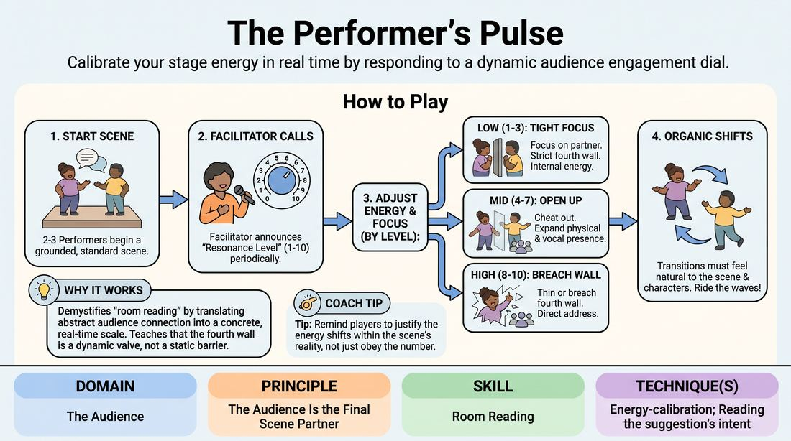

# 🎯 Scene Lab — The Resonance Dial

{ .infographic }

> Calibrate your stage energy in real time by responding to a dynamic audience engagement dial.

`Players 3–99` · `~35 min` · `Complexity 3/5` · `Energy medium` · `Contact none` · `Props: none`

⬅️ [Back to the Week 07 run-sheet](../week-07.md)

## Why this activity, here

Week 7 puts short-form under pressure, and short-form lives or dies on how players read a house. Earlier weeks built scene grounding; this block adds an outward channel on top of it without letting the scene collapse into pandering. It feeds directly into the match-play format later in the session, where players have to sense a room's temperature with no facilitator calling numbers.

## What students actually learn

- They stop treating the audience as either invisible or as the only thing in the room, and start holding both.
- They notice they already have a physical vocabulary for openness — cheating out, widening, lifting the voice — and can use it deliberately.
- They feel the difference between acknowledging a room and begging it, in their own body, not as a note.
- They discover a scene can survive a fourth-wall break if the character's state carries it.

## Setup

Clear a playing area with the group seated facing it as a house. Chairs in an arc, not a circle — you want a real front. You need a visible spot to stand at the side where players can hear you but aren't looking at you. No props. Write the numbers 1-10 on a whiteboard with three bands marked: 1-3 closed, 4-7 open, 8-10 through, if the room likes a visual anchor. Have suggestions ready in case the house goes quiet.

## How to run it — 35 minutes

| Min | What you do |
|---:|---|
| 4 | Explain the three bands. Demonstrate each yourself with one volunteer for ten seconds apiece — closed, open, through — so the room sees the physical difference before anyone has to produce it. |
| 5 | First scene. Two players. Give them thirty seconds of clean platform before you touch the dial, then move slowly: 2, 5, 2. Small range on purpose. |
| 5 | Second scene, fresh players. Use the full range including an eight or nine. Call the shifts faster, roughly every thirty seconds. |
| 5 | Third scene, three players. Note aloud when someone shifts before the character does. Push for at least one nine that stays inside the story. |
| 5 | Fourth scene. Add short reads with the numbers — "four, they're patient", "nine, they're with you." Players respond to the read, not just the digit. |
| 5 | Final scene: hand the dial to the house. Two audience members alternate calling numbers. Players don't know who's calling. Run four minutes, then cut. |
| 6 | Debrief seated. Take the questions below. Close by naming the cue and let it stand without elaboration. |

## Side-coaching script

| When | Say |
|---|---|
| Thirty seconds in, before the first number | *"Platform first. Who, where, what."* |
| Calling a low number | *"Two. Shrink the world. Still reach the back row."* |
| Calling a mid number | *"Six. Open the door. Don't walk through it."* |
| Calling a high number | *"Nine. Let them in. Stay in the story."* |
| A player snaps between levels like a switch | *"Through the character. Not the dial."* |
| A player addresses the house and abandons the scene | *"Come back. Bring them with you."* |
| Players go quiet and shrink under a low number | *"Small isn't quiet. Play it clear."* |
| Last thirty seconds of any scene | *"Finish the thought. Land it."* |

!!! success "What good looks like"
    The scene keeps running through every number. You see body angle, volume and eyeline change while the story stays continuous. At an eight, a player looks out and the look means something in character — a plea, a smirk of complicity, a check that someone else saw what they saw. At a two, the pair are tight and specific and you can still hear every word. The house laughs at things that happened, not at players asking for it. Nobody says the number out loud.

## When it goes wrong

| You see | What's causing it | The fix |
|---|---|---|
| On high numbers, players turn front and start doing stand-up. The scene stops. | They read "break the wall" as "leave the scene". No model for a break that stays in character. | Cut, and demonstrate: same line, once as a comment to the audience, once as a character confiding in them. Restart at the same number. |
| On low numbers, everything drops to a mumble and the back row loses the scene. | They're equating intimacy with volume, not with focus. | Call "small isn't quiet" and make them replay the last thirty seconds at the same closeness with twice the projection. |
| Visible gear changes — a player hears "seven" and repositions their feet mid-sentence. | They're obeying you rather than absorbing the number. | Tell them to take the number in and let it change the next thing they want, not the current thing they're doing. Delay the shift by one line. |
| Scenes get sillier as the numbers rise and nobody is playing anything. | High resonance is being read as permission to abandon commitment. | Run a scene where you never go above six. Show them the room can be warm without anyone reaching for it. |

## Scaling

| Class size | What changes |
|---|---|
| **10–13** | Run as written. Six scenes possible if they move quickly; five is plenty. Everyone plays at least once, most play twice. Keep the whole group in the house for every scene. |
| **14–17** | Trim scenes to four minutes each and add a sixth scene in place of two minutes of debrief. Use three-player scenes for rounds three and four so more people get up. Roughly two-thirds of the room plays. |
| **18–20** | Split the house in two after the demo. Run two playing areas at opposite ends for rounds two and three, with an assistant or a confident participant calling the dial in one while you call the other. Reconvene as one house for the last three scenes so everyone sees a full-room read. Accept that some people only play once. |

## Variations

**Two bands only** — Cut the dial to closed (1-5) and open (6-10). Call one or the other, nothing between.  
*Easier. Removes the judgement about how much to open and lets nervous players feel the two extremes cleanly first.*

**Silent dial** — Hold up fingers instead of calling. Players must catch the number in peripheral vision without looking away from their partner.  
*Harder. Forces genuine peripheral awareness of the house, which is what actually happens in performance.*

**Honest dial** — Stop calling numbers. Call only what you genuinely observe in the room — "they've gone quiet", "someone at the back just checked their phone" — and let players decide the response.  
*Different emphasis. Moves from executing a level to interpreting a room, which is the skill the numbers were standing in for.*

## Debrief

1. **When did opening up help the scene, and when did it cost you something?**
   > *A good answer sounds like:* Someone names a specific moment — "the nine gave me a laugh but I lost where we were and had to rebuild." They're talking about trade-offs, not about whether breaking the wall is allowed.

2. **What did your body actually do differently between a three and a seven?**
   > *A good answer sounds like:* Concrete physical detail: feet turned out, chin up, more air behind the voice, standing further apart. Not "I felt more open." You want the mechanics named so they can repeat them.

3. **Where's the line between letting the audience in and asking them for something?**
   > *A good answer sounds like:* They locate it in intention rather than technique — a look out that shares something versus a look out that waits for a response. Someone usually mentions a moment they caught themselves fishing.

4. **When the house was calling the dial, what changed for you?**
   > *A good answer sounds like:* They noticed the numbers matched what they could already feel, or didn't. Either answer is useful. The good version is specific about what information they were getting from the room without being told.

!!! warning "Safety & inclusion"
    No contact is required. If a scene moves towards touch, players negotiate it in the moment or play it at a distance — say this before the first scene. Direct address can feel exposing for people who have never performed; make clear that a knowing glance counts as a nine and nobody has to speak to the house. Anyone can pass on going up, and you fill the slot without comment. Watch for the person who has played once and keeps volunteering; spread the rounds deliberately. If the room is very quiet, the numbers still work — say so, so nobody reads a silent house as failure.

## Why it works

Room reading normally develops slowly and by accident, because a performer only gets one reading per show and no feedback on whether it was right. This compresses the loop: a player gets six or seven distinct room-states in five minutes, each with an immediate physical response and an immediate visible result on the scene. Calling the number externally removes the guesswork so the body can learn the response first; the honest-dial variation and the audience-called round then hand the reading back. The cue holds because the exercise separates the two things that look alike from the outside — a high number is permission to include the house, never to solicit it, and players feel the difference in their own gut the moment they cross it.

[Open the full activity card »](../../../../games/D5_P1_S1_T1_G054__the-performer-s-pulse.md){target=_blank rel=noopener}
