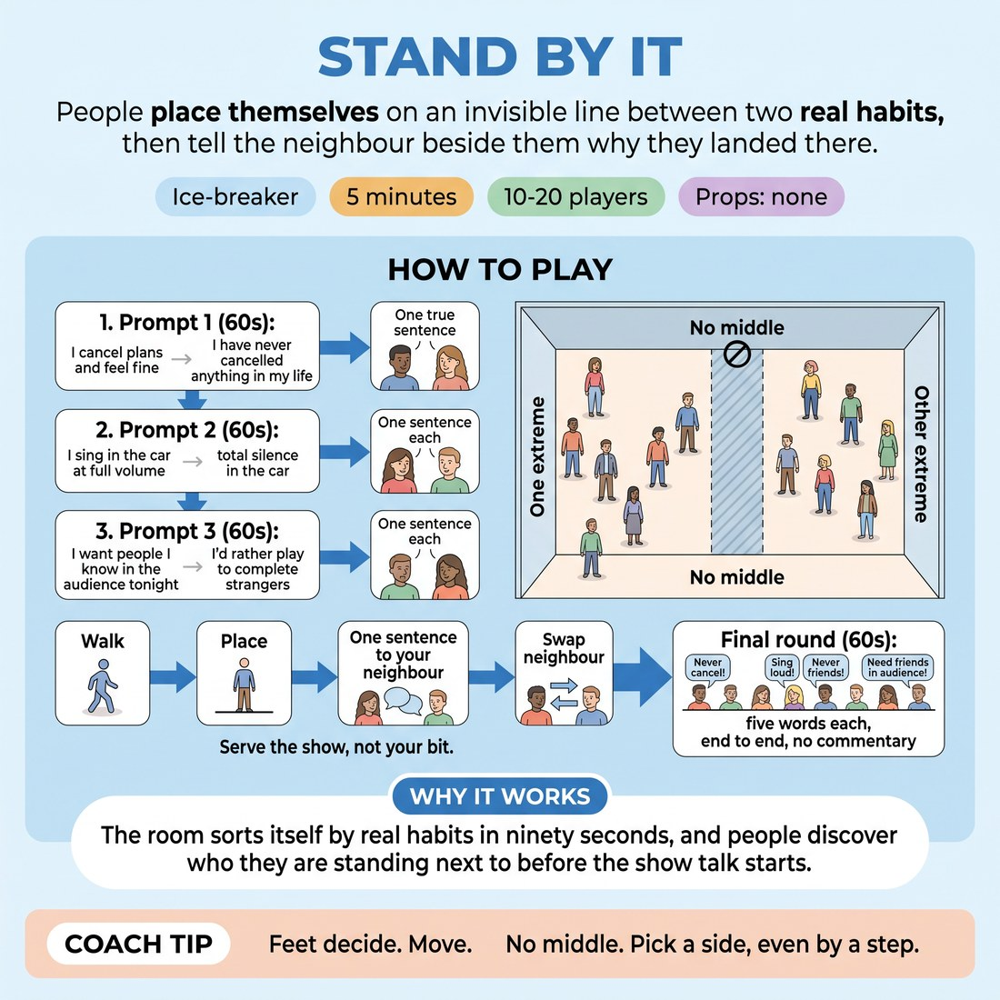

# 🧊 Ice-breaker — Stand By It

{ .infographic }

> People place themselves on an invisible line between two real habits, then tell the neighbour beside them why they landed there.

`Players 10–20` · `~5 min` · `Complexity 2/5` · `Energy medium` · `Contact none` · `Props: none`

⬅️ [Back to the Week 08 run-sheet](../week-08.md)

## Why this activity, here

Week 8 is showcase day. This is the first thing in the room and it runs before any warm-up of the body or voice. It gets everyone standing, committed and speaking within five minutes, and the third prompt surfaces who is nervous about friends in the house before anyone has to admit it out loud. It feeds directly into the audience-energy work: they have already seen the room disagree about what an audience is for.

## What students actually learn

- Committing to a position, even a mild one, is faster and less painful than hedging.
- Their nerves about tonight are a spread across the room, not a private defect.
- A short true sentence to one person is enough contact to feel part of the group.

## Setup

Clear a straight run of floor from one wall to the other. Push chairs back. No props. Know your three prompts by heart so you can call them without reading. Decide before class which wall is which end and stick to it all four rounds.

## How to run it — 5 minutes

| Min | What you do |
|---:|---|
| 1 | Name the line and the two walls. Ban the middle. Call prompt one — cancelling plans. They walk and place. Twenty seconds each with the nearest person, one true sentence. |
| 1 | Call prompt two — singing in the car. They walk and re-place. New neighbour. Twenty seconds each, one sentence. |
| 1 | Call prompt three — people you know in tonight's audience versus complete strangers. Walk, place, new neighbour, one sentence each. |
| 1 | Freeze the line. Run along it end to end: five words or fewer each on the last prompt. Keep it moving, no commentary. |
| 1 | Tell them to look at the shape of the line. Ten seconds of looking. Break to the circle without discussion. |

## Side-coaching script

| When | Say |
|---|---|
| As they first walk out | *"Pick a side. No middle."* |
| When people stall between walls | *"Body first, reason later."* |
| Starting each partner exchange | *"One sentence. True, not clever."* |
| Ten seconds into a pairing | *"Swap. Other person."* |
| When someone re-places next to the same person | *"New neighbour every round."* |
| During the call-along | *"Five words. Keep it moving."* |
| If someone editorialises during the call-along | *"No commentary. Next."* |
| Before the break to circle | *"Look at the line. Then circle up."* |

!!! success "What good looks like"
    People move quickly and land off-centre without agonising. The pairs are talking in low, quick, unforced voices. The call-along runs like a drumbeat — no pauses, no laughs sought, no one adding a second thought. On the last prompt the line is genuinely spread, and people notice that.

## When it goes wrong

| You see | What's causing it | The fix |
|---|---|---|
| A crowd bunched at the exact centre of the room. | They are hedging because both ends sound like a judgement on them. | Say the middle is banned again and add "a step is enough". Physically walk through the centre so it is occupied and they have to shift. |
| Pairs still talking after you call the swap, running the round long. | They have treated it as a conversation rather than a sentence each. | Cut in over them with the next prompt. Do not wait for silence. The exercise recovers on the next round. |
| The five-word call-along turns into jokes and the line laughs at each one. | It is showcase day and someone is warming up their bit. | Call "no commentary" and speed the tempo. Point at the next person before the last has finished. Speed removes the room for performance. |
| One or two people hang back near a wall and never move between rounds. | Reluctance to be read, or a mobility issue you have not been told about. | Take the prompt to them — "where would you be?" — and accept a pointed answer. Do not make an example of it. |

## Scaling

| Class size | What changes |
|---|---|
| **10–13** | One line, full width of the room. Everyone speaks in the call-along; it takes about thirty seconds. Keep all three prompts and the full twenty seconds per person in pairs. |
| **14–17** | One line still. Tighten pair time to fifteen seconds each so the rounds hold. The call-along is the tight part — point at people in sequence to keep it under forty-five seconds. |
| **18–20** | Run two parallel lines down the room, both using the same two walls. Pairs happen within each line. For the call-along, run line one end-to-end, then line two, and drop pair time to twelve seconds each to buy the space. |

## Variations

**Show of hands first** — Before each walk, ask for a quick hand-raise for each end, then send them to the floor.  
*Easier — people see the spread before committing, so standing alone at a wall feels less exposed.*

**Silent placement** — Run rounds two and three with no talking at all. Place, look along the line, re-place if you want, move on.  
*Harder — removes the explanation that lets people justify a hedged position, and forces the body to answer.*

**Performance habits only** — Replace all three prompts with performing ones: play safe or play risky, lead or support, want notes or want to be left alone.  
*Different emphasis — surfaces ensemble roles directly before a showcase rather than warming up general disclosure.*

## Debrief

1. **Which prompt made you hesitate longest?**
   > *A good answer sounds like:* Someone names the audience prompt and says they wanted to be at both ends, or that they moved once they saw where others stood. Two or three answers is plenty — move on.

2. **Looking at the last line, what did the shape tell you about tonight?**
   > *A good answer sounds like:* "We're spread out." "I thought everyone wanted their mates in." Enough that the room registers the spread as normal. Do not chase agreement.

!!! warning "Safety & inclusion"
    No contact in this activity. If anyone cannot stand or walk the distance, let them mark a position by pointing or by placing a chair on the line — the placement counts the same. Any prompt can be answered with "pass" in the call-along; say so once at the start and do not return to it. Nothing here requires disclosing anything personal beyond a habit, and the third prompt in particular may touch nerves about tonight — take answers, do not probe them.

## Why it works

Audience-energy management starts with reading a room's spread rather than assuming it. The line makes that spread physical and instant: within four minutes each person has taken a position, defended it in one sentence, and seen where they sit relative to everyone else. Banning the middle forces commitment, which is the same muscle used when serving a show — a decision made and stood behind rather than hedged. The five-word call-along removes the reward for elaborating, which is the cue in miniature: contribute your bit, keep the show moving, sit down.

[Open the full activity card »](../../library/icebreakers/IB__stand-by-it.md){target=_blank rel=noopener}
