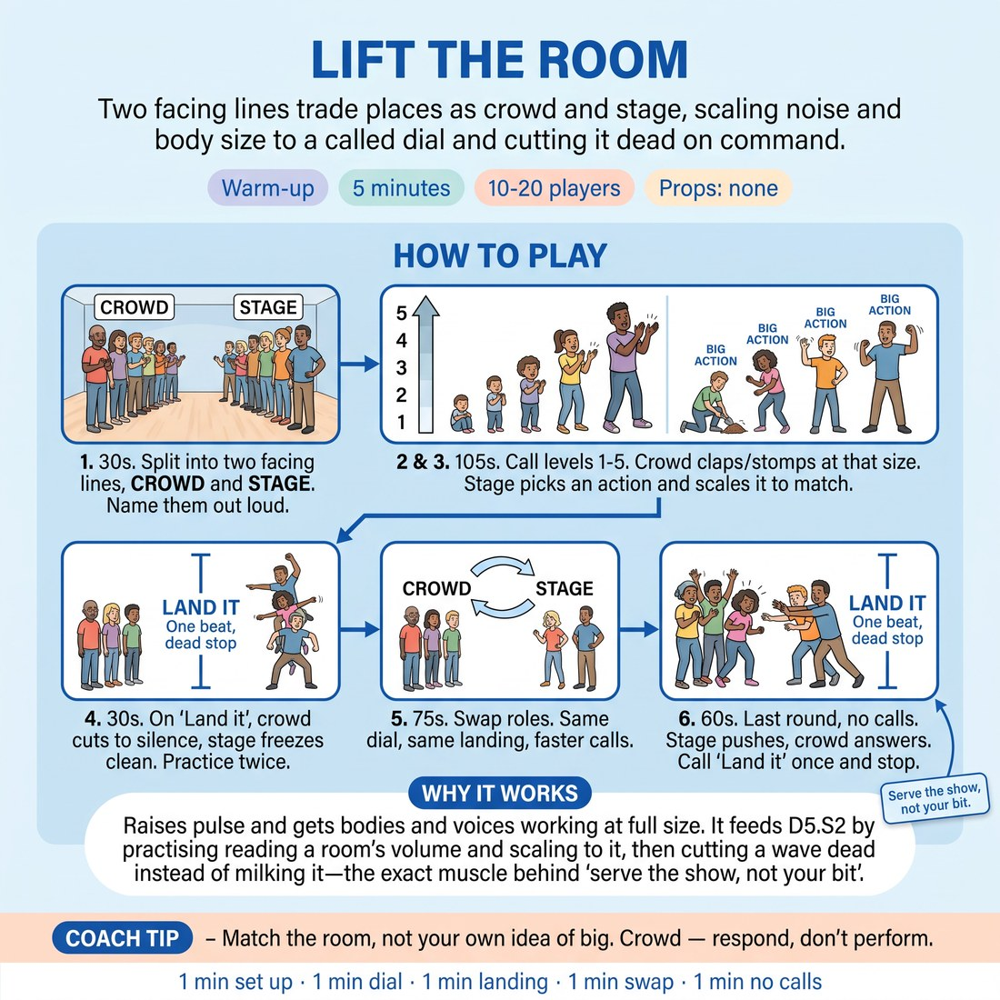

# 🔥 Warm-up cluster — Lift the Room

{ .infographic }

> Two facing lines trade places as crowd and stage, scaling noise and body size to a called dial and cutting it dead on command.

`Players 10–20` · `~5 min` · `Complexity 2/5` · `Energy high` · `Contact none` · `Props: none`

⬅️ [Back to the Week 08 run-sheet](../week-08.md)

## Why this activity, here

It opens showcase week. The room walks in either flat or wired, and both states wreck a match. Before anyone plays a scene for a paying audience, they feel the loop between what a stage does and what a house gives back. Everything later in the session — the format runs, the callbacks, the sightlines — sits on the fact that they have already handled a crowd deliberately rather than hoping one arrives.

## What students actually learn

- That crowd energy is a dial they can read and answer, not weather that happens to them.
- That the body scales before the voice does — bigger arms read as louder than a shout.
- That ending clean is a skill in itself, and a room will follow a decisive stop.
- That matching the house is a choice made in service of the show, not a surrender of their idea.

## Setup

Clear floor for two facing lines with two metres between them. No chairs, no props. Check the room next door is not mid-scene before you licence stomping. Have a hard stop in mind — five minutes means five minutes.

## How to run it — 5 minutes

| Min | What you do |
|---:|---|
| 1 | Form the two lines. Name crowd and stage aloud. Teach the dial one to five, run it up and back down once so everyone hears what five actually is. |
| 1 | Line B picks a repeating action. Call numbers at random — three, one, five, two. Line B scales to the number the crowd is giving, not to their own comfort. |
| 1 | Introduce 'Land it'. Crowd cuts to silence in one beat, stage freezes clean. Practise twice. Then a short burst of dial calls ending in a landing. |
| 1 | Swap sides without discussion. New stage picks actions on the spot. Same dial, same landing, calls twice as fast. Two landings inside the minute. |
| 1 | Final round, no calls. The stage pushes or pulls; the crowd answers honestly. Call 'Land it' within twenty seconds. Two sentences of framing, then move on. |

## Side-coaching script

| When | Say |
|---|---|
| First run up the dial | *"Five is the whole body. Show me five."* |
| Stage side is playing its own level | *"Read the room, not your plan."* |
| Actions have shrunk into the shoulders | *"Bigger arms. Let the body carry it."* |
| Crowd is politely half-clapping at four | *"Give them something to answer."* |
| Just before the first landing | *"Land it — one beat, dead stop."* |
| After a soggy freeze | *"Freeze clean. Land it again."* |
| Fast calls on the swap | *"Two. Five. One. Keep up."* |
| Final no-call round | *"Serve the show, not your bit."* |

!!! success "What good looks like"
    The two lines move as one instrument. When you call five the floor shakes and the stage side is fully extended; when you call one you can hear breathing and the actions are tiny but still alive. Landings are instant — no trailing claps, no giggling wobble in the freeze. In the last round the stage side takes the room up without asking permission, and the crowd meets it inside a second.

## When it goes wrong

| You see | What's causing it | The fix |
|---|---|---|
| Everyone plays at three regardless of the number called. | Nobody wants to be the loudest person in the room at nine in the morning. | Stop. Run the crowd alone at five for five seconds with you stomping in it. Then restart. Ceiling raised by demonstration, not instruction. |
| Landings dribble out — a few extra claps, a laugh, then quiet. | They hear 'Land it' as a suggestion rather than a beat. | Call it again immediately and count the beat out loud: 'Land it — now.' Repeat until one landing is genuinely silent, then move on. |
| Stage side keeps changing their action to something funnier. | They are chasing a laugh instead of playing the dial. | Name it lightly: one action, whole round. Point out that the interesting change is the size, not the idea. |
| The final no-call round drifts to a mushy medium and never resolves. | Nobody on the stage side is willing to lead the push. | Let it drift for ten seconds, then call 'Land it' and say so in the framing. It is useful data for the showcase, not a failure to hide. |

## Scaling

| Class size | What changes |
|---|---|
| **10–13** | One pair of lines, five or six a side. Run the dial calls slower so each person is audible; the crowd is thin, so ask for genuine five. Keep all six steps as written. |
| **14–17** | One pair of lines still. Cut the practice landings from two to one on the first side to protect time. Calls on the swap can be very fast — the crowd is big enough to turn quickly. |
| **18–20** | Two pairs of lines running side by side, facing across the room, with one facilitator calling for both. Everyone plays, nobody watches. Drop the final no-call round to fifteen seconds so both pairs land together. |

## Variations

**Crowd only** — Skip the stage side entirely. Whole room is the crowd; you run the dial and the landings for the full block.  
*Easier — removes the pressure of being watched and gets a nervous or very new group to full volume faster.*

**Silent dial** — Hold up fingers instead of calling numbers, and use a flat palm for the landing. No voice from you at all.  
*Harder — forces the stage side to keep peripheral attention on a signal while committing to a big physical action.*

**Stage leads** — Cut the number calls after the first thirty seconds. The stage side sets the level with their bodies; the crowd matches whatever they are given.  
*Different emphasis — shifts from reading the house to driving it, which is what the showcase openers actually need.*

## Debrief

1. **What made you go bigger — the number, or the other line?**
   > *A good answer sounds like:* Someone says they stopped listening to the call and started riding the other line. That is the loop working. Move on.

2. **What did the clean landing feel like from the stage side?**
   > *A good answer sounds like:* 'Powerful' or 'scary' or 'like I was in charge of it.' Anything that names the stop as an active choice rather than an ending imposed on them.

!!! warning "Safety & inclusion"
    No contact in this activity. Stomping is optional — offer clapping, thigh-slaps or a vocal 'hup' as equal alternatives and say so before the first run, not after someone opts out. Anyone with hearing sensitivity stands at the end of a line nearest the door and can step out for the fives; tell the room this is available. Watch for anyone with a knee, hip or back issue during stomping and remind them size can live in the arms. Keep the two lines two metres apart so nobody swings into anybody.

## Why it works

Audience-energy management fails when performers treat the house as fixed. This activity makes the house a live variable that responds within one beat, so the causal link becomes physical rather than theoretical: you go bigger, they go louder; you cut, they cut. Because the roles swap, everyone has felt both ends of the same wire inside four minutes. The landing teaches the harder half — that energy you raised is yours to put down, and a room stops when someone means it. By the time they run the showcase format they are already treating the crowd as a scene partner: something to read and answer, in service of the show rather than the bit.

[Open the full activity card »](../../library/warmups/WU__lift-the-room.md){target=_blank rel=noopener}
