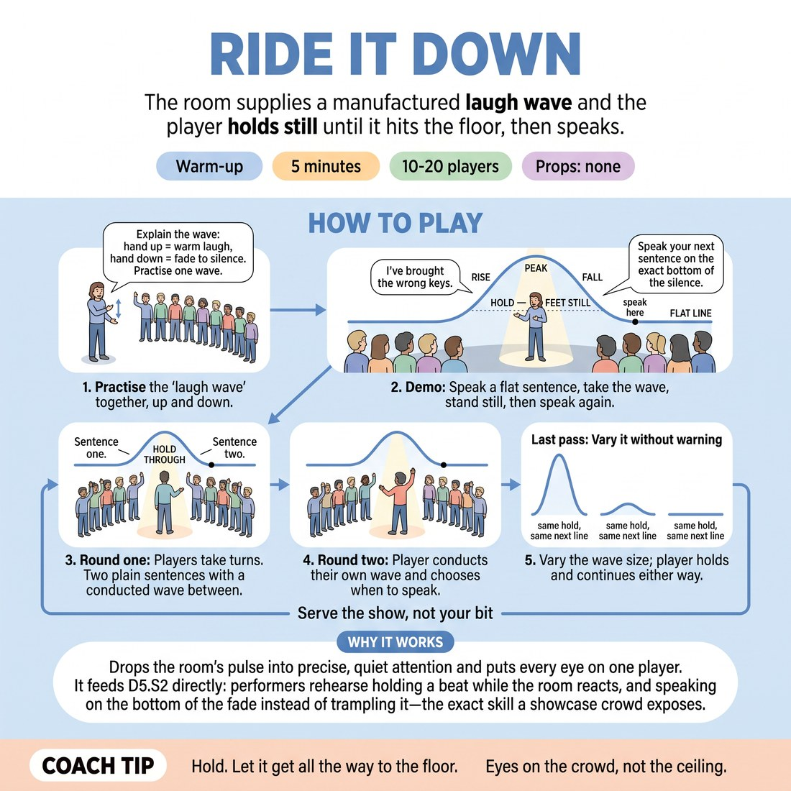

# 🔥 Warm-up cluster — Ride It Down

{ .infographic }

> The room supplies a manufactured laugh wave and the player holds still until it hits the floor, then speaks.

`Players 10–20` · `~5 min` · `Complexity 3/5` · `Energy low` · `Contact none` · `Props: none`

⬅️ [Back to the Week 08 run-sheet](../week-08.md)

## Why this activity, here

It opens showcase week. The room has spent seven weeks making scenes for each other; tonight strangers laugh at them, and the first big laugh is where most beginners rush, mug or drop the scene. This five minutes installs the physical habit of waiting, and everything after it — the match rounds, the genre pieces — assumes players can survive being enjoyed.

## What students actually learn

- A laugh is weather that passes, not a verdict to answer.
- They can stand still while being looked at and nothing bad happens.
- The bottom of a laugh is a place with a floor, and you can feel it arrive.
- No laugh is not a failure — the next line goes in either way.

## Setup

Clear one open spot with room for one person to stand. Arrange everyone else in a wide arc facing it, standing. No chairs, no props, no notes. Know your own flat sentence before you start. Check the room next door is not in a quiet exercise.

## How to run it — 5 minutes

| Min | What you do |
|---:|---|
| 1 | Explain the wave and the hand signal. Run one practice wave together, up and fully down. Then take the spot and demo: flat sentence, wave, stand still, second sentence on the silence. |
| 2 | Round one. Players take the spot in arc order. Two plain sentences each, you conduct the wave between them. Rotate immediately, no feedback, no laughs from you between turns. |
| 1 | Round two. Same order, continuing from where you stopped. The player raises their own hand to call the wave and chooses the moment to cut it and speak. You say nothing. |
| 1 | Last pass. Give four or five players an unannounced wave: enormous, tiny, or none at all. They hold and speak regardless. Stop on time and move straight on. |

## Side-coaching script

| When | Say |
|---|---|
| During the practice wave, if it dies raggedly | *"All the way down. Find the floor together."* |
| First player, as the wave peaks | *"Feet still. Let it wash."* |
| A player speaks over the tail of the laugh | *"Too early. Wait for the floor."* |
| A player grins or plays to the arc | *"Don't chase it. It's not yours."* |
| Rotation is slowing between turns | *"Next. Straight in."* |
| Round two, a player holds the wave too long | *"Cut it. Now."* |
| Last pass, a player gets no laugh at all | *"Nothing came. Same line, same weight."* |
| Final ten seconds | *"Last one. Serve the show, not your bit."* |

!!! success "What good looks like"
    Players stand still with their weight settled while the arc laughs, eyes forward, face unchanged. The second sentence lands in real silence at the same volume as the first. Turns rotate with no gaps. By the last pass, the player who gets nothing looks the same as the player who gets a roar.

## When it goes wrong

| You see | What's causing it | The fix |
|---|---|---|
| The manufactured laugh curdles into embarrassed giggling and the arc breaks eye contact. | The group thinks it is laughing at the person rather than operating a machine. | Stop. Say the laugh is a sound effect and you are conducting it. Run two waves on an empty spot with nobody standing there, then resume. |
| Players speak the second sentence while the laugh is still fading. | Silence feels much longer from the spot than from the arc. | Call 'wait for the floor' and let one player stand a full three seconds past the end. Ask the arc whether it felt long. It won't have. |
| Players start writing punchlines into their two sentences. | Being laughed at makes people want to have earned it. | Reject the line out loud and hand them one: 'The bus was late.' Reset the wave. Plainer lines make the exercise work. |
| Rotation stalls and only six people get a turn. | You are commenting between turns, or players are hesitating to step out. | Say nothing at all between turns. Call the next name before the previous player has left the spot. |

## Scaling

| Class size | What changes |
|---|---|
| **10–13** | Everyone takes round one and round two. Give the last pass to four players chosen at random. Two sentences each throughout. |
| **14–17** | Round one covers roughly the first ten in arc order. Round two continues from where you stopped so the rest get their turn. Last pass to four, drawn from those who went earliest. |
| **18–20** | One turn per person, not two. Round one covers ten, round two covers the remainder, last pass takes four volunteers who already went. Cut each turn to one sentence, wave, one sentence, and call names ahead. |

## Variations

**Arc first** — Run the whole first round with the player facing away from the group. They hear the wave but see nobody.  
*easier — removes the eye contact that makes people rush*

**Two-wave hold** — Conduct a wave, let the player start their second sentence, then bring a second wave up on top of it. They stop, hold, and restart the sentence from the beginning on the silence.  
*harder — trains recovery mid-line, which is what actually happens in a show*

**Wave in a scene** — Two players start a thirty-second scene. Conduct a wave at a random moment. Both hold, then continue the scene from exactly where it stopped, same subject.  
*different emphasis — moves the skill from solo poise to shared scene memory under interruption*

## Debrief

1. **What did the silence at the bottom feel like from the spot?**
   > *A good answer sounds like:* Longer than it was, and then oddly comfortable. Someone naming the moment they stopped wanting to fill it.

2. **What changed when you got no laugh at all?**
   > *A good answer sounds like:* An honest admission of the small drop, followed by noticing the next line worked the same. Not 'I didn't mind'.

3. **Where does this go tonight?**
   > *A good answer sounds like:* Concrete: when the audience laughs, stop, let it finish, then continue the scene that was already happening — rather than adding a topper.

!!! warning "Safety & inclusion"
    No contact at any point. Anyone may pass the spot and remain in the arc; say so before round one and again before the last pass. Warn that the group laugh is loud — offer a soft-hum version to anyone with sound sensitivity, and let them stand at the arc's edge. Keep the laughs warm and even; if anyone starts a pointed or mocking laugh, stop and reset once. Nobody's own material is used, so nothing personal is on the line.

## Why it works

Audience-energy management fails because the laugh arrives as information — approval — and the player answers it. Here the laugh carries no information: you switch it on regardless of what was said, and the sentences are deliberately flat. That breaks the link between the sound and the player's worth, leaving only the mechanical problem of when to speak next. Repeating the hold under a big wave, a small one and none at all builds one response for all three, so on stage the player treats the laugh as timing rather than judgement. That is the whole of 'serve the show, not your bit'.

[Open the full activity card »](../../library/warmups/WU__ride-it-down.md){target=_blank rel=noopener}
