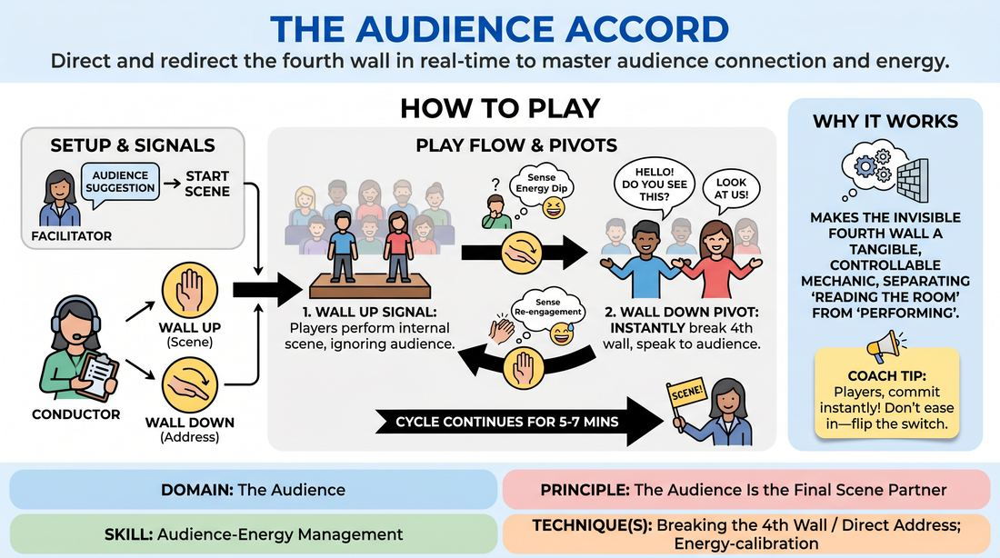

# 🎲 Drill A — isolation — The Fourth Wall Conductor

{ .infographic }

> Direct and redirect the fourth wall in real-time to master audience connection and energy.

`Players 3–99` · `~25 min` · `Complexity 3/5` · `Energy medium` · `Contact none` · `Props: none`

⬅️ [Back to the Week 08 run-sheet](../week-08.md)

## Why this activity, here

Week 8 is the showcase. Every earlier week trained scene craft with the audience treated as furniture. This is the first block that makes the audience an instrument the players read and play. It isolates one variable — where the attention is pointed — before Drill B puts it inside full match or genre format, where nobody will be holding a signal.

## What students actually learn

- They stop treating the audience as a passive judge and start treating it as information they can read while playing.
- They find out their scene survives a break to direct address. The internal reality does not shatter; it waits.
- They learn what riding a laugh physically feels like, instead of talking through it and losing the line.
- They notice their own bit-protecting instinct — the urge to finish the funny thing — and hand the decision over to someone watching the room.

## Setup

Chairs in a shallow arc facing an open playing area, wide enough that 'the back row' is a real place. Leave one clear standing spot at the downstage edge for the Conductor, side-on, where players can see the signal in peripheral vision and the Conductor can see every face in the seats. No props needed. Have a scrap of paper for noting who has played and who has conducted.

## How to run it — 25 minutes

| Min | What you do |
|---:|---|
| 3 | Demonstrate both signals yourself. Wall Up: flat palm to the players. Wall Down: open sweep to the seats. Say the cue: serve the show, not your bit. Take one suggestion. |
| 2 | Dry-run the signals with the whole group standing. You conduct. On Wall Down everyone turns out and says one line to the seats. On Wall Up everyone turns back in. Repeat four times. |
| 5 | Round one. Two players, one Conductor. Full scene, five switches minimum. Call 'Scene!' at four minutes and spend one minute asking the Conductor what they saw in the room. |
| 5 | Round two. New players, new Conductor. Same shape. Tell this Conductor to drop the wall only on dips, never on peaks. Note aloud how that changes the scene's rhythm. |
| 5 | Round three. New players, new Conductor. Free choice of when to drop. Tell players that while the wall is down they must confess something, not explain something. |
| 2 | Silent round. Same players stay in. You conduct fast — switches every fifteen seconds. Players must keep the story continuous across every flip. Stop it dead at two minutes. |
| 3 | Debrief seated. Two questions, quick answers, no speeches. Name who has not yet conducted and mark them for the next block. |

## Side-coaching script

| When | Say |
|---|---|
| Wall is up and players are cheating out toward the seats | *"Wall's up. Give me your back if you need to."* |
| The instant the Conductor drops the wall | *"Open out. Back row."* |
| A laugh starts while a player is still talking | *"Ride it. Don't talk through it."* |
| A player uses direct address to summarise the plot | *"Confess, don't explain."* |
| Conductor is watching the players instead of the seats | *"Eyes off the stage. Read the room."* |
| Wall goes up and players hesitate | *"Straight back in. Same breath."* |
| A player keeps milking after the beat has landed | *"Serve the show, not your bit."* |
| Last thirty seconds of any round | *"Land it. Wall up, finish inside."* |

!!! success "What good looks like"
    The switches are clean and instant — no shuffle, no glance at the Conductor for confirmation. When the wall drops, voices get bigger and bodies square to the seats without being told. When it goes up, the scene resumes mid-thought rather than restarting. The seated group is visibly warmer during direct address and stays leaning in when it ends. The Conductor's drops correlate with something you can see happening in the room, and at least once a Conductor cuts a player off mid-laugh and the scene is better for it.

## When it goes wrong

| You see | What's causing it | The fix |
|---|---|---|
| On Wall Down, players tell the audience what is happening in the scene — 'so I'm his brother and I've just found out about the money.' | They read direct address as narration, which is the safest use of it and the deadest. | Stop the scene. Say: the audience already saw that. Tell them what your character would never say out loud in the scene. Restart from the same moment. |
| The Conductor drops the wall every ten seconds, and the scene never accumulates anything. | Nervous conducting. They think action equals doing their job. | Give them a floor: minimum forty seconds between drops. Make them name, out loud afterwards, the specific thing in the room that triggered each drop. |
| Players stay half-out after Wall Up — feet to the audience, voices still projected outward. | Direct address feels safer than eye contact with a scene partner, so they linger there. | Call 'give me your back' as it happens. If it persists, make them physically turn a quarter away from the seats on every Wall Up for one round. |
| The seated group goes flat and stops reacting entirely, so the Conductor has nothing to read. | They have watched four scenes and slipped into student mode rather than audience mode. | Stop. Tell the seats their job is to react honestly and audibly, not to assess. Move them one row closer. Run the next round shorter. |

## Scaling

| Class size | What changes |
|---|---|
| **10–13** | One playing area, two-handers, four rounds. Everyone gets one turn either onstage or conducting; track it on paper. Move the arc close so the back row is only three metres away, or the projection note becomes meaningless. |
| **14–17** | One playing area, three-handers in rounds two and three so more people cycle through. Keep round length as written but cut the Conductor's post-round comment to twenty seconds. Expect two or three people to conduct rather than play — that is a real turn, not a consolation. |
| **18–20** | Keep one audience; splitting halves the energy the Conductor needs to read. Run three-handers throughout and shorten each scene to three minutes, using the recovered minutes for a fifth round. Accept that four or five people will only sit and conduct today; write their names down and put them onstage first in Drill B. |

## Variations

**Called switches** — You conduct all rounds yourself and announce 'wall down' and 'wall up' aloud instead of signalling.  
*Easier. Removes the peripheral-vision problem and lets nervous players concentrate on the pivot itself.*

**Two conductors** — Assign a Conductor to each player. Each drops and raises independently, so one player can be talking to the audience while the other is still inside the scene.  
*Harder. Forces players to hold two realities at once and to make the mismatch part of the story.*

**Audience conducts** — Retire the Conductor. The wall drops whenever the seated group laughs, and goes back up when the laugh dies. Players must sense both edges unaided.  
*Different emphasis. Shifts from obeying a read of the room to making the read yourself, which is what the showcase actually demands.*

## Debrief

1. **When the wall dropped, what did you say — and would your character have said it inside the scene?**
   > *A good answer sounds like:* A player identifies a specific line as a confession or a private complaint, and notices they could not have said it to their scene partner. Weak answers describe plot recaps; push once, then move on.

2. **Conductors — name one moment you dropped the wall and say what you saw in the room that made you do it.**
   > *A good answer sounds like:* They point to something observable: a laugh dying early, three people checking the door, a lean-in on a particular line. Vague answers about 'the energy' need one follow-up: what did you actually see?

3. **Whose turn got cut off mid-laugh, and what happened to the scene?**
   > *A good answer sounds like:* Someone admits they wanted to keep going and the scene was better without it. That is the cue landing. If nobody says it, name the moment yourself and move to Drill B.

!!! warning "Safety & inclusion"
    No physical contact in this drill. Direct address is exposing for people who have spent seven weeks hiding behind a scene partner, so make conducting a full, named turn rather than a sideline — some will choose it and that is fine. Never send players into the seats and never single out an individual audience member for a line; address the group. If a player freezes on Wall Down, raise the wall yourself immediately and let the scene continue. Anyone can pass on a round without giving a reason.

## Why it works

Audience-energy management fails when it is taught as an attitude. Here it is externalised: someone else holds the decision, so the player cannot confuse serving the room with finishing their own funny thing. The signal makes the choice visible and non-negotiable, and repeating the pivot dozens of times builds the physical habit — square up, project, ride, drop — before the judgement is handed back. Rotating the Conductor role means every player spends time watching faces instead of playing, which is where the reading skill is actually built. The cue lands because being cut off mid-bit, by a peer, in front of the room, is a felt experience rather than a note.

[Open the full activity card »](../../../../games/D5_P1_S2_T3_G011__the-audience-accord.md){target=_blank rel=noopener}
