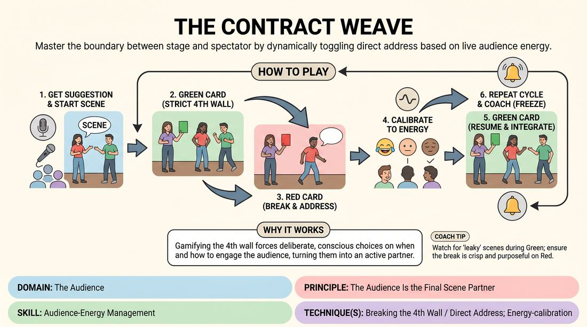

# 🎲 Drill B — under load — The Fourth Wall Weave

{ .infographic }

> Master the boundary between stage and spectator by dynamically toggling direct address based on live audience energy.

`Players 3–99` · `~25 min` · `Complexity 3/5` · `Energy medium` · `Contact none` · `Props: required`

⬅️ [Back to the Week 08 run-sheet](../week-08.md)

## Why this activity, here

Week 8 is the showcase. Drill A has warmed the ensemble on scene basics under performance conditions; this block puts the audience relationship itself under load. It feeds directly into the match or genre night, where players must hold scenes while also managing a live room — hosting, tagging, riding a laugh, rescuing a flat moment. The red card is the artificial version of what will happen for real in a few hours.

## What students actually learn

- They stop treating the audience as a wall to ignore or a judge to please, and start treating it as a third scene partner with a mood.
- They can drop out of a scene and back into it without losing the thread — the scene survives the interruption.
- They learn to read what silence means before filling it, rather than reflexively pushing harder.

## Setup

Two cards, A5 or bigger, one green one red, held where every player can see them without turning upstage. A bell or clicker. Chairs in a shallow arc for the watching half, playing area clear in front of them — actual audience geometry, not a circle. You stand at the side of the playing area, visible to the players, out of the audience's eyeline. No props.

## How to run it — 25 minutes

| Min | What you do |
|---:|---|
| 4 | Explain the two cards and demonstrate. Take a volunteer, play thirty seconds of scene with them, flip red yourself and address the room, flip green and carry on. Show the two-second turnaround. |
| 5 | First pair up. Run two-minute scenes with card flips roughly every thirty seconds. Do not use the bell yet — let them find the mechanic badly. Two pairs in this window. |
| 2 | Stop everything. Give the room one collective note: the commonest fault so far, usually apologetic direct address or a dead re-entry. Name the cue: serve the show, not your bit. |
| 6 | Second round. Shorten the intervals — some flips at fifteen seconds. Use the bell freely now, freezing and restarting from position. Three pairs through, roughly ninety seconds each. |
| 5 | Final round with a deliberately quiet audience: instruct watchers to withhold laughter for the first thirty seconds. Players must handle silence in direct address. Two or three pairs. |
| 3 | Debrief standing, in the audience arc. Two questions, quick answers. Finish by restating the cue and naming when they will use it tonight. |

## Side-coaching script

| When | Say |
|---|---|
| A player turns fully upstage during green | *"Open the angle. They paid to see your face."* |
| Red card up and nobody has moved | *"Somebody take it. Now."* |
| Direct address is mumbled or hedged | *"Bigger. Land the line, then stop."* |
| The room laughs and the player talks over it | *"Let it finish. Ride the wave."* |
| The room is silent and the player pushes harder | *"Name the silence. Don't fight it."* |
| Green returns and the scene restarts cold | *"Pick it up mid-thought. Same scene."* |
| A player is doing standup instead of hosting | *"One line, then back in."* |
| Late in the last round, everything is working | *"Serve the show, not your bit."* |

!!! success "What good looks like"
    The flip is almost invisible in the wrong direction — you see a player pivot out to the room, deliver one clean line, and pivot back into a scene that hasn't stopped breathing. Direct address is short, audible, and specific to what the audience just did, not a generic aside. When the room is silent, the player acknowledges it rather than overselling. Watchers laugh in the right places and lean forward in the quiet ones.

## When it goes wrong

| You see | What's causing it | The fix |
|---|---|---|
| Direct address becomes a comedy set — the player faces front and does forty seconds of material. | They've read the red card as permission to leave the scene, and the audience attention is more rewarding than the scene partner. | Cap it out loud: one sentence, maximum two. Ring the bell on anything longer and restart from the moment before the flip. |
| The scene dies at every green flip — players stand there and restart with 'So, anyway…' | Nothing was actually happening in the scene, so there is nothing to return to. | Before the next pair, make them establish a physical activity and a relationship in the first fifteen seconds. Re-entry needs something to re-enter. |
| Players glance at you constantly, waiting for the card. | Anxiety about missing a flip has pulled focus off the partner. | Move the cards to the back of the audience arc, at eye level. They can see them peripherally without breaking the scene sightline. |
| Audience goes flat and stays flat, so calibration has nothing to work with. | Watchers have slipped into evaluation mode, judging rather than responding. | Rotate watchers into playing every ninety seconds. A room that expects to be up next stays warm. |

## Scaling

| Class size | What changes |
|---|---|
| **10–13** | One playing area. Pairs. Every person plays at least once across the three rounds; you have room for eight or nine pair-turns in twenty-five minutes. Keep flips at thirty seconds. |
| **14–17** | One playing area still — the audience half is the point. Use threes rather than pairs in round two so more people cycle through; the third player becomes the designated red-card responder for that scene. Trim each turn to seventy-five seconds. |
| **18–20** | Split into two rooms or two ends of the space if you have a second facilitator with a second card set. If you are alone, stay single-focus, run threes throughout, and accept that four or five people watch only. Tell them that up front and give them a job: track which direct addresses landed and report in the debrief. |

## Variations

**Called flips** — Instead of cards, say 'out' and 'in' aloud. Players don't have to watch for a visual cue.  
*Easier. Removes the split attention and lets nervous players focus purely on the transition.*

**Silent house** — Instruct the audience not to react at all for a whole round — no laughter, no noise. Players still must calibrate.  
*Harder. Forces them to work from body language and stillness rather than volume, which is what a real dead room gives you.*

**Host and scene** — One player is the permanent host who owns all red-card moments; two others hold the scene and never break. Rotate the host each turn.  
*Different emphasis. Shifts from individual toggling to ensemble handover — closer to how a match night actually runs.*

## Debrief

1. **When the room went quiet, what did you assume it meant, and what did you do about it?**
   > *A good answer sounds like:* Something specific and unflattering — 'I assumed I was dying so I got louder, and it got worse.' Or 'I said out loud that we'd lost them and they laughed.' Move on once someone distinguishes between reading the room and panicking at it.

2. **What made a re-entry work versus fall flat?**
   > *A good answer sounds like:* They name the mechanic: the scene had somewhere to go, or the player picked up mid-action rather than restarting. Weak answers say 'it just felt smoother' — push once, then move.

3. **Tonight, when do you drop the bit for the show?**
   > *A good answer sounds like:* A concrete instance — 'if the tag's landing better than my joke, I give it away.' Anything that names giving something up rather than adding something is a good sign.

!!! warning "Safety & inclusion"
    No contact in this activity. If a player is uncomfortable with direct address, let them take the green-card role only and pass the red moment to their partner — no explanation required, and say so before the first round. Being watched by the whole group is the load here; keep turns short so nobody is exposed for long. Watch for anyone who freezes on a red flip and bail them out with the bell rather than letting them stand there. Chairs available throughout; direct address works seated.

## Why it works

Audience-energy management fails when performers treat the audience as either invisible or as the only thing in the room. The card forces rapid alternation between those two states, so the switch stops being a decision and becomes a reflex. Because the flips are unpredictable, players cannot pre-plan their direct address — they have to build it from whatever the room just did, which is the actual skill. And because the audience is other students who will be onstage in ninety seconds, the feedback is honest and immediate rather than polite. The cue lands because the drill repeatedly punishes the longer, funnier aside and rewards the short one that gets back to the scene.

[Open the full activity card »](../../../../games/D5_P1_S2_T3_G025__the-contract-weave.md){target=_blank rel=noopener}
