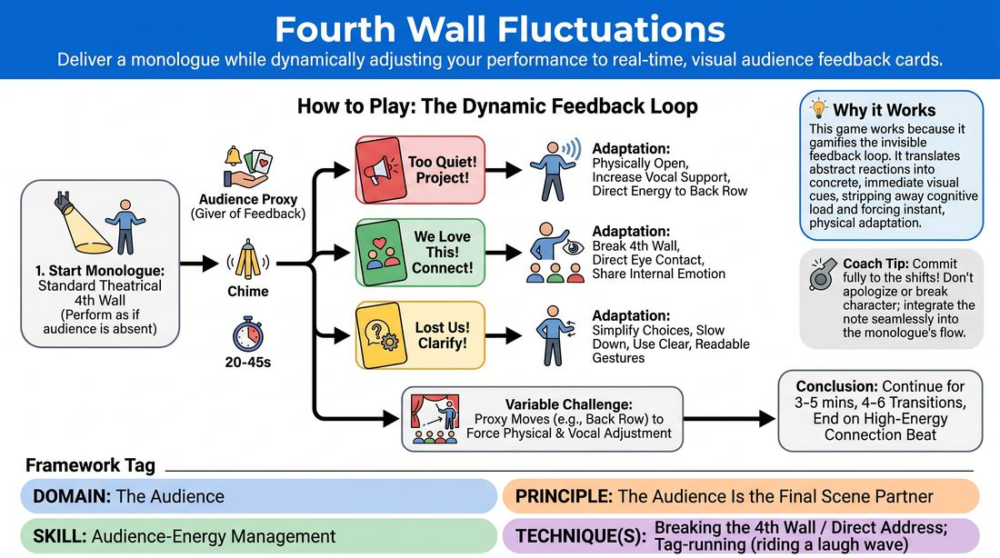

# 🎯 Scene Lab — Fourth Wall Fluctuations

{ .infographic }

> Deliver a monologue while dynamically adjusting your performance to real-time, visual audience feedback cards.

`Players 2–99` · `~35 min` · `Complexity 3/5` · `Energy medium` · `Contact none` · `Props: required`

⬅️ [Back to the Week 08 run-sheet](../week-08.md)

## Why this activity, here

Week 8 is showcase week. They have spent seven weeks learning to serve the scene and each other; tonight a paying room enters the equation. Earlier blocks fixed the material. This block trains the other half — noticing what the room needs and changing while still going. It feeds directly into the match or genre night, where a host's read of the crowd and a player's willingness to adjust mid-scene decide whether the evening lands.

## What students actually learn

- They stop treating an audience note as criticism and start treating it as information they can act on inside the next breath.
- They find out they have three usable gears — bigger, warmer, clearer — and can change gear without restarting.
- They discover their default setting. Most people live in one mode and have never been asked to leave it.
- They feel the difference between serving the room and defending their own material.

## Setup

Clear a playing area with a genuine back wall — you need distance for PROJECT to mean anything. Chairs in a loose arc for each group's audience. Print three A5 cards per group in thick marker: PROJECT, CONNECT, CLARIFY. One bell, chime, glass and spoon, or bunch of keys per group. A visible timer. Before you start, tell everyone the monologue subject: something real and low-stakes — a room they know well, a journey they take often, an object they own. Nobody needs to be funny and nobody needs to confess anything.

## How to run it — 35 minutes

| Min | What you do |
|---:|---|
| 4 | Lay out the three cards and say what each one demands physically. Then demo: start a dull monologue about your kitchen, have someone chime and raise cards, take each one mid-sentence. Keep the demo under ninety seconds. |
| 5 | Whole room on its feet, no monologue. Everyone counts to twenty out loud together. Call PROJECT, CONNECT, CLARIFY in random order; they switch mode on the call while still counting. Calibrate the three gears in the body first. |
| 8 | Split into groups. Each group works its own corner. Ninety-second turns, three cards per turn, Proxy stays seated and stationary. Get through as many performers as the group can. Everyone in the group is the audience — attention on, phones away. |
| 8 | Same groups, new Proxy each turn. Now the Proxy walks — back of the space, side, behind the audience — so the performer must re-aim. Ninety-second turns again, four cards. Anyone who has not gone yet goes first. |
| 6 | Full room reconvenes as one audience. Take two or three volunteers who want stage time before the showcase. Two-minute turns, five cards, Proxy roaming, finish on CONNECT. Applaud each one properly. |
| 4 | Sit down where you are. Run the debrief questions. End by naming the cue out loud and connecting it to the showcase running order. |

## Side-coaching script

| When | Say |
|---|---|
| A performer freezes when the first card appears | *"Keep talking. Take it in the next breath."* |
| PROJECT is up and volume rises but the body stays closed | *"Open the chest. Give it to the back wall."* |
| CONNECT is up and they scan the room without settling | *"One face. Stay there."* |
| CLARIFY is up and hands are still busy | *"Hands quiet. Say it plainer."* |
| A performer keeps commenting on the cards | *"Don't announce the note. Just be different."* |
| The Proxy moves and the performer stays front-on | *"Follow the room. Turn your voice."* |
| Energy dips near the end of a turn | *"Last thirty. Find the room."* |
| CONNECT tips into showing off | *"Serve the show, not your bit."* |

!!! success "What good looks like"
    The chime goes, the card goes up, and the change arrives within two or three words — no gap, no apology, no glance at the facilitator. You can tell from the back of the room which card is up without seeing it. The monologue keeps its thread throughout; the adjustments are to size and address, not to subject. When the Proxy walks to the side wall, the performer's body finds them. The final CONNECT beat lands on actual faces, and the room's attention visibly sharpens for it.

## When it goes wrong

| You see | What's causing it | The fix |
|---|---|---|
| The performer stops dead, reads the card aloud, then restarts the sentence. | They are treating the card as an instruction to be obeyed rather than a condition to absorb. Usually the demo was too tidy. | Re-demo badly on purpose — take a card mid-word and keep going. Tell the Proxy to hold cards low and to one side so they are seen peripherally, not read head-on. |
| CONNECT turns into a stand-up bit — winking, working the crowd, chasing laughs. | The only model of direct address most people have is a comedian doing crowd work. | Stop the turn. Say the cue. Restart with the instruction: share one private thought with one person, quietly. Warmth, not volume. |
| Monologues collapse after forty seconds — nothing left to say. | The subject was too thin, or they chose something abstract they cannot see in their head. | Reassign to a concrete physical space they know: their kitchen, their commute, a shop near them. Tell them to describe what is on the shelves. Detail buys time. |
| The Proxy fires cards every ten seconds and the turn becomes chaos. | Nerves on the Proxy's part, plus no visible clock. | Put a timer where the Proxy can see it and give the interval out loud — twenty seconds minimum between cards. Coach the Proxy to let a change settle before the next chime. |

## Scaling

| Class size | What changes |
|---|---|
| **10–13** | Two groups of five or six, one in each half of the room. Ninety-second turns throughout. Everyone gets a turn in the second round and most get two. Take three volunteers for the full-room round. |
| **14–17** | Three groups of five or six. Cut turns to seventy-five seconds in the first round so every group clears its members. Rotate the Proxy every turn. Two volunteers for the full-room round. |
| **18–20** | Three groups of six or seven. Sixty-second turns, three cards, in the first round; ninety seconds in the second. Accept that two or three people will only perform once — prioritise them for the moving-Proxy round. Two volunteers at the end, two minutes each. |

## Variations

**Two gears** — Use PROJECT and CONNECT only. Proxy stays seated. Turns of sixty seconds with two cards.  
*Easier. Removes the hardest card — CLARIFY asks people to judge their own clarity while speaking — and halves the decision load for a nervous group.*

**Contradiction** — Add a fourth card: TOO MUCH — PULL BACK. Two Proxies work at once and may raise different cards. The performer chooses which need is more real and plays it.  
*Harder. Forces a judgement about what the room actually wants rather than obedience to a signal, which is closer to a live house.*

**Two-hander** — Run it as a two-person scene instead of a monologue. Cards are aimed at one player only; the other keeps playing the scene straight and must absorb the shift.  
*Different emphasis. Moves the skill from solo address to adjusting audience energy without abandoning a scene partner — which is what the showcase actually demands.*

## Debrief

1. **Which card was hardest to take, and what happened in your body when it went up?**
   > *A good answer sounds like:* Something specific and physical: "CLARIFY — I went stiff and quiet instead of clear," or "CONNECT made me want to be funny." Not "they were all fine." Move on once two or three people have named a real bodily response.

2. **When you were watching, could you tell which card was up?**
   > *A good answer sounds like:* Watchers describe what they saw from outside — "you got louder but I still couldn't hear the ends of words", "you slowed down and I suddenly followed the story." The point is that adjustment is visible to a room, not private.

3. **On Saturday night, what is your version of the chime?**
   > *A good answer sounds like:* They name a real signal available in a live show: coughing, phone light, a laugh dying early, the back row leaning back. Someone should say they will watch a specific thing. Vague answers about "vibes" mean push once more, then close.

!!! warning "Safety & inclusion"
    No physical contact in this activity. Eye contact is the one demand that can bite: tell the room that anyone uncomfortable holding a gaze may look at foreheads or the space just past a shoulder, and that audience members may look away at any point without it counting as a failed CONNECT. Say up front that the monologue subject is deliberately mundane — no one needs to disclose anything personal, and anyone drifting somewhere heavy can switch subject mid-turn. Volume work strains voices: warn against pushing from the throat, and let anyone with a cold, a voice injury or a hearing difference sit out PROJECT and play the other two cards. Standing is not required; a seated performer can do all three. Anyone can pass on the full-room round with no comment from you.

## Why it works

D5.S2 is about managing audience energy, and the usual obstacle is not skill but latency. A live performer feels something vague from the room, spends several seconds interpreting it as judgement, and by the time they respond the moment has moved. This activity replaces the vague feeling with a discrete visible signal and removes the interpretation step entirely — the card already says what the room needs. What remains is the motor act of changing, repeated often enough in one block to become reflex rather than deliberation. The moving Proxy adds spatial re-aiming, so the adjustment lives in the whole body and not just the volume knob. And because the cards arrive without regard for where the performer is in their material, they learn the cue: the room's need outranks the plan.

[Open the full activity card »](../../../../games/D5_P1_S2_T3_G039__fourth-wall-fluctuations.md){target=_blank rel=noopener}
