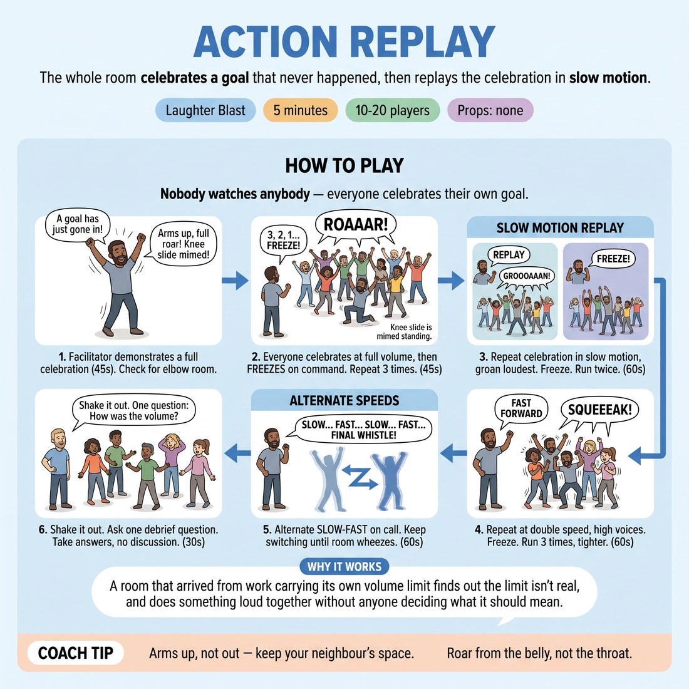

# 😄 Laughter Blast — Action Replay

{ .infographic }

> The whole room celebrates a goal that never happened, then replays the celebration in slow motion.

`Players 10–20` · `~5 min` · `Complexity 1/5` · `Energy high` · `Contact none` · `Props: none`

⬅️ [Back to the Week 01 run-sheet](../week-01.md)

## Why this activity, here

First block of the first week back. The room has been apart, some of them for months, and they arrive polite and self-monitoring. This puts everyone at full volume simultaneously before anyone can decide whether they feel like it, and hands them the session skill in physical form: the tempo changes are picked up from the edges of the room, not by staring at a leader. It feeds the group-mind work that follows and sets the noise floor for the whole three hours.

## What students actually learn

- Their voice at full volume stops being a decision and becomes available.
- They can lock to a shared tempo using sound and peripheral vision, without turning their head.
- Speed and size are dials they can be told to move, not fixed personal settings.

## Setup

No props. Clear floor, everyone standing, spread so each person can swing both arms without contact. Push chairs and bags to the walls first. Know your own exit lines: 'FREEZE', 'REPLAY', 'FAST FORWARD', 'SLOW', 'FAST', 'FINAL WHISTLE'. Warn the room next door if the walls are thin.

## How to run it — 5 minutes

| Min | What you do |
|---:|---|
| 1 | Spread them out and check elbow room. Demonstrate the goal celebration yourself, alone, full commitment. Then count down from three and run the first full-volume five-second burst. Call 'FREEZE'. |
| 1 | Run two more full-volume bursts, five seconds each, freezing between. Then call 'REPLAY' and take them through slow motion twice — low groan, arms dragging, freeze at the end. |
| 1 | Call 'FAST FORWARD'. Three rounds at double speed with squeaky voices, five seconds each, freeze between. Make each one tighter and louder than the last. |
| 1 | Alternate 'SLOW' and 'FAST' on your call, roughly every eight seconds, no pauses. Keep switching until they are laughing too hard to keep the shape. Call 'FINAL WHISTLE'. |
| 1 | Shake out arms, legs, face. Ask: what did you use to know when to switch. Take three answers. No discussion. Move to the next block. |

## Side-coaching script

| When | Say |
|---|---|
| Before the first countdown | *"Eyes forward. Nobody watches anybody."* |
| First full-volume burst, if it comes out thin | *"Louder than is polite."* |
| Entering slow motion | *"Drag it. Every joint heavy."* |
| During fast forward | *"Same shape, half the time."* |
| On the first alternation | *"Switch on my word, not after it."* |
| Mid-alternation, when the room starts syncing | *"Take the tempo off the room, not off me."* |
| Just before the last switch | *"One more. Everything you have left."* |
| On the final whistle | *"Freeze. Breathe. Shake it out."* |

!!! success "What good looks like"
    Full-volume noise from everyone at the same instant, not a ripple. Slow motion that actually looks slow — sustained groan, weight in the legs — rather than a slightly reduced normal speed. On the alternations the switch lands together within about half a second, and it lands even though nobody is staring at you. People are laughing at the end and slightly out of breath.

## When it goes wrong

| You see | What's causing it | The fix |
|---|---|---|
| Half the room is doing a small, apologetic version with hands near the chest. | They are checking whether it is safe to be big, which means they are watching each other instead of committing. | Stop, name it without blame, and go again with your own version twice the size. Repeat 'nobody watches anybody' before the countdown. |
| Slow motion looks like normal speed with a quiet voice. | They have dropped the volume but not the tempo — the body is still on standard time. | Side-coach 'drag it, every joint heavy' and demonstrate one arm rising over four full seconds. Make your groan longer than theirs. |
| The switches between SLOW and FAST arrive raggedly, spread over two seconds. | They are waiting to see what neighbours do before committing, so the change propagates instead of landing. | Call 'switch on my word, not after it', then make the next two calls sharp and close together so hesitation is not possible. |
| Two or three people stand still, arms folded, mouthing it. | Volume in front of a new room feels exposing, and they have decided to sit this one out. | Do not single them out. Keep the pace up — most join by the third fast-forward. Let anyone who stays out mark it silently at their own scale. |

## Scaling

| Class size | What changes |
|---|---|
| **10–13** | One group, everyone in. Run exactly as written. With a smaller room the sound is thinner, so add a fourth full-volume burst in the opening minute and cut one slow-motion repeat. |
| **14–17** | One group, exactly as written. Stand at the edge rather than the centre so your calls carry to the back wall and everyone can hear you without turning. |
| **18–20** | One group, but check spacing twice — this is where elbows meet. Keep the alternation calls to six seconds instead of eight; a bigger room takes longer to settle, so switch sooner to stay chaotic. |

## Variations

**Sitting replay** — Run the whole thing seated in a circle. Celebration is arms, torso and voice only. No knee slides, no travelling.  
*Easier. Removes the floor work and the spacing problem, and lowers the exposure for a nervous first-week room.*

**Handover whistle** — After the first alternation, pass the calling to a participant. They choose SLOW, FAST or FREEZE. Rotate the caller every fifteen seconds.  
*Harder. The room must track a changing voice source, and the callers discover how much authority a single word carries.*

**No sound** — Run the entire sequence in silence. Full commitment in the body, mouths open, nothing coming out. Tempo changes on a hand signal held at your waist.  
*Different emphasis. Strips out the audio cue, so the tempo switch has to be caught in peripheral vision alone.*

## Debrief

1. **What did you use to know when to switch?**
   > *A good answer sounds like:* Concrete and sensory: the sound of the room dropping, movement at the edge of vision, someone's arm going up beside them. Not 'I listened to you' — you want them noticing that they were reading the group, not the leader. Three answers is enough.

2. **What changed between the first roar and the last one?**
   > *A good answer sounds like:* 'I stopped deciding whether to do it.' 'I was louder and I didn't notice.' Anything that names the drop in self-monitoring. Move on as soon as one person says it plainly.

!!! warning "Safety & inclusion"
    No contact in this activity, and spacing is checked before the first burst — say out loud that if anyone drifts into a neighbour's space, they step back rather than freeze. Mimed knee slides happen on the spot, standing; nobody goes to the floor. Anyone with a voice, knee, back or hearing issue plays it at whatever scale suits, including silent and small, and you say that before the countdown rather than asking who needs it. The seated variation is available to individuals, not just to the whole group — set a chair at the edge and let anyone use it. Warn the room that it gets loud.

## Why it works

Peripheral awareness fails when attention narrows to a single point. Telling the room not to watch anybody removes the focal point, and then the tempo switches force them to coordinate anyway — so the only channels left are ambient sound and the far edge of vision. The unison requirement does the training; the instruction not to look sets the constraint. The volume does separate work: at full roar, self-monitoring is expensive to maintain, so it drops, and the group arrives at the next block with a higher baseline of commitment than they walked in with.

[Open the full activity card »](../../library/laughter/LB__action-replay.md){target=_blank rel=noopener}
