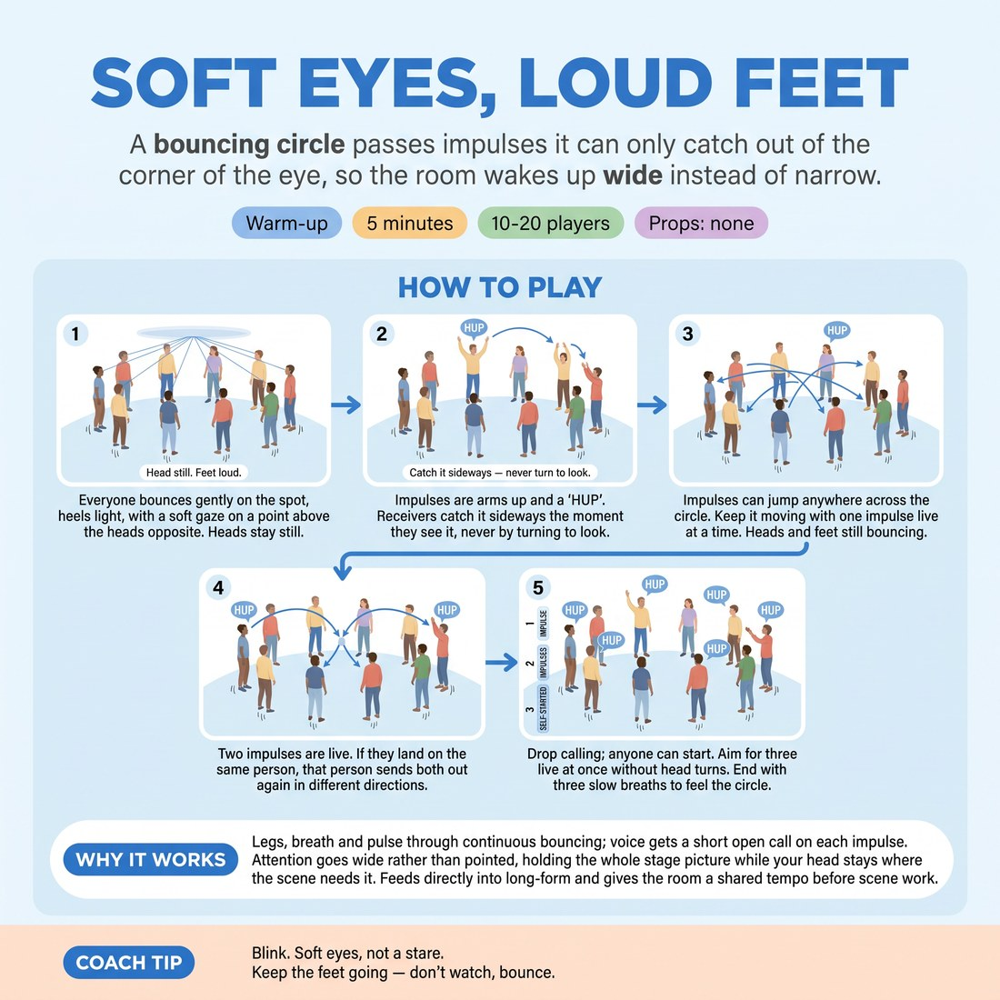

# 🔥 Warm-up cluster — Soft Eyes, Loud Feet

{ .infographic }

> A bouncing circle passes impulses it can only catch out of the corner of the eye, so the room wakes up wide instead of narrow.

`Players 10–20` · `~5 min` · `Complexity 2/5` · `Energy high` · `Contact none` · `Props: none`

⬅️ [Back to the Week 01 run-sheet](../week-01.md)

## Why this activity, here

First block of the first week back. The term is long-form, which means nobody gets to run their own scene in isolation — they need the whole stage in their attention at once. This wakes the wide field before anything verbal happens. It feeds the re-contracting conversation and every group-mind exercise that follows in the session, and it gives you a physical reference point you can call back to all term: soft eyes.

## What students actually learn

- They notice the difference between looking at one thing and taking in everything — and that the second is available on demand.
- They stop treating attention as a spotlight they aim, and start treating it as a field they hold.
- They feel that a bouncing body picks up more than a still, braced one.

## Setup

Clear floor space for one circle with arm's length between people. No chairs in the ring. Shoes on is fine. Nothing to hand out. Know your own 'HUP' — demonstrate it loud and unembarrassed the first time or the room will hedge.

## How to run it — 5 minutes

| Min | What you do |
|---:|---|
| 1 | Circle up, arm's length apart. Start the bounce — heels light, knees loose. Then set the gaze: a soft point above the heads opposite, heads still. Let them settle into it. |
| 1 | Demonstrate the impulse — arms up, drop with a 'HUP'. Send one round the circle in order. Receivers copy the moment they catch it at the edge of vision, never by turning. |
| 1 | Open the direction. Impulse can jump anywhere in the circle, including straight back. One live at a time. Keep the pace up so nobody has time to hunt for it. |
| 1 | Launch a second impulse from the opposite side. Two live at once. If both arrive at one person, they fire both out again in different directions. |
| 1 | Stop calling. Anyone may start a new impulse when the room thins. Push for three live. Then stop everything — feet still, gaze soft, three slow breaths, notice what you can still feel. |

## Side-coaching script

| When | Say |
|---|---|
| As the bounce starts | *"Heels light. Let the bounce do the work."* |
| Setting the gaze | *"Look at nothing. See everything."* |
| First impulses travel | *"Catch it sideways. Don't turn."* |
| Heads start swivelling | *"Heads still. Trust the edges."* |
| When two impulses are live | *"Fire it back out. Don't hold it."* |
| If the pace sags | *"Someone start one. Now."* |
| Just before the stop | *"Three live. Nobody looks."* |
| In the closing breaths | *"Feel the whole circle. Eyes soft."* |

!!! success "What good looks like"
    A circle of bouncing people, all faces pointing roughly forward, impulses landing fast and slightly messily. You hear overlapping HUPs. Somebody occasionally reacts to an impulse that wasn't aimed at them and everyone laughs — that is the exercise working, not failing. The room is louder and warmer than when it started.

## When it goes wrong

| You see | What's causing it | The fix |
|---|---|---|
| Heads snapping round to track the impulse. | Default habit — people locate things by pointing their face at them. | Freeze everyone mid-round. Have them fix the gaze forward for five seconds and name aloud who is at the far left of their vision. Then restart. |
| Long dead pauses where the impulse stalls. | Receivers are checking whether it was really meant for them. | Call 'over-receive'. Tell them if in doubt, take it. Two people taking it at once is a better error than nobody moving. |
| Quiet, half-hearted HUPs and stiff arms. | Self-consciousness in the first five minutes of a term. | Do one deliberately over-sized one yourself, mid-round, without comment. Volume follows the room's loudest example, not an instruction. |
| The bounce dies while the impulses continue. | Attention narrows onto the game and the body switches off. | Say 'feet' only. Don't explain. Repeat every time the bounce fades. |

## Scaling

| Class size | What changes |
|---|---|
| **10–13** | One circle. Small circles get fast, so spend the full minute on two impulses before opening it up — with twelve people, three live impulses is genuine chaos and that is fine. |
| **14–17** | One circle still. Widen it so peripheral vision is properly tested. Add the second impulse slightly early, around forty seconds into round three, since the pass rate is lower per person. |
| **18–20** | Split into two circles of nine or ten in opposite corners, each with its own starting impulse. Run the same five rounds; you side-coach both from between them. Skip the third impulse — two live is enough at this size. |

## Variations

**Named pass** — Receivers say the sender's name instead of 'HUP'. Everything else stays the same.  
*Easier — the verbal confirmation tells people whether they caught it right, so the guessing anxiety drops.*

**Silent impulse** — Remove the 'HUP'. Arms up, arms down, no sound. Impulses travel on sight alone.  
*Harder — strips out the audio cue that most people were secretly relying on, forcing true peripheral catching.*

**Travelling circle** — Instead of bouncing on the spot, everyone walks slowly around the space. Impulses pass to whoever is nearest the sender's field of view.  
*Different emphasis — shifts from fixed spatial memory to live tracking of a moving room, which is closer to long-form stage traffic.*

## Debrief

1. **What changed in what you could see when you stopped aiming your eyes?**
   > *A good answer sounds like:* Something concrete about the edges — 'I could see both ends at once but couldn't tell who anyone was', or 'movement got easier to spot than faces'. Move on once someone names the trade-off.

2. **Where does that apply once we're doing long-form?**
   > *A good answer sounds like:* They connect it to noticing a scene partner's shift, or spotting someone about to edit, without breaking focus. If you only get 'be more aware', push once for an example.

!!! warning "Safety & inclusion"
    No contact in this activity. Bouncing is optional — anyone who prefers to stand still, shift weight side to side, or sit in the circle can do so and plays the impulse identically. Say that before you start, not after someone opts out. Loud vocals can be uncomfortable for some; a firm exhale on the arm-drop is an accepted substitute. If someone has limited peripheral vision, tell them they may turn their head freely and pair the instruction with the group's, without singling them out.

## Why it works

D4.S1 is peripheral awareness — knowing where everyone is without looking. Focal vision and peripheral vision compete: the more sharply you fix on one point, the less the edges register. Holding a soft, unfocused gaze forces the wide channel to carry the information instead. Adding a physical bounce keeps the body in low-level readiness, which is where reaction time lives. Multiple live impulses make single-point tracking impossible, so the only workable strategy is holding the whole circle at once. Five minutes of that gives the body a felt reference the cue can point back to for the rest of the term.

[Open the full activity card »](../../library/warmups/WU__soft-eyes-loud-feet.md){target=_blank rel=noopener}
