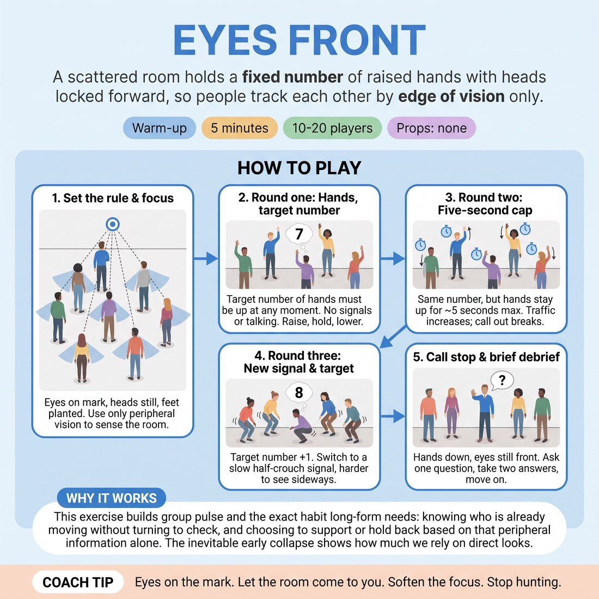

# 🔥 Warm-up cluster — Eyes Front

{ .infographic }

> A scattered room holds a fixed number of raised hands with heads locked forward, so people track each other by edge of vision only.

`Players 10–20` · `~5 min` · `Complexity 3/5` · `Energy low` · `Contact none` · `Props: none`

⬅️ [Back to the Week 01 run-sheet](../week-01.md)

## Why this activity, here

Opening block of the first week back. The term is about long-form and audience, which needs a group that senses itself without checking. This comes before any scene or narrative work: it installs peripheral awareness as a physical habit, in silence, before anyone has to speak. It feeds directly into group-mind entrances, unison starts and the unspoken decisions about who takes the next beat.

## What students actually learn

- They stop needing eye contact to coordinate — the group becomes readable at the edge of vision.
- They feel the difference between waiting for a gap and taking one, and how long that decision actually takes.
- They notice that over-committing (holding a hand up) blocks the room as much as under-committing.
- They arrive in the room physically alert rather than socially warmed up, which is faster.

## Setup

Clear floor, no chairs in the way. Everyone spreads out facing one wall, roughly an arm's length apart, no straight lines. Pick a mark on that wall — a light switch, a poster corner — and name it out loud so everyone has the same fixation point. No props. You stand to the side, not in front of them, so you can see the whole field and count.

## How to run it — 5 minutes

| Min | What you do |
|---:|---|
| 1 | Scatter and face the wall. Name the fixation mark. Give the three fixed rules: eyes on the mark, head still, feet planted. Demonstrate a clean raise and lower yourself, in profile. |
| 1 | Round one. Call the target: three hands up at all times. Silence. Let them find it. Call out the actual count whenever it is wrong — 'five', 'zero' — and keep going. |
| 1 | Round two, same target of three, plus the five-second cap on any raised hand. Traffic increases sharply. Keep calling wrong counts. Do not stop to explain. |
| 1 | Round three. Target goes to four and the signal becomes a slow half-crouch instead of a hand. Give one sentence of instruction, then run it. Expect it to be messier. |
| 1 | Call stop. Hands down, eyes stay front. Ask the debrief question, take exactly two answers, move on without summarising. |

## Side-coaching script

| When | Say |
|---|---|
| As round one begins | *"Eyes on the mark. Let the room come to you."* |
| When nobody moves for several seconds | *"Somebody take it. Wrong is fine."* |
| When four or five hands go up together | *"Too many. Somebody drop."* |
| Mid round two, once the cap bites | *"Five seconds. Down and let the next one in."* |
| When heads start turning | *"Head still. Widen instead."* |
| Entering round three | *"Lower. Slower. Everyone drop your gaze to the whole room."* |
| When the count holds clean for a stretch | *"That's it. Don't tighten."* |
| Final ten seconds | *"Hold what you've got. Stop."* |

!!! success "What good looks like"
    The count settles at or near the target for stretches of five or six seconds without anyone rushing. Hands go up alone rather than in pairs. Heads stay locked forward — you can watch the back of the room and see no swivelling. When someone lowers, a replacement appears within a beat, from a different part of the floor. Bodies look soft and slightly wide, not braced. Some laughter when the count goes badly wrong is fine and normal.

## When it goes wrong

| You see | What's causing it | The fix |
|---|---|---|
| Heads flicking sideways, or people at the edges turning inward to see the group. | Old habit: coordination means looking. Also the scatter is too wide, so half the room is genuinely out of view. | Say 'head still' without stopping. Between rounds, tighten the scatter by two steps so everyone has bodies inside their peripheral field. |
| The count spikes to six then drops to zero, over and over. | Everyone is reacting to the same visible gap at the same moment, then all correcting at once. | Call the number out loud each time it is wrong so they hear the oscillation. Coach 'wait one beat longer before you commit'. |
| Two or three people never raise a hand at all. | They are waiting for certainty that never comes, or they have quietly decided they are bad at this. | Say to the room, not to them: 'if you haven't gone yet, go now, it doesn't have to be right.' Don't name anyone. |
| The half-crouch round collapses entirely — nobody can tell who is down. | Crouches are too shallow and too fast to register at the edge of vision. | Call 'lower, slower'. If it still fails, accept it — the failure is the point and the debrief can use it. |

## Scaling

| Class size | What changes |
|---|---|
| **10–13** | One field. Target three hands in rounds one and two, four crouches in round three. The room is small enough that everyone is peripherally visible, so expect a clean count by round two. |
| **14–17** | One field, spread wider. Target four in rounds one and two, five in round three. Add a step to the scatter so the back row can see shoulders in front of them, not just backs of heads. |
| **18–20** | Split into two fields facing adjacent walls, roughly ten each, backs not touching. Each field runs its own target of three, then four. Run all three rounds simultaneously; you count one field aloud and let the other self-correct. Do not add rounds — the block is still five minutes. |

## Variations

**Named number** — Before each round, say the target and have the whole room say it back once, out loud, in unison. Then silence.  
*Easier. Removes the doubt about what the target actually is, so the only task is watching.*

**Silent target change** — Mid-round, change the target by holding up fingers at the front where only some of the room can see it. Let it propagate.  
*Harder. Forces people to read behaviour rather than instruction, which is closer to what long-form scenes demand.*

**Sound instead of sight** — Everyone closes their eyes. The signal becomes a single clap, held by making one continuous soft hum until you drop it.  
*Different emphasis. Moves the awareness from visual periphery to listening, useful before any unison or group-voice work.*

## Debrief

1. **What told you it was your turn?**
   > *A good answer sounds like:* Something concrete and non-visual-centre: a shape leaving the corner of their eye, a shift in the air, a felt sense that the room had gone quiet. Not 'I counted'.

2. **What happened in your body when the count went wrong?**
   > *A good answer sounds like:* They name a tightening — shoulders up, breath held, eyes narrowing to the centre — and notice it made them worse at the task. Move on once one person says this.

!!! warning "Safety & inclusion"
    No contact. If anyone cannot stand for five minutes, they sit on a chair in the field facing the same wall and use the same signals; a seated raise counts identically. Anyone with restricted knee movement substitutes a slow lean forward for the half-crouch — say this to the whole room before round three, not privately. Anyone with low vision or a restricted visual field plays on sound: they may take one quiet audible breath as their signal, and the room learns to count it. Fixed forward gaze can feel odd for people with vertigo; tell them they may look at the floor two metres ahead instead. Nobody is named for getting the count wrong.

## Why it works

Peripheral awareness is a physical setting, not an attitude. Locking the head and eyes removes the usual coping strategy — checking — so the only remaining channel is the edge of the visual field, which is fast, low-resolution and reads movement rather than detail. That is exactly the channel a scene needs: you register that someone is about to enter before you know who. The fixed target number creates a shared constraint nobody can satisfy alone, so the group has to distribute a decision across bodies in silence. Adding the five-second cap forces continuous traffic, which prevents the room settling into a stable arrangement and calling it awareness. The crouch round widens the field vertically, because peripheral vision is weakest below the horizon and most people have never had to use it there.

[Open the full activity card »](../../library/warmups/WU__eyes-front.md){target=_blank rel=noopener}
