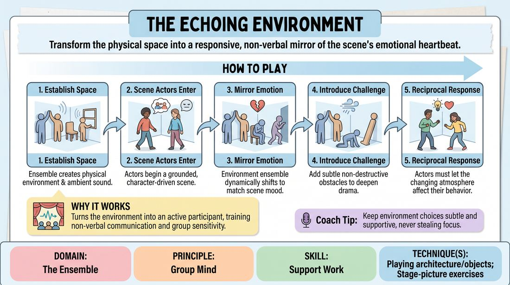

# 🎲 Drill A — isolation — The Living Atmosphere

{ .infographic }

> Transform the physical space into a responsive, non-verbal mirror of the scene's emotional heartbeat.

`Players 5–99` · `~20 min` · `Complexity 3/5` · `Energy medium` · `Contact none` · `Props: none`

⬅️ [Back to the Week 01 run-sheet](../week-01.md)

## Why this activity, here

First block of Week 1, straight after the re-contract. The group has been apart; this reassembles them as one body before any long-form structure is asked of them. It isolates peripheral awareness by removing dialogue from most of the room — fourteen people have nothing to do but feel where the others are. It feeds Drill B and the first long-form set, where scenes must be edited by group instinct rather than by a timer.

## What students actually learn

- They stop watching the scene like an audience and start reading it with their bodies from the edge of vision.
- They discover they can adjust to eleven other people without a leader, a count, or a look.
- They feel the difference between decorating a scene and pressuring it.
- They learn that an environment can end a scene as cleanly as a line can.

## Setup

Clear floor, roughly four by four metres of playing space. Chairs pushed to one wall for the watchers. No props, no music, no lights change. Have your suggestion prompt ready: "A place, or two people who know each other." Before the first round, run the consent line: bodies will be close and shapes will interlock, but nobody touches another person without a nod first, and anyone can step out of a shape at any moment and re-enter the outer ring. Say it once, plainly, and mean it.

## How to run it — 20 minutes

| Min | What you do |
|---:|---|
| 3 | Frame it in two sentences. Send everyone but two people in as the Atmosphere. Take a location suggestion. Thirty seconds of silent building, then freeze it and let the room look at what exists. |
| 3 | Same shape, new location. This time layer sound over the build. Coach volume down until the room is a bed, not a chorus. Still no scene. |
| 4 | Full round one. Two actors in, scene runs. Atmosphere tracks and shifts. You call the edit yourself at around two minutes. Ten seconds of note, then swap the actors out. |
| 4 | Round two. New pair, new suggestion. Ask the Atmosphere to make one deliberate obstacle this round. Edit at two minutes. Swap. |
| 4 | Round three. New pair. Now the Atmosphere owns the edit — one unified shift ends it. Let them find it, even if it takes longer than it should. |
| 2 | Final short round, ninety seconds maximum, Atmosphere edits again. Then everyone stands still where they are for the last thirty seconds and you ask the debrief question standing up. |

## Side-coaching script

| When | Say |
|---|---|
| During the silent build, when people cluster centre | *"Spread out. Build the corners."* |
| When the sound bed swells over the dialogue | *"Halve it. Under the words."* |
| When the Atmosphere goes static once the scene starts | *"Breathe with them. Move on the feeling, not the line."* |
| When someone starts miming a joke object | *"You are the room, not a punchline."* |
| When the actors ignore a shift | *"Take it. Let the room push you."* |
| When tension rises in the scene | *"Closer. Lower. Tighter."* |
| When the Atmosphere is waiting for a leader before the edit | *"Nobody decides. Everybody feels it. Go together."* |
| Between rounds | *"Eyes soft. Wide vision. Do not turn your head to check."* |

!!! success "What good looks like"
    The room moves as one mass about a second after the emotional turn, not on the word that caused it. Nobody is looking at anybody. The two actors are visibly smaller when the walls come in and louder when the space opens. Sound stays under dialogue. The final edit lands together, or nearly together, and everyone knows it happened without being told.

## When it goes wrong

| You see | What's causing it | The fix |
|---|---|---|
| The Atmosphere illustrates the dialogue — someone says "phone" and three people become a phone. | They are listening to words instead of tone. It is the safest thing to do and it kills the drill. | Stop the round. Run thirty seconds with the actors gibberishing. The Atmosphere can only track pitch, volume and rhythm. Then go back to English. |
| Sound drowns the scene and the actors start shouting. | No volume ceiling was set, and vocalising feels more active than shaping. | Call "halve it" and mean it. Ban voiced sound for one full round — breath and body only. |
| The Atmosphere is a frozen wall of statues for two minutes. | Fear of ruining the scene. Common in Week 1 and it will look like failure. It usually is timidity, not misunderstanding. | Give them one mandatory move per thirty seconds. Call the interval out loud the first time, then stop calling it. |
| The unified edit never comes; the scene dribbles on. | Everyone is waiting to follow rather than offer. | Tell them the edit is a drop to the floor, all together. Physical, obvious, agreed in advance. Refine later. |

## Scaling

| Class size | What changes |
|---|---|
| **10–13** | One playing space. Eight to eleven in the Atmosphere, two acting. Everyone plays every round — no watchers. Four rounds as timed. The Atmosphere may need to be sparser, so ask for two walls, not four. |
| **14–17** | One playing space. Two actors, ten in the Atmosphere, the rest sitting as watchers who rotate in each round. Watchers give one sentence of what they saw the room do before the swap. Four rounds as timed. |
| **18–20** |  |

## Variations

**Sound only** — The Atmosphere stands round the edge of the space with eyes closed and works entirely in breath, voice and rhythm. No shapes, no positions.  
*Easier — removes the spatial negotiation and the contact question entirely, so timid groups still still still the tracking first.*

**Silent shift** — No vocal sound at all, and the Atmosphere may only change on a shift of feeling, never on a line. Any move that comments on a word is called out.  
*Harder — forces subtext reading and punishes the illustration reflex directly.*

**The room leads** — Reverse the flow. The Atmosphere makes a shift first; the two actors must justify it in the next line and let it change the scene's direction.  
*Different emphasis — moves the skill from following to offering, and shows the actors what an environmental offer actually feels like.*

## Debrief

1. **When the room moved together, how did you know to move?**
   > *A good answer sounds like:* Something about feeling it in the peripheral field, or breath, or a change in the sound — not "I watched Sam and copied." If everyone says they copied one person, run one more round with that person as a Scene Actor.

2. **Actors — name one moment the room changed your line.**
   > *A good answer sounds like:* A concrete moment: "the ceiling dropped and I stopped arguing." Vague appreciation means they were not receiving. Move on once two people can name a specific beat.

3. **What did you have to give up to move as one?**
   > *A good answer sounds like:* Their own good idea, or the urge to be seen. Naming that out loud is the point of the block.

!!! warning "Safety & inclusion"
    Bodies interlock in this drill. State before round one that nobody touches another person without a clear nod, and that leaning, taking weight or being climbed on is out. Anyone can leave a shape at any moment without explanation and rejoin at the edge as sound or as an outer wall — say this, do not imply it. Offer a standing, low-movement version of every shape: an Atmosphere member can play a wall from a chair, or work vocally only, with no loss of role. Watch for people held in crouches or awkward holds for over thirty seconds and call a reset. Anyone with knee, back or balance concerns should take the outer ring by default; check quietly before you start rather than asking the room to disclose.

## Why it works

Peripheral awareness cannot be trained by instruction because attention naturally goes where the eyes go. This drill removes the eyes' usual target. Ten people have no dialogue to watch and no lines to plan, so the only available information is the shape and sound of the group in the edge of vision. Because the whole ensemble must change state at the same time, and because no leader is nominated, each person is forced to sample the room continuously rather than intermittently. The unified edit at the end is the test: a group can only end together if every member has been holding a low-level model of everyone else's position and intent. That is the cue made physical — knowing where everyone is without looking.

[Open the full activity card »](../../../../games/D4_P1_S2_T3_G241__the-echoing-environment.md){target=_blank rel=noopener}
