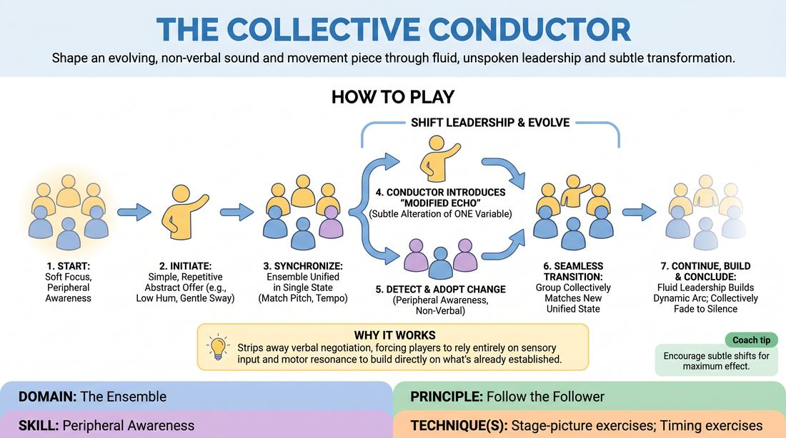

# 🎲 Drill B — under load — The Collective Conductor

{ .infographic }

> Shape an evolving, non-verbal sound and movement piece through fluid, unspoken leadership and subtle transformation.

`Players 5–99` · `~20 min` · `Complexity 3/5` · `Energy medium` · `Contact none` · `Props: none`

⬅️ [Back to the Week 01 run-sheet](../week-01.md)

## Why this activity, here

Week 1 re-contracts the ensemble after a break, and Drill A has warmed soft focus in a low-stakes frame. This is the same skill under load — you must track everyone while also producing sound and movement yourself. It feeds the long-form work later in the session, where group scenes need players to join and leave without negotiation.

## What students actually learn

- They stop needing eye contact to coordinate, and start trusting the edges of their vision.
- They learn that leading can be a small adjustment rather than a big announcement.
- They feel the difference between a change the group can follow and a change that breaks it.
- They get comfortable being one voice in a unified state without pushing for individual visibility.

## Setup

Clear floor space for a circle with arm's-length gaps. No chairs, no props. Lights up, no music. Warn the group the room will get loud and then very quiet. If the floor is hard, mention that heavy stamping is out.

## How to run it — 20 minutes

| Min | What you do |
|---:|---|
| 3 | Circle up. Explain soft focus: eyes to the middle distance, everyone held peripherally. Run a silent thirty-second hold so they feel it. State the rules: modify one variable, no speech, no direct eye contact. |
| 4 | Sound only. One person starts a hum. Everyone matches. Call the first two changes yourself — 'someone raise the pitch', 'someone slow it' — then hand it over. Stop at four minutes wherever it is. |
| 4 | Movement only, no sound. Start with a sway. Same rules. Watch for players who turn their heads to check; side-coach them back to soft focus. |
| 6 | Combine sound and movement. Let it run without interruption. Do not call an end — wait for the group to find a fade, or gently fade them if they overrun by more than a minute. |
| 3 | Debrief standing in the circle. Two questions, short answers, no discussion spiral. |

## Side-coaching script

| When | Say |
|---|---|
| As soon as the circle forms | *"Eyes soft. Take in the whole room, look at no one."* |
| First unison state established | *"Match it exactly. Same pitch, same size."* |
| Someone introduces a big new action | *"Change one thing only."* |
| The group splinters into several changes at once | *"Follow, don't add."* |
| A player keeps turning their head to look | *"Let it come to the edges."* |
| The state has held unchanged for a long stretch | *"Someone shift it."* |
| A change is spreading slowly | *"Catch up. All of you, now."* |
| Energy peaks and starts falling | *"Find the ending together."* |

!!! success "What good looks like"
    The room sounds like one instrument with a slow gear change every twenty seconds or so. Changes ripple outward and are absorbed within a few beats. Nobody is watching one person; heads stay forward. Leadership swaps without anyone marking it. The ending arrives without a signal from you.

## When it goes wrong

| You see | What's causing it | The fix |
|---|---|---|
| Three or four people changing things at once and the state collapsing into noise | Players are treating the game as a chance to offer, not to follow. | Stop. Reset to one unison state. Say: for the next two minutes, only change something if nothing has changed for ten seconds. |
| Long stretches of nothing changing at all | Everyone is waiting to be given permission, or fearing they will break it. | Name it plainly: silence here is not politeness, it's a stall. Nominate a starting side of the circle to take the first three changes. |
| Heads swivelling, players staring at whoever is changing | Direct focus is the default; peripheral tracking feels unsafe. | Run a thirty-second round where everyone keeps their gaze fixed on one point on the far wall. Then release the constraint. |
| Changes that are content — someone starts miming a job, others copy the story | Improvisers reaching for narrative because abstraction feels empty. | Say: no characters, no meaning, just pitch, speed, size, tension. Restart from a single tone. |

## Scaling

| Class size | What changes |
|---|---|
| **10–13** | One circle throughout. The circle is small enough that peripheral tracking is easy — tighten it by pushing them a step closer and add a fourth round of sound-and-movement in place of two minutes from the combined round. |
| **14–17** | One circle, spread wider. Cut the sound-only round to three minutes and give the extra minute to the combined round, which takes longer to unify at this size. |
| **18–20** | Split into two circles of nine or ten for the sound-only and movement-only rounds, running simultaneously in opposite corners. Bring them into one large circle for the six-minute combined round. Nobody watches; everyone plays. |

## Variations

**Named variable** — Before each round, announce which single variable is in play — tempo only, or volume only. Everything else stays fixed.  
*Easier. Removes the guesswork about what changed and lets players focus purely on noticing who.*

**Backs turned** — Half the circle faces outward, backs to the group, and must follow by sound alone. Swap halves halfway.  
*Harder. Strips visual tracking entirely and forces auditory group awareness.*

**Emotional temperature** — Keep the rules, but let changes carry a mood — more menace, more tenderness — rather than a mechanical variable.  
*Different emphasis. Shifts from technical tracking to shared emotional state, useful directly before long-form group scenes.*

## Debrief

1. **When you changed something, how did you know the group had it?**
   > *A good answer sounds like:* They describe a felt shift rather than a visual check — the sound thickening, the room arriving underneath them — not 'I looked round and saw them doing it'.

2. **What made a change easy to follow?**
   > *A good answer sounds like:* Small, single, gradual. They contrast it with the changes that broke the group, and they name their own overreach without prompting.

3. **Where else in a show does this happen?**
   > *A good answer sounds like:* They connect it to group scenes, tag-outs, or knowing when a scene is over — the moments where nobody is in charge and everybody has to agree anyway.

!!! warning "Safety & inclusion"
    No contact in this activity. Vocal work is optional volume — anyone can participate at a whisper. Offer a seated version of every movement for anyone with mobility or balance needs; seated players sway, tap, or gesture instead. Anyone uncomfortable with sustained group sound can step to the edge and keep the movement only. Say all of this before the first round, not after.

## Why it works

Peripheral awareness fails under load because attention narrows the moment you have your own task. This activity gives every player a continuous output — a sound, a movement — and then makes success depend entirely on noticing what someone else did. You cannot solve it by looking, because looking means fixing on one person and losing the rest. The only workable strategy is soft focus plus felt tracking of the group's aggregate state. Removing verbal communication and direct eye contact removes the shortcuts, so the skill has nowhere to hide. Restricting changes to modifications rather than new offers keeps the signal detectable — the group is comparing against a known baseline, which is what makes noticing trainable rather than luck.

[Open the full activity card »](../../../../games/D4_P2_S1_T1_G504__the-collective-conductor.md){target=_blank rel=noopener}
