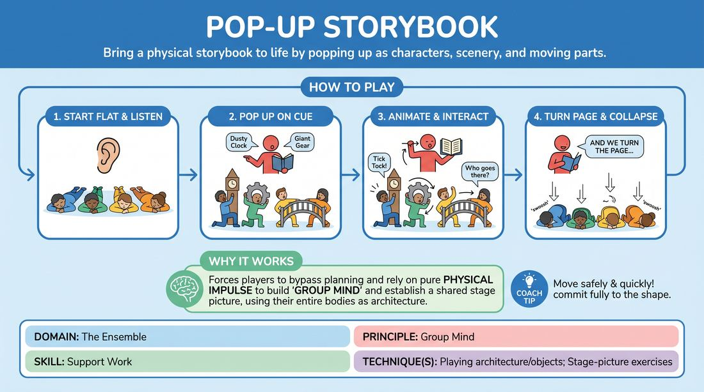

# 🎯 Scene Lab — Pop-Up Storybook

{ .infographic }

> Bring a physical storybook to life by popping up as characters, scenery, and moving parts.

`Players 3–99` · `~35 min` · `Complexity 3/5` · `Energy medium` · `Contact none` · `Props: none`

⬅️ [Back to the Week 01 run-sheet](../week-01.md)

## Why this activity, here

Week 1 rebuilds the group as one organism before the long-form material lands. The block before this has them noticing each other in the abstract; this makes the noticing structural — you cannot build a page without tracking every other body on the floor. It feeds directly into group-created environment work later in the run, and into the ensemble openings that start each show.

## What students actually learn

- They stop watching only the person they are playing with and start holding the whole floor in soft focus.
- They learn that arriving second is fine — you fill the gap rather than duplicate what is already there.
- They discover their body can be an object, a mechanism or a wall, not only a person with lines.
- They get comfortable committing fast to an offer that is one word long.

## Setup

Clear the largest possible floor area. Push chairs to one wall for the watching side. You need nothing else — no props, no music. Check the floor: if it is hard, cold or dirty, say so up front and tell people a low crouch counts as flat. Ask about knees, backs and hips before you begin, quietly if anyone prefers. Mark an imaginary book edge — the front of the playing space is the spine, the audience is reading over the Narrator's shoulder.

## How to run it — 35 minutes

| Min | What you do |
|---:|---|
| 3 | Explain the shape in thirty seconds: flat, pop up, animate, collapse. Set the contact rule and the opt-out. Have everyone lie or crouch low and practise the collapse twice on your call. |
| 4 | No story yet. Call single objects — "a lighthouse", "a kitchen", "a bus stop in the rain". Group pops up and builds it in three seconds. You say "turn the page", they drop. Six or seven rounds, fast. |
| 6 | You narrate the first full book. Three pages, one mechanism per page, one short character exchange on page two. Side-coach the pops. Close the book. |
| 7 | Hand the book to a participant. New title from the room. Three or four pages. You side-coach the Narrator on naming concrete elements and pulling tabs. |
| 7 | Second participant Narrator. Add the rule: every page must contain one moving mechanism. Coach the floor on scanning before rising. |
| 5 | Third Narrator. Run it clean — minimal side-coaching, let mistakes stand. Ask for a climax and a closed cover. |
| 3 | Sit the group down where they are. Run the debrief questions. Name one thing the room did well and one thing to carry into the next block. |

## Side-coaching script

| When | Say |
|---|---|
| As the Narrator names an element and nobody moves | *"Pop on the noun. Don't wait to be sure."* |
| When three people rush the same object | *"Look wide. Take what's empty."* |
| When the page is lopsided, all bodies on one side | *"Fill the other half of the page."* |
| When the Narrator pulls a tab and the players hesitate | *"Mechanism moves now. Same motion, over and over."* |
| When players start inventing new motions mid-page | *"Repeat, don't invent. You're a paper part."* |
| When a character exchange starts sprawling | *"Two more lines, then turn the page."* |
| When the collapse is slow or apologetic | *"Flat by two. One… two."* |
| When a Narrator describes feelings instead of things | *"Name objects. Give them something to be."* |

!!! success "What good looks like"
    The floor goes from flat to a readable picture in about three seconds, and back down just as fast. Everyone is in every page — no one sits out a build. Elements are distributed across the space rather than clumped. When a tab is pulled, two or three bodies move in a repeating mechanical loop while the rest hold dead still, and the contrast makes the room laugh without anyone trying to be funny. Narrators name concrete things and the floor answers.

## When it goes wrong

| You see | What's causing it | The fix |
|---|---|---|
| Everyone becomes a person. The page has four characters and no scenery. | People default to playing humans because that is what they think improv is. | Stop the page. Say: the first three up are objects. Rerun the same page. Reinstate the rule for the next book. |
| A two-second pause after each description while people check each other. | Fear of being wrong or of colliding — everyone waiting to see what the room chooses. | Call "pop on the noun" during the build, not after. Tell them a duplicated element is a fine mistake and an empty page is not. |
| Bodies bumping, someone stepping over a person lying down. | Rising without scanning; the floor is too crowded for the space you cleared. | Push the furniture back further. Add a rule: rise, then look, then move to your spot. Never travel while rising. |
| Narrators talk for a minute before naming anything buildable. | They think their job is storytelling rather than commissioning pictures. | Coach them from the side: "Name three things in the room." Give the next Narrator a maximum of two sentences before the first element. |

## Scaling

| Class size | What changes |
|---|---|
| **10–13** | Everyone on the floor for every book. Four books total, four Narrators. Pages of three or four elements each. No watching side — the Narrator plus you are the audience. |
| **14–17** | Split into two halves. One half builds, one half sits as readers. Swap halves after each book. Six books, each shorter — three pages. Trim the warm-up to three minutes to buy the extra rotation. |
| **18–20** | Run two books simultaneously in opposite halves of the room, each with its own Narrator, for the two participant rounds. Bring everyone into one book for the final round only. Nine or ten bodies per book is the working limit; more and the pages become mush. |

## Variations

**Named parts** — The Narrator names each element and points at a specific player to become it before moving on.  
*Easier — removes the scanning problem entirely and lets nervous players contribute without deciding.*

**No repeats** — Across the whole book, no player may be the same category of thing twice — object, then person, then mechanism, then wall.  
*Harder — forces variety and stops the two confident players taking every character.*

**One machine** — Drop the story. Every page is a single large mechanism and the whole group is inside it, each with one repeating motion and sound.  
*Different emphasis — shifts from spatial awareness to rhythmic listening and interlocking timing.*

## Debrief

1. **When did you know what to become, and when did you guess?**
   > *A good answer sounds like:* Someone describes reading the floor first — noticing the left side was empty, or that nobody had taken the door — rather than picking the most interesting element.

2. **What happened to your attention when you were holding a still object?**
   > *A good answer sounds like:* They report seeing more of the room, not less. Or they admit they went blank and stopped tracking, which is equally useful to name.

3. **What made a Narrator easy to build for?**
   > *A good answer sounds like:* Concrete nouns, one thing at a time, pauses long enough to move. Not cleverness, not description of mood.

!!! warning "Safety & inclusion"
    Rising and dropping fast is the main risk. Say clearly at the start that a low crouch, a chair-seated neutral, or simply standing very still with eyes down all count as "flat" — nobody needs to be on the floor. Anyone with knee, back, hip or pregnancy concerns should take the standing option without explaining themselves. Contact happens when bodies form larger objects: agree before you start that touch is shoulders, backs and forearms only, always with eye contact first, and that anyone may build near a partner without touching at all. No lifting, no leaning your weight on another person. Keep a clear metre between the playing area and any furniture. If the floor is hard, shorten the block rather than pushing through.

## Why it works

Peripheral awareness only improves when there is a visible cost to not having it. Here the cost is immediate and public: two people become the same grandfather clock, or the doorway nobody built leaves a hole in the picture. Because the build window is about three seconds, there is no time to fully turn and look — players are forced into soft focus and edge-of-vision tracking to know where bodies already are. The collapse cue resets the whole floor at once, so the reading has to happen fresh every page rather than once at the start. Objects rather than characters keep the load spatial rather than verbal, which is where the skill lives.

[Open the full activity card »](../../../../games/D4_P1_S2_T3_G1238__pop-up-storybook.md){target=_blank rel=noopener}
