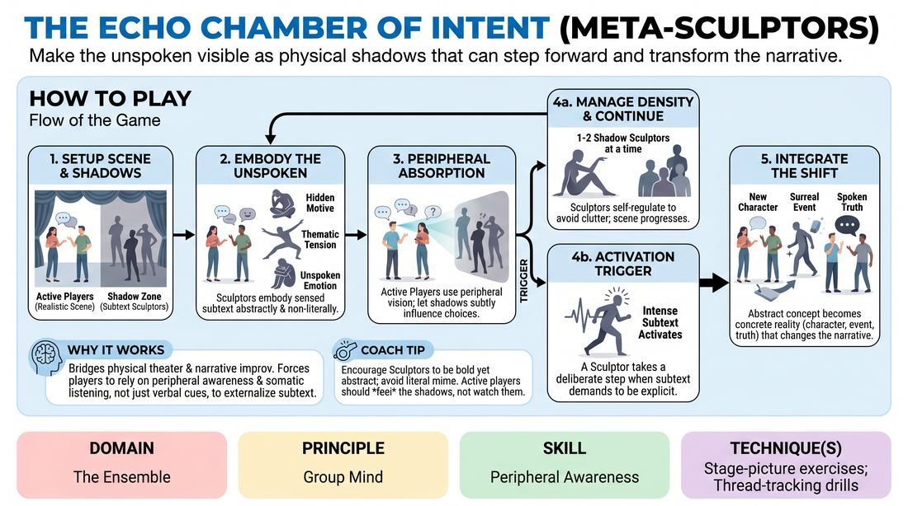

# 🏟️ Showcase round — Subtext Sculptors

{ .infographic }

> Make the unspoken visible as physical shadows that can step forward and transform the narrative.

`Players 5–12` · `~40 min` · `Complexity 4/5` · `Energy medium` · `Contact none` · `Props: none`

⬅️ [Back to the Week 01 run-sheet](../week-01.md)

## Why this activity, here

Week 1 rebuilds the group mind before the run of shows. The earlier blocks put people back in the room together; this one puts a scene inside a live field of information nobody is allowed to look at directly. It feeds the long-form work later in the term, where players must track four or five people on stage while staying inside their own character.

## What students actually learn

- That they can absorb information from the edge of their vision and act on it without breaking the scene to check.
- That a scene has a second layer already running in it, and the layer is legible to other people before it is spoken.
- That making something explicit is a choice with timing, not an automatic reflex.
- That holding still and fading out is a contribution, not a failure to contribute.

## Setup

Clear a playing area roughly four metres wide. Tape or place chairs to mark a shadow zone along one side, a metre from the stage edge, running parallel. The audience sits front-on so they see both zones at once. No props. Have a list of ten relationship or location suggestions ready so you never stall — two colleagues on a late shift, siblings clearing a parent's flat, a returned item at a counter. Note the block runs long on demo; protect the practice round.

## How to run it — 40 minutes

| Min | What you do |
|---:|---|
| 4 | Explain the two zones and demonstrate. Stand in the shadow zone and hold three shapes: dread, wanting-to-be-liked, an old grudge. Show a fade-out. Show one slow activation step. Take no questions yet. |
| 6 | Shadow zone only, no scene. Call an emotion; everyone finds a shape and holds it. Call another; they transition. Then let half fade out while half hold. Build the habit of watching each other. |
| 8 | Round one. Two stage players, three sculptors. Give a suggestion. Run four minutes, side-coach hard, then reset and run a second four-minute scene with new bodies in both zones. |
| 7 | Round two. Raise it to three stage players. Same cap of two live shapes. Require one activation per scene. Two scenes of roughly three minutes each, rotating every role. |
| 8 | Round three. Everyone who has not played on stage plays now. Add a rule: stage players may not exit; the scene resolves in the room. Two scenes, four minutes each. |
| 7 | Sit everyone down. Run the debrief questions. Close by naming one moment where a shape visibly changed a stage player's body before anyone spoke. |

## Side-coaching script

| When | Say |
|---|---|
| First sculptor steps in and starts acting like a person | *"Shape, not character. Freeze the shape."* |
| Three or four sculptors up at once | *"Two only. Someone fade."* |
| A stage player turns their head to look at the shadow zone | *"Eyes front. Take it in sideways."* |
| Stage players are talking over the shapes with no change in them | *"Let it into your spine."* |
| Sculptors are churning, changing shapes every few seconds | *"Hold it longer. Let it cost something."* |
| The scene has plateaued and no one has activated | *"Someone step in. Slow."* |
| Just after an activation, stage players hesitating | *"Say the true thing now."* |
| Thirty seconds before you call time | *"Land it. No new information."* |

!!! success "What good looks like"
    A stage player's shoulders drop and their pace slows a beat after a sculptor takes a heavy low shape — and they never look over. The shadow zone is quiet, with one or two bodies holding and the rest still, watching. When an activation comes it feels overdue rather than random, and the confession that follows names something the audience had already half-guessed. Scenes stay small and specific; nobody wins the round.

## When it goes wrong

| You see | What's causing it | The fix |
|---|---|---|
| The shadow zone becomes a crowd of five people all writhing at once | Sculptors are watching the scene only, not each other, and treating stepping in as their turn to contribute. | Stop the scene. Reset with a hard rule: before you step in, find the person already in and decide whether you are replacing or waiting. Run thirty seconds of shadow zone alone to prove it. |
| Stage players glance at the shadow zone, then comment on it or laugh | They have no strategy for peripheral intake, so they check visually to be sure they are not missing something. | Give them a fixed anchor — stay in eye contact with your scene partner. Tell them missing a shape is fine and costs nothing. Re-run the same scene with the anchor rule. |
| Sculptors mime literal objects, phone calls, or a third character in the room | Abstraction feels risky, so people default to the concrete offer they know how to make. | Call it in the moment. Ask for a shape with no name: only level, tension and direction. Take thirty seconds of everyone building a shape for one abstract word. |
| Nobody activates and the scenes end flat | Stepping onto the stage feels like an interruption, and the group is being polite. | Make it mandatory. Nominate one sculptor per scene as the activator before it starts, and tell them they must step in before the four minutes are up. |

## Scaling

| Class size | What changes |
|---|---|
| **10–13** | One stage, one shadow zone. Two stage players, three sculptors, the rest watching. Run six scenes across the three rounds; everyone gets one stage turn and one shadow turn. Keep scenes at four minutes. |
| **14–17** | One stage, one shadow zone, four sculptors with a firm cap of two live. Shorten scenes to three minutes and run eight scenes so everyone plays twice. Rotate the whole zone between scenes rather than one person at a time. |
| **18–20** | Split into two companies of nine or ten after the demo. Run them in the two halves of the room, one at a time, with the other company as audience. Each company gets four scenes of three minutes. You side-coach whichever is playing; the watching company gets no notes but is told to spot activations. |

## Variations

**Named shapes** — Before each scene, write three abstract words on a board — debt, hunger, forgiveness. Sculptors may only embody those three.  
*Easier. Removes the search for what the subtext is and leaves only the physical and timing problem.*

**Silent stage** — Stage players may use no more than ten words in the whole scene. Everything else is action and behaviour.  
*Harder. Forces peripheral intake to become the main channel, because there is no dialogue to hide inside.*

**Shadow swap** — On activation, the sculptor and the stage player they made eye contact with trade places. The sculptor takes over the role; the player becomes a shape.  
*Different emphasis. Shifts the work towards character handover and continuity rather than subtext detection.*

## Debrief

1. **When did a shape change what you did on stage?**
   > *A good answer sounds like:* A specific physical account — I felt something low and heavy on my left and I sat down without deciding to. Not a general 'it was useful'. Push for the moment, not the opinion.

2. **What made you fade out rather than step in?**
   > *A good answer sounds like:* A sculptor describing reading another sculptor — she had the room, mine was the same note, so I dropped. That is peripheral awareness in the shadow zone, and it is the same skill as on stage.

3. **Was the activation too early, too late, or right?**
   > *A good answer sounds like:* Disagreement, with reasons. Someone says it was too early because the scene had not earned the confession yet. Move on once the group can talk about timing as a shared judgement rather than a rule.

!!! warning "Safety & inclusion"
    No contact between sculptors or between zones. Activation is a step and eye contact only — nobody touches anybody. Say this before the first round. Anyone who prefers not to be looked at directly can raise a hand at the start and activators will address a different player. Standing shapes can be played seated or with minimal movement; tell the room this openly so no one has to ask. Rule out shapes that imitate a real person present, or that caricature disability, accent or ethnicity. Anyone can sit out a round as audience with no explanation; keep two chairs at the front so opting out looks like a place, not a withdrawal. Suggestions stay everyday — no bereavement, assault or illness prompts unless the group offers them itself.

## Why it works

Peripheral awareness fails when players believe they must look to know. This activity removes looking as an option and then makes the unseen information matter, so the only route to a good scene is intake at the edge of vision. Because the shadow zone is abstract, there is nothing to decode literally — the player receives weight, height and tempo, which travel straight into posture without passing through analysis. The two-body cap forces sculptors to track each other in the same peripheral way, so both zones are drilling the same skill at once. The activation rule gives the field a consequence: information absorbed sideways eventually has to be spoken, which stops the exercise becoming atmosphere with no stakes.

[Open the full activity card »](../../../../games/D4_P1_S1_T1_G465__the-echo-chamber-of-intent-meta-sculptors.md){target=_blank rel=noopener}
