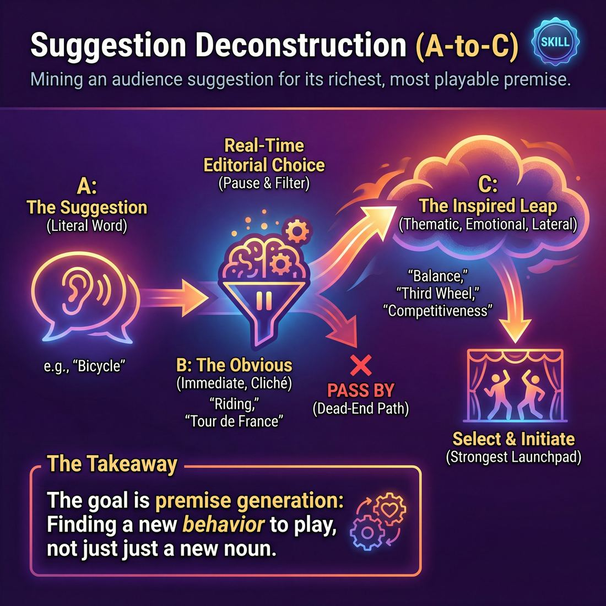

# Week 02 — A → C — Mining the Suggestion

> *The first thing a suggestion makes you think of is the thing everyone in the room already thought of.*

| Course | Week | Domain | Focus | Stage | Length | Class |
|---|---|---|---|---|---|---|
| The Piece — Long-Form & Audience | 2/8 | D4 | `D4.S3` — Suggestion Deconstruction (A-to-C) | Competent → Proficient | 180 min | 10–20 |

!!! note "Builds on"
    Last week they learned to see each other on the floor; this week they learn to see past the obvious in what an audience hands them.

## 🎬 The arc of this session

They arrive loose from last week, trusting the floor and each other, and slightly hungry to show they can be interesting. The session takes that hunger and redirects it away from cleverness and into excavation: taking a plain word, walking three or four steps from it, and finding specific human material nobody else in the room would have reached. They leave able to hand a group one ordinary noun and get ten playable starting points back, none of them the obvious one.

!!! tip "Watch for"
    The pretentious turn. Around minute 70 someone will offer "the concept of absence" or "the space between two people" as their C-point and the room will nod respectfully. Name it the moment it happens, without shaming the person, and ask for the smell, the object and the time of day instead.

## ⏱️ Session flow (180 minutes)

| Time | Block | Activity |
|---|---|---|
| **0:00–0:05** | 🧊 Ice-breaker | *Tuesday at Seven* |
| **0:05–0:10** | 😄 Laughter Blast | *Slow-Motion Sneeze* |
| **0:10–0:25** | 🔥 Warm-up cluster | *Three Jumps Out*, *Discard Twice*, *The Fourth Breath* |
| **0:25–0:45** | 🧠 Theory | — |
| **0:45–1:05** | 🎲 Drill A — isolation | *The Invocation* |
| **1:05–1:15** | ☕ Break | — |
| **1:15–1:35** | 🎲 Drill B — under load | *The Status Alchemist* |
| **1:35–2:10** | 🎯 Scene Lab | *Symphony of Sentience* |
| **2:10–2:50** | 🏟️ Showcase round | *The Partner's Pedestal* |
| **2:50–3:00** | 💭 Reflection & homework | — |

## 🎒 Before you start

- Clear a floor big enough for five people to stand apart without touching. Chairs stacked at one edge, not in a ring.
- Whiteboard or large pad plus two working markers. You will be writing association chains all session — keep the board visible from every seat.
- Write four plain nouns on separate index cards and pocket them: BREAD, LADDER, POSTCARD, KEYS. You need them for the theory demo and as backups.
- Review last week's homework aloud in one minute: they were asked to notice one thing on the periphery each day. Take two examples, no more, then move on.
- Blank paper and a pen per person for Drill A. Count them out before anyone arrives.
- Decide now who watches during the showcase. With more than 16 you will need two rotating audience benches — mark them with chairs before the room fills.

## 1. 🧊 Ice-breaker (5 min)

*"Stand up, find someone you did not work with last week, and tell me where you were on Tuesday at seven."*

**Why here:** Gets voices out and immediately trains the habit of specifying a time, a place and a person rather than a concept — the exact material C-points are made of.

### Tuesday at Seven

> Everyone reports where they actually were last Tuesday evening, then boils it down to a three-word headline for the circle.

`Players 10–20` · `~5 min` · `Complexity 2/5` · `Energy medium` · `Contact none` · `Props: none`

**How to play**

1. Stand everyone in a circle. Give your own answer first, one plain sentence: where you were last Tuesday at seven in the evening, and what you were doing.
2. Pair everyone off. Odd number, make one three.
3. Tell partners to swap real accounts of Tuesday at seven — thirty seconds each. You call the swap. Ask for detail, not summary. Say boring is fine and welcome.
4. Bring the circle back. Go round the ring. Each person gives their Tuesday as a three-word headline about themselves. Five seconds each.
5. Keep the ring moving. Do not stop for laughs, do not let anyone explain the headline.
6. Take a fast show of hands: completely typical Tuesday, somewhere new, cannot remember at all. Say the split out loud.
7. Ask one debrief question standing. Take two or three answers. Move straight into the warm-up.

📄 **[Full teaching notes »](week-02/advanced_w02__b1_1.md)**

**Side-coach:** *“"Which room? What was on the table?"”*

## 2. 😄 Laughter Blast (5 min)

*"Shake out. We are going to sneeze, very slowly, together, and nobody is allowed to apologise for it."*

**Why here:** Last week was about trust; today is a thinking session, and a physical absurdity now stops them getting precious before the theory block.

### Slow-Motion Sneeze

> The whole room builds one enormous sneeze together, over and over, in different sizes.

`Players 10–20` · `~5 min` · `Complexity 1/5` · `Energy high` · `Contact none` · `Props: none`

**How to play**

1. Get everyone standing in a circle, close enough to hear each other. Say nothing clever by way of introduction.
2. Demonstrate one enormous sneeze yourself: long shaky build, wet CHOO, complete collapse. Then say the room does it together.
3. Lead round one, slow build. Count four seconds of rising 'aaah', arms lifting, heads tilting back. Sneeze on your signal. Three times.
4. Lead round two, mouse sneeze. Same four-second build, but the release is tiny and squeaky, whole body shrinking. Three times. You squeak loudest.
5. Lead round three, opera sneeze. Build on a rising sung note, arms wide, sneeze in full voice, collapse forward from the waist. Three times, each bigger.
6. Call rapid fire. Five sneezes in a row on your count, any size, no build-up, everyone at once. Let it turn into noise.
7. Stop dead. Ask one question. Take two or three quick answers. Do not discuss. Move straight into the next block.

📄 **[Full teaching notes »](week-02/advanced_w02__b2_1.md)**

**Side-coach:** *“"Stretch the build. You are three seconds from the sneeze, not one."”*

## 3. 🔥 Warm-up cluster (15 min)

*"Circle up. Three short things back to back. Do not try to be interesting in any of them."*

**Why here:** Three drills that install the mechanic in the body before it is explained: jump away from the obvious, throw away your first two ideas, wait one breath longer than is comfortable.

### Three Jumps Out

> The room jumps a word three associations away from itself and freezes in the shape of whatever lands third.

`Players 8–20` · `~5 min` · `Complexity 2/5` · `Energy high` · `Contact none` · `Props: none`

**How to play**

1. Circle everyone up standing, arms free. Tell them you will call a word, then count three jumps. On each landing they shout their own next association out loud.
2. Explain the third landing: shout the word and freeze your body in its shape. Hold until you call the next word.
3. Demo once at half speed with 'beach'. Jump, shout. Jump, shout what the first word gave you. Jump, shout, freeze. Point out how far apart the shapes are.
4. Run six rounds at pace with no gap between them: hospital, wedding, snow, bank, dog, birthday. Count the jumps out loud, three per word.
5. Add one rule: word three must not fit in the same shop, building or afternoon as word one. Run three rounds — airport, phone, gym.
6. Run two final rounds with jumps one and two silent. Shout only on the third landing. Point out how many people land on the same word, then sit everyone down.

📄 **[Full teaching notes »](week-02/advanced_w02__b3_1.md)**

### Discard Twice

> In pairs, players say the two obvious answers out loud, flick them away, and hand their partner the third one — the specific one.

`Players 10–20` · `~5 min` · `Complexity 2/5` · `Energy medium` · `Contact none` · `Props: none`

**How to play**

1. Pair everyone up. Odd number, make one three and rotate the feeder role.
2. Explain the shape: A says one plain noun. B holds an open palm, names the two most obvious associations, and flicks each one off the palm.
3. Tell B to then look at A and give a third answer — concrete and small, not surreal, not clever.
4. Demo once with a volunteer. Take 'wedding'. Flick off 'cake'. Flick off 'speech'. Land on 'the folding chair with one short leg'.
5. Run round one. A feeds, B discards twice and lands the third, then swap immediately. Keep cycling new nouns until you call time.
6. Call a partner change. Nobody stays where they are.
7. Run round two with one added rule: the third must be something the speaker has actually seen or touched first-hand.
8. Run round three in the same pairs. After the third lands, the listener repeats it back word for word before feeding the next noun.
9. Stop. Tell everyone to keep hold of one third they heard from a partner and carry it into the next block.

📄 **[Full teaching notes »](week-02/advanced_w02__b3_2.md)**

### The Fourth Breath

> A word is offered, the room breathes four times in silence, and only the fourth association gets spoken.

`Players 8–24` · `~5 min` · `Complexity 2/5` · `Energy low` · `Contact none` · `Props: none`

**How to play**

1. Stand the group in a circle. Tell them you will say one word, then lead four slow breaths in silence. Eyes closed or soft gaze — their choice.
2. Explain the rule: on each out-breath, let one association arrive and let it go. Only the fourth one gets spoken aloud. Nothing before that counts.
3. Run a practice on the word BREAD. Breathe four times audibly so they can follow your rhythm. Take three or four voices at random. Note how far four breaths travelled.
4. Give a fresh word. Lead four breaths. Then go round the circle: one word or short phrase each, quiet, no explaining, no justifying.
5. Give a second word. Same shape, plus one rule — nobody repeats an association already spoken. If yours is taken, breathe once more and offer something else.
6. Give a third word with two breaths only. Same discipline, faster. Say out loud if you hear the room sliding back to first thoughts.
7. Stop. Eyes open. Say the cue: never play A, go to C. Move straight into the next block without discussion.

📄 **[Full teaching notes »](week-02/advanced_w02__b3_3.md)**

**Side-coach:** *“"That was your first idea. Discard it and give me the next one."”*

## 4. 🧠 Theory — Suggestion Deconstruction (A-to-C) (20 min)

{ .infographic }

- **The big idea:** A suggestion is a doorway, not a subject. The first association everyone reaches — A — is the one the whole room reached simultaneously, which means the audience has already seen that scene. C is three deliberate steps sideways: still connected to the word, but arrived at by a path only you walked.
- **Where you are on the path:** They can already listen and support. What they cannot yet do is delay. Their instinct is to seize the first image and play it hard, and their scenes are competent but interchangeable. Proficient here means the pause before the choice becomes automatic, not effortful.
- **The one cue to coach:** *“Never play A. Go to C.”*

**The three beats**

1. **Say it.** Say: "When someone shouts a word, your brain hands you something in half a second. That is A. Everyone got the same thing. Play A and you are performing the audience's imagination back at them. B is the second thought — usually A with a hat on. C is where the word stops being a topic and starts being a place with people in it. Never play A. Go to C."
2. **Show it.** Take the word BREAD from the board. Out loud, step through it: A is a bakery, someone kneading dough, flour on an apron. B is a French village, a baguette under an arm. C — say it slowly — is the plastic tag that seals the bag, which is colour-coded by day of the week, which means somebody in a factory decides what colour Thursday is. Then say: "That is a scene. Two people arguing about Thursday. Sixty seconds ago that word was just bread." Do not rehearse this in advance so the room sees the walking, not the destination.
3. **Try it.** Everyone stands. Give the word LADDER. In pairs, they alternate associations aloud, one each, as fast as they can, for ninety seconds — no stopping, no judging, no repeating. Then thirty seconds silent: each person picks the association furthest from where they started. Take four out loud from the room. Point at which ones are A wearing a hat and which are genuinely C. Two minutes on that, then move.

!!! warning "The misunderstanding that always comes up"
    They hear "go to C" as "go abstract" or "go weird". C is not stranger than A, it is more specific than A. Correct it with this: "Weird is still an association — it is just A with a costume. C has a person in it, doing something, somewhere. If you cannot say who is in the room, you have not got to C, you have got to fog."

!!! abstract "📖 Go deeper"
    Read the full write-up: [Suggestion Deconstruction (A-to-C)](../../../theory/04_the-ensemble/04_S3__suggestion-deconstruction-a-to-c.md)

## 5. 🎲 Drill A — isolation (20 min)

*"Pen and paper each, sit where you can hear me. One word, and you are going to walk away from it in writing."*

**Why here:** Isolates the skill with no scene pressure at all — pure excavation on paper and out loud, so the mechanic is clean before anyone has to act.

### The Invocation

> Elevate a mundane object into a mythic deity to inspire rich, thematic ensemble scenes.

`Players 4–12` · `~20 min` · `Complexity 4/5` · `Energy medium` · `Contact none` · `Props: none`

**How to play**

1. Stand the group in a circle. Take one concrete inanimate object as a suggestion from the room — stapler, kettle, house key. Write it up so everyone can see it.
2. Call Phase One: "It is." Players speak in any order, one at a time, giving plain physical facts only. "It is metal." "It is cold." No metaphor yet.
3. Call Phase Two: "You are." Players now address the object directly and give it human traits, feelings, history, relationships. "You are a keeper of secrets." "You are patient."
4. Call Phase Three: "Thou art" or "I am." Players speak to the object as a god, or speak as the object. Grand, mythic, abstract. Metaphor welcome.
5. Push volume and body in Phase Three. Let voices overlap, let players repeat each other's lines, let it become a chant. Encourage stamping, swaying, whatever the group offers.
6. Cut the invocation at its loudest point with a clap. Hold the silence for three seconds.
7. Send two players straight out of the silence into a sixty-second scene using a character, relationship or theme the invocation threw up. Cut it and reset.

📄 **[Full teaching notes »](week-02/advanced_w02__b5_1.md)**

**Side-coach:** *“"Cross out anything you could have written in the first two seconds."”*

## ☕ Break — 10 minutes

Water, notes, informal talk. Non-negotiable at three hours — do not let it collapse into a working discussion.

## 6. 🎲 Drill B — under load (20 min)

*"Same skill, but now there is someone in the scene who wants something from you. Pairs, on your feet."*

**Why here:** Adds load: they must now reach a C-point while also managing a status relationship, so the excavation has to happen under a second demand.

### The Status Alchemist

> Elevate your partner's status through silent projection, generative repetition, and deep physical embodiment.

`Players 2–99` · `~20 min` · `Complexity 3/5` · `Energy medium` · `Contact none` · `Props: none`

**How to play**

1. Pair everyone off. Name one Alchemist and one Reflector in each pair. Hand each Alchemist a folded slip carrying a high-status quality. They read it silently and keep it hidden.
2. Run phase one in silence, one minute. Alchemists treat their partner as if the quality is obvious — posture, distance, eye contact, deference. Reflectors notice, and let their body answer.
3. Open the talking. Alchemists give direct, positive observations that hand the quality over. Ban the word printed on the slip. Say what the quality causes, never what it is called.
4. Tell Reflectors to echo each line aloud in the first person, then change breath and posture to make it true before the next line arrives.
5. Alchemists build. Each new observation goes further than the last and uses the Reflector's own physical adjustment as its evidence. One gift at a time, no stacking.
6. Call phase three. The pair begin any simple shared activity. The Alchemist keeps treating the Reflector as high status; the Reflector plays with the competence they were handed.
7. Swap roles. Give the new Alchemist a fresh slip. Run the same three phases at the same lengths.
8. Require no touch. Deference is distance, height, eye contact and timing. Anyone who prefers not to hold eye contact can look at the forehead or hands.

📄 **[Full teaching notes »](week-02/advanced_w02__b7_1.md)**

**Side-coach:** *“"You went to A because the status got hot. Stay with the harder idea."”*

## 7. 🎯 Scene Lab (35 min)

*"Groups of five. One word between you, and every one of you needs a different door into it."*

**Why here:** Group work where several C-points from one word must coexist, which is the real long-form problem: one suggestion, many unrelated true things.

### Symphony of Sentience

> Evolve a single, non-verbal collective consciousness through intuitive, multi-modal sound and movement.

`Players 5–12` · `~35 min` · `Complexity 3/5` · `Energy medium` · `Contact none` · `Props: none`

**How to play**

1. Clear the floor. Stand everyone in a loose circle, an arm's length apart, facing in. Tell them the whole block is wordless — sounds yes, language no.
2. Say one abstract seed word aloud: "rust", "anticipation", "thaw", "decay". Do not explain it. Do not let anyone ask what it means.
3. Point at one player. They make a single short sound or movement — their first response to the word. Name that offer out loud as A.
4. Tell the rest: do not copy A. Each new offer is the next thing along from what the room is already doing, not a repeat of what one person did.
5. Instruct everyone to answer the whole room. Watch peripherally, listen to the aggregate texture, add to that — not to your neighbour alone.
6. Keep every offer brief and textural. No solos, no characters, no story, no miming objects. Side-call anyone who holds the floor.
7. Let offers overlap and layer without pause. Silence is permitted. Stillness counts as a contribution.
8. Drop a fresh prompt word into the flow when the state settles, or say nothing and let it drift on its own.
9. Call "freeze" when the room reaches stillness, peak intensity, or an obvious resolution. Hold the freeze three seconds before releasing.

📄 **[Full teaching notes »](week-02/advanced_w02__b8_1.md)**

**Side-coach:** *“"Somebody in that group has taken the obvious one. Trade it."”*

## 8. 🏟️ Showcase round (40 min)

*"I want one ordinary noun from someone who has not spoken much today. Then we play it three times, three different ways, and nobody plays a bakery."*

**Why here:** A genuine word from a student, played three ways in front of watchers, proves the method works under observation and produces material for next week.

### The Partner's Pedestal

> Elevate your partner to legendary status through relentless, reciprocal gifting and physical attunement.

`Players 2–99` · `~40 min` · `Complexity 3/5` · `Energy medium` · `Contact none` · `Props: none`

**How to play**

1. Take one word from the room. Say its first association, then an association off that. Use only the second one — C — to name a neutral relationship for the pairs.
2. Pair everyone off. Label one Player A, one Player B. Hand each pair their relationship: two colleagues waiting on news, two old friends meeting after a long trip. No plot.
3. Run sixty seconds of silence. A makes one small honest gesture or shift of expression that comes from a real internal feeling. No mime, no jokes.
4. Tell B to mirror the feeling underneath, not the shape of the movement. B takes it into their own body and lets it surface however it surfaces.
5. Have A deepen or shift the feeling. B mirrors the new layer. Keep trading until the minute ends. Both now share one emotional temperature.
6. A speaks first. The line comes straight out of what the body is already doing — the silent connection, said aloud.
7. From there both players gift status. Attribute intelligence, expertise or past triumphs to your partner, and be specific. Lower your own standing when it makes theirs taller.
8. Gift without words as well: yield the space, look up at them, let awe show on your face when they speak.
9. Receive graciously. No deflecting, no "hardly". Accept the endowment, stand on it, and hand a fresh piece of genius straight back.

📄 **[Full teaching notes »](week-02/advanced_w02__b9_1.md)**

**Side-coach:** *“"Watchers — hands up if you had already imagined that. Players, go one step further."”*

## 9. 💭 Reflection & homework (10 min)

**Deepen your improv**
1. Think of a scene you started today that died in the first thirty seconds. Was it A, and if so, what was the C you could feel but did not reach for?
2. When you were pushed past your first idea, what did it cost you — did it feel like thinking, or like stalling? Where in your body did you notice the delay?

**Beyond the stage**
3. This week, when someone tells you a problem, notice the first response your mouth wants to make. Hold it for one breath and offer the second one instead. Report back on what changed in the conversation.

➡️ **[This week's homework](../homework/HW-ADVW02.md)**

??? note "🎓 Facilitator notes"

    **Timing risks**
    - The theory try-it overruns badly if you take more than four examples from the room. Cap it at four and say so before you start taking them.
    - The showcase at 40 minutes only fits three scenes plus notes if you keep your feedback to ninety seconds per scene. Write that number on your hand.
    - Groups of five in Scene Lab will spend twelve minutes negotiating instead of playing. Give them four minutes to choose C-points, then call time whether or not they have agreed.

    **Failure modes this week**
    - Pretentiousness. Abstract, mood-heavy openings with no person in them. Fix by asking for the object in someone's hand, not by criticising the idea.
    - Chain-showing. They perform the association walk aloud on stage — "bread, bakery, Thursday tag" — instead of just playing Thursday. The walk is private. Say it once early and once more when it happens.
    - Paralysis. Some will freeze because now no idea feels far enough away. Tell them C is a distance, not a quality bar, and that a played B beats an unplayed C every time.
    - The clever few dominating the group drills. In Scene Lab, physically assign who speaks first in each group of five.

    **What good looks like by the end:** By the end, a group of five takes one plain noun and returns ten starting points in under four minutes, none of them the first association, and every one of them containing a person doing something specific in a specific place. The pause before choosing is visible and short. Nobody apologises for taking it.

    **Carry into next week:** Keep the strongest of the three showcase openings — note the word, the C-point and who played it. That becomes the seed for next week's montage. Also note which two people defaulted hardest to A under pressure; pair them with confident excavators next session rather than with each other.
