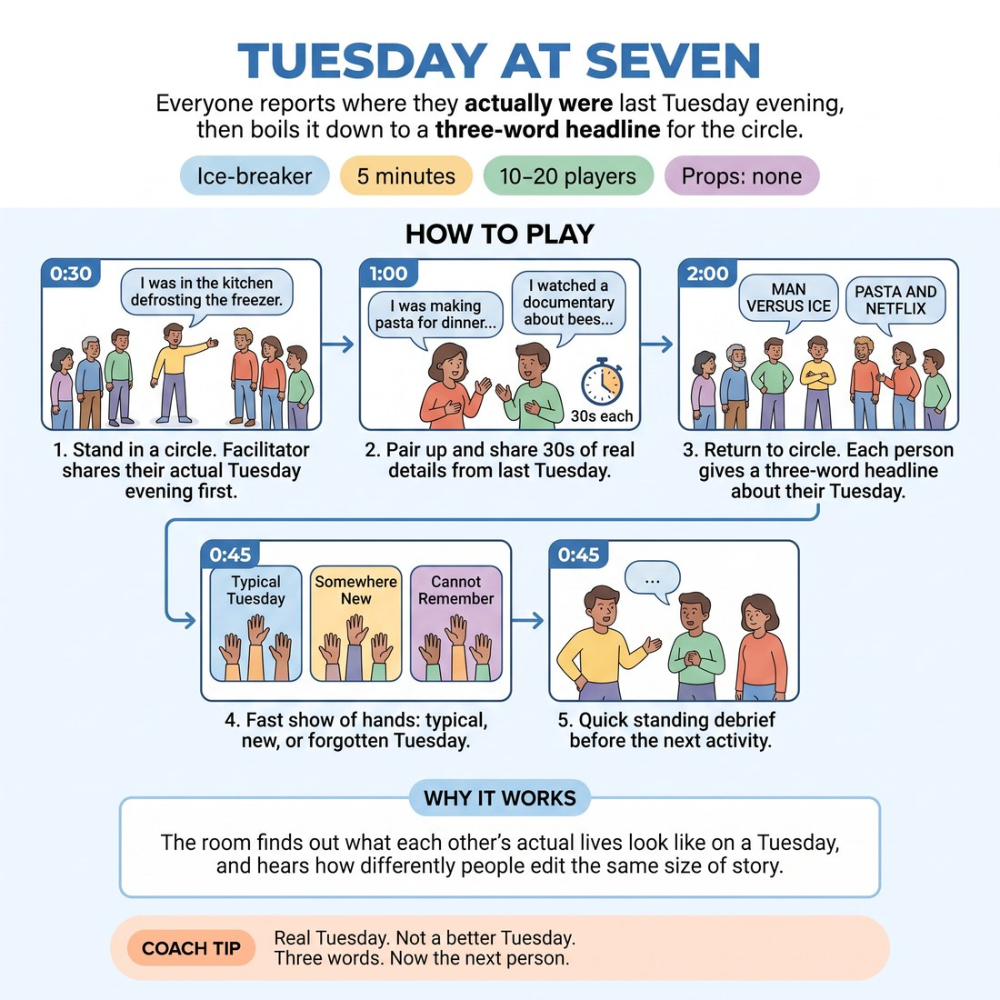

# 🧊 Ice-breaker — Tuesday at Seven

{ .infographic }

> Everyone reports where they actually were last Tuesday evening, then boils it down to a three-word headline for the circle.

`Players 10–20` · `~5 min` · `Complexity 2/5` · `Energy medium` · `Contact none` · `Props: none`

⬅️ [Back to the Week 02 run-sheet](../week-02.md)

## Why this activity, here

First thing in the room, before any theory about suggestions. Week 2 is about refusing the obvious response to an audience word. This block gets people handling real, specific, unglamorous material about themselves and compressing it — so when you name A-to-C twenty minutes later, they already have a felt example of raw fact becoming something with an angle. It feeds the deconstruction drills and, later, the opening of the long-form piece.

## What students actually learn

- That their own ordinary week is usable material, and that specificity is more interesting than invention.
- That compressing something forces a point of view — three words cannot be neutral.
- That the first, most literal description of a thing is rarely the one worth playing.

## Setup

Chairs pushed back, standing circle, everyone can see everyone. No props, no paper. Know your own Tuesday before the class starts — pick something genuinely dull, not a good story. Have a timer or watch you can glance at without stopping the room.

## How to run it — 5 minutes

| Min | What you do |
|---:|---|
| 1 | Circle up. Give your own Tuesday at seven in one plain sentence. Keep it dull and concrete. Then pair everyone off, shoulder to shoulder, and name who goes first. |
| 1 | Partners swap real accounts, thirty seconds each. Call the swap loudly at the halfway point. Push for detail — what was on, what was cold, who was in the room. |
| 2 | Back to the circle. Round the ring, three-word headline each, five seconds. Point at the next person before the last one finishes. No explanations, no repeats of the round. |
| 1 | Show of hands: typical Tuesday, somewhere new, no memory. Say the split out loud. One question, two or three answers, then straight into the warm-up. |

## Side-coaching script

| When | Say |
|---|---|
| As pairs start talking | *"Detail, not summary. What was actually in the room."* |
| Twenty seconds into the first partner | *"Boring is fine. Boring is the good stuff."* |
| Calling the swap | *"Swap now. Second person."* |
| Opening the headline round | *"Three words. About you, not about Tuesday."* |
| Someone starts explaining their headline | *"Just the three. Next."* |
| The ring slows or a laugh stalls it | *"Keep it moving. Don't wait for the laugh."* |
| Someone freezes | *"Any three words. Take them back at the end if you want."* |
| Closing the round | *"Notice how far the three words travelled from the sentence."* |

!!! success "What good looks like"
    The ring keeps a steady pulse — headline, point, headline, point — and lands inside two minutes. Headlines are odd and specific rather than tidy. At least a few people describe themselves rather than the events. Laughs are short and the circle does not stop for them. Nobody has invented a Tuesday.

## When it goes wrong

| You see | What's causing it | The fix |
|---|---|---|
| People telling stories instead of headlines — five, ten, twenty words with a lead-in. | The pair stage warmed them up to narrate and you did not cut hard enough at the switch. | Count the words out loud on the offender's behalf, say 'three', and point to the next person. One interruption fixes the whole ring. |
| Headlines all sound the same shape — 'watched telly alone', 'ate dinner quietly'. | They are summarising the event rather than commenting on themselves. | Call 'about you, not about Tuesday' mid-round and give one of your own as a model: something with a judgement or an angle in it. |
| Someone says they cannot remember Tuesday and stalls the circle. | Genuine blank, plus pressure to produce something worth hearing. | Say 'then that's the headline — cannot remember Tuesday' and move on immediately. Do not let them dig. |
| The round runs long and eats the warm-up. | Group of eighteen-plus at five seconds each, plus laughter gaps. | Split into two circles for the headline round and run them at the same time. You watch one, then the other. |

## Scaling

| Class size | What changes |
|---|---|
| **10–13** | One circle throughout. Five seconds each is comfortable; the headline round lands around sixty to seventy seconds, so you can take four debrief answers instead of two. |
| **14–17** | One circle, but tighten the headline round — point at the next person early and refuse any explanation. Cut the show of hands to two options: typical, or not typical. |
| **18–20** | Split into two circles of nine or ten for the headline round only, running simultaneously. Stand between them. Bring the whole room back together for the show of hands and the one question. |

## Variations

**Two-word headline** — Same structure, but the headline is two words. Give an example before the round starts.  
*Harder — the compression removes any chance of narrating and forces an angle almost immediately.*

**Partner writes it** — After the pair swap, each person gives their partner's Tuesday as the three-word headline, in the round.  
*Easier for the self-conscious, and shifts the emphasis to listening — you cannot compress what you did not hear.*

**Third association** — After each headline, the person to their left says one word the headline makes them think of, then one more word from that.  
*Different emphasis — puts the A-to-C chain on the floor explicitly, ahead of the drills.*

## Debrief

1. **Whose headline was nothing like the sentence they'd have given at the start?**
   > *A good answer sounds like:* Someone names a specific pair — 'she said she was sorting the recycling, and the headline was king of the small jobs' — and the room recognises the gap without you explaining it.

2. **What made the three-word version more interesting than the thirty-second one?**
   > *A good answer sounds like:* 'You had to decide what it meant.' 'It had an opinion in it.' Anything pointing at compression forcing a choice. If you get 'it was funnier', ask why, take one more answer, then move.

!!! warning "Safety & inclusion"
    No contact in this activity — pairs stand near each other, nothing more. Anyone can pass on the headline round by saying 'pass'; take it without comment and come back to them at the end only if they nod. Real personal material is in play, so say up front that people choose their own level of detail and nothing is followed up on. If someone's Tuesday was genuinely difficult, they can give a headline for a different evening. Standing is not required — anyone who prefers to sit stays in the ring on a chair.

## Why it works

D4.S3 asks players to stop playing the literal suggestion and move to the third thought. The obstacle is that beginners treat the obvious response as the only honest one. This block breaks that by using material where the literal version already exists and is agreed — everyone knows what they actually did on Tuesday. The three-word compression cannot restate the fact; there is not room. So the player is forced to select, judge and angle, which is the A-to-C move performed on autobiographical material rather than on an audience word. Doing it on their own week makes the move feel like observation rather than cleverness, which is the point: C is not a joke, it is a further-along association. The cue lands later with a reference point already in the room.

[Open the full activity card »](../../library/icebreakers/IB__tuesday-at-seven.md){target=_blank rel=noopener}
