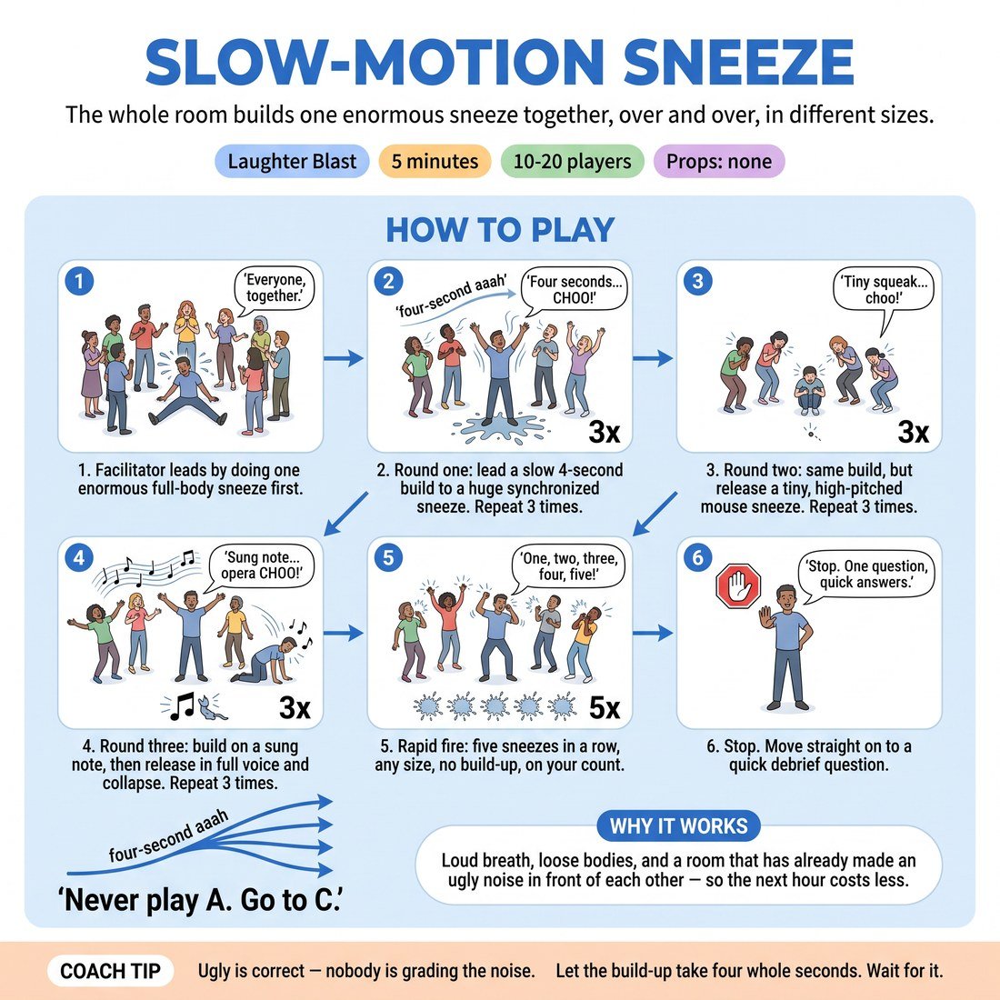

# 😄 Laughter Blast — Slow-Motion Sneeze

{ .infographic }

> The whole room builds one enormous sneeze together, over and over, in different sizes.

`Players 10–20` · `~5 min` · `Complexity 1/5` · `Energy high` · `Contact none` · `Props: none`

⬅️ [Back to the Week 02 run-sheet](../week-02.md)

## Why this activity, here

Week 2 opens on A-to-C. Before anyone deconstructs a suggestion they need lungs, volume and a body that will commit to something silly without checking whether it's clever. This is the noise that buys you that. It also plants the week's shape in miniature: one stimulus, played four different sizes, none of them the obvious one. Feeds straight into the first A-to-C drill where they take a single word and refuse the first association.

## What students actually learn

- They make a large, undignified noise in front of thirteen strangers within ninety seconds of arriving, which lowers the cost of everything after it.
- They feel the difference between doing a thing and doing a version of a thing — the same sneeze, four ways.
- Their voices are open and their breath is low before any scene work starts.

## Setup

Standing circle, no chairs, arms' width apart so nobody gets elbowed on the arm lift. Move bags out of the ring. Tissues somewhere visible if you have them. Nothing else to prepare — do not explain the exercise before you start it, just do the first sneeze.

## How to run it — 5 minutes

| Min | What you do |
|---:|---|
| 1 | Circle up. Do your own enormous sneeze cold, no preamble. Say 'everyone, together.' Lead three slow-build sneezes: four seconds of rising 'aaah', arms up, heads back, release on your signal. |
| 1 | Mouse sneeze. Same four-second build, tiny squeaked release, bodies shrinking to a point. Three of them. Squeak louder than anyone. |
| 1 | Opera sneeze. Build on a rising sung note, arms wide, full-voice release, fold forward from the waist. Three, each one bigger than the last. |
| 1 | Rapid fire. Count five and take five sneezes back to back, any size, no build, everyone together. Let the circle turn to noise and don't tidy it. |
| 1 | Cut it hard. Ask: which size was hardest to commit to? Take two or three one-line answers. No discussion. Straight on. |

## Side-coaching script

| When | Say |
|---|---|
| Just after your demo sneeze, as they hesitate | *"Copy me. Don't improve it."* |
| During the four-second build in round one | *"Longer on the build. Let it get uncomfortable."* |
| Mouse round, if people are still doing medium sneezes | *"Smaller. Smaller. Whole body to a pinprick."* |
| Opera round, first pass | *"Sing the build. Full voice on the release."* |
| Opera round, third pass | *"Bigger than you want to. Collapse all the way down."* |
| Going into rapid fire | *"No build now. Just fire."* |
| Mid rapid fire | *"Louder. Let it be a mess."* |
| The instant the fifth one lands | *"Stop. Hands down."* |

!!! success "What good looks like"
    By the opera round the noise is genuinely loud and slightly out of control, people are laughing at the collapse rather than at each other, and nobody is scanning the room to see whether it's alright to be doing this. Bodies are moving as much as voices. When you cut it, breathing is audible.

## When it goes wrong

| You see | What's causing it | The fix |
|---|---|---|
| Half the circle mouthing the sneeze at 20% volume while watching you. | You demonstrated at half size, or you explained before you did it. They are matching your commitment level, not your instruction. | Do one more yourself at absolute full size, ugly, and immediately count them in. Don't ask for more volume — model it. |
| People turn the sneeze into a bit — funny voices, silly characters, sneezing at each other. | Someone reached for cleverness and the room followed. It becomes performance for laughs instead of shared noise. | Call 'everyone the same sneeze, on my count' and lead the next one very precisely. Uniformity kills the bit fast. |
| The mouse round dies — polite little coughs, no energy, and the room goes quiet. | Small is harder than big. Nobody wants to be the one squeaking. | Squeak absurdly loud yourself on the second and third. Small does not mean quiet. Say it if you need to. |
| You have used four minutes and are only on the opera round. | You are pausing to explain each round. The rounds are meant to run into each other. | Cut a repetition from each round rather than dropping a round. Three sizes with two reps each beats two sizes done fully. |

## Scaling

| Class size | What changes |
|---|---|
| **10–13** | One circle. Run all three reps of every round as written; the smaller circle can hear itself so the mouse round works. Rapid fire at five sneezes. |
| **14–17** | One circle, arms' width apart, which will be a wide ring — stand in it rather than outside so your count carries. Drop to two reps on the slow build to protect time. Rapid fire at five. |
| **18–20** | One circle still — splitting it halves the volume and the point is mass noise. Two reps per round, not three. Count with a raised arm as well as your voice; at twenty people the back of the ring will not hear the count over the noise. Rapid fire at six. |

## Variations

**Follow the leader** — After round one, hand the next sneeze size to a volunteer. They choose it, demonstrate it once, and lead three. Take two volunteers before rapid fire.  
*Easier on you, harder on them — moves the commitment burden into the room and gives quiet people a low-stakes lead.*

**Half and half** — Split the circle down the middle. One half builds the 'aaah' while the other half stays silent, then the silent half delivers the release. Swap.  
*Harder — requires listening and timing rather than just volume, and the release has to land on someone else's build.*

**Any sneeze but the sneeze** — After the opera round, ask each person to release with a sound that is not a sneeze but comes out of the same build — a laugh, a shout, a sob. All at once, three times.  
*Different emphasis — pushes straight at the A-to-C idea: same set-up, refuse the obvious payoff.*

## Debrief

1. **Which size was hardest to commit to?**
   > *A good answer sounds like:* 'The mouse one — I felt more stupid being small than being huge.' Specific, about their own body, one sentence. Two or three of these and you move on.

2. **What changed between the first sneeze and the last one?**
   > *A good answer sounds like:* 'I stopped checking what everyone else was doing.' Or simply 'louder'. Anything naming their own attention shifting is enough. Do not chase depth here.

!!! warning "Safety & inclusion"
    No contact, so no consent step needed. Say once, before you start: tilt your head back only as far as is comfortable, and if your neck or back objects, do the whole thing looking straight ahead — it works fine. Anyone who does not want to make loud noise can do the full body shape silently; say this out loud so it is not a private request. Warn about voice: this is one minute of loud, not a habit — no scraping, no shouting from the throat. If anyone is unwell or germ-conscious, tell the room to aim the release downward into an elbow rather than across the circle. Sneezing can trigger a genuine coughing fit in people with asthma; keep water accessible and let anyone step out without explanation.

## Why it works

The block sits under 'Never play A. Go to C.' A sneeze is the A — the obvious, literal, one-and-only version of the thing. The exercise never lets them stay there. Within three minutes the same physical impulse has been played tiny, operatic and as pure noise, and each version came from the same four-second build. That is the mechanical shape of suggestion deconstruction, done in the body before it is done with words: one stimulus, several distances from the literal, and the interesting ones are not the first one. Doing it loudly and in unison also removes the audition quality — nobody is being judged on their sneeze, so the risk of the later A-to-C drills, where people worry their association is wrong, is pre-lowered.

[Open the full activity card »](../../library/laughter/LB__slow-motion-sneeze.md){target=_blank rel=noopener}
