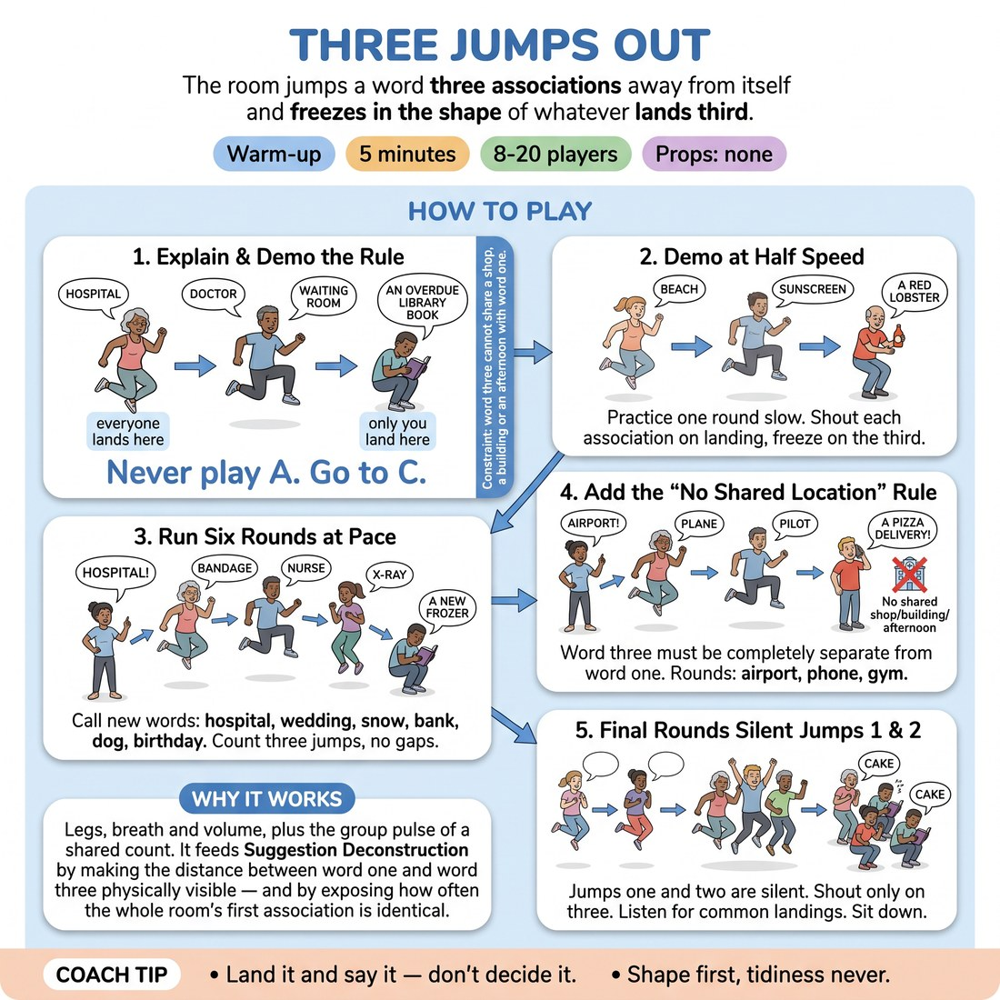

# 🔥 Warm-up cluster — Three Jumps Out

{ .infographic }

> The room jumps a word three associations away from itself and freezes in the shape of whatever lands third.

`Players 8–20` · `~5 min` · `Complexity 2/5` · `Energy high` · `Contact none` · `Props: none`

⬅️ [Back to the Week 02 run-sheet](../week-02.md)

## Why this activity, here

Opens Week 2, the session where the group learns to mine a suggestion instead of illustrating it. It comes before any scene work and before the seated association drills. It puts the A-to-C move in the body first — three physical steps away from the given word — so that when they later sit and mine 'balloon' on paper, the jump is already a familiar sensation rather than a new instruction.

## What students actually learn

- The first association is not a choice — it arrives whether you want it or not. The third one required them to travel.
- Distance from the suggestion is measurable. They can feel the difference between one jump and three.
- Everyone's first jump is roughly the same. The spread only opens up at three, which is where their own material lives.

## Setup

Clear floor space, everyone standing in a circle with enough room to jump without touching. No chairs in the ring. Have the two word lists to hand or memorised: hospital, wedding, snow, bank, dog, birthday, then airport, phone, gym. Nothing to print. Check the floor is safe for jumping and note anyone who has flagged a knee, back or balance issue before you start.

## How to run it — 5 minutes

| Min | What you do |
|---:|---|
| 1 | Circle up. Give the rule: one word from you, three jumps, a shouted association on every landing, freeze on the third. Demo once at half speed with 'beach' and name the spread of shapes you see. |
| 2 | Six rounds at pace: hospital, wedding, snow, bank, dog, birthday. Count the three jumps aloud each time. Do not pause between rounds — call the next word straight over the freeze. |
| 1 | Add the distance rule: word three cannot belong in the same shop, building or afternoon as word one. Run airport, phone, gym. Let the extra thinking time show; keep the count steady anyway. |
| 1 | Two final rounds with jumps one and two silent, shouting only on the third landing. Name aloud how many people landed on the same word. Sit the room down where they stand. |

## Side-coaching script

| When | Say |
|---|---|
| During the demo, before the first real round | *"Say the word that arrives. Not the good one."* |
| First two rounds, when people are watching each other | *"Your own word. Don't shop."* |
| Any round where the shouts thin out | *"Louder on the landing. All three."* |
| When freezes are vague or half-hearted | *"Whole body on three. Commit to the shape."* |
| Immediately after adding the distance rule | *"Different building. Different afternoon."* |
| When someone stalls on jump three and stops jumping | *"Keep jumping. Word can be late."* |
| The two silent rounds | *"Travel quietly. Only three out loud."* |
| Just before sitting down | *"Look at the shapes. That's your range."* |

!!! success "What good looks like"
    Noisy and slightly untidy. Everyone jumps on your count whether or not their word is ready. First landings across the room cluster hard — five people shouting 'doctor' at 'hospital' — and by the third landing the shouts are all different and some are strange. The freezes are physically distinct: someone low, someone wide, someone folded. Nobody is checking whether their word was clever.

## When it goes wrong

| You see | What's causing it | The fix |
|---|---|---|
| Everyone lands on the third jump with a word that is still obviously inside the first — hospital, doctor, nurse, ward. | They are listing category members rather than associating. The mind stayed in one room and walked around it. | Call the distance rule earlier than planned. Say 'different building' before the jump, not after, and take one out-loud example from the room. |
| People jump but the shouts are quiet or half the circle is silent on landings one and two. | Self-editing — they are waiting until they have a word worth saying. | Stop, say the word only has to exist, not be good, and run one throwaway round with a dull word like 'chair' where nobody is judged. |
| The circle drifts out of sync and people are jumping on their own count. | Your count is buried under the shouting. | Count louder and clap the beat. Reset with 'find my count' and start the next word on a clear one-two-three. |
| Two or three people stand still, arms folded, watching. | Either a physical issue they haven't declared or the jumping feels childish to them. | Offer the stamp or hand-clap version out loud to the whole room, not to them individually, so opting out costs nothing. |

## Scaling

| Class size | What changes |
|---|---|
| **10–13** | One circle. Run the full nine rounds as written; the smaller group gets through them faster, so add a tenth word (kitchen) to fill the second block. You can hear individual words, so name two contrasting third-jumps aloud after round three. |
| **14–17** | One circle, wider. Run exactly as written. You will only catch fragments of the shouting — that is fine, judge by volume and by the spread of the frozen shapes rather than by individual words. |
| **18–20** | Two concentric rings or one wide horseshoe so nobody is jumping into a back. Cut the first block from six rounds to five (drop 'dog') to keep the total at five minutes. Everyone jumps; nobody watches. |

## Variations

**Two jumps** — Cut to two jumps and freeze on the second. Keep the same word list and the same pace.  
*Easier — the second association still arrives on its own, so nobody stalls, and the room gets the shape of the game before the distance demand lands.*

**No repeats in the room** — On the third landing, anyone who shouts a word already shouted by someone else steps into the middle for the next round and jumps there.  
*Harder — forces listening across the circle while associating, and makes the cluster at the first association visible as a cost.*

**Partner jump** — Pairs face each other. A shouts on landings one and three, B shouts on two. The third word must come from B's word, not A's.  
*Different emphasis — shifts from private association to building on someone else's offer, which is where the suggestion work goes in the second half.*

## Debrief

1. **Where did your word stop being the obvious one?**
   > *A good answer sounds like:* They name a specific jump — 'one and two were both hospital stuff, three was a car park' — rather than talking generally about creativity.

2. **How many of you shouted the same word on jump one?**
   > *A good answer sounds like:* Hands go up in a cluster and someone says it out loud. The point lands without you having to explain that first associations are shared property.

!!! warning "Safety & inclusion"
    No contact in this activity — keep the circle wide enough that nobody jumps into a neighbour. Before starting, offer the alternative once to the whole room: a firm stamp, a heel raise, or a hand-clap on the beat instead of a jump. All work identically and nobody needs to explain why they are using them. Anyone who prefers not to shout can say their word at speaking volume or mouth it; the freeze still counts. Watch for hard floors and heeled shoes, and say that people can step out of a round and back in without comment.

## Why it works

D4.S3 rests on the fact that a suggestion's first association is common property — the whole room reaches for it simultaneously, which is why scenes built on it feel pre-seen. This drill makes that visible in two seconds: fifteen people shout 'doctor' at 'hospital'. Then it enforces travel. Three counted jumps give the mind no time to evaluate, so associations get made rather than chosen, and the third landing is far enough out to be personal. Putting it in the body rather than on paper means the distance is felt as effort — three jumps' worth — which is the sensation they need to recognise later when they are sitting with a suggestion and wondering whether they have gone far enough. The cue 'never play A, go to C' becomes a physical memory before it is a rule.

[Open the full activity card »](../../library/warmups/WU__three-jumps-out.md){target=_blank rel=noopener}
