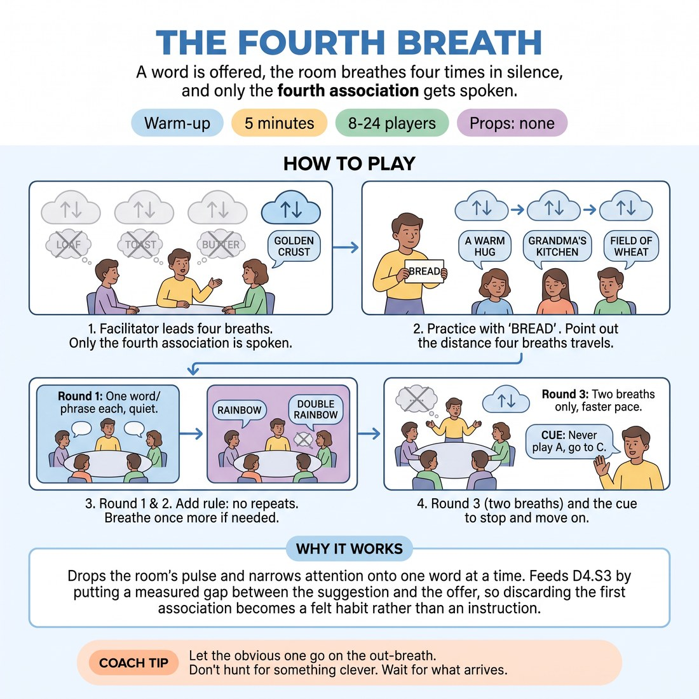

# 🔥 Warm-up cluster — The Fourth Breath

{ .infographic }

> A word is offered, the room breathes four times in silence, and only the fourth association gets spoken.

`Players 8–24` · `~5 min` · `Complexity 2/5` · `Energy low` · `Contact none` · `Props: none`

⬅️ [Back to the Week 02 run-sheet](../week-02.md)

## Why this activity, here

Week 2 opens the A-to-C skill. Week 1 left them able to start a scene from anything; now they need to stop starting from the obvious. This is the first thing they do in the room, before any scene work, so the standard is set physically rather than argued. It feeds the deconstruction and mining exercises later in the session, where they will pull specifics out of a single audience word — and it gives you a shorthand to call back to all day: fourth breath.

## What students actually learn

- That their first association is not a thought, it is a reflex — and that waiting four breaths reliably produces something they did not know they had.
- That silence in front of other people is survivable, and that the room does not need filling while someone thinks.
- That the interesting material sits three moves past the obvious, and getting there is a procedure, not talent.

## Setup

No props. No chairs. Clear enough floor for one standing circle. Have five or six concrete, ordinary nouns picked in advance — BREAD, KETTLE, FENCE, POSTCARD, LADDER, SHOE. Avoid abstract words like FREEDOM; they produce vapour. Know your third word before you start so the fast round does not stall on you choosing.

## How to run it — 5 minutes

| Min | What you do |
|---:|---|
| 1 | Circle up. Give the rule: one word, four slow breaths in silence, only the fourth association gets spoken. Eyes closed or soft gaze, their choice. Do not take questions. |
| 1 | Practise on BREAD. Lead four audible breaths so they lock to your rhythm. Take three or four voices at random. Name out loud how far from 'toast' the room got. |
| 1 | Round one. New word. Four breaths, you leading. Then straight round the circle — one word or short phrase each, quiet, no explaining. Keep it moving. |
| 1 | Round two. New word, same shape, plus: no repeating anything already said. If yours is gone, take one more breath and offer something else. |
| 1 | Round three. New word, two breaths only. Faster, same discipline. Call it if first thoughts creep back. Stop, eyes open, say the cue, move on. |

## Side-coaching script

| When | Say |
|---|---|
| As you lead the first breath | *"Breathe in. Let the first one go."* |
| Between second and third breath | *"That one's too easy. Let it pass."* |
| Just before the fourth out-breath | *"Now. Whatever's there."* |
| As the circle starts speaking | *"Quiet voice. No explaining."* |
| If someone hesitates in the circle | *"Say the one you're embarrassed by."* |
| Round two, when a repeat is nearly offered | *"Taken. Breathe once more."* |
| Round three if answers get obvious again | *"That's the first thought. Go past it."* |
| On the final stop | *"Never play A. Go to C."* |

!!! success "What good looks like"
    The room is genuinely quiet during the breaths — no shuffling, no whispered checking. Answers come out oddly specific and slightly private: not 'oven' but 'the bread bin that never shut properly'. Voices drop. Nobody laughs at their own offer or tacks on a justification. By round three, with only two breaths, most of the room still lands somewhere unobvious, and one or two answers make heads turn.

## When it goes wrong

| You see | What's causing it | The fix |
|---|---|---|
| People speak the moment you finish the word, before the breaths start. | They have treated it as a word-association game, which they already know how to win. | Stop the round. Say the first association is banned, out loud, as a rule. Restart with a new word and count the breaths aloud yourself. |
| The circle produces near-identical answers — everyone lands on the same three ideas. | Later speakers are listening to earlier ones instead of their own fourth breath. | Bring in the no-repeats rule a round early. Tell them to hold their word from the fourth breath and not revise it while others speak. |
| Answers come with explanations — 'ladder, because my dad had one'. | Nerves. They are justifying so the offer feels defensible. | Side-coach 'just the word' every time it happens, without commenting further. It stops within four or five people. |
| Two or three people find the silence uncomfortable and start joking. | Group silence is unusual and the joke discharges it. | Do not address it directly. Shorten the practice, get to the first real round faster. The structure absorbs them once there is a turn coming. |

## Scaling

| Class size | What changes |
|---|---|
| **10–13** | One circle. Run all three rounds full — every voice, every round. You have time for a short pause between the fourth breath and the first speaker. |
| **14–17** | One circle. Rounds one and two full. For round three, split direction — start at two points in the circle and run both ways at once so it finishes inside the minute. |
| **18–20** | One circle, but do not go round for every round. Round one full circle at pace, one word only. Round two, take a sample of eight to ten voices at random. Round three, popcorn — anyone speaks, aim for twelve offers, no order. |

## Variations

**Two breaths, spoken pairs** — Same word, two breaths, but they turn to a neighbour and each says their association to one person rather than the whole circle.  
*Easier. Removes the exposure of the full-circle turn, so nervous groups reach the fourth thought instead of freezing on the obvious one.*

**Seventh breath** — Seven breaths. Only the seventh association gets spoken. Run one round only, with a full circle.  
*Harder. The extra silence is genuinely uncomfortable and the material that surfaces is stranger and more personal. Use it with a group already comfortable together.*

**Sense not idea** — Same structure, but the fourth association must be something they can see, smell, hear or touch — no concepts, no abstractions.  
*Different emphasis. Pushes toward the concrete detail they will need when mining a suggestion for scene material rather than clever lateral leaps.*

**Blind chain** — Four breaths on the word. First speaker offers. Second person breathes four more on that offer, not the original word. Continue round.  
*Different emphasis. Shows how far the room travels from the suggestion collectively, which is the long-form move rather than the individual one.*

## Debrief

1. **What did you throw away on the first breath?**
   > *A good answer sounds like:* They can name it immediately and it is dull — 'toast', 'butter', 'sandwich'. Someone notices that everyone's first thought was the same. Move on as soon as that lands.

2. **Which of your four was the one you nearly didn't say?**
   > *A good answer sounds like:* Someone admits the fourth one felt too odd or too personal, and the room recognises it was also the most interesting thing they heard. That is the whole point; stop there.

!!! warning "Safety & inclusion"
    No contact. Nobody touches anyone. Eyes closed is offered, never required — say so explicitly, because closing your eyes in a room of near-strangers is a real ask. Anyone who finds directed breathing uncomfortable, for anxiety or any other reason, can simply count four silent beats instead; say this at the top so no one has to ask. Keep the breaths slow and shallow, not deep — this is timing, not a breathing exercise. Standing is default; a chair is fine and does not change anything. Passing on a turn is allowed with a hand gesture, no explanation, and you move straight on.

## Why it works

The framework principle is A-to-C: the first response to a suggestion belongs to everyone in the room, so it carries no information. The obstacle is speed — under social pressure people speak the first available thing to avoid the silence. This activity removes the pressure by making silence compulsory and timed. Four breaths is roughly twelve seconds, long enough that the reflex answer arrives, exhausts itself, and gets replaced twice over. Because the delay is imposed by the structure rather than by willpower, nobody has to be clever or fast to reach C. Repeating it three times, with the last round shortened to two breaths, compresses the same procedure until it starts to happen without the count.

[Open the full activity card »](../../library/warmups/WU__the-fourth-breath.md){target=_blank rel=noopener}
