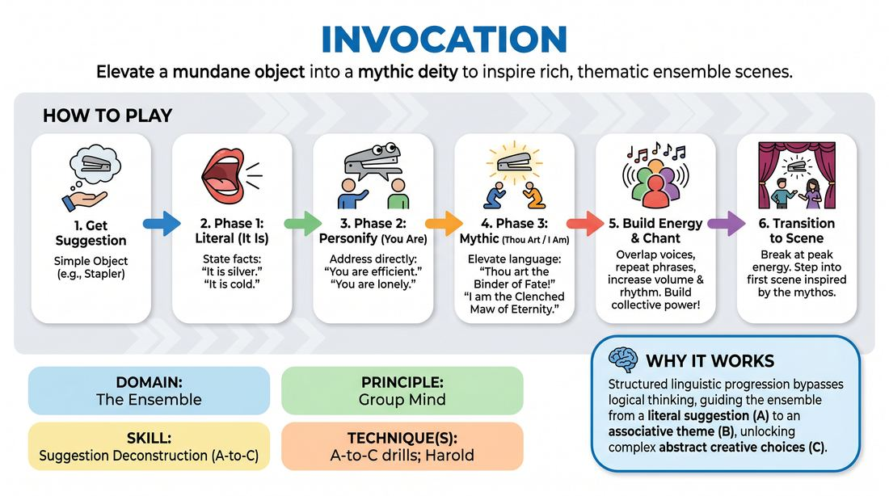

# 🎲 Drill A — isolation — The Invocation

{ .infographic }

> Elevate a mundane object into a mythic deity to inspire rich, thematic ensemble scenes.

`Players 4–12` · `~20 min` · `Complexity 4/5` · `Energy medium` · `Contact none` · `Props: none`

⬅️ [Back to the Week 02 run-sheet](../week-02.md)

## Why this activity, here

Week 1 established that long-form needs fuel that isn't the suggestion itself. This is the first drill of Week 2 and it isolates the climb: a literal object at A, associations at B, thematic material at C. It is deliberately run without scene pressure for most of its length. It feeds the second drill of the day, where pairs mine suggestions silently, and it feeds the Week 3 opening formats where a whole group generates material before anyone plays a character.

## What students actually learn

- That the third thing they say about an object is more useful than the first, and that getting there takes about ninety seconds of patience.
- That saying something out loud in a group changes what the next person can reach — associations compound.
- That mythic language is a tool, not a joke, and it stops feeling embarrassing after roughly two rounds.
- That a theme is something you find, not something you decide.

## Setup

Clear floor space for one standing circle of the whole group, or two circles well apart. A board or flipchart to write the object on. No chairs in the circle. Tell people before you start that this involves speaking in unison and getting loud, and that anyone can stand in the circle silently and still be part of it. No contact is required at any point.

## How to run it — 20 minutes

| Min | What you do |
|---:|---|
| 2 | Circle up. Name the three phases and give one example line for each. Say the cue: never play A, go to C. Take the first object suggestion and write it up. |
| 3 | Run Phase One only. Physical facts, one voice at a time. Let it feel dull. Stop it while people are still finding facts and name what they noticed: this is A, and A is thin. |
| 2 | Same object. Run Phase Two only. Direct address, human traits. Stop and point out one line that carried a whole relationship in it. |
| 4 | New object. Run all three phases straight through, calling each transition yourself. Build Phase Three to overlapping chant. Clap it out. Hold the silence. |
| 3 | Split into two circles. Each runs its own invocation on its own object with a player from that circle calling the phase changes. You move between them. |
| 4 | Back to one circle. Final invocation, new object. At your clap, two volunteers step out and play sixty seconds using something the invocation produced. Cut it. |
| 2 | Harvest. Ask the room for three Phase Three lines they remember. Write them up. Point at them and say: that is what you open a set with. |

## Side-coaching script

| When | Say |
|---|---|
| Phase One, when someone reaches for a metaphor early | *"Facts only. Save it."* |
| Phase One, when it goes quiet | *"Smaller. Look closer."* |
| Entering Phase Two | *"Talk to it now. You."* |
| Phase Two, when lines stay descriptive | *"Give it a feeling. Give it a history."* |
| Entering Phase Three | *"Thou art. Make it bigger than the object."* |
| Phase Three, when players are all waiting their turn | *"Repeat someone. Take their line and say it again."* |
| Phase Three, building | *"Louder. Let it overlap."* |
| At the peak, just before the clap | *"Find the top — and hold."* |

!!! success "What good looks like"
    Phase One is flat and a bit boring, and nobody rescues it. Phase Two shifts the room's attention — people start listening to each other instead of preparing lines. Phase Three has at least ten seconds where three or four voices are going at once and nobody can be heard individually, and the group finds a stop without you having to force it. When you clap, there is a real silence. The two players who step out do not mention the object.

## When it goes wrong

| You see | What's causing it | The fix |
|---|---|---|
| Phase Three sounds like Phase Two with a 'thou' in front of it — "Thou art quite useful in an office." | Players are still describing the object rather than using it as a symbol. They have not let go of the literal. | Stop the round. Give them one sentence yourself: "Thou art the binder of broken worlds." Ask what it binds. Restart Phase Three only, and ban the object's name. |
| Laughter every time someone commits — the ritual is being played as a spoof of a cult. | Sincerity feels exposing, and mockery is the cheapest exit. Usually starts with one or two people and spreads. | Name it flatly and without disapproval: this only works if it's straight. Run one more round at half volume, eyes down, so nobody is watching anybody's face. |
| Long gaps in every phase; people take turns like a talking stick and wait politely. | They think each contribution must be good. They are drafting. | Call for repetition — anyone can say a line already said. Drop the rule that each person goes once. Speed it up until it's messy. |
| The post-invocation scene is about the object. Two people are talking about a stapler. | They defaulted to A because it was the last concrete thing available under pressure. | Before the next launch, have the room shout out one theme word from the invocation. The players must start with that word and are forbidden the object. |

## Scaling

| Class size | What changes |
|---|---|
| **10–13** | One circle throughout. Skip the split at minute twelve — instead run a second full three-phase invocation as one group with a participant calling the phases. Everyone speaks in every phase. |
| **14–17** | One circle for the first three blocks, then split into two circles of seven to nine for the simultaneous round. Recombine for the final invocation. Two scene launches at the end instead of one, thirty seconds each. |
| **18–20** | Two circles of nine or ten from minute five onward, each with an appointed phase caller, and run the middle blocks in parallel. Come together only for the final invocation. Cap Phase One at ninety seconds or it drags. |

## Variations

**Two phases only** — Run It Is and You Are, drop Thou Art entirely. Finish on the direct-address phase and launch the scene from there.  
*Easier — removes the exposure of mythic language for groups that are new to each other or visibly resistant on the day.*

**Abstract suggestion** — Take a non-object suggestion — "Tuesday", "regret", "the number nine" — and force Phase One to find physical facts about it anyway.  
*Harder — players must manufacture the literal rung before they can climb off it, which is exactly the move a bad suggestion demands.*

**Solo ladder** — Everyone finds a partner. A speaks the full three phases about an object alone, ninety seconds, while B listens and then names the single strongest line back.  
*Different emphasis — shifts from collective energy to individual association speed, and gives quieter players a turn at the top of the ladder.*

## Debrief

1. **At what point did the object stop being the subject?**
   > *A good answer sounds like:* Someone locates it in Phase Two, not Phase Three — "once we said 'you are patient' it was about patience, not the kettle." That means they can feel the rung change rather than just perform it.

2. **Whose line did you steal?**
   > *A good answer sounds like:* People name each other, and describe building on a phrase rather than inventing alongside it. If nobody can name anyone, the circle was parallel play and you say so.

3. **What would you open a show with from tonight — and it can't be the object?**
   > *A good answer sounds like:* A theme or an image in a few words: "things that hold other things together", "being useful and unnoticed". Vague answers like "the energy" mean run one more invocation before moving on.

!!! warning "Safety & inclusion"
    No contact anywhere in this drill; if a circle starts holding hands, let it happen only if someone proposes it aloud and you check the room for a nod first, with a clear stand-out option. Chanting and ritual imagery can land badly for people with religious backgrounds or histories of coercive groups — say up front that you are inventing a fictional deity for a stapler, that no real faith or practice is being copied, and that standing silently in the circle counts as full participation. Volume: warn before Phase Three that it gets loud, and let anyone step to the edge of the room. Nobody is called on by name.

## Why it works

The three phases are a forced-slow ladder from A to C. Left alone, a player asked for something interesting about a stapler will jump straight to a joke, which is A dressed up. Making the literal rung compulsory and boring drains the appeal of staying there. The direct-address rung converts an object into a relationship, which is the smallest unit a scene can use. The mythic rung then requires abstraction, because there is no way to say "thou art" about a stapler without reaching for what the stapler stands for. Doing it aloud in a group means each person's association is available to everyone else, so the climb is collective and faster than any individual could manage. The chant at the top matters because volume and unison suppress self-editing at exactly the moment the material gets least literal.

[Open the full activity card »](../../../../games/D4_P1_S3_T1_G1136__invocation.md){target=_blank rel=noopener}
