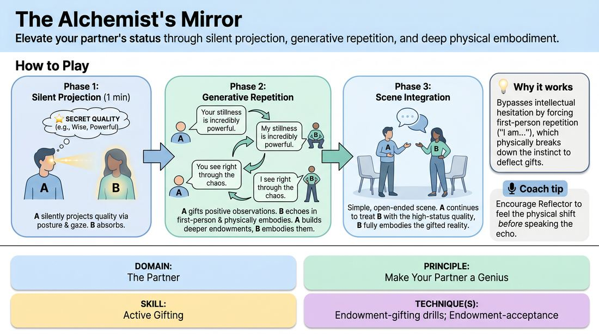

# 🎲 Drill B — under load — The Status Alchemist

{ .infographic }

> Elevate your partner's status through silent projection, generative repetition, and deep physical embodiment.

`Players 2–99` · `~20 min` · `Complexity 3/5` · `Energy medium` · `Contact none` · `Props: none`

⬅️ [Back to the Week 02 run-sheet](../week-02.md)

## Why this activity, here

Drill A opened the suggestion and pulled associations off it. This block puts the same move under pressure with a partner watching. The slip is the A — the flat label. The Alchemist can never say it, so they must reach for the third thing out: what the quality does, what it costs, what people do around it. The Reflector then has to live inside that C rather than a word. It feeds the second half of the session, where pairs mine a live audience suggestion and build the opening of a piece from its consequences rather than its surface.

## What students actually learn

- That the obvious word for a thing is almost never the playable version of it — and that finding the playable version takes about two seconds, not two minutes.
- That being endowed feels like permission. Most people are waiting to be told what they are before they act.
- That status is carried in breath and distance before it reaches language, so it can be changed by changing those first.

## Setup

Write fifteen to twenty slips before class, one quality each: unshakeably calm, reads a room instantly, never rushes, trusted with everything, has done this a thousand times, the last one anyone would lie to. Fold them. Bring spares. Clear floor space so every pair can stand two metres apart without touching another pair. No chairs needed. Have a second stack ready for the swap so nobody gets a repeat.

## How to run it — 20 minutes

| Min | What you do |
|---:|---|
| 2 | Pair them. Assign Alchemist and Reflector. Hand out slips. State the ban: the word on the slip is never spoken. Demonstrate one line yourself — 'people go quiet when you walk in' — then start. |
| 1 | Phase one, silence. Alchemists project the quality with body only: distance, height, eye contact, how long they wait before moving. Reflectors receive and let posture shift. Call time cleanly. |
| 4 | Phase two. Alchemists speak observations; Reflectors echo in the first person and adjust before the next line lands. Side-coach for slowness and specificity. Stop anyone listing compliments. |
| 3 | Phase three. Call 'scene'. Pairs start a simple shared activity — packing a bag, waiting for a train. Treatment continues. No plot required. Call time mid-flow, not at a resolution. |
| 1 | Swap. New slips to the new Alchemists, twenty seconds to read, then straight into phase one silence. Do not re-explain the rules; they have them. |
| 4 | Phase two again. Push harder on the ban — if you hear the label, call 'go further out' at that pair without stopping the room. |
| 3 | Phase three again. Same instruction. Watch for Reflectors who play the competence rather than announce it. Call time. |
| 2 | Everyone stands still. Ask each Reflector to say one line that landed hardest. No discussion, no thanks. Move on. |

## Side-coaching script

| When | Say |
|---|---|
| Thirty seconds into the first silent phase | *"Change the distance. Let the body say it."* |
| As phase two opens | *"Never say the word. Say what it causes."* |
| When echoes come back flat | *"Breath first, then the line."* |
| When Alchemists start listing | *"One gift. Wait for it to land."* |
| When observations stay generic | *"Name what you can actually see right now."* |
| At the call into scene | *"Scene. Keep the treatment, drop the compliments."* |
| When a Reflector starts explaining their own quality | *"Play it. Don't sell it."* |
| Twenty seconds before each time call | *"Last exchange. Make it the furthest one."* |

!!! success "What good looks like"
    The room gets quieter, not louder. Alchemists take a beat before each line and their observations reference something visible — a hand that stopped moving, a jaw that unclenched. Reflectors echo in a voice that has already changed, and the change happens between the echo and the next sentence, not after it. By phase three you cannot tell who has the slip. The scenes are dull in content and clear in status: someone packs a bag while someone else defers to how they pack it. Nobody is being funny.

## When it goes wrong

| You see | What's causing it | The fix |
|---|---|---|
| Reflectors parroting lines in a flat voice, faces unchanged, like a language drill. | They are treating the echo as the task. The echo is only the receipt; the adjustment is the task. | Freeze the room. Have Reflectors say one echo, then hold silent for three seconds and let the body catch up before anything else is said. Restart. |
| Alchemists paying compliments about clothes, hair, voice or looks. | Endowment has collapsed into social flattery, which is the safest available move and requires nothing. | Call it: 'nothing you could say to a stranger at a party.' Redirect to capability and effect — what this person can do, what happens around them. |
| Pairs laughing and inflating into parody — 'you are the greatest genius alive'. | Sincerity is uncomfortable, and scale is the exit. Big claims cost nothing because nobody has to inhabit them. | Cap it: no superlatives, no 'the most'. Everything must be sized so the Reflector could actually be it in the next thirty seconds. |
| Phase three scenes turning into pep talks or coaching sessions. | They carried the language of phase two into the scene instead of the behaviour. | Give the scene a physical task before you call it — folding, sorting, queueing. Ban all direct praise once the scene starts. |

## Scaling

| Class size | What changes |
|---|---|
| **10–13** | Five or six pairs, everyone playing at once. If odd, make one trio: two Alchemists sharing one Reflector, alternating lines. Run both role rounds at full length as written. |
| **14–17** | Seven or eight pairs at once. Space is tight, so run phase three in two waves — odd-numbered pairs play while even-numbered pairs watch for ninety seconds, then reverse. Phases one and two stay simultaneous. |
| **18–20** | Ten pairs. Split the room into two halves working in opposite corners and take one half at a time for phase three, ninety seconds each. Cut phase two by thirty seconds in each round to protect the swap. Add those sixty seconds to the closing minute. |

## Variations

**Label allowed** — Drop the ban. Alchemists may say the word on the slip as often as they like, and build outward from it.  
*Easier — removes the A-to-C load and leaves only endowment and embodiment. Use if the room stalls silently in the first two minutes.*

**No shared words** — The Reflector must echo the meaning without reusing any noun or verb from the Alchemist's line.  
*Harder — forces translation rather than repetition, and stops the echo becoming automatic.*

**Two alchemists** — Three players. Two Alchemists work the same Reflector from the same slip, alternating lines and never contradicting.  
*Different emphasis — shifts the work onto agreement and listening between the givers, which is what a group scene actually asks for.*

## Debrief

1. **What was the hardest word to avoid, and what did you say instead?**
   > *A good answer sounds like:* They name the slip word and then a concrete substitute — 'calm' became 'you were the only one who didn't look at the door'. If they can't produce the substitute, run one more thirty-second exchange before moving on.

2. **Reflectors — when did you stop performing it and start believing it?**
   > *A good answer sounds like:* They locate a moment, usually physical: a breath dropping, shoulders settling, slowing down. Vague answers about feeling good mean it stayed at the neck; note it and carry on.

3. **How does this apply to a one-word suggestion from an audience?**
   > *A good answer sounds like:* They make the transfer without prompting: the word itself is dead on stage, what plays is the second or third thing it implies. That's the bridge to the next block.

!!! warning "Safety & inclusion"
    No touch at any point. Say this before pairing, not after. Deference is built from distance, height and timing alone. Sustained eye contact is optional — offer looking at the forehead, the hands, or a point just past the shoulder, and say so out loud so nobody has to ask. Endowments are positive by design; if anyone writes or improvises a slip quality that reads as backhanded, replace it immediately. Anyone who would rather not be endowed can take the Alchemist role both rounds, or sit out and watch one pair, reporting one thing they saw at the close. Kneeling, bowing or floor work is never required.

## Why it works

The slip gives each Alchemist a flat label, and the ban makes the label unusable. That forces the search outward in real time, with a partner waiting — which is exactly the pressure of a live suggestion. Because the Reflector must echo in the first person and physically settle before the next line, the Alchemist gets immediate feedback on whether their C-level observation was playable or just clever. Vague endowments produce no change in the body; specific consequences do, visibly, within a second. The drill therefore teaches the A-to-C move by making the failure of A instantly legible rather than by explaining it.

[Open the full activity card »](../../../../games/D2_P3_S5_T1_G032__the-alchemist-s-mirror.md){target=_blank rel=noopener}
