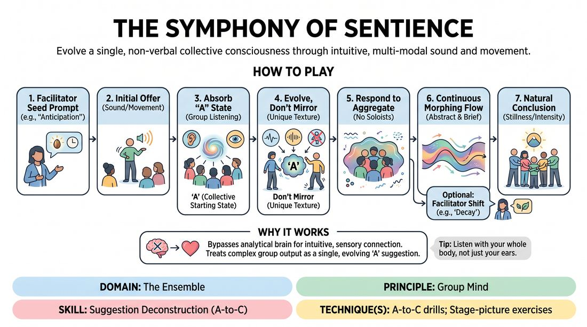

# 🎯 Scene Lab — Symphony of Sentience

{ .infographic }

> Evolve a single, non-verbal collective consciousness through intuitive, multi-modal sound and movement.

`Players 5–12` · `~35 min` · `Complexity 3/5` · `Energy medium` · `Contact none` · `Props: none`

⬅️ [Back to the Week 02 run-sheet](../week-02.md)

## Why this activity, here

Week 2 sits between the first taste of long-form and the openings work that follows. The class has already met the cue "Never play A. Go to C." verbally — riffing associations off a word. This block moves the same skill into the body and the voice, where nobody can hide behind a clever answer. It feeds directly into the group opening: an ensemble that can build a non-verbal collective state from a suggestion can build a physical opening later without a leader.

## What students actually learn

- They stop treating a suggestion as an instruction and start treating it as a starting temperature.
- They feel the difference between copying an offer and extending it — in the body, not as a note.
- They can track the whole room rather than one partner, which is what group work actually requires.
- They discover that their second or third impulse is more interesting than their first, and stop reaching for the first.

## Setup

Empty floor, chairs stacked or pushed to the walls. Enough space that everyone can extend both arms without touching. No props, no music. Have six to eight abstract seed words written down before you start — states and processes work better than objects: erosion, static, thaw, swarm, waiting, fever, ash, surfacing. Note the exits and tell people they can step out of the circle at any point and rejoin.

## How to run it — 35 minutes

| Min | What you do |
|---:|---|
| 3 | Circle up. Frame it: wordless, brief offers, respond to the whole room. Say the cue — never play A, go to C. Do not demonstrate. Take no questions about meaning. |
| 4 | Sound only. Feet planted. Give the word "static". Point at one player to make the first sound. Run it until the texture changes twice, then freeze. |
| 4 | Movement only, no sound. Give the word "thaw". Same structure. Freeze when the room stills. Note aloud who copied and who extended — no discussion yet. |
| 6 | Combine both. Give "erosion". Let it run full length. Do not intervene for the first two minutes. Side-coach only if the room locks into unison. |
| 3 | Break the circle. Two sentences of correction only: name the unison problem or the soloist problem, whichever you saw. Reform the circle immediately. |
| 7 | Long round. Seed with "waiting". Drop two new prompt words in mid-flow, roughly two and five minutes in, without stopping the action. Freeze on resolution. |
| 4 | Split the room in half. Half plays a two-minute round on a word they choose by pointing; half watches. Swap. Watchers say nothing. |
| 4 | Sit or stand in the circle. Run the debrief questions. Stop on time even if the answers are good. |

## Side-coaching script

| When | Say |
|---|---|
| The first offer has just landed and the room is hesitating | *"Add. Don't wait to be right."* |
| Everyone has fallen into the same rhythm or the same sound | *"That's unison. Break it. Go one step further out."* |
| Someone starts a character, a word, or a recognisable mime | *"Texture, not story. Drop the picture."* |
| One player is dominating volume or floor space | *"Smaller. Let the room carry it."* |
| The state has plateaued and nothing is changing | *"Something is shifting. Find it."* |
| Two people are locked in a private duet | *"Answer the room, not the person."* |
| The energy is spiralling into noise | *"Take it down. Find the low end."* |
| Just before you call freeze | *"Let it land. Hold."* |

!!! success "What good looks like"
    The room sounds like one thing with many parts. Nobody is watching one person. Offers are short and overlap, so no single contribution is identifiable as anyone's. The state changes three or four times over a round without a visible decision being made. When you drop a new prompt, the change takes ten or fifteen seconds to work through the group rather than happening instantly — that lag means people are responding to each other, not to you. At freeze, several people are surprised by where it ended up.

## When it goes wrong

| You see | What's causing it | The fix |
|---|---|---|
| Within thirty seconds the whole room is doing the same sound in the same rhythm, like a chant. | Unison feels safe and it feels like ensemble. It is actually everyone playing A at once. | Call it in the moment: "That's unison. Go one step further out." If it recurs, run a round where you forbid any two adjacent players from making the same kind of offer. |
| One person is performing — big movements, loud sound, everyone else watching them. | They read the exercise as a chance to lead. The rest defaulted to audience. | Side-call "smaller, let the room carry it." If it persists, run a round where every offer must last under two seconds. That removes the space for a solo. |
| People giggling, breaking, looking at each other for permission. | Abstract non-verbal work feels exposing and adults default to irony. Common in week two. It is not a discipline problem. | Do not scold. Close eyes for the sound-only round so nobody is being looked at. Shorten the round. Laughter usually dies once the texture gets interesting. |
| The whole round is a single flat drone that never changes. | Everyone is being polite and adding nothing new. They have confused "support" with "don't disrupt". | Drop a new prompt word that contradicts the current state — "fever" into a slow drone. Say "something is shifting, find it." |

## Scaling

| Class size | What changes |
|---|---|
| **10–13** | One circle throughout. Skip the split-half round at minute 31 and instead run one more full-group round on a word the group picks; roll the extra minute into the debrief. A circle this size can hear itself, so side-coach less. |
| **14–17** | One circle for the first four rounds. For the split at minute 31, two groups of seven to eight, each playing two minutes while the other watches from the wall. Watchers stay silent and stay standing. |
| **18–20** | The single circle gets too loud and people stop hearing the aggregate. Run the sound-only and movement-only rounds in two concentric rings — inner ring plays first minute, outer ring joins for the second. From minute 14 onward, split into two circles of nine or ten at opposite ends of the room, each with its own seed word. Take the last split round as a shared one: circle one plays, circle two watches, swap after two minutes. |

## Variations

**Named seed** — Instead of an abstract word, give a concrete place — a launderette, a car park at 4am. Ensemble still plays texture, not story.  
*Easier. A concrete image gives people somewhere to start when abstraction is stalling them.*

**Two-second rule** — No offer may last longer than two seconds. Every player must contribute at least once every ten seconds.  
*Harder. Removes hiding, removes soloing, forces the aggregate to change constantly.*

**Blind build** — Everyone closes their eyes or wears a blindfold. Sound only. Freeze called by you, then everyone opens their eyes and describes the state in one word each.  
*Different emphasis — shifts the load entirely onto listening and kills the habit of watching one leader.*

## Debrief

1. **When did you notice the state had changed into something nobody started?**
   > *A good answer sounds like:* A specific moment — "the scraping turned into breathing and I don't know who did it." If they name a person as the author, push once: "who else was already doing that?"

2. **What was your first impulse on the word, and did you play it?**
   > *A good answer sounds like:* Someone admits their first idea was the obvious one — leaves for autumn, dripping for thaw — and that they held it and offered the next thing. That is A-to-C, felt rather than explained.

3. **What changed when you stopped listening to one person and started listening to the room?**
   > *A good answer sounds like:* They describe it as easier, not harder. "I stopped trying to be correct." If everyone says they never managed it, say so plainly and note it as the thing to keep working.

!!! warning "Safety & inclusion"
    No contact is required at any point; say so before the first round. Anyone who wants to work without contact can hold a hand up and the room gives them space. Movement can be made entirely seated or from a fixed spot — offer this openly, not as an accommodation asked for privately. Volume can spike; tell people they may cover their ears or step to the wall and rejoin without explanation. Eyes-closed work is optional every time you call for it. Watch for anyone drifting backwards out of the circle and check in during the break rather than in front of the group.

## Why it works

The prompt is A. The first offer is almost always a literal association with A — the obvious sound for "rust", the obvious shape for "thaw". By forbidding copying and requiring each new contribution to extend the aggregate rather than mirror an individual, the exercise makes the group's state drift away from the prompt by mechanical necessity. Nobody has to decide to be original; the rule does it. Because the medium is non-verbal and textural, players cannot pre-plan a clever answer — there is no time to construct one, and no words to construct it in. That removes the wit filter that makes A-to-C hard verbally. What they are left with is the physical sensation of a suggestion being a starting temperature rather than a topic, which is exactly what the opening of a long-form set requires.

[Open the full activity card »](../../../../games/D4_P1_S3_T1_G096__the-symphony-of-sentience.md){target=_blank rel=noopener}
