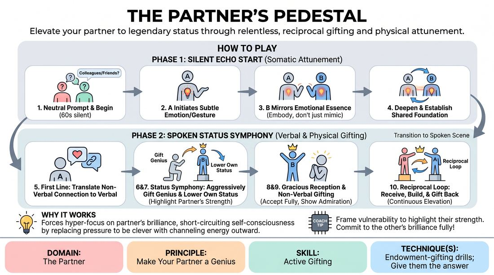

# 🏟️ Showcase round — The Partner's Pedestal

{ .infographic }

> Elevate your partner to legendary status through relentless, reciprocal gifting and physical attunement.

`Players 2–99` · `~40 min` · `Complexity 3/5` · `Energy medium` · `Contact none` · `Props: none`

⬅️ [Back to the Week 02 run-sheet](../week-02.md)

## Why this activity, here

Earlier in the session they mined suggestions on paper and in short bursts — one word, two steps sideways, land on C. This is the showcase where C stops being a list item and becomes a two-person scene with a body in it. The pedestal is the engine: it gives players something to do with the C-association other than explain it. It feeds Week 3, where scenes have to sustain without a facilitator calling cut.

## What students actually learn

- That making your partner interesting is easier than being interesting, and produces more material.
- That a scene can start from a shared physical state rather than a clever first line.
- That deflecting a compliment kills a scene, and taking one costs nothing.
- That the third association gives them a world to play in, while the literal suggestion gives them a subject to talk about.

## Setup

Clear a playing area with room for two people standing, and a seated audience arc facing it. Two chairs to the side, used only if a pair wants them. Whiteboard or paper for the A→C chain so the C-word stays visible all block. No props. Have a timer with an audible cue.

## How to run it — 40 minutes

| Min | What you do |
|---:|---|
| 4 | Restate the cue: never play A, go to C. Take a suggestion, step it out twice in front of everyone, write C up. Demonstrate thirty seconds of Echo Start with one volunteer. |
| 5 | Pair everyone off and give the relationship. All pairs run the silent Echo Start simultaneously, sixty seconds, then swap who initiates and run it again. Side-coach over the top. |
| 5 | Same pairs, still simultaneous. A speaks first, then ninety seconds of gifting. Call cut, reset, run it once more with a new relationship. Loud room — let it be loud. |
| 3 | Pull everyone into the audience arc. Two sentences on gracious reception: take the compliment, stand on it, gift back. Set the running order of pairs. |
| 18 | Showcase. Each pair takes the space: thirty to forty-five seconds of Echo Start, then scene. Cut at roughly three minutes per pair. No notes between pairs — keep them rolling. |
| 5 | Sit the room down. Run the debrief questions. Finish on the cue and hand back to the run-sheet. |

## Side-coaching script

| When | Say |
|---|---|
| During the silent Echo Start | *"Copy the feeling, not the shape."* |
| When the mirroring goes static | *"Let it change. Deepen it."* |
| Just before the first spoken line | *"Speak from what your body already knows."* |
| When gifting turns into vague praise | *"Name the thing. What exactly are they brilliant at?"* |
| When a player deflects an endowment | *"Take it. Stand on it."* |
| When one player is doing all the elevating | *"Give it back. Their turn to be the genius."* |
| When a scene drifts back to the literal suggestion | *"Not A. You're in C. Stay there."* |
| Fifteen seconds before cut | *"One last gift, then land it."* |

!!! success "What good looks like"
    Two people standing closer than they started, both slightly tilted toward the other. The silence before the first line feels occupied rather than empty. Endowments are specific — a name, a date, a thing that was built — and they get taken without a flinch, then repaid within a line or two. Nobody is arguing about facts. The scene sounds like it belongs to the C-word, not the suggestion, and the audience is leaning in rather than waiting for a punchline.

## When it goes wrong

| You see | What's causing it | The fix |
|---|---|---|
| A run of flat adjectives — "you're so smart", "you're amazing" — and no scene underneath. | Gifting is being read as compliments rather than endowment. Nothing concrete is being handed over. | Call for a noun. Make them name a specific thing the partner did, made, survived or discovered. Specifics generate scene; adjectives do not. |
| A player waves the gift off — "oh, it was nothing", "I'm rubbish really". | Ordinary social reflex against seeming arrogant. Deflection feels polite and reads as blocking. | Side-coach "take it". Have them replay the exchange on the spot, accepting the endowment and adding one detail to it. Ten seconds, then carry on. |
| The Echo Start turns into comic mirror-mime — big shapes, laughing, showing off. | Discomfort with a silent minute in front of others. | Ask for smaller. One change every five seconds, nothing bigger than a hand. Tell them the audience can read a jaw from twelve feet away. |
| Scenes about the literal suggestion word — someone shouts "bicycle" and they discuss bicycles. | The C-word was generated but never used, or the pair reached for the safest reference. | Point at the C-word on the board. Restart the scene from the first line, banning the suggestion word from anyone's mouth. |

## Scaling

| Class size | What changes |
|---|---|
| **10–13** | Five or six pairs. Everyone showcases at three minutes each with time to spare. Odd number — you play the spare, or make one trio where the third mirrors both during the Echo Start and enters the scene only in the final thirty seconds. |
| **14–17** | Seven or eight pairs. Cut the on-stage Echo Start to thirty seconds and the whole slot to two minutes fifteen. Announce the shorter clock before the showcase starts so nobody feels rushed off. |
| **18–20** | n/a two halves before step five...ppairss  pairs.。ppairss..．. Split. Split.at halves at step five.two haling areas at opposite ends, each half its own audience. Both run in parallel for the full eighteen minutes, five pairs a side at three and a half minutes each. Stand between the two and call cut for both with the timer. You will see less of each scene — accept that and keep the debrief general.at halves at step five.two haling areas at opposite ends, each half its own audience. Both run in parallel for the full eighteen minutes, five pairs a side at three and a half minutes each. Stand between the two and call cut for both with the timer. You will see less of each scene — accept that and keep the debrief general.ppairs. Split the room in two at step five: two playing areas at opposite ends, each half its own audience. Both halves run in parallel for the full eighteen minutes, five pairs a side at three and a half minutes each.ppairss. Split the room in two at step five: two playing areas at opposite ends, each half its own audience. Both halves run in parallel for the full eighteen minutes, five pairs a side at three and a half minutes each. Stand between the two areas and call cut for both with the timer. You will see less of each scene — accept that and keep the debrief general.ppairss. Split the room in two at step five: two playing areas at opposite ends, each half its own audience. Both halves run in parallel for the full eighteen minutes, five pairs a side at three and a half minutes each. Stand between the two areas and call cut for both with the timer. You will see less of each scene — accept that and keep the debrief general.pairss.ss. Split the room in two at step five: two playing areas at opposite ends, each half its own audience. Both halves run in parallel for the full eighteen minutes, five pairs a side at three and a half minutes each. Stand between the two areas and call cut for both with the timer. You will see less of each scene — accept that and keep the debrief general.airs.s. Splitt the room in two at step five: two playing areas at opposite ends, each half its own audience. Both halves run in parallel for the full eighteen minutes, five pairs a side at three and a half minutes each. Stand between the two areas and call cut for both with the timer. You will see less of each scene — accept that and keep the debrief general.s. Split the room in two at step five: two playing areas at opposite ends, each half its own audience. Both halves run in parallel for the full eighteen minutes, five pairs a side at three and a half minutes each. Stand between the two areas and call cut for both with the timer. You will see less of each scene — accept that and keep the debrief general.s. Split the room in two at step five: two playing areas at opposite ends, each half its own audience. Both halves run in parallel for the full eighteen minutes, five pairs a side at three and a half minutes each. Stand between the two areas and call cut for both with the timer. You will see less of each scene — accept that and keep the debrief general.airs. Split the room in two at step five: two playing areas at opposite ends, each half its own audience. Both halves run in parallel for the full eighteen minutes, five pairs a side at three and a half minutes each. Stand between the two areas and call cut for both with the timer. You will see less of each scene — accept that and keep the debrief general.s. Split the room in two at step five: two playing areas at opposite ends, each half its own audience. Both halves run in parallel for the full eighteen minutes, five pairs a side at three and a half minutes each. Stand between the two areas and call cut for both with the timer. You will see less of each scene — accept that and keep the debrief general.pairs. Split the room in two at step five: two playing areas at opposite ends, each half its own audience. Both halves run in parallel for the full eighteen minutes, five pairs a side at three and a half minutes each. Stand between the two areas and call cut for both with the timer. You will see less of each scene — accept that and keep the debrief general.pairs. Split the room in two at step five: two playing areas at opposite ends, each half its own audience. Both halves run in parallel for the full eighteen minutes, five pairs a side at three and a half minutes each. Stand between the two areas and call cut for both with the timer. You will see less of each scene — accept that and keep the debrief general.pairs. Split the room in two at step five: two playing areas at opposite ends, each half its own audience. Both halves run in parallel for the full eighteen minutes, five pairs a side at three and a half minutes each. Stand between the two areas and call cut for both with the timer. You will see less of each scene — accept that and keep the debrief general.pairs. Split the room in two at step five: two playing areas at opposite ends, each half its own audience. Both halves run in parallel for the full eighteen minutes, five pairs a side at three and a half minutes each. Stand between the two areas and call cut for both with the timer. You will see less of each scene — accept that and keep the debrief general.pairs. Split the room in two at step five: two playing areas at opposite ends, each half its own audience. Both halves run in parallel for the full eighteen minutes, five pairs a side at three and a half minutes each. Stand between the two areas and call cut for both with the timer. You will see less of each scene — accept that and keep the debrief general.pairs. Split the room in two at step five: two playing areas at opposite ends, each half its own audience. Both halves run in parallel for the full eighteen minutes, five pairs a side at three and a half minutes each. Stand between the two areas and call cut for both with the timer. You will see less of each scene — accept that and keep the debrief general.pairs. Split the room in two at step five: two playing areas at opposite ends, each half its own audience. Both halves run in parallel for the full eighteen minutes, five pairs a side at three and a half minutes each. Stand between the two areas and call cut for both with the timer. You will see less of each scene — accept that and keep the debrief general.pairs. Split the room in two at step five: two playing areas at opposite ends, each half its own audience. Both halves run in parallel for the full eighteen minutes, five pairs a side at three and a half minutes each. Stand between the two areas and call cut for both with the timer. You will see less of each scene — accept that and keep the debrief general.pairs. Split the room in two at step five: two playing areas at opposite ends, each half its own audience. Both halves run in parallel for the full eighteen minutes, five pairs a side at three and a half minutes each. Stand between the two areas and call cut for both with the timer. You will see less of each scene — accept that and keep the debrief general.pairs. Split the room in two at step five: two playing areas at opposite ends, each half its own audience. Both halves run in parallel for the full eighteen minutes, five pairs a side at three and a half minutes each. Stand between the two areas and call cut for both with the timer. You will see less of each scene — accept that and keep the debrief general.pairs. Split the room in two at step five: two playing areas at opposite ends, each half its own audience. Both halves run in parallel for the full eighteen minutes, five pairs a side at three and a half minutes each. Stand between the two areas and call cut for both with the timer. You will see less of each scene — accept that and keep the debrief general.pairs. Split the room in two at step five: two playing areas at opposite ends, each half its own audience. Both halves run in parallel for the full eighteen minutes, five pairs a side at three and a half minutes each. Stand between the two areas and call cut for both with the timer. You will see less of each scene — accept that and keep the debrief general.pairs. Split the room in two at step five: two playing areas at opposite ends, each half its own audience. Both halves run in parallel for the full eighteen minutes, five pairs a side at three and a half minutes each. Stand between the two areas and call cut for both with the timer. You will see less of each scene — accept that and keep the debrief general.pairs. Split the room in two at step five: two playing areas at opposite ends, each half its own audience. Both halves run in parallel for the full eighteen minutes, five pairs a side at three and a half minutes each. Stand between the two areas and call cut for both with the timer. You will see less of each scene — accept that and keep the debrief general.pairs. Split the room in two at step five: two playing areas at opposite ends, each half its own audience. Both halves run in parallel for the full eighteen minutes, five pairs a side at three and a half minutes each. Stand between the two areas and call cut for both with the timer. You will see less of each scene — accept that and keep the debrief general.pairs. Split the room in two at step five: two playing areas at opposite ends, each half its own audience. Both halves run in parallel for the full eighteen minutes, five pairs a side at three and a half minutes each. Stand between the two areas and call cut for both with the timer. You will see less of each scene — accept that and keep the debrief general.pairs. Split the room in two at step five: two playing areas at opposite ends, each half its own audience. Both halves run in parallel for the full eighteen minutes, five pairs a side at three and a half minutes each. Stand between the two areas and call cut for both with the timer. You will see less of each scene — accept that and keep the debrief general.pairs. Split the room in two at step five: two playing areas at opposite ends, each half its own audience. Both halves run in parallel for the full eighteen minutes, five pairs a side at three and a half minutes each. Stand between the two areas and call cut for both with the timer. You will see less of each scene — accept that and keep the debrief general.pairs. Split the room in two at step five: two playing areas at opposite ends, each half its own audience. Both halves run in parallel for the full eighteen minutes, five pairs a side at three and a half minutes each. Stand between the two areas and call cut for both with the timer. You will see less of each scene — accept that and keep the debrief general.pairs. Split the room in two at step five: two playing areas at opposite ends, each half its own audience. Both halves run in parallel for the full eighteen minutes, five pairs a side at three and a half minutes each. Stand between the two areas and call cut for both with the timer. You will see less of each scene — accept that and keep the debrief general.pairs. Split the room in two at step five: two playing areas at opposite ends, each half its own audience. Both halves run in parallel for the full eighteen minutes, five pairs a side at three and a half minutes each. Stand between the two areas and call cut for both with the timer. You will see less of each scene — accept that and keep the debrief general.pairs. Split the room in two at step five: two playing areas at opposite ends, each half its own audience. Both halves run in parallel for the full eighteen minutes, five pairs a side at three and a half minutes each. Stand between the two areas and call cut for both with the timer. You will see less of each scene — accept that and keep the debrief general.pairs. Split the room in two at step five: two playing areas at opposite ends, each half its own audience. Both halves run in parallel for the full eighteen minutes, five pairs a side at three and a half minutes each. Stand between the two areas and call cut for both with the timer. You will see less of each scene — accept that and keep the debrief general.pairs. Split the room in two at step five: two playing areas at opposite ends, each half its own audience. Both halves run in parallel for the full eighteen minutes, five pairs a side at three and a half minutes each. Stand between the two areas and call cut for both with the timer. You will see less of each scene — accept that and keep the debrief general.pairs. Split the room in two at step five: two playing areas at opposite ends, each half its own audience. Both halves run in parallel for the full eighteen minutes, five pairs a side at three and a half minutes each. Stand between the two areas and call cut for both with the timer. You will see less of each scene — accept that and keep the debrief general.pairs. Split the room in two at step five: two playing areas at opposite ends, each half its own audience. Both halves run in parallel for the full eighteen minutes, five pairs a side at three and a half minutes each. Stand between the two areas and call cut for both with the timer. You will see less of each scene — accept that and keep the debrief general.pairs. Split the room in two at step five: two playing areas at opposite ends, each half its own audience. Both halves run in parallel for the full eighteen minutes, five pairs a side at three and a half minutes each. Stand between the two areas and call cut for both with the timer. You will see less of each scene — accept that and keep the debrief general.pairs. Split the room in two at step five: two playing areas at opposite ends, each half its own audience. Both halves run in parallel for the full eighteen minutes, five pairs a side at three and a half minutes each. Stand between the two areas and call cut for both with the timer. You will see less of each scene — accept that and keep the debrief general.pairs. Split the room in two at step five: two playing areas at opposite ends, each half its own audience. Both halves run in parallel for the full eighteen minutes, five pairs a side at three and a half minutes each. Stand between the two areas and call cut for both with the timer. You will see less of each scene — accept that and keep the debrief general.pairs. Split the room in two at step five: two playing areas at opposite ends, each half its own audience. Both halves run in parallel for the full eighteen minutes, five pairs a side at three and a half minutes each. Stand between the two areas and call cut for both with the timer. You will see less of each scene — accept that and keep the debrief general.pairs. Split the room in two at step five: two playing areas at opposite ends, each half its own audience. Both halves run in parallel for the full eighteen minutes, five pairs a side at three and a half minutes each. Stand between the two areas and call cut for both with the timer. You will see less of each scene — accept that and keep the debrief general.pairs. Split the room in two at step five: two playing areas at opposite ends, each half its own audience. Both halves run in parallel for the full eighteen minutes, five pairs a side at three and a half minutes each. Stand between the two areas and call cut for both with the timer. You will see less of each scene — accept that and keep the debrief general.pairs. Split the room in two at step five: two playing areas at opposite ends, each half its own audience. Both halves run in parallel for the full eighteen minutes, five pairs a side at three and a half minutes each. Stand between the two areas and call cut for both with the timer. You will see less of each scene — accept that and keep the debrief general.pairs. Split the room in two at step five: two playing areas at opposite ends, each half its own audience. Both halves run in parallel for the full eighteen minutes, five pairs a side at three and a half minutes each. Stand between the two areas and call cut for both with the timer. You will see less of each scene — accept that and keep the debrief general.pairs. Split the room in two at step five: two playing areas at opposite ends, each half its own audience. Both halves run in parallel for the full eighteen minutes, five pairs a side at three and a half minutes each. Stand between the two areas and call cut for both with the timer. You will see less of each scene — accept that and keep the debrief general.pairs. Split the room in two at step five: two playing areas at opposite ends, each half its own audience. Both halves run in parallel for the full eighteen minutes, five pairs a side at three and a half minutes each. Stand between the two areas and call cut for both with the timer. You will see less of each scene — accept that and keep the debrief general.pairs. Split the room in two at step five: two playing areas at opposite ends, each half its own audience. Both halves run in parallel for the full eighteen minutes, five pairs a side at three and a half minutes each. Stand between the two areas and call cut for both with the timer. You will see less of each scene — accept that and keep the debrief general.pairs. Split the room in two at step five: two playing areas at opposite ends, each half its own audience. Both halves run in parallel for the full eighteen minutes, five pairs a side at three and a half minutes each. Stand between the two areas and call cut for both with the timer. You will see less of each scene — accept that and keep the debrief general.pairs. Split the room in two at step five: two playing areas at opposite ends, each half its own audience. Both halves run in parallel for the full eighteen minutes, five pairs a side at three and a half minutes each. Stand between the two areas and call cut for both with the timer. You will see less of each scene — accept that and keep the debrief general.pairs. Split the room in two at step five: two playing areas at opposite ends, each half its own audience. Both halves run in parallel for the full eighteen minutes, five pairs a side at three and a half minutes each. Stand between the two areas and call cut for both with the timer. You will see less of each scene — accept that and keep the debrief general.pairs. Split the room in two at step five: two playing areas at opposite ends, each half its own audience. Both halves run in parallel for the full eighteen minutes, five pairs a side at three and a half minutes each. Stand between the two areas and call cut for both with the timer. You will see less of each scene — accept that and keep the debrief general.pairs. Split the room in two at step five: two playing areas at opposite ends, each half its own audience. Both halves run in parallel for the full eighteen minutes, five pairs a side at three and a half minutes each. Stand between the two areas and call cut for both with the timer. You will see less of each scene — accept that and keep the debrief general.pairs. Split the room in two at step five: two playing areas at opposite ends, each half its own audience. Both halves run in parallel for the full eighteen minutes, five pairs a side at three and a half minutes each. Stand between the two areas and call cut for both with the timer. You will see less of each scene — accept that and keep the debrief general.pairs. Split the room in two at step five: two playing areas at opposite ends, each half its own audience. Both halves run in parallel for the full eighteen minutes, five pairs a side at three and a half minutes each. Stand between the two areas and call cut for both with the timer. You will see less of each scene — accept that and keep the debrief general.pairs. Split the room in two at step five: two playing areas at opposite ends, each half its own audience. Both halves run in parallel for the full eighteen minutes, five pairs a side at three and a half minutes each. Stand between the two areas and call cut for both with the timer. You will see less of each scene — accept that and keep the debrief general.pairs. Split the room in two at step five: two playing areas at opposite ends, each half its own audience. Both halves run in parallel for the full eighteen minutes, five pairs a side at three and a half minutes each. Stand between the two areas and call cut for both with the timer. You will see less of each scene — accept that and keep the debrief general.pairs. Split the room in two at step five: two playing areas at opposite ends, each half its own audience. Both halves run in parallel for the full eighteen minutes, five pairs a side at three and a half minutes each. Stand between the two areas and call cut for both with the timer. You will see less of each scene — accept that and keep the debrief general.pairs. Split the room in two at step five: two playing areas at opposite ends, each half its own audience. Both halves run in parallel for the full eighteen minutes, five pairs a side at three and a half minutes each. Stand between the two areas and call cut for both with the timer. You will see less of each scene — accept that and keep the debrief general.pairs. Split the room in two at step five: two playing areas at opposite ends, each half its own audience. Both halves run in parallel for the full eighteen minutes, five pairs a side at three and a half minutes each. Stand between the two areas and call cut for both with the timer. You will see less of each scene — accept that and keep the debrief general.pairs. Split the room in two at step five: two playing areas at opposite ends, each half its own audience. Both halves run in parallel for the full eighteen minutes, five pairs a side at three and a half minutes each. Stand between the two areas and call cut for both with the timer. You will see less of each scene — accept that and keep the debrief general.pairs. Split the room in two at step five: two playing areas at opposite ends, each half its own audience. Both halves run in parallel for the full eighteen minutes, five pairs a side at three and a half minutes each. Stand between the two areas and call cut for both with the timer. You will see less of each scene — accept that and keep the debrief general.pairs. Split the room in two at step five: two playing areas at opposite ends, each half its own audience. Both halves run in parallel for the full eighteen minutes, five pairs a side at three and a half minutes each. Stand between the two areas and call cut for both with the timer. You will see less of each scene — accept that and keep the debrief general.pairs. Split the room in two at step five: two playing areas at opposite ends, each half its own audience. Both halves run in parallel for the full eighteen minutes, five pairs a side at three and a half minutes each. Stand between the two areas and call cut for both with the timer. You will see less of each scene — accept that and keep the debrief general.pairs. Split the room in two at step five: two playing areas at opposite ends, each half its own audience. Both halves run in parallel for the full eighteen minutes, five pairs a side at three and a half minutes each. Stand between the two areas and call cut for both with the timer. You will see less of each scene — accept that and keep the debrief general.pairs. Split the room in two at step five: two playing areas at opposite ends, each half its own audience. Both halves run in parallel for the full eighteen minutes, five pairs a side at three and a half minutes each. Stand between the two areas and call cut for both with the timer. You will see less of each scene — accept that and keep the debrief general.pairs. Split the room in two at step five: two playing areas at opposite ends, each half its own audience. Both halves run in parallel for the full eighteen minutes, five pairs a side at three and a half minutes each. Stand between the two areas and call cut for both with the timer. You will see less of each scene — accept that and keep the debrief general.pairs. Split the room in two at step five: two playing areas at opposite ends, each half its own audience. Both halves run in parallel for the full eighteen minutes, five pairs a side at three and a half minutes each. Stand between the two areas and call cut for both with the timer. You will see less of each scene — accept that and keep the debrief general.pairs. Split the room in two at step five: two playing areas at opposite ends, each half its own audience. Both halves run in parallel for the full eighteen minutes, five pairs a side at three and a half minutes each. Stand between the two areas and call cut for both with the timer. You will see less of each scene — accept that and keep the debrief general.pairs. Split the room in two at step five: two playing areas at opposite ends, each half its own audience. Both halves run in parallel for the full eighteen minutes, five pairs a side at three and a half minutes each. Stand between the two areas and call cut for both with the timer. You will see less of each scene — accept that and keep the debrief general.pairs. Split the room in two at step five: two playing areas at opposite ends, each half its own audience. Both halves run in parallel for the full eighteen minutes, five pairs a side at three and a half minutes each. Stand between the two areas and call cut for both with the timer. You will see less of each scene — accept that and keep the debrief general.pairs. Split the room in two at step five: two playing areas at opposite ends, each half its own audience. Both halves run in parallel for the full eighteen minutes, five pairs a side at three and a half minutes each. Stand between the two areas and call cut for both with the timer. You will see less of each scene — accept that and keep the debrief general.pairs. Split the room in two at step five: two playing areas at opposite ends, each half its own audience. Both halves run in parallel for the full eighteen minutes, five pairs a side at three and a half minutes each. Stand between the two areas and call cut for both with the timer. You will see less of each scene — accept that and keep the debrief general.pairs. Split the room in two at step five: two playing areas at opposite ends, each half its own audience. Both halves run in parallel for the full eighteen minutes, five pairs a side at three and a half minutes each. Stand between the two areas and call cut for both with the timer. You will see less of each scene — accept that and keep the debrief general.pairs. Split the room in two at step five: two playing areas at opposite ends, each half its own audience. Both halves run in parallel for the full eighteen minutes, five pairs a side at three and a half minutes each. Stand between the two areas and call cut for both with the timer. You will see less of each scene — accept that and keep the debrief general.pairs. Split the room in two at step five: two playing areas at opposite ends, each half its own audience. Both halves run in parallel for the full eighteen minutes, five pairs a side at three and a half minutes each. Stand between the two areas and call cut for both with the timer. You will see less of each scene — accept that and keep the debrief general.pairs. Split the room in two at step five: two playing areas at opposite ends, each half its own audience. Both halves run in parallel for the full eighteen minutes, five pairs a side at three and a half minutes each. Stand between the two areas and call cut for both with the timer. You will see less of each scene — accept that and keep the debrief general.pairs. Split the room in two at step five: two playing areas at opposite ends, each half its own audience. Both halves run in parallel for the full eighteen minutes, five pairs a side at three and a half minutes each. Stand between the two areas and call cut for both with the timer. You will see less of each scene — accept that and keep the debrief general.pairs. Split the room in two at step five: two playing areas at opposite ends, each half its own audience. Both halves run in parallel for the full eighteen minutes, five pairs a side at three and a half minutes each. Stand between the two areas and call cut for both with the timer. You will see less of each scene — accept that and keep the debrief general.pairs. Split the room in two at step five: two playing areas at opposite ends, each half its own audience. Both halves run in parallel for the full eighteen minutes, five pairs a side at three and a half minutes each. Stand between the two areas and call cut for both with the timer. You will see less of each scene — accept that and keep the debrief general.pairs. Split the room in two at step five: two playing areas at opposite ends, each half its own audience. Both halves run in parallel for the full eighteen minutes, five pairs a side at three and a half minutes each. Stand between the two areas and call cut for both with the timer. You will see less of each scene — accept that and keep the debrief general.pairs. Split the room in two at step five: two playing areas at opposite ends, each half its own audience. Both halves run in parallel for the full eighteen minutes, five pairs a side at three and a half minutes each. Stand between the two areas and call cut for both with the timer. You will see less of each scene — accept that and keep the debrief general.pairs. Split the room in two at step five: two playing areas at opposite ends, each half its own audience. Both halves run in parallel for the full eighteen minutes, five pairs a side at three and a half minutes each. Stand between the two areas and call cut for both with the timer. You will see less of each scene — accept that and keep the debrief general.pairs. Split the room in two at step five: two playing areas at opposite ends, each half its own audience. Both halves run in parallel for the full eighteen minutes, five pairs a side at three and a half minutes each. Stand between the two areas and call cut for both with the timer. You will see less of each scene — accept that and keep the debrief general.pairs. Split the room in two at step five: two playing areas at opposite ends, each half its own audience. Both halves run in parallel for the full eighteen minutes, five pairs a side at three and a half minutes each. Stand between the two areas and call cut for both with the timer. You will see less of each scene — accept that and keep the debrief general.pairs. Split the room in two at step five: two playing areas at opposite ends, each half its own audience. Both halves run in parallel for the full eighteen minutes, five pairs a side at three and a half minutes each. Stand between the two areas and call cut for both with the timer. You will see less of each scene — accept that and keep the debrief general.pairs. Split the room in two at step five: two playing areas at opposite ends, each half its own audience. Both halves run in parallel for the full eighteen minutes, five pairs a side at three and a half minutes each. Stand between the two areas and call cut for both with the timer. You will see less of each scene — accept that and keep the debrief general.pairs. Split the room in two at step five: two playing areas at opposite ends, each half its own audience. Both halves run in parallel for the full eighteen minutes, five pairs a side at three and a half minutes each. Stand between the two areas and call cut for both with the timer. You will see less of each scene — accept that and keep the debrief general.pairs. Split the room in two at step five: two playing areas at opposite ends, each half its own audience. Both halves run in parallel for the full eighteen minutes, five pairs a side at three and a half minutes each. Stand between the two areas and call cut for both with the timer. You will see less of each scene — accept that and keep the debrief general.pairs. Split the room in two at step five: two playing areas at opposite ends, each half its own audience. Both halves run in parallel for the full eighteen minutes, five pairs a side at three and a half minutes each. Stand between the two areas and call cut for both with the timer. You will see less of each scene — accept that and keep the debrief general.pairs. Split the room in two at step five: two playing areas at opposite ends, each half its own audience. Both halves run in parallel for the full eighteen minutes, five pairs a side at three and a half minutes each. Stand between the two areas and call cut for both with the timer. You will see less of each scene — accept that and keep the debrief general.pairs. Split the room in two at step five: two playing areas at opposite ends, each half its own audience. Both halves run in parallel for the full eighteen minutes, five pairs a side at three and a half minutes each. Stand between the two areas and call cut for both with the timer. You will see less of each scene — accept that and keep the debrief general.pairs. Split the room in two at step five: two playing areas at opposite ends, each half its own audience. Both halves run in parallel for the full eighteen minutes, five pairs a side at three and a half minutes each. Stand between the two areas and call cut for both with the timer. You will see less of each scene — accept that and keep the debrief general.pairs. Split the room in two at step five: two playing areas at opposite ends, each half its own audience. Both halves run in parallel for the full eighteen minutes, five pairs a side at three and a half minutes each. Stand between the two areas and call cut for both with the timer. You will see less of each scene — accept that and keep the debrief general.pairs. Split the room in two at step five: two playing areas at opposite ends, each half its own audience. Both halves run in parallel for the full eighteen minutes, five pairs a side at three and a half minutes each. Stand between the two areas and call cut for both with the timer. You will see less of each scene — accept that and keep the debrief general.pairs. Split the room in two at step five: two playing areas at opposite ends, each half its own audience. Both halves run in parallel for the full eighteen minutes, five pairs a side at three and a half minutes each. Stand between the two areas and call cut for both with the timer. You will see less of each scene — accept that and keep the debrief general.pairs. Split the room in two at step five: two playing areas at opposite ends, each half its own audience. Both halves run in parallel for the full eighteen minutes, five pairs a side at three and a half minutes each. Stand between the two areas and call cut for both with the timer. You will see less of each scene — accept that and keep the debrief general.pairs. Split the room in two at step five: two playing areas at opposite ends, each half its own audience. Both halves run in parallel for the full eighteen minutes, five pairs a side at three and a half minutes each. Stand between the two areas and call cut for both with the timer. You will see less of each scene — accept that and keep the debrief general.pairs. Split the room in two at step five: two playing areas at opposite ends, each half its own audience. Both halves run in parallel for the full eighteen minutes, five pairs a side at three and a half minutes each. Stand between the two areas and call cut for both with the timer. You will see less of each scene — accept that and keep the debrief general.pairs. Split the room in two at step five: two playing areas at opposite ends, each half its own audience. Both halves run in parallel for the full eighteen minutes, five pairs a side at three and a half minutes each. Stand between the two areas and call cut for both with the timer. You will see less of each scene — accept that and keep the debrief general.pairs. Split the room in two at step five: two playing areas at opposite ends, each half its own audience. Both halves run in parallel for the full eighteen minutes, five pairs a side at three and a half minutes each. Stand between the two areas and call cut for both with the timer. You will see less of each scene — accept that and keep the debrief general.pairs. Split the room in two at step five: two playing areas at opposite ends, each half its own audience. Both halves run in parallel for the full eighteen minutes, five pairs a side at three and a half minutes each. Stand between the two areas and call cut for both with the timer. You will see less of each scene — accept that and keep the debrief general. |

## Variations

**Because Ladder** — The receiving player may only answer with "Yes, and that's because…" plus one new fact about themselves, before gifting back. Everything else stays the same.  
*Easier — the sentence stem removes deflection and guarantees the endowment gets built on.*

**Silent Pedestal** — Run the full scene with no words. All gifting is physical: yielding ground, presenting objects, standing back, applauding, deferring.  
*Harder — strips out the verbal shortcut and forces status to live in the body.*

**C-Card Drop** — Mid-scene, hold up a fresh C-word from the earlier chain. The next line must endow the partner with expertise in it.  
*Different emphasis — shifts the load onto suggestion mining and fast integration rather than status generosity.*

## Debrief

1. **What did the silent minute give you that a first line wouldn't have?**
   > *A good answer sounds like:* Someone says they already knew how they felt about the other person before anyone spoke, so the first line had somewhere to come from. Not "it was nice to warm up."

2. **Where did you notice yourself wanting to deflect, and what happened when you didn't?**
   > *A good answer sounds like:* A concrete moment — "she said I'd rebuilt the engine and I nearly said no I didn't" — followed by what the scene got instead. Specific beat, not general theory.

3. **Whose scene stayed in C, and how could you tell from the audience?**
   > *A good answer sounds like:* They point at content that could only have come from the third association, and note that the literal suggestion was never mentioned. Vague answers mean run the chain again next week.

!!! warning "Safety & inclusion"
    No contact is required at any point. Say so before the Echo Start: mirroring happens at a distance, and nobody touches anybody. If a pair wants contact later in a scene, both must agree out loud beforehand, and either can decline with no explanation. Sustained eye contact is uncomfortable for some — offer watching the hands, shoulders or jaw instead, and mean it. Anyone who would rather not showcase can sit in the audience arc and run the pair work only; take that quietly at the break rather than in front of the room. Chairs are available throughout for anyone who does not want to stand for eighteen minutes.

## Why it works

Two mechanisms, running together. The A→C step removes the obvious material before the scene begins, so players cannot fall back on the reference everyone in the room already has; whatever they invent has to be theirs. The pedestal then solves the problem that A→C creates — once you are somewhere unfamiliar, you need a reason to speak. Gifting supplies one. If your job is to make your partner extraordinary, you never have to search for something clever, only for something specific about them. Attention points outward, which is where it needs to be for anything to be built jointly. And because every gift must be accepted and repaid, the scene accumulates rather than negotiates: each line adds a fact rather than testing one.

[Open the full activity card »](../../../../games/D2_P3_S5_T1_G179__the-partner-s-pedestal.md){target=_blank rel=noopener}
