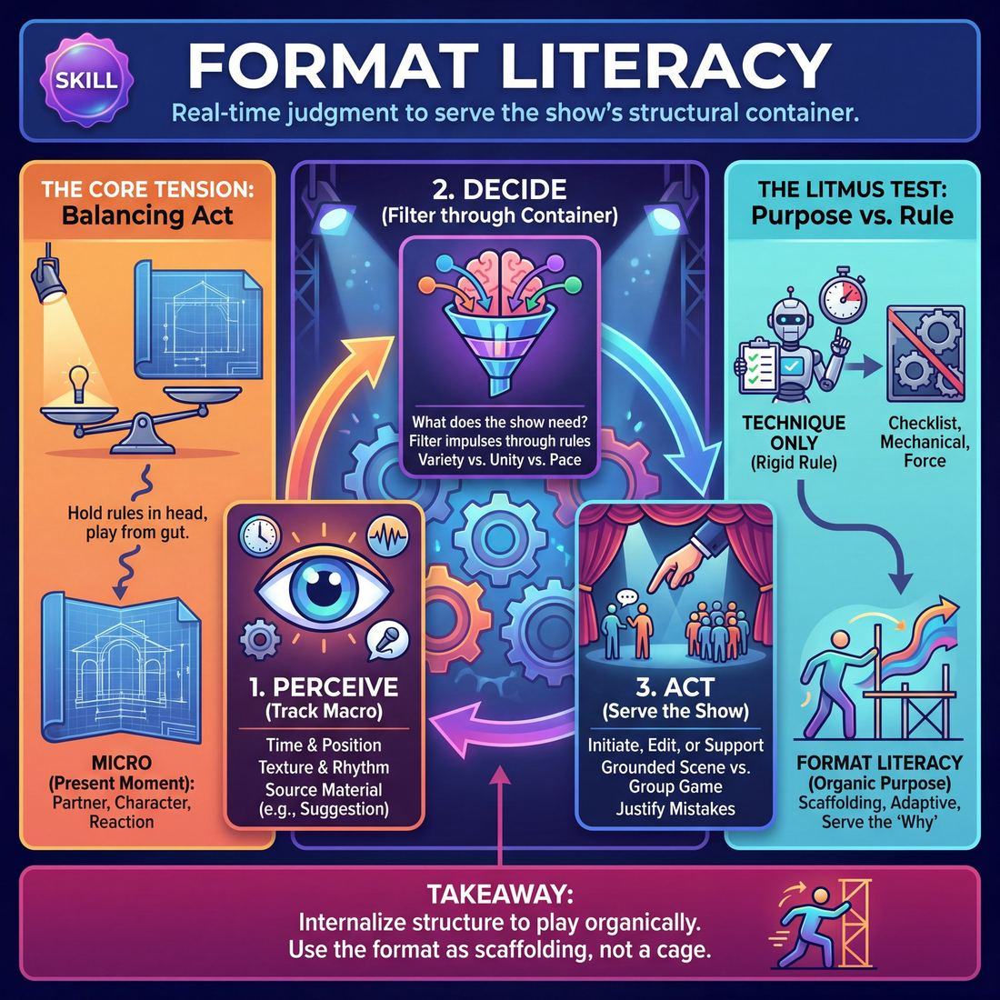

# Week 03 — Openings — Filling the Well

> *An opening exists so that the next twenty-five minutes have somewhere to come from.*

| Course | Week | Domain | Focus | Stage | Length | Class |
|---|---|---|---|---|---|---|
| The Piece — Long-Form & Audience | 3/8 | D4 | `D4.S6` — Format Literacy | Competent → Proficient | 180 min | 10–20 |

!!! note "Builds on"
    Week 2 gave them C-points from a single word; this week turns those points into a shared pool the whole company can draw from mid-set.

## 🎬 The arc of this session

They arrive able to mine a single word but still treating the top of a set as throat-clearing — three minutes of nice noise, then a scene from nowhere. The session turns the opening into a countable supply: they run structurally different openings, harvest out loud, and learn to hear the difference between an opening that yields four playable premises and one that just filled the time. They leave having performed a full ten-minute montage — opening, harvest, scenes, edits — and closed the first arc of the course.

!!! tip "Watch for"
    They will perform the opening at each other — dense, clever, fast — and produce nothing retrievable. Watch for openings that get laughs and yield zero. Name that gap out loud the first time it happens.

## ⏱️ Session flow (180 minutes)

| Time | Block | Activity |
|---|---|---|
| **0:00–0:05** | 🧊 Ice-breaker | *Verdict in Three Words* |
| **0:05–0:10** | 😄 Laughter Blast | *The Kettle* |
| **0:10–0:25** | 🔥 Warm-up cluster | *Drop the Bucket*, *Stock the Shelf*, *Borrow Two* |
| **0:25–0:45** | 🧠 Theory | — |
| **0:45–1:05** | 🎲 Drill A — isolation | *The Armando* |
| **1:05–1:15** | ☕ Break | — |
| **1:15–1:35** | 🎲 Drill B — under load | *La Ronde* |
| **1:35–2:10** | 🎯 Scene Lab | *The Monologist* |
| **2:10–2:50** | 🏟️ Showcase round | *Vocal Groove Longform* |
| **2:50–3:00** | 💭 Reflection & homework | — |

## 🎒 Before you start

- Clear the floor for a full circle of up to 20 plus a back line of chairs. Mark a performance area roughly four metres wide with tape or two chairs at the corners.
- Whiteboard or flip pad plus two working markers. You will write harvest lists in front of the room all session — keep the boards up, do not wipe between blocks.
- Print the harvest card, one per person: IMAGES / RELATIONSHIPS / PHRASES / OBSESSIONS. Four boxes, nothing else. They fill these in during Drill A and B.
- Review Week 2 homework in the first five minutes of arrival, not on the clock: ask three people for a C-point they found in a word during the week. Write those three on the board and leave them there as evidence that mining works.
- Group splits: at 10-13, run everything as one group, single circle, single performance line. At 14-17, split for Drill A and Drill B into two groups of 7-9 with you moving between them — half the showcase watches while half performs, then swap. At 18-20, split into three groups for warm-ups and Drill B, two groups for Drill A, and run the showcase as two teams of 9-10 with the non-performing team seated as a real audience.
- Water on the floor, phones off the floor. Have a timer you can see from anywhere in the room.

## 1. 🧊 Ice-breaker (5 min)

*Circle up, standing. Three words each, no explaining, no fourth word. Go round once and keep it moving.*

**Why here:** Gets everyone speaking within ninety seconds and sets the session's habit of compressing a whole reaction into something retrievable.

### Verdict in Three Words

> A fast circle where each person rules an everyday thing overrated or underrated and defends it in exactly three words.

`Players 10–20` · `~5 min` · `Complexity 1/5` · `Energy medium` · `Contact none` · `Props: none`

**How to play**

1. Stand everyone in a circle, you included. Say the rule: you name an everyday item, each person calls it overrated or underrated, then gives a reason of exactly three words.
2. Demonstrate once yourself. Take an item, give a verdict, count out three words on your fingers so the length is unmistakable. Keep the whole demo under ten seconds.
3. Call the first item. Go clockwise. Verdict, three words, next person. Cap each turn at five seconds. Allow no debate, no follow-ups, no defending a previous answer.
4. Call a second item. Reverse direction, starting with the person on your right. Same pace. If someone stalls, say their verdict for them and move on.
5. Run a final lap: each person names an item of their own and its verdict only, no reason. Three seconds a head. Keep it moving through hesitation.
6. Ask for a show of hands on whichever verdict split the room hardest. Say the count out loud. Do not discuss it. Go straight into the warm-up.

📄 **[Full teaching notes »](week-03/advanced_w03__b1_1.md)**

**Side-coach:** *“"Don't set it up — just the three words."”*

## 2. 😄 Laughter Blast (5 min)

*Stay in the circle, feet apart, hands loose. We're building pressure together and letting it go together — nobody is being funny here.*

**Why here:** Drops the self-monitoring that makes openings clever and unusable, and it builds group breath before the first collective task.

### The Kettle

> The whole room boils like a kettle, from a low hum to a shrieking whistle, then blows steam and does it again.

`Players 10–20` · `~5 min` · `Complexity 1/5` · `Energy high` · `Contact none` · `Props: none`

**How to play**

1. Stand everyone in a loose circle with room to crouch. Tell them: we are one kettle. Low hum down low, pitch rises as we rise, full whistle at the top, then steam out.
2. Demonstrate the whole arc yourself at full volume — crouch, hum, rise, shriek, flop forward and hiss. Do it once, badly and loudly, then start. No talking about it.
3. Run round one slow. Everyone crouches and hums low. Count eight slow beats as the room rises. At the top, whistle five seconds, then flop forward and hiss the steam out.
4. Run round two at double speed. Four beats up, whistle, hiss. Go straight into the next one. Three in a row, back to back, so nobody has room to think.
5. Run round three as a boil-over. Everyone whistles at the top, then shakes the whole body while still whistling. Keep it going until you call 'steam'. Shake harder than anyone in the room.
6. Split the room in half for the last round. One half boils through the arc; the other half hisses steam continuously underneath. Swap at fifteen seconds. Both halves whistle together to finish.
7. Ask one debrief question. Take three answers. Move on.

📄 **[Full teaching notes »](week-03/advanced_w03__b2_1.md)**

**Side-coach:** *“"Let it come from the belly, not the throat."”*

## 3. 🔥 Warm-up cluster (15 min)

*Three short ones back to back. Drop the Bucket first — quantity, no quality control. Five minutes each, no long resets between them.*

**Why here:** Three drills in sequence that isolate the three moves an opening needs: dumping without editing, storing what others give, and taking someone else's offer forward.

### Drop the Bucket

> The room jogs on the spot, and on each call everyone freezes into a physical image thrown up by a single word.

`Players 10–20` · `~5 min` · `Complexity 2/5` · `Energy high` · `Contact none` · `Props: none`

**How to play**

1. Get everyone standing with arm's length of space. Tell them to jog on the spot, light and easy, eyes up and off the floor.
2. Explain the rule: you call a word plus 'freeze'. They have three seconds to hit a full-body shape that word throws up. Hold two seconds. Jog again.
3. Demo one yourself. Call a word, drop into a committed low or high shape, hold, release, jog. Show them a hand gesture is not enough.
4. Run six words with jogging between each. Plain, literal shapes are fine here. Push for whole-body commitment, high or low, not standing-and-pointing.
5. Run six more words. Ban the literal object. The shape must come from something the word reminds them of, not the thing itself. Same jog-and-freeze rhythm.
6. Run a third set. After each freeze call 'look'. They break, copy the nearest person's shape, and make it one size bigger. Then jog on.
7. Call one final word. Everyone freezes and holds for five silent seconds, looking around at the images the room has made. Shake out.
8. Say the cue: the opening isn't a warm-up, it's the well. Every shape was a bucket coming up full.

📄 **[Full teaching notes »](week-03/advanced_w03__b3_1.md)**

### Stock the Shelf

> In pairs, players place small true details on an imaginary shelf between them, then answer each other detail for detail until the pair has stock worth building on.

`Players 10–20` · `~5 min` · `Complexity 2/5` · `Energy medium` · `Contact none` · `Props: none`

**How to play**

1. Pair everyone off, standing, facing each other. Odd number: make one three.
2. Tell each pair to hold both palms up in the gap between them. Say that gap is a shelf.
3. Round one: alternate placing items. Each is one concrete detail from the past week, five words or fewer. No jokes, no explanation, no reaction. Eyes on your partner.
4. Round two: when your partner places an item, answer with a detail it pulls out of you. A thing, not a comment. Keep the chain moving, no pauses.
5. Call stop. Each pair picks the single item on their shelf with the most heat — the one they'd happily build twenty-five minutes from.
6. Go round the room, pair by pair. One item each, five words, nothing added.
7. Do not repeat any item back. Do not praise any of them. Let each one sit, then move on.

📄 **[Full teaching notes »](week-03/advanced_w03__b3_2.md)**

### Borrow Two

> The room builds a silent pool of images from one word, drops them one at a time, and each player leaves holding two that weren't theirs.

`Players 10–20` · `~5 min` · `Complexity 2/5` · `Energy low` · `Contact none` · `Props: none`

**How to play**

1. Scatter the group around the room, no clumps, everyone standing where they can't see faces. Say one word out loud, once. Don't explain it.
2. Tell them: eyes closed or soft on the floor, no talking. Build three concrete images off that word — things you could see, not opinions or jokes.
3. Hold a full minute of silence. Don't fill it. Say the same word once more halfway through, at the same volume.
4. Call eyes open. Explain the drop: no speaking order, one image each, one breath long, then sit down where you are.
5. Tell them if two voices clash, both speakers stay standing and go again later. No apologising, no negotiating out loud.
6. Run the drop until every person is seated. Keep it slow. Let gaps sit. Do not prompt anyone by name.
7. Point at three seated players in turn. Each names two images from the pool that were not their own, out loud, fast.
8. Say the cue: the opening isn't a warm-up, it's the well. Move straight on.

📄 **[Full teaching notes »](week-03/advanced_w03__b3_3.md)**

**Side-coach:** *“"You've heard it — now say it back before you add."”*

## 4. 🧠 Theory — Format Literacy (20 min)

{ .infographic }

- **The big idea:** An opening is material generation with a yield you can count. Four things come out of it: images, relationships, phrases, obsessions. If you cannot name four playable premises within thirty seconds of it ending, the opening did not work — regardless of how it felt.
- **Where you are on the path:** They can find a C-point in a word. They cannot yet hold a shared pool as a company, and they still hope something will stick rather than deciding what to take. Expect competent individual offers and no collective memory.
- **The one cue to coach:** *“The opening isn't a warm-up. It's the well.”*

**The three beats**

1. **Say it.** Say: the opening isn't a warm-up, it's the well. Everything in the next twenty-five minutes has to come from somewhere, and this is the somewhere. Then give them the four-box vocabulary — images, relationships, phrases, obsessions — and say that a premise is any of those four with a person attached to it.
2. **Show it.** Run a 45-second word-association opening with four volunteers on the word 'ladder'. Stop it dead. Go to the board and write what came out under the four headings, out loud, in about fifteen seconds. Then say: 'Four premises. Any of these starts a scene now.' Point at one and name the scene it would start.
3. **Try it.** Everyone up. Two lines facing each other, or three lines at 18-20. Ninety seconds of association on a word the room gives you. Stop. Thirty seconds, out loud, no writing: each line names four premises. Sit down. Do not fix or improve anything — the point is the harvest, not the opening.

!!! warning "The misunderstanding that always comes up"
    They think harvesting means remembering everything, or that the first scene must be literally about the opening. Correct both: you take four things and abandon the rest, and the scene comes from the opening the way a smell comes from a kitchen — it does not have to be a report.

!!! abstract "📖 Go deeper"
    Read the full write-up: [Format Literacy](../../../theory/04_the-ensemble/04_S6__format-literacy.md)

## 5. 🎲 Drill A — isolation (20 min)

*Now the whole shape, small. One person talks, we listen for the four boxes, then we play from what we heard. Harvest cards out.*

**Why here:** The first structurally complete opening: a personal monologue feeding scenes, so they feel material arriving from one clear source.

### The Armando

> Weave personal, true-life monologues into a rich tapestry of interconnected, thematic improv scenes.

`Players 4–99` · `~20 min` · `Complexity 4/5` · `Energy medium` · `Contact none` · `Props: none`

**How to play**

1. Take one word from the room. That word feeds the whole set, not just the first story.
2. Line the ensemble up on the backline. Everyone stays visible and available while the piece runs.
3. Send one player forward to tell a short true story from their own life, sparked by the word. Honest, not performed. No jokes hunted.
4. Tell the backline to listen for specifics: a phrase, a job, a relationship, a mood, a small object. Not the plot.
5. On the story's last line, two players step out and start a scene inspired by one of those specifics. Never a re-enactment of the story.
6. Run scenes off each other, edited by sweeps or tag-outs. Play different angles on the same material: other characters, other stakes, other tones.
7. When the run of scenes flattens, a player steps forward with a new true story, sparked by the original word or by something a scene threw up.
8. Repeat the cycle. Let callbacks and echoes appear on their own; do not force them.

📄 **[Full teaching notes »](week-03/advanced_w03__b5_1.md)**

**Side-coach:** *“"Name the box you're pulling from before you step out."”*

## ☕ Break — 10 minutes

Water, notes, informal talk. Non-negotiable at three hours — do not let it collapse into a working discussion.

## 6. 🎲 Drill B — under load (20 min)

*Different engine now. Nobody narrates; the material comes out of who's with whom. Same harvest cards, same four boxes.*

**Why here:** A structurally opposite opening — relationship-driven and chained rather than monologue-fed — so they can feel the difference in what each kind of well produces.

### La Ronde

> Connect a chain of character-driven duets to map a shared, living world.

`Players 4–99` · `~20 min` · `Complexity 4/5` · `Energy medium` · `Contact none` · `Props: none`

**How to play**

1. Take one location or theme from the room. Write it up where everyone can see it. Every scene in the chain lives inside that world.
2. Set the playing order. Number everyone in the arc. They enter in that order, no swapping.
3. Send the first two players out. They play a two-hander and establish who they are to each other inside the first few lines.
4. Clap at roughly forty seconds, or on a clear beat. Player one exits. Player two stays — same character, same body, same emotional state.
5. Send the next player in as a brand-new character. They start a fresh scene with the person who stayed.
6. Repeat the pattern on every clap: the earlier player leaves, the later one stays, the next enters. Everyone plays exactly two consecutive scenes.
7. Close the loop. For the last scene, bring back the very first player, as their original character, opposite the final entrant.
8. Harvest immediately. Ask the room to call out details of the world they just built. Write every one on the board.

📄 **[Full teaching notes »](week-03/advanced_w03__b7_1.md)**

**Side-coach:** *“"Take one thing from the last pairing into the next — one only."”*

## 7. 🎯 Scene Lab (35 min)

*Two openings, two harvests. When an opening ends, the whole company names four premises out loud inside thirty seconds. If you can't, we stop and look at why.*

**Why here:** Thirty-five minutes to practise the harvest itself under real conditions, with time to fail an opening and debrief it rather than rerun it.

### The Monologist

> Weave personal, spontaneous monologues and fast-paced scenic play into a seamless tapestry of comedic truth.

`Players 4–99` · `~35 min` · `Complexity 4/5` · `Energy medium` · `Contact none` · `Props: none`

**How to play**

1. Pick one player as Monologist. Everyone else stands shoulder to shoulder on the backline, facing out, visible and ready to step in.
2. Ask the room for a single word. The Monologist takes it and starts a true story from their own life immediately — no preamble, no framing.
3. Tell the backline to mine the story for a theme, a feeling, a character, an odd detail. They are harvesting, not memorising the plot.
4. When the story ends, around sixty to ninety seconds, the Monologist steps back to the line. Someone starts a scene within two seconds. No conferring.
5. Edit fast: sweep across the stage, tag out a player you want to replace, or cross-fade a new scene over the dying one. Play three scenes.
6. Call the Monologist downstage for a second story — sparked by a scene, or another face of the same word. Then run three more scenes.
7. In the second wave, bring back characters, phrases or images from the first wave when it's honest. Finish on the highest-energy scene or a clean button.
8. Cap each set at eight minutes here. If time runs short, cut the second wave rather than letting scenes sprawl.

📄 **[Full teaching notes »](week-03/advanced_w03__b8_1.md)**

**Side-coach:** *“"Say the premise as a person doing something, not as a theme."”*

## 8. 🏟️ Showcase round (40 min)

*This is the piece. Opening, harvest, scenes, edits, ten minutes, performed once. Audience sits down and watches like an audience.*

**Why here:** The full ten-minute form performed once and reviewed once, closing the first arc and showing them what three weeks of C-points, harvests and edits add up to.

### Vocal Groove Longform

> A musical longform format where a continuous vocal groove inspires and connects a series of scenes.

`Players 4–99` · `~40 min` · `Complexity 4/5` · `Energy high` · `Contact none` · `Props: none`

**How to play**

1. Take one suggestion from the audience — an object, a place, a theme. Repeat it back once, loudly, so the whole line has the same word.
2. Send one player out first with a beat or a bassline. Make them hold it alone for four bars before anyone joins.
3. Layer the rest in one at a time: vocalised instruments, harmonies, sound effects. Keep every part short and loopable. Join only when you hear a gap.
4. Once the groove holds itself without effort, invite sung lines over the top. Short, narrative, about the suggestion. Characters, wants, relationships. One voice at a time.
5. Let any two or three players step forward off the line and start a spoken scene, taken from a lyric that just landed.
6. Tell the line to drop to a murmur the instant feet step forward. The groove never stops. It sits under the dialogue.
7. End each scene at a natural stop. The actors step back into the line and the ensemble swells the groove to full volume.
8. Repeat the cycle — verse, scene, verse, scene. Let characters from earlier scenes reappear, and let them meet.
9. Call the ending on the clock or on a swell. Bring every thread into one unison sound, then cut it clean together.

📄 **[Full teaching notes »](week-03/advanced_w03__b9_1.md)**

**Side-coach:** *“"Edit on the yield, not on the laugh."”*

## 9. 💭 Reflection & homework (10 min)

**Deepen your improv**
1. Which of tonight's two openings gave you more to play, and what specifically did it give you that the other one didn't?
2. Name one premise from the showcase that was in the well and never got used. What stopped you reaching for it?

**Beyond the stage**
3. Think of a conversation this week where you had plenty to work with and used none of it. What would harvesting have looked like there?

➡️ **[This week's homework](../homework/HW-ADVW03.md)**

??? note "🎓 Facilitator notes"

    **Timing risks**
    - Scene Lab overruns because a failed opening tempts you to rerun it. Debrief for two minutes and move on — the second opening must happen.
    - At 18-20, the showcase eats the reflection. Start the second team at the twenty-minute mark whatever state the first review is in.
    - Warm-up cluster runs long if you reset fully between the three drills. Roll straight from one to the next.

    **Failure modes this week**
    - Openings played for laughs — dense, fast, unrepeatable. Nothing survives the harvest. Stop it live and ask for a single image back.
    - Harvest turns into theme-naming: 'it was about loneliness'. Push for a person and an action every time.
    - Scenes report the opening back rather than growing from it. Name it once, early, then let it be.
    - One or two strong voices carry every opening while the rest bank material and never spend it. Call names during the harvest at 14+.

    **What good looks like by the end:** An opening ends and, within thirty seconds and without prompting, four different people name four playable premises out loud. The showcase scenes are traceable to the opening without quoting it. Somebody says an opening didn't work and can say why.

    **Carry into next week:** They now have a well and can draw from it. Next week is what happens when the well runs dry mid-set — returning, reincorporating and building second beats from material already spent. Bring the harvest cards back.
