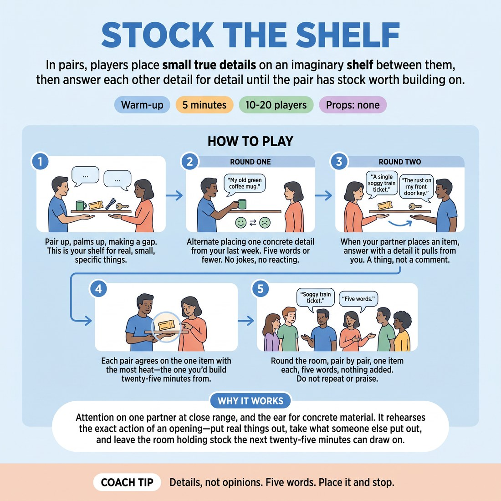

# 🔥 Warm-up cluster — Stock the Shelf

{ .infographic }

> In pairs, players place small true details on an imaginary shelf between them, then answer each other detail for detail until the pair has stock worth building on.

`Players 10–20` · `~5 min` · `Complexity 2/5` · `Energy medium` · `Contact none` · `Props: none`

⬅️ [Back to the Week 03 run-sheet](../week-03.md)

## Why this activity, here

This is the first thing in a session about openings. It comes before any format work and feeds directly into the long-form opening you run later in the block. The room arrives with nothing in it; this puts real material on the floor in five minutes so that when you say the opening is the well, they have already drawn from one.

## What students actually learn

- That a detail from their actual week is usable material, and they do not have to invent anything to start.
- That listening to a partner's specific thing pulls specifics out of them, without effort or wit.
- The difference between placing an item and commenting on it — the habit that later separates opening work from scene work.

## Setup

Clear standing space so pairs can face each other with about a metre between them. No chairs, no props, no paper. Know your headcount before you start so you can time the share-out. If the room is narrow, run two facing lines rather than scattered pairs.

## How to run it — 5 minutes

| Min | What you do |
|---:|---|
| 1 | Pair the room. Palms up, shelf between them. Explain the rule once: five words, one true detail from the last week, alternating. Start round one immediately and let it run to the end of the minute. |
| 2 | Round two. Now each item answers the last one — a detail it pulls out of you, not a comment on theirs. Side-coach for pace. Keep it moving; no gaps for thinking. |
| 1 | Stop. Each pair agrees on the one item with the most heat. Give them roughly thirty seconds, then get everyone facing into the circle ready to share. |
| 1 | Round the room, pair by pair, one item, five words. Move fast. No repeating, no praise, no laughter chased. End on the last item and go straight into the next block. |

## Side-coaching script

| When | Say |
|---|---|
| Ten seconds into round one | *"Smaller. Something you actually touched."* |
| When someone explains their item | *"No story. Just the thing."* |
| Mid round one, if pairs are joking | *"True, not funny. Keep going."* |
| Starting round two | *"Their item pulls yours. Don't choose it."* |
| When a pair stalls in round two | *"Say the boring one. Keep the chain."* |
| Thirty seconds left in round two | *"Faster. Stop editing."* |
| Calling the pick | *"Most heat, not most clever."* |
| During the share-out | *"Five words. Let it sit. Next."* |

!!! success "What good looks like"
    Low volume, fast exchange, very few pauses. Items are ordinary: a broken zip, cold coffee, the 6:40 train. Nobody laughs much and nobody minds. In round two you can hear the chain — one person's detail visibly dislodging the other's. At the share-out the room goes quiet after each item instead of responding to it.

## When it goes wrong

| You see | What's causing it | The fix |
|---|---|---|
| Pairs telling each other short anecdotes with a beginning and an end. | They have heard "detail from your week" as "thing that happened to you". | Stop the room for five seconds. Say: a noun, not an event. Give three examples from your own week. Restart. |
| Every item gets a laugh or a "oh me too", and the pace collapses. | Improvisers default to reacting. The no-reaction rule feels rude to them. | Name it out loud: reacting is the thing we're switching off for four minutes. It comes back later. |
| In round two people place items that are related by topic but obviously pre-planned. | They are curating a theme instead of letting association work. | Call "say the boring one". Speed is the fix — at pace they cannot curate. |
| The share-out overruns and eats the next block. | Pairs add context to their item. | Cut in on the sixth word. After two cuts the room self-corrects. Do not apologise for cutting. |

## Scaling

| Class size | What changes |
|---|---|
| **10–13** | Five or six pairs. Share-out takes under forty seconds; use the spare time to run round two ten seconds longer. |
| **14–17** | Seven or eight pairs. Share-out is tight — start it at the four-minute mark and keep the pace brisk. |
| **18–20** | n/a |

## Variations

**Given start** — You place the first item for every pair — same word for the whole room, e.g. "kettle". They build from there.  
*Easier. Removes the blank-page moment for people who freeze on "anything from your week".*

**No repeats in the room** — During the share-out, any pair whose item duplicates a category already said must place a different one from their shelf on the spot.  
*Harder. Forces range and stops the room converging on commuting and coffee.*

**Silent shelf** — Round one is mimed only — place the object with your hands, no words. Partner names what they think it was before placing their own.  
*Different emphasis. Shifts from verbal specificity to physical detail and reading a partner's body.*

## Debrief

1. **Which item on your shelf would you actually build from, and why that one?**
   > *A good answer sounds like:* They point at something plain and say it has more in it than they expected — a person attached to it, a feeling, an unresolved bit. Not "it was the funniest".

2. **What changed between round one and round two?**
   > *A good answer sounds like:* They describe items arriving without being chosen — that listening did the work rather than thinking. Some will say round two was easier despite being longer. Move on once one person says that.

!!! warning "Safety & inclusion"
    No contact. Palms are held up facing each other, not touching. Say so when you set it up. Anything from the past week is fair game but nothing is required — tell the room they can place the dullest true thing they own and it still counts. Anyone who does not want to disclose personal detail can use items from a room they were in rather than a thing they did. Runnable seated for anyone who needs it; pair a seated player with a seated or kneeling partner at the same eye level.

## Why it works

Format literacy starts with knowing what an opening is for. An opening produces raw stock, not scenes. This exercise separates the two mechanically: round one forbids reaction, so nothing can turn into a scene, and round two forces association, so material accumulates without anyone steering it. Because the details are true and small, players cannot fall back on invention, which is the thing that makes most openings thin. By the time they reach the real opening later in the session they have already felt material arrive from listening rather than from thinking, and they have a physical image — a shelf with things on it — for what a full well feels like.

[Open the full activity card »](../../library/warmups/WU__stock-the-shelf.md){target=_blank rel=noopener}
