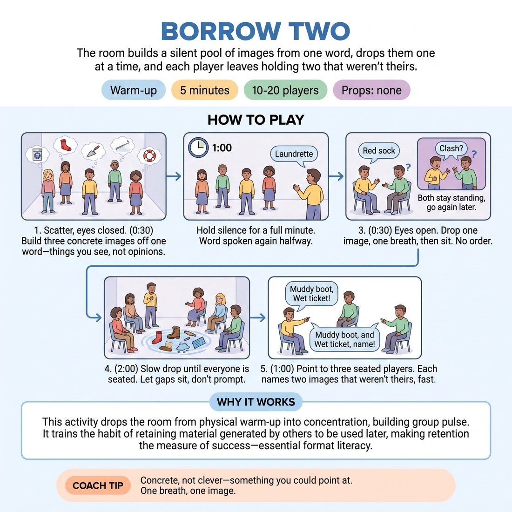

# 🔥 Warm-up cluster — Borrow Two

{ .infographic }

> The room builds a silent pool of images from one word, drops them one at a time, and each player leaves holding two that weren't theirs.

`Players 10–20` · `~5 min` · `Complexity 2/5` · `Energy low` · `Contact none` · `Props: none`

⬅️ [Back to the Week 03 run-sheet](../week-03.md)

## Why this activity, here

Week 3 is openings. Last week they built scenes from a suggestion; this week they build material before any scene exists. Borrow Two is the smallest possible version of that: one word in, a shared pool out, everyone leaving with something that isn't theirs. It feeds the long openings later in the session, where the whole point is that the group harvests each other rather than each player mining their own head.

## What students actually learn

- That listening during an opening is a collecting act, not politeness — they leave holding other people's images.
- That silence before speaking produces more specific offers than speaking immediately.
- That an opening's output is a pool the group shares, not a series of individual contributions.

## Setup

Clear floor. No chairs needed — people sit on the floor where they stand. Pick your word before class: concrete, ordinary, not loaded. Good ones: hinge, rust, kitchen, wire, coat, gutter. Avoid abstractions like freedom or memory. Nothing else required.

## How to run it — 5 minutes

| Min | What you do |
|---:|---|
| 1 | Scatter them across the floor, spaced, not facing each other. Say your word once. Instruct: eyes closed or soft down, silence, build three concrete images off it — things you could see. |
| 1 | Hold silence for the full minute. Resist filling it. At roughly thirty seconds, say the word once more, same volume, no emphasis. |
| 1 | Eyes open. Give the drop rules: no order, one image each, one breath long, sit after speaking. Clashes mean both stay standing and go later. Start it. |
| 1 | Run the drop until everyone is seated. Keep the pace slow. Let gaps sit for several seconds. Do not call on anyone. |
| 1 | Point at three seated players in turn. Each names two images from the pool that weren't their own, fast, no thinking time. Say the cue. Move on. |

## Side-coaching script

| When | Say |
|---|---|
| Just after you say the word, as they close their eyes | *"Things you could see. Not what you think about it."* |
| Thirty seconds into the silence | *"[the word] — again."* |
| First few drops, if they're rushing | *"One breath. Then sit."* |
| A gap opens and someone looks anxious | *"Let it sit. Nobody's late."* |
| Two people clash | *"Both stay up. Come back to it."* |
| Images turning into sentences or bits | *"Shorter. Just the thing."* |
| Last two or three standing | *"No hurry. It's still yours to drop."* |
| Pointing at the three players for the borrow | *"Two that weren't yours. Now."* |

!!! success "What good looks like"
    The room gets quieter as it goes, not louder. Images are short and specific — 'a bent nail', 'steam on a window' — rather than statements or attempts at humour. Gaps of five or six seconds happen and nobody dies. When you point at the three players, they answer immediately and correctly, and often name images from people they weren't looking at. Total drop takes about ninety seconds and finishes without you naming anyone.

## When it goes wrong

| You see | What's causing it | The fix |
|---|---|---|
| Images arriving as jokes — each drop gets a small laugh and the next person tries to top it | The group has read this as a comedy warm-up and is performing for each other rather than depositing. | Stop the drop. Restate: things you could see, no punchlines. Restart from wherever you were. Don't scold — just narrow the instruction and go again. |
| A queue forms — people drop in a neat clockwise order | Someone started near the door and the room defaulted to turn-taking to avoid clashes. | Call 'break the order'. Ask the next three drops to come from three different corners. Clashes are fine; the queue is the problem. |
| Two or three people never drop, and you run out of time | They didn't build images during the silence, or they're waiting for a gap that feels safe enough. | At four minutes, say 'anyone still standing, one word is enough'. Accept a single noun. Don't leave anyone standing when the block ends. |
| The three borrowers can only name their own images back | They were rehearsing their own drop instead of listening to the pool — the commonest failure here, and it will happen in your first run. | Name it plainly in the cue line. Say: that's the whole exercise. Run the borrow with three different players later in the session if there's time. |

## Scaling

| Class size | What changes |
|---|---|
| **10–13** | One pool, one word. Everyone drops one image. Silence stays at a full minute. The drop finishes early — use the spare fifteen seconds to point at four borrowers instead of three. |
| **14–17** | One pool, one word. Everyone drops one image. Tighten the drop instruction: one breath means five words or fewer. Three borrowers. Expect the drop to fill the full two minutes. |
| **18–20** | Split into two pools of nine or ten in opposite halves of the room, same word, running at the same time. Each half runs its own drop. Point at two borrowers per half — they must borrow from their own pool only. |

## Variations

**Word on the board** — Write the word up and leave it visible instead of saying it aloud twice. Drop the silence to forty seconds.  
*Easier — removes the memory load, helps groups who get anxious with eyes closed.*

**Second pass, no repeats** — After everyone is seated, run a second drop from the same word. Nothing already said can be reused, and nobody may repeat their own type of image.  
*Harder — the obvious images are gone, so they have to go into the specific and the strange.*

**Borrow and build** — At the borrow stage, each of the three players names two images that weren't theirs and then joins them into one sentence out loud.  
*Different emphasis — shifts from collecting to connecting, which is the next step in the openings work.*

## Debrief

1. **Whose image are you still holding?**
   > *A good answer sounds like:* They name a specific image and the person it came from, without hedging. If they can only say 'someone said something about a window', the listening was general rather than particular — worth one more beat of discussion.

2. **What happened in your head during the gaps?**
   > *A good answer sounds like:* Someone admits they were rehearsing their own drop and missed three images. Someone else says they stopped planning halfway and just started hearing. Both are useful. Move on once one person names the rehearsing.

!!! warning "Safety & inclusion"
    No contact. Eyes closed is optional throughout — say so, and offer 'soft gaze at the floor' as an equal choice, not a fallback. Anyone who prefers not to speak can drop a single word or pass by sitting down; note quietly that you'd rather they sat than stood frozen. People who need to sit for the standing portion can start seated and raise a hand to signal their drop. Keep the word neutral — avoid anything with obvious grief, body or violence associations.

## Why it works

Format literacy starts with knowing what an opening is for. Most beginners treat it as a group warm-up that gets discarded once scenes start. This exercise makes the output survive the exercise: the borrow at the end proves the pool exists outside any one person's head. The enforced silence removes the fastest speakers' advantage and pushes everyone past their first association, which is usually generic. The one-breath limit stops images turning into stories, so the pool stays as raw material rather than finished offers. And the clash rule — both stay standing — teaches that overlapping is normal and costless in an opening, which is the exact fear that makes groups queue up and go dead.

[Open the full activity card »](../../library/warmups/WU__borrow-two.md){target=_blank rel=noopener}
