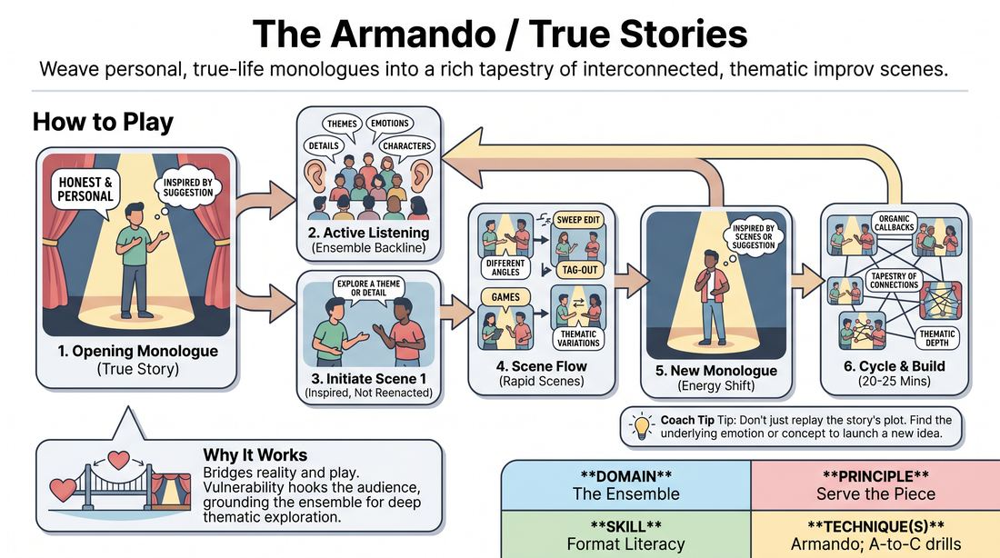

# 🎲 Drill A — isolation — The Armando

{ .infographic }

> Weave personal, true-life monologues into a rich tapestry of interconnected, thematic improv scenes.

`Players 4–99` · `~20 min` · `Complexity 4/5` · `Energy medium` · `Contact none` · `Props: none`

⬅️ [Back to the Week 03 run-sheet](../week-03.md)

## Why this activity, here

Week 3 sits on openings. The class has already made shapes together — patterns, group images, word-associations. This block turns the opening from decoration into supply: material goes in, scenes come out. It feeds the second half of the session, where they run longer openings and harvest them cold, and it sets up next week's edits.

## What students actually learn

- They stop treating a personal story as a performance and start treating it as raw stock for other people.
- They hear the difference between a detail and a plot, and learn that the detail is what launches a scene.
- They can name where a scene came from, so the form stops being an abstract shape and becomes a supply chain.
- They lose the fear of stepping out first after a monologue ends.

## Setup

Clear floor. One clean backline against a wall — chairs stacked out of the way. Nothing else needed. Bring a timer you can see. Decide pods before the room arrives and write the pod lists on paper so you are not counting heads at the start. If you run two pods, put them in opposite corners facing away from each other.

## How to run it — 20 minutes

| Min | What you do |
|---:|---|
| 2 | Frame it in two lines: the opening is the well, and everything drawn afterwards comes from it. Then tell a 45-second true story of your own. Ask the room to call back three concrete details they heard. |
| 3 | Round one, harvest only. One player tells a 90-second true story off the word. No scenes. Every backliner then says one detail aloud in turn, one phrase each, no repeats. |
| 4 | Round two. New monologuist, 90 seconds. On the last line, two players step out and play a 90-second scene off one detail. Sweep it. Stop. Ask the pair which detail they took. |
| 4 | Round three. New monologuist, 60 seconds. Now two scenes back to back with a sweep edit between them. Call the sweep yourself if nobody moves. |
| 4 | Round four. Skip the monologue at the start. Run one scene, then send a player forward with a true story pulled from something that scene said. One scene off that story. Sweep. |
| 3 | Final cycle, unbroken: word, story, two scenes, second story, one scene. You call edits only. Do not stop to teach. End on your sweep. |

## Side-coaching script

| When | Say |
|---|---|
| As the first monologuist starts | *"True, not funny."* |
| When the story drifts into summary | *"Give us one thing we can see."* |
| During the backline harvest | *"A detail, not the plot."* |
| As two players step out | *"Steal one thing. Don't retell it."* |
| When a scene opens with explaining | *"Start inside it."* |
| When a scene has made its point | *"Sweep."* |
| Before the second monologue | *"From the scene, not the suggestion."* |
| If the backline goes still after a story ends | *"Two feet. Now."* |

!!! success "What good looks like"
    The story ends and someone is already walking out. The scene that follows is clearly related and clearly not the same events — a different person, a different room, the same weather. Backliners can say the detail they grabbed without hesitating. Nobody is trying to be the funniest person in the pod, and the room is quieter during the stories than during the scenes.

## When it goes wrong

| You see | What's causing it | The fix |
|---|---|---|
| The monologuist gets a laugh, then starts hunting for the next one. The story becomes a stand-up set. | Being watched by a silent line of peers. Laughter is the only feedback available, so they chase it. | Stop them mid-story. Say: tell me what the kitchen smelled like. Restart from there. Tell the backline not to laugh generously for one round. |
| The first scene is the story again, with the monologuist's mum played by someone else. | They heard the narrative and not the parts. Easiest thing to copy is the whole thing. | Sweep it fast. Have the backline name three details that were not in the scene. Relaunch off one of those. |
| The story ends and four seconds of nothing. Then everyone steps out at once. | Nobody wants to be wrong about which detail matters, so they all wait for permission. | Say the rule aloud: any detail is the right detail. Run three rounds where you point at two people the moment the story ends. |
| Monologues stretch to three minutes and the pod only gets two scenes. | No felt sense of length, and the room is listening well, which is rewarding. | Hold up a hand at 60 seconds and cut at 90 without apology. Tell them the story is the well, not the set. |

## Scaling

| Class size | What changes |
|---|---|
| **10–13** | One pod, one backline, you run all edits. Five monologuists across the block. Keep the timings as written. |
| **14–17** | Two pods in opposite corners. Each nominates a timekeeper who also calls sweeps. You float, coaching one pod per round. Cut round three's second scene to keep both pods on the clock. |
| **18–20** | Two pods, cap each backline at ten. Drop round three entirely and give those four minutes to rounds two and four. Each pod gets three monologuists, not five; the rest stay on the backline and harvest aloud. |

## Variations

**Detail board** — After each monologue, the backline calls out details and one player writes them on a flip chart. Scenes must launch off a written one, said aloud first.  
*Easier — removes the panic of choosing under pressure and makes the harvest visible.*

**No word** — Drop the suggestion. Every monologue after the first must come from a line spoken in the preceding scene. Allow tag-outs as well as sweeps.  
*Harder — the well has to refill itself from the piece rather than from outside.*

**Tone only** — Scenes may not use any fact from the story. They may only match its emotional temperature — the awkwardness, the relief, the low dread.  
*Different emphasis — moves the harvest from content to atmosphere, which is what carries a long set.*

## Debrief

1. **Which detail did you take, and why that one?**
   > *A good answer sounds like:* A specific phrase or image, named without hedging — "the uncle who kept apologising" — and an honest reason like it was the only thing they could picture.

2. **What happened to a scene when it copied the story too closely?**
   > *A good answer sounds like:* They describe it running out of road, or feeling like they were protecting the monologuist. Not a general statement about originality.

3. **What made it easy or hard to tell something true in front of the line?**
   > *A good answer sounds like:* Practical, not confessional — the silence helped, the laughter derailed them, they picked something small on purpose.

!!! warning "Safety & inclusion"
    Say this before round one and mean it: pick a story you would tell a colleague on a long train journey, not one you would tell a therapist. No live wounds. Anyone may pass on being monologuist without giving a reason — say "pass" and the next person steps out. Nothing told in the room leaves it. Tell the ensemble not to mine another person's story for the painful part; take the ordinary parts. Tag-outs use a shoulder tap; ask for a show of hands on consent to touch first, and offer a spoken "tag" as the standing alternative for anyone who prefers it, with no explanation needed.

## Why it works

Format literacy is knowing where material comes from, not knowing the running order. This drill makes the causal link short enough to feel: a detail is spoken, and within four seconds it is a scene. Because the backline harvests aloud before playing, the invisible step — listening for parts rather than plot — is made audible and correctable. Isolating the cycle from the full set removes the pressure to build a whole piece, so attention stays on the transfer point where openings usually fail.

[Open the full activity card »](../../../../games/D4_P3_S6_T2_G635__the-armando-true-stories.md){target=_blank rel=noopener}
