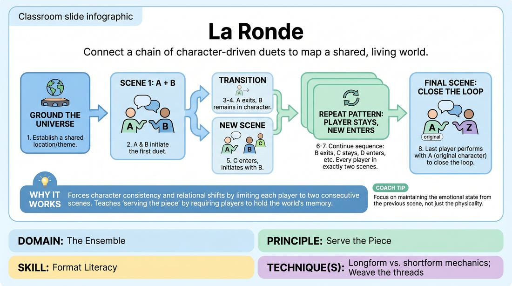

# 🎲 Drill B — under load — La Ronde

{ .infographic }

> Connect a chain of character-driven duets to map a shared, living world.

`Players 4–99` · `~20 min` · `Complexity 4/5` · `Energy medium` · `Contact none` · `Props: none`

⬅️ [Back to the Week 03 run-sheet](../week-03.md)

## Why this activity, here

Drill A opened the tap with free association — no characters, no continuity, no cost. This puts the same well-filling under time pressure and asks it to hold shape: people, relationships, a place that stays put. It feeds the back half of the session, where they run an opening and then pull scenes out of what it left behind. The harvest board from this drill is the material they use.

## What students actually learn

- They stop treating each scene as a blank page and start reading what is already standing on stage.
- They find out they can carry a character through a scene change without re-explaining it.
- They stop hoarding ideas privately — material accumulates in the room, and they can spend it.
- They feel a format produce content on its own, rather than being a container they have to fill.

## Setup

Chairs in a shallow arc facing an open playing area, wide enough for two people and two clear entrances. Flip chart or whiteboard visible to all, with a marker. Write the chosen location at the top and leave the rest of the sheet blank for the harvest. Have something to call transitions with — a clap is fine, a hand chime is cleaner over noise. Number the arc left to right before you start so nobody is working out whose turn it is mid-scene.

## How to run it — 20 minutes

| Min | What you do |
|---:|---|
| 2 | Take one location or theme from the room — take the second suggestion, not the first. Write it up. Number the arc in playing order and read the numbers back. |
| 2 | Walk the handover with three volunteers, no scene content. One exits on your clap, one holds their posture, one enters. Do it twice so the mechanics are boring before the pressure starts. |
| 6 | Run the chain from player one. Clap at about forty seconds. Say nothing but side-coaching calls. Keep the pace steady even if a scene is going well. |
| 5 | Continue to the end of the order, then close the loop: the first player returns as their original character opposite the last entrant. Let the closing scene run slightly longer, around sixty seconds. |
| 3 | Harvest. Ask the room to call out anything true about this world — names, objects, jobs, weather, rules, grudges. Write everything. Do not filter. Aim for twelve entries. |
| 2 | Debrief standing, at the board. Two questions, short answers. Leave the harvest sheet up for the rest of the session. |

## Side-coaching script

| When | Say |
|---|---|
| First ten seconds of any scene | *"Tell us who you are to each other."* |
| On every clap, as the exit happens | *"Same body. Same voice. New scene."* |
| A scene is all questions and no statements | *"Say something you know."* |
| Players are inventing a new location | *"Stay in the world. Name something in the room."* |
| A scene drifts into plot mechanics | *"Relationship first. Plot later."* |
| A scene stalls and the clock is running | *"Two lines and out."* |
| Three scenes from the close | *"Start bringing things back."* |
| Just before the final scene | *"Close the loop. First character, same as she was."* |

!!! success "What good looks like"
    Handovers are clean — one person walks off, the other does not visibly reset. You can tell the staying character is the same person because the posture and pace survive the clap. Entrants arrive with a relationship in their first two lines rather than negotiating one. Details recur: a name from scene two shows up in scene seven without anyone being told to do it. The closing scene lands because the first character has changed slightly, and the room notices. Afterwards, the group can list ten or more true things about the world, and half of them nobody consciously decided.

## When it goes wrong

| You see | What's causing it | The fix |
|---|---|---|
| The staying player shakes themselves out and starts the next scene as a visibly different person — new voice, new stance. | They treat each clap as a full reset. Usually nerves plus a habit of starting fresh. | Freeze the room. Ask the entrant to greet them by the name established last scene. Restart the beat from there. Add the call: same body, same voice. |
| Every scene invents its own location — a kitchen, then a spaceship, then a car park. | The shared world was named but never used, so it has no weight. | Point at the board. Require the next three entrants to name one physical thing in that location in their first line. |
| Players hesitating at the edge, checking whether it is their turn, chain stalling between scenes. | Playing order not fixed, or fixed and forgotten under pressure. | Stop and re-number aloud. Have each person say their number in sequence. Then have the next three stand ready at the entrance rather than sitting. |
| Scenes running long and rich, and you feel bad clapping. | You are protecting good work at the cost of the drill. | Clap anyway. The point is accumulation, not any one scene. Say it out loud so nobody thinks they were cut for being poor. |

## Scaling

| Class size | What changes |
|---|---|
| **10–13** | One chain, one loop, everyone in. Scenes at forty-five seconds. Ten to thirteen scenes fits the six-plus-five minutes with room for the longer closer. You can afford one restart if a handover collapses. |
| **14–17** | Split into two chains of seven to nine, run back to back. Same location for both, so the second chain inherits the first chain's details. Scenes at forty seconds. Non-playing chain sits and watches, then swaps. Harvest once, at the end, from both. |
| **18–20** | Two chains of nine or ten running simultaneously in opposite halves of the room, same location. One clap transitions both. Scenes at thirty seconds. Drop the walkthrough to ninety seconds and give that minute back to the harvest. Expect overlap noise — tell them to play to their own half. |

## Variations

**Signposted Ronde** — Every entrant must state the relationship in their first line: "Mum, you promised." Post the location and three fixed facts about it before you start.  
*Easier — removes the negotiation that eats the first fifteen seconds of every scene.*

**Self-called chain** — No clap. Players call their own transitions by walking off. Anything over sixty seconds and you cut it. Nobody may exit before the relationship is clear.  
*Harder — they carry the timing, which means listening for the peak while playing.*

**Object Ronde** — Each scene must add one physical thing to the location and handle it in mime. The closing scene must use three of them.  
*Different emphasis — pulls attention off relationship and onto shared physical world-building, which is what feeds a montage.*

## Debrief

1. **What is true about this world that nobody decided?**
   > *A good answer sounds like:* They name two or three specifics — the shop that never opens, the brother everyone avoids — and can trace them back to a scene they were not in. If they can only list what they personally established, run the harvest again before moving on.

2. **What happened in your body when your partner walked off?**
   > *A good answer sounds like:* Someone says they wanted to drop the character and start over, and describes what it took not to. Someone else says holding it was easier than expected. Both are fine. Vague "it was interesting" means push once, then move.

3. **Which three things on that board would you open a set with?**
   > *A good answer sounds like:* They pick concrete, unresolved details rather than jokes — a rule of the place, a relationship with tension in it. That tells you they are reading the board as material, not as a record.

!!! warning "Safety & inclusion"
    No contact is required at any point. If a handover or a scene calls for touch, the offering player asks first, in character or out — either is fine — and a no costs nothing. Anyone can pass their turn: say so before you start, and if someone waves you on, skip their number and the chain continues without comment. Keep a chair in the playing area so anyone who needs to sit can play seated. Rule out sexual content and graphic violence in the world before the first suggestion, so the location comes back workable. A player may decline a relationship they are handed and redirect it — "not your wife, your solicitor" — and the scene carries on.

## Why it works

Format Literacy is the ability to feel a structure generating material rather than waiting to be filled. La Ronde makes that mechanical: every scene inherits exactly one element from the one before, so nothing can start from zero and nothing is thrown away. Under a forty-second clap, players have no time to plan, so the only available source is what is already on stage — the previous character's tone, a name half-heard four scenes ago, the location on the board. That is the same draw an opening asks for later in the session. By the harvest, the room has physical evidence: a board of specifics none of them wrote alone. The cue stops being an assertion and becomes something they can point at.

[Open the full activity card »](../../../../games/D4_P3_S6_T4_G754__la-ronde.md){target=_blank rel=noopener}
