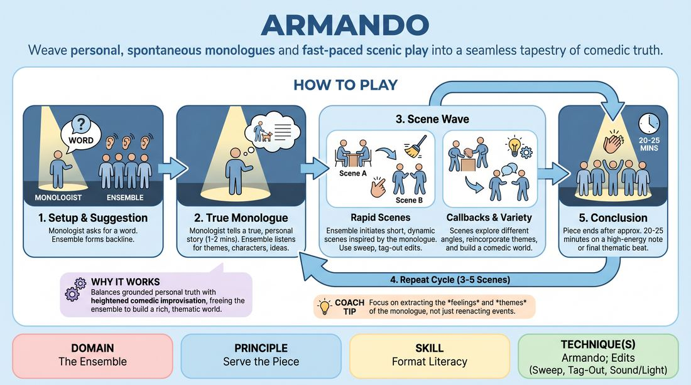

# 🎯 Scene Lab — The Monologist

{ .infographic }

> Weave personal, spontaneous monologues and fast-paced scenic play into a seamless tapestry of comedic truth.

`Players 4–99` · `~35 min` · `Complexity 4/5` · `Energy medium` · `Contact none` · `Props: none`

⬅️ [Back to the Week 03 run-sheet](../week-03.md)

## Why this activity, here

They have spent the morning on group openings that produce material from nothing — word association, movement, group mind. Those wells are collective and abstract. This one has a face and a voice, so the harvest step becomes visible: you can hear the source, then watch what people took from it. It feeds directly into next week's full-form run, where the opening they choose has to actually supply the scenes.

## What students actually learn

- They stop paraphrasing the source and start transposing it — same feeling, different world.
- They hear the difference between a detail worth stealing and a plot point that leads nowhere.
- They find out that a personal story is a usable engine, not a confession, and that telling one in front of the class costs less than they feared.
- They feel how fast an edit has to come when the material is finite.

## Setup

Clear a playing space with a backline — a wall, a taped line, or a row of chairs pushed back. Everyone else sits in a shallow arc as audience. No props, no chairs on stage unless a scene needs one. Have a timer you can see. Write the two-word reminder HARVEST, DON'T RETELL somewhere visible. Ask beforehand who is willing to be Monologist and note two or three names so you are not fishing at the moment of play.

## How to run it — 35 minutes

| Min | What you do |
|---:|---|
| 4 | Frame it. Take a word from the room and tell sixty seconds of a true story from your own life. Then ask the group: what did you take? Take five answers. Reject plot summaries out loud. |
| 4 | Pairs. A takes a word from B and tells forty-five seconds of true story. B names three harvests — a feeling, a character, a detail. Swap. Both directions inside the four minutes. |
| 9 | Set one. First Monologist, one word from the room. Story, three scenes, second story, up to three more scenes. Call the button at eight minutes. Keep one minute for the group to breathe. |
| 3 | Notes on the harvest only. Name two scenes that transposed well and one that retold. Do not give scene craft notes yet. Reset the backline. |
| 9 | Set two. New Monologist, new word. Same shape. Push the ensemble to start the first scene faster and to call back in the second wave. |
| 3 | Notes again. Ask the second Monologist what they heard come back at them from their own story. Let them answer without the group correcting. |
| 3 | Debrief the block with the whole room seated. Two questions, then land the cue. |

## Side-coaching script

| When | Say |
|---|---|
| As the Monologist begins the first story | *"Small and true. Not the best story — the nearest one."* |
| During the monologue, to the backline | *"Mine it. One feeling, one detail."* |
| The moment the Monologist steps back | *"Go now. Two seconds."* |
| A scene starts re-enacting the story | *"Different world. Same heat."* |
| A scene has made its point and keeps talking | *"Sweep it."* |
| Second wave begins | *"Bring someone back."* |
| Energy sags in the middle of wave two | *"Tag out. New angle on the same thing."* |
| Around thirty seconds before the cap | *"Find the button."* |

!!! success "What good looks like"
    The Monologist speaks plainly and stops before they run out of road. There is no pause between the story ending and the first scene starting — someone is already walking on. The scenes are not set in the story's location and do not use its characters, but you can tell exactly which story they came from. Edits land while scenes are still alive. In the second wave, a character from scene two walks back on and the room makes a noise. The Monologist watches their own life come back at them slightly distorted and is not embarrassed by it.

## When it goes wrong

| You see | What's causing it | The fix |
|---|---|---|
| The first scene is a dramatisation of the monologue — same people, same kitchen, same argument. | The ensemble listened for plot because plot is the easiest thing to hold onto. | Stop the scene. Ask the initiator what feeling was in the story. Restart the scene in any setting except the one described. Do this once and it usually sticks. |
| A four-second hole after the Monologist steps back, then two people start at once and both retreat. | Everyone is waiting for someone with a better idea. Nobody wants to spend the harvest badly. | Side-coach "go now" before the story even ends. Tell them the first scene only has to be about the smallest detail they heard, not the whole story. |
| The Monologist tells something raw and the room goes careful. Scenes become polite and bloodless. | The story landed as disclosure rather than material, and the ensemble is protecting the teller. | Before the set, say out loud: pick something you would tell a colleague, not a therapist. If it happens anyway, thank them, take the note publicly, and let the next Monologist reset the register. |
| Scenes run three minutes and there is only time for two of them. | Nobody edits because editing feels like interrupting a friend. | Stand at the side and call "sweep it" yourself for the first two scenes. Once they hear that the scene survives being cut early, they start doing it. |

## Scaling

| Class size | What changes |
|---|---|
| **10–13** | One group, everyone on the backline, no separate audience. Two sets of eight minutes as written. With ten people the backline is thin, so allow four scenes per wave rather than three and expect the same faces recurring — that is fine, it helps callbacks. |
| **14–17** |  |
| **18–20** | Split into two groups of nine or ten after the pairs drill and run in opposite corners at the same time. Each group gets one Monologist and one eight-minute set only. Use the second nine-minute block to swap Monologists within each group rather than merging. Take notes from a fixed spot between the two corners and give shared notes to the whole room.after seseven or eight, sitting out for that set as audience.of two seven or eight, running concurrently.after two seven or eight players each. Announce the eight-minute cap for both groups at once and cut them both together., or or of each. Run both sets concurrently in opposite corners.of seseven or eight players.of seseven or eight. Each group runs one set per nine-minute block, so every group sees two Monologists.of seseven or eight. Keep both caps synchronised so the notes rounds stay whole-room.of seseven or eight players each.of seseven or eight players.of seven or eight players.into two groups of seven or eight., the the pairs drill.,. running concurrently in opposite corners of the room. Each group runs one Monologist per nine-minute block, so four people monologue in total. You cannot watch both closely — position yourself between the corners, call the eight-minute cap for both at once, and gather the whole room for the shared notes rounds. Expect the second group to be quieter because they can hear you side-coaching the first.,, of seven or, of nine or ten each. Each group runs one Monologist per nine-minute block. Notes rounds are whole-room. Accept that you will see roughly half of what happens.of seven, of seven, of nine or ten. Two sets each, one per block, whole-room notes.of nine or ten players. One Monologist per group per block, four Monologists total, whole-room notes between blocks. |

## Variations

**Named Harvest** — Before each scene starts, the initiator says one line out loud to the room — "the smell of chlorine", "he wanted to be forgiven" — then plays it.  
*Easier. It forces the transposition into words before the body has to commit, and it shows the rest of the backline what harvesting sounds like.*

**One Well** — Single continuous monologue of two and a half minutes, no second story. The ensemble covers six scenes off that one telling.  
*Harder. The material runs out around scene four, so they have to start mining scenes for scenes, which is what a real form demands.*

**Rotating Teller** — Change Monologist between waves. The second teller takes their word from something the first three scenes threw up, not from the audience.  
*Different emphasis. Everyone practises telling as well as harvesting, and the group learns that the well can be refilled from the stage.*

## Debrief

1. **What did you take from the monologue that wasn't in the monologue?**
   > *A good answer sounds like:* A specific inference rather than a quotation — "nobody in the story ever said sorry, so I played two people apologising too much." If answers are all plot summaries, run one more scene with the Named Harvest rule before moving on.

2. **Monologists — what came back at you that you didn't expect?**
   > *A good answer sounds like:* Surprise rather than correction. "I didn't know that bit was the funny bit." If they start defending the accuracy of their story, remind the room the story is fuel, not a script, and move on.

3. **Where would this form break if we ran it for twenty-five minutes?**
   > *A good answer sounds like:* Structural thinking — running out of material by wave two, editing too slowly, the Monologist getting precious. That is format literacy talking, and it is what next week builds on.

!!! warning "Safety & inclusion"
    Personal stories are the material here, so set the line before you start: choose something you would tell a colleague at lunch, not something you have not finished feeling. Nobody has to be Monologist — ask for volunteers rather than going round the circle, and have your two or three pre-agreed names ready. Anyone may sit a set out on the audience arc with no explanation. Scenes involve no required contact; if a scene needs a touch, players ask in the moment or mime it. If a story touches something heavy, do not mine it for laughs from the side — take it seriously, thank the teller, and steer the ensemble to the feeling rather than the event. Tell the room that nothing said in a monologue leaves the studio.

## Why it works

Format literacy is knowing what a form does to material, not knowing its running order. Most openings hide the conversion step — a group hums, associates, and scenes somehow appear, so students learn the ritual without learning the mechanism. A single spoken source makes the conversion audible. Everyone hears the same ninety seconds, then watches six different extractions from it, and the gap between the source and the scene becomes measurable in the room. When a scene retells, everyone can hear that it retold. When a scene transposes, everyone can hear which thread it pulled. That comparison is the learning; the personal story is just the cleanest way to make the source singular enough to compare against.

[Open the full activity card »](../../../../games/D4_P3_S6_T2_G932__armando.md){target=_blank rel=noopener}
