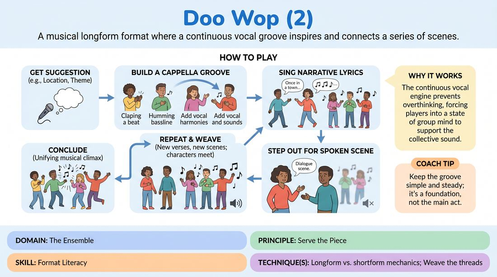

# 🏟️ Showcase round — Vocal Groove Longform

{ .infographic }

> A musical longform format where a continuous vocal groove inspires and connects a series of scenes.

`Players 4–99` · `~40 min` · `Complexity 4/5` · `Energy high` · `Contact none` · `Props: none`

⬅️ [Back to the Week 03 run-sheet](../week-03.md)

## Why this activity, here

Week 3 has spent the morning on openings that generate rather than warm up. They have already built a group opening in silence and in movement. This is the same idea with sound: a groove that keeps running is a well you can keep going back to. It feeds next week's work on returning to material, because here the return is audible — you can literally hear the source the scenes came from.

## What students actually learn

- That an opening can stay alive underneath the show instead of finishing before it starts.
- That you can contribute usefully to a piece without saying anything clever — a two-note bassline is a full contribution.
- That listening for a gap is a skill, and joining a texture is different from starting one.
- That a scene can be launched by a single line someone else sang, not by an idea you had beforehand.

## Setup

Standing room, no chairs, no tables. Put the ensemble in a shallow arc facing the same direction, shoulder to shoulder, with about two metres of clear floor in front of them for scenes. No music, no props. Have water available — this is thirty minutes of vocalising. If the room is echoey, tighten the arc; if it is dead, tighten it more. You will need a timer you can see without announcing it.

## How to run it — 40 minutes

| Min | What you do |
|---:|---|
| 5 | Groove only, no words. One player starts a bassline alone for four bars. Layer the rest in one at a time. Run it two or three times from silence, each build under thirty seconds. Practise dropping to a murmur on your hand signal and swelling back. |
| 4 | Add sung verses. Groove runs; players step half a pace forward to sing a short narrative line about a suggestion you give, then step back. No scenes yet. Insist on one voice at a time and on lines about people, not about the object. |
| 3 | Practise the handover. Groove, one sung line, two players step out, thirty seconds of spoken scene, step back, swell. Do it twice. Only note the mechanics: did the line duck fast enough, did the swell come back. |
| 10 | First full piece. Take a real suggestion from the watchers or from the room. Run the form end to end. Do not side-coach content. Call the final swell at nine minutes so they land the ending themselves. |
| 4 | Fast notes standing up. Name two things that worked and one mechanical fix — usually volume, or too many people singing at once. Swap who starts the bassline. No discussion, no defending. |
| 10 | Second full piece, new suggestion. Ask for one deliberate return: a character from an early scene appears in a later one. Otherwise leave them alone. Call the ending at nine minutes again. |
| 4 | Sit down where you are and debrief. Use two of the questions below. Finish by naming what the groove gave them that a silent opening would not have. |

## Side-coaching script

| When | Say |
|---|---|
| During the build, when three people start at once | *"One at a time. Wait for a gap."* |
| When the groove is getting busy and losing its pulse | *"Simpler. Fewer notes. Make it loop."* |
| The moment two players step forward | *"Line down. Keep it running."* |
| When a verse is all description and no person | *"Sing about somebody."* |
| When a scene has finished but nobody moves | *"Step back. Swell it."* |
| When scenes are all new people and no threads | *"Bring someone back."* |
| At the two-minute warning | *"Start gathering it."* |
| On the final unison | *"Together. Now cut."* |

!!! success "What good looks like"
    The groove is simple enough that you could hum it after one hearing, and it survives people leaving and rejoining. Volume changes are fast and collective — the drop happens on the step forward, not three seconds later. Scenes are ordinary and specific, and at least one of them clearly came from a line somebody sang. In the second piece, a face from earlier walks back on and the room recognises it without being told. The ending is a decision, not a fade.

## When it goes wrong

| You see | What's causing it | The fix |
|---|---|---|
| The groove speeds up steadily until it is twice its starting tempo and nobody can sing over it. | Excitement, and no one taking responsibility for the pulse. | Name a keeper of the beat before each piece. Tell that person their only job is tempo, and that everyone else follows them, not each other. |
| Scenes start but the groove dies underneath them within twenty seconds. | The line is listening to the scene and forgetting to make sound. | Assign two people per piece who never leave the line. Tell them out loud, in front of everyone, that they are the floor. |
| Verses are witty summaries of the suggestion and no scene can be built from them. | People writing lyrics in their heads instead of naming a person with a want. | Restrict verses to a sentence that contains a person and a verb. Say it as a rule before the second piece. |
| Two or three confident singers do everything and the rest hum quietly at the back. | The form rewards volume, and nervous singers keep shrinking. | Before the second piece, cap it: nobody sings more than two verses. Give the quiet players the bassline start. |

## Scaling

| Class size | What changes |
|---|---|
| **10–13** | One ensemble, everyone in the line. Two pieces of nine minutes as written. Expect two scenes running at a time to be impossible — keep to one, and let scenes run a little longer. |
| **14–17** | One ensemble still, but split the arc into a left half and a right half for the build so the layering does not stampede. Two pieces. Cap verses at two per person so everyone sings at least once. |
| **18–20** | Split into two groups of nine or ten. Each group performs one seven-minute piece for the other, then swaps, then a third round where you pick eight volunteers from across both groups for a final piece. Watching group stays silent and standing. |

## Variations

**One-note floor** — Everyone in the line may only make one sustained sound, chosen before the piece starts and never changed. Only the person stepping out to sing may add melody.  
*Easier. Removes the pressure to invent musically and makes the volume duck obvious.*

**No spoken scenes** — Every scene must be sung over the groove, in character, with the line still going. Dialogue is sung back and forth.  
*Harder. Forces commitment and kills the safety of dropping into ordinary conversation.*

**Groove as location** — Whatever the groove sounds like at the moment someone steps out defines where the scene is. If it turns industrial, the scene is in a factory.  
*Different emphasis — the musicians drive the narrative instead of accompanying it.*

## Debrief

1. **When did the groove stop being a warm-up and start being useful?**
   > *A good answer sounds like:* Someone points to a specific moment — a lyric they took a scene from, or a swell that told them a scene was over. Not a general comment about energy.

2. **What did you do when you had nothing to sing?**
   > *A good answer sounds like:* Honest answers about holding the bassline, doubling someone else's part, or just being the floor — and recognising that as a real contribution rather than a failure to participate.

3. **How did the second piece differ from the first?**
   > *A good answer sounds like:* They name the mechanical change — faster ducking, simpler groove, a returning character — and connect it to the piece feeling more like one thing than a set of sketches.

!!! warning "Safety & inclusion"
    No physical contact is required. If a scene calls for it, players ask first and can decline without explanation. Singing is the exposure risk here, not touch: say at the top that nobody has to sing in tune, and that percussive and breath sounds — clicks, taps, hisses, spoken rhythm — count fully as musical contributions. Offer a standing opt-out from solo verses for the whole session; anyone can take it silently by staying in the line. Watch for vocal strain in the second half and remind people to drop an octave rather than push. Anyone who needs to sit can sit and still play their part.

## Why it works

Format literacy is knowing what a structure gives you and what it asks of you. This form makes both audible. The groove is a shared resource that keeps existing whether or not you are using it, so the usual anxiety about running out of material has a physical answer — the well is still making noise behind you. Because the line must duck and swell as one, the ensemble gets continuous feedback on whether it is listening, without anyone having to say so. And because scenes are launched from lyrics rather than from private ideas, players practise taking the offer that is already in the room instead of importing one. That is the cue made mechanical: the opening does not finish, so it cannot have been a warm-up.

[Open the full activity card »](../../../../games/D4_P3_S6_T4_G1031__doo-wop-2.md){target=_blank rel=noopener}
