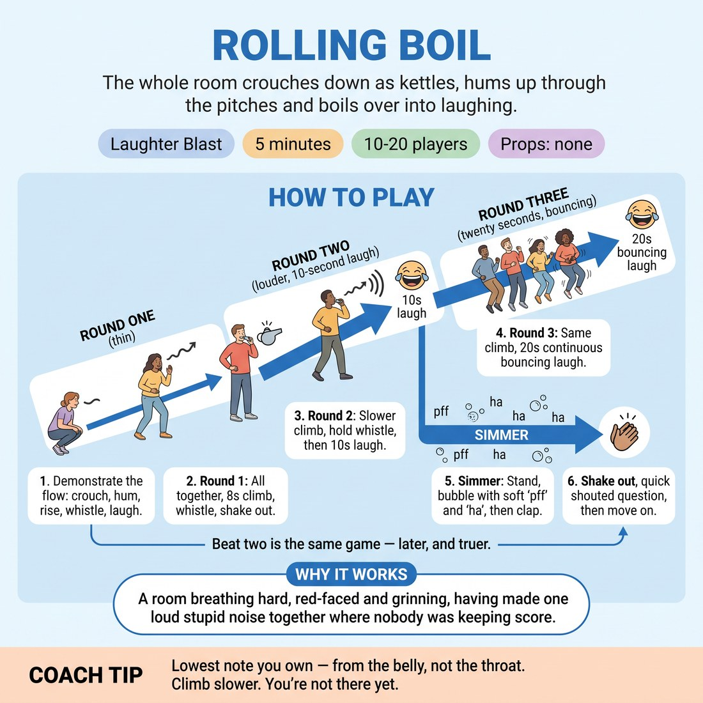

# 😄 Laughter Blast — Rolling Boil

{ .infographic }

> The whole room crouches down as kettles, hums up through the pitches and boils over into laughing.

`Players 10–20` · `~5 min` · `Complexity 1/5` · `Energy high` · `Contact none` · `Props: none`

⬅️ [Back to the Week 04 run-sheet](../week-04.md)

## Why this activity, here

Week 4 is Harold mechanics — beats, group games, returns — and the head does most of the work. This sits between the analytical block before it and the first full Harold attempt after, resetting breath and volume so the group scene lands loud instead of tentative. It also rehearses the week's cue in the body: the same move, three times, hotter each time.

## What students actually learn

- That repeating something identical is not repetition — it deepens, because everyone already knows the shape and can commit harder.
- That the third pass is where the real energy lives, so they stop hedging on the first.
- That laughing on purpose, badly, in front of nine strangers costs nothing.

## Setup

Standing circle, no chairs, arms' length apart. Move bags and coats out of the ring so nobody trips while bouncing. No props. Know where the door is if someone needs to step out. Check the room next door isn't mid-scene if walls are thin — warn them beforehand.

## How to run it — 5 minutes

| Min | What you do |
|---:|---|
| 1 | Circle up. State the opt-outs. Demonstrate solo, full volume: crouch, low hum, slow rise, kettle whistle, laugh. Then start round one together — crouch, lowest hum, count the climb. |
| 1 | Finish round one with a whistle and a shake-out. Say it was thin, cheerfully. Run round two: slower climb, louder, hold the whistle to the end of the breath, then ten seconds of laughing. |
| 1 | Round three. Same climb, same whistle, but nobody stops at the top. Twenty seconds of belly laugh while bouncing on the spot. Count the seconds out loud. |
| 1 | Call the simmer. Everyone stays standing and bubbles — random 'pff' and 'ha', no pattern, all at once. Let it settle into one soft rolling sound. Cut it with a single clap. |
| 1 | Shake hands and shoulders out. Ask one question, take shouted overlapping answers for twenty seconds, name the cue, move straight into the next block. |

## Side-coaching script

| When | Say |
|---|---|
| As they crouch for round one | *"Lower than you think. Find the bottom of your voice."* |
| Mid-climb, any round | *"Slower. Don't get there yet."* |
| At the top of round two | *"Whistle till the breath's gone."* |
| When round two's laugh starts politely | *"From the belly, not the throat."* |
| Around ten seconds into round three | *"Keep bouncing. Ten more. Nobody stops."* |
| Starting the simmer | *"Small now. No pattern. Just bubble."* |
| If the simmer organises into a rhythm | *"Break it up. Off the beat."* |
| Immediately after the clap | *"Shake it out. Hands, shoulders, done."* |

!!! success "What good looks like"
    Round three is noticeably louder and messier than round one, and several people are laughing for real by the end of it. The simmer sounds like water, not like a group of adults making noises. Nobody is watching the facilitator for permission.

## When it goes wrong

| You see | What's causing it | The fix |
|---|---|---|
| Round one is quiet and half the circle is smirking at the floor. | Normal. Round one is always thin because nobody knows what they've agreed to yet. | Say so out loud and move on fast. Do not repeat round one. The fix is round two, louder, with you leading it. |
| The twenty-second laugh dies at about eight seconds. | Fake laughing is physically tiring and people stop when they feel silly. | Count out loud from eight onwards and bounce harder yourself. The bouncing keeps the breath moving; without it the laugh collapses. |
| The simmer locks into a shared rhythm and becomes a chant. | Groups synchronise by default and it turns into a performance. | Call 'off the beat' and make a deliberately ugly, mistimed sound yourself. Cut it within fifteen seconds if it won't break. |
| Two or three people stand still with arms folded throughout. | Vocal exposure lands harder on some people than physical exposure. | Leave them. Do not single them out. Offer clapping the pulse as a stated role at the top so standing out is already legitimate. |

## Scaling

| Class size | What changes |
|---|---|
| **10–13** | One circle. Run all three rounds as written. The room is small enough that thin sound shows — lead loudest yourself throughout and lengthen the simmer to about forty seconds. |
| **14–17** | One circle, standard timings. Step into the middle for round three so your bounce is visible to everyone behind you. Simmer runs thirty seconds. |
| **18–20** | One circle, but tighten it — shoulders nearly touching, or the far side can't hear the climb. Cut round two's laugh to eight seconds to protect time. Simmer runs twenty-five seconds; cut it clean. |

## Variations

**Half and half** — Split the circle. One half climbs and whistles while the other half watches, then swap. Two shorter cycles instead of three full ones.  
*Easier — being heard in a group of eight is less exposing than being one of twenty, and watching first shows the shape.*

**Chain boil** — Instead of everyone together, one person starts the climb and each neighbour joins one second later, so the boil travels round the circle before everyone tops out at once.  
*Harder — requires listening and holding your own pitch against a moving wall of sound.*

**Three temperatures** — Run the same climb three times and name each one: kettle, then storm, then engine. Same shape, different sound each pass.  
*Different emphasis — makes the week's cue explicit. Same structure, later and truer, with the flavour changing rather than the form.*

## Debrief

1. **Which round felt like the real one?**
   > *A good answer sounds like:* Almost everyone says three. Someone notices that three was identical to one, and the difference was entirely in how much they gave it. That's the answer — move on.

2. **What made the twenty seconds possible?**
   > *A good answer sounds like:* 'Everyone else was still going.' 'The bouncing.' 'You kept counting.' Anything naming external support rather than personal willpower. Then move straight into the Harold block.

!!! warning "Safety & inclusion"
    No contact in this activity. State at the top that anyone can hum quietly, mouth it, or clap the pulse instead — and that stepping out of the circle to shake arms is fine at any point. Sustained loud laughing strains the voice; tell people to drop to a hum if their throat catches. Warn anyone with vertigo or joint issues that the bouncing in round three is optional and marching on the spot works. Volume alone can be hard for people with sensory sensitivity — flag the loud round before it starts so it isn't a surprise, and keep the door unlocked.

## Why it works

Format Literacy is the ability to recognise a shape returning and give it more, not less. Rolling Boil runs the identical move three times in ninety seconds, which makes the improvement impossible to attribute to novelty — round three is louder only because the group has stopped hedging. That is the same mechanism as a Harold's second beat: the audience and the players already hold the game, so the work goes into depth rather than setup. Doing it physically, with breath and volume, plants the cue somewhere faster than analysis. It also raises the room's baseline volume immediately before a group scene, which is the practical reason it sits here.

[Open the full activity card »](../../library/laughter/LB__rolling-boil.md){target=_blank rel=noopener}
