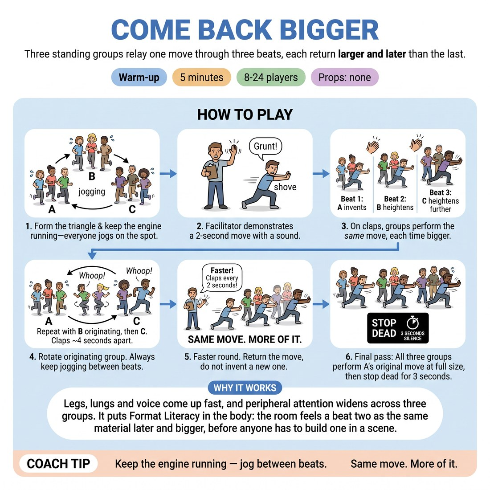

# 🔥 Warm-up cluster — Come Back Bigger

{ .infographic }

> Three standing groups relay one move through three beats, each return larger and later than the last.

`Players 8–24` · `~5 min` · `Complexity 3/5` · `Energy high` · `Contact none` · `Props: none`

⬅️ [Back to the Week 04 run-sheet](../week-04.md)

## Why this activity, here

Week four is the Harold, and the whole week turns on one idea: a second beat is not a new scene, it is the first scene later. This runs before any Harold structure work, in bodies rather than heads, so the class already knows in their muscles what a return feels like before they have to build one in a scene. It feeds the group games and the beat-two work that follow.

## What students actually learn

- They feel the difference between returning to a move and inventing a new one — and notice how strongly the body wants to invent.
- Heightening stops meaning louder and starts meaning the same thing, further along.
- They watch another group closely enough to reproduce their shape, which is the attention a second beat demands.
- Stopping dead together gives them the ending of a beat as a physical event, not a fade.

## Setup

Clear floor, enough room for three clusters standing five or six feet apart in a triangle. No chairs, no props. You need a clap loud enough to cut through jogging feet — use a hand drum or a shout of "BEAT" if the room is echoey. Tell people they can march or step in place instead of jogging.

## How to run it — 5 minutes

| Min | What you do |
|---:|---|
| 1 | Form the triangle. Get everyone jogging or marching on the spot. Say the frame: three groups, three beats, one move. Demonstrate a two-second move with a sound — shove and grunt — then show it bigger, then bigger again. |
| 1 | Group A originates on your clap; whole group does it in unison. Clap for B to repeat it heightened. Clap for C to heighten again. Four seconds between claps. Fix anyone who invents rather than returns. |
| 1 | Run the cycle twice more: B originates, then C originates. Keep the jogging going between beats. Call "same move, later" whenever a group drifts. |
| 1 | Fast round. Clap every two seconds. One full cycle of three originations if time allows, otherwise two. Accuracy matters more than size here. |
| 1 | Final pass: Group A fires its very first move; all three groups do it together at full size, then stop dead. Hold three seconds of silence. Then one line from you and move on. |

## Side-coaching script

| When | Say |
|---|---|
| As the jogging starts | *"Engine stays on. Beats happen on top of it."* |
| Just before the first clap | *"Group A — make it small. You need room to grow."* |
| When a receiving group changes the move | *"Not a new move. The same move, later."* |
| When groups get loud but not bigger | *"Volume is not size. Take up more floor."* |
| When beats bleed into each other | *"Land it. Then wait for the clap."* |
| During the fast round | *"Copy first, heighten second."* |
| On the final unison move | *"All three, full size — and stop."* |
| In the three seconds of silence | *"Hold it. That's the end of a beat."* |

!!! success "What good looks like"
    Three recognisable versions of one move, growing. You can point at beat three and still name what beat one was. Groups move in rough unison without rehearsing. The jogging never fully stops, so the room stays warm and a bit breathless. The final freeze is genuinely silent and everyone is grinning at how big the move got.

## When it goes wrong

| You see | What's causing it | The fix |
|---|---|---|
| Beat three has nothing to do with beat one — a shove has become a dance. | Groups are treating heighten as "do something more interesting", which is invention. | Stop the round. Ask Group C to show beat one back to the room. Restart and call "same move" on every clap for a full cycle. |
| Only two or three people in a group actually move; the rest half-mark it. | Nobody committed first, so everyone waits to see what the group does. | Name one person per group as the starter for the next cycle. Say "everybody, at once, on the clap" and clap harder. |
| The jogging dies and it becomes three groups standing about. | You stopped calling it and the physical frame quietly dropped. | Call "engine" between every beat for the next thirty seconds. Rejoin the jogging yourself. |
| Moves are already enormous on beat one, so beats two and three have nowhere to go. | Originators are performing rather than offering. | Tell the next originator to make it small and boring on purpose. Point out that the growth is the whole point, not the move. |

## Scaling

| Class size | What changes |
|---|---|
| **10–13** | Three groups of three to four. Run four full cycles: A, B, C, then A again. Claps four seconds apart throughout, two seconds for the fast round. Small groups fall out of unison easily — call "together" often. |
| **14–17** | Three groups of five or six. Run three cycles at four seconds, then one fast cycle. Bigger groups need a beat longer to land in unison, so let the first clap of each cycle sit slightly late. |
| **18–20** | Three groups of six or seven, spaced further apart so nobody gets elbowed. Cut to two cycles at four seconds plus one fast cycle — larger groups eat time. Use a drum or shout rather than a clap. |

## Variations

**Sound only** — Same structure, but the move must be vocal — a noise, no gesture. Bodies keep jogging.  
*Easier. Removes the physical self-consciousness and makes the copying more obvious to hear.*

**Blind return** — The receiving group closes their eyes during the originating beat and is described the move in three words by one member of the originating group before they perform it.  
*Harder. Forces the essence of the move to be named, which is what a second beat actually reuses.*

**Later, not bigger** — Change the rule: each beat is the same move but further along in time — the shove has become a shove that already happened, the aftermath.  
*Different emphasis. Trades heightening for consequence, which is the more useful Harold skill and much harder to do standing up.*

## Debrief

1. **What made a return feel like the same move rather than a new one?**
   > *A good answer sounds like:* They name something concrete they copied — the direction, the sound, the tempo — and notice that keeping one specific thing was enough for it to read as a return.

2. **Where did you feel the pull to invent?**
   > *A good answer sounds like:* Someone admits they got bored of the move, or wanted to add something funnier, and can see that the boredom was theirs, not the audience's.

!!! warning "Safety & inclusion"
    No contact between people — moves are made in your own space and the triangle keeps groups apart. Say up front that marching, stepping or standing still with arm movement all count as the engine; nobody has to jog. Anyone who needs to sit can sit and do the moves seated with the same timing. Warn before the loud beats if you have anyone noise-sensitive, and use a drum rather than a shout. Big physical moves are fine but nothing that involves dropping to the floor at speed.

## Why it works

Format literacy fails when students hear "second beat" as "second scene". This puts the return in the body under time pressure, where there is no room to think up something clever — the only available action is to reproduce what you just saw and push it further. Because three groups do it in unison, nobody's individual invention can hijack the move, so the return survives intact and everyone gets to see it survive. The final freeze marks the beat boundary physically, which is the thing students most often cannot feel later in a Harold.

[Open the full activity card »](../../library/warmups/WU__come-back-bigger.md){target=_blank rel=noopener}
