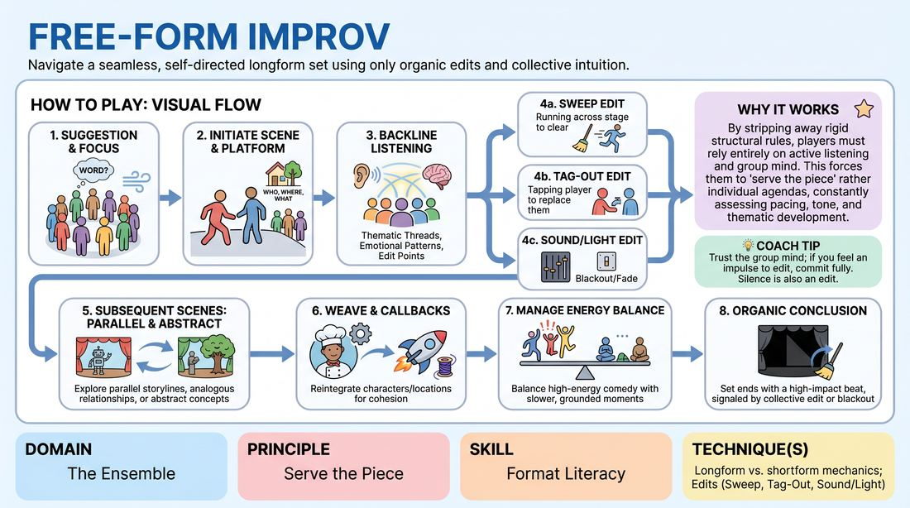

# 🎲 Drill A — isolation — The Open Canvas

{ .infographic }

> Navigate a seamless, self-directed longform set using only organic edits and collective intuition.

`Players 2–99` · `~20 min` · `Complexity 4/5` · `Energy medium` · `Contact none` · `Props: none`

⬅️ [Back to the Week 04 run-sheet](../week-04.md)

## Why this activity, here

Week four moves from scenes to shape. Weeks one to three built platform, agreement and second-beat instinct in isolated pairs. This drill isolates the two mechanics the Harold runs on — the edit and the return — before you hang them on a fixed structure later in the session. Everything after this block (group games, beat two, third-beat weaving) assumes players can clear a stage cleanly and bring something back without being told to.

## What students actually learn

- They stop waiting for permission to end a scene, and start reading when the scene has finished saying its thing.
- They feel the difference between repeating a joke and returning to a game later and further along.
- They learn to hold attention as a room — noticing when someone else is already moving and yielding without a collision.

## Setup

Clear a playing area with a wall or taped line for the backline. Chairs in a loose arc for anyone watching. No props. You need a timer you can see and a hard voice for time calls. Before the first run, take the touch agreement out loud and confirm the no-contact alternative. Split the room into two ensembles and put them on opposite sides of the space so the watching group is a real audience, not a queue.

## How to run it — 20 minutes

| Min | What you do |
|---:|---|
| 3 | Frame it in two sentences: this is edits and returns, nothing else. Then dry-run the three edits with the whole room, no scene content — sweep, tag-out, focus-shift, twice each, until the mechanics are boring. |
| 4 | Ensemble A. Edit-only pass. Give a word. Every scene is disposable and must be cleared inside roughly twenty seconds. Aim for ten or more edits. Content does not matter; clean clears do. |
| 4 | Ensemble B does the same edit-only pass with a new word. Push them for one more edit than A managed. Call "sweep it" yourself if a scene stalls past thirty seconds. |
| 4 | Ensemble A. Open canvas run. New word, scenes as long as they earn. One rule added: at least two returns before the end. They finish it themselves; you do not call time unless they overrun. |
| 4 | Ensemble B. Same run, new word. Ask the watching group beforehand to notice where the returns land, not whether they were funny. |
| 1 | Whole room, standing. One sentence each from three volunteers on where a return arrived. Then move on — the long debrief comes after Drill B. |

## Side-coaching script

| When | Say |
|---|---|
| During the dry-run, if edits are timid | *"All the way across. Own the clear."* |
| Edit-only pass, when a scene passes twenty seconds | *"Sweep it. Don't wait for the ending."* |
| Backline players visibly rehearsing their next idea | *"Watch, don't plan."* |
| Two players start an edit at the same time | *"First foot out wins. Second one back."* |
| Open canvas run, once three scenes have played | *"Bring something back."* |
| When a return lands as a straight repeat | *"Same game — later, and truer."* |
| Three loud scenes in a row | *"Someone take the slow one."* |
| When the room senses an ending but nobody moves | *"Clear it now."* |

!!! success "What good looks like"
    Edits arrive slightly earlier than comfortable, and nobody apologises for them. The backline is still, watching, and one person moves while the rest hold. Scenes two and four are recognisably related without anyone explaining how. When a character comes back, the room makes a small noise of recognition rather than a laugh at a catchphrase. The set ends because everyone knew it was over, not because you called time.

## When it goes wrong

| You see | What's causing it | The fix |
|---|---|---|
| A scene runs three minutes while five people stand frozen in the backline. | Everyone is waiting for a perfect edit point and treating an early edit as rude. | Stop it. Rerun thirty seconds of edit-only pass and tell them a slightly early edit is always better than a late one. Then restart the set. |
| Two players sweep simultaneously and collide, and the set stops dead while they laugh. | Backline is watching the scene, not each other. | Reinstate the rule aloud: first foot past the line owns the edit, the other returns without comment. Practise one deliberate near-collision so the yield is rehearsed. |
| Sweeps come exactly when a scene gets awkward or slow. | The edit is being used as an escape hatch from discomfort. | Ban sweeps for ninety seconds. Only tag-outs allowed. They have to stay in the world and change it from inside. |
| Returns are catchphrases and voices from beat one, delivered for the laugh. | They have heard "callback" and are performing recognition rather than progression. | Say the cue and add one instruction: the character comes back having had a worse week. Same game, more consequence. |

## Scaling

| Class size | What changes |
|---|---|
| **10–13** | Two ensembles of five to seven. Run the schedule exactly as written. With five on a backline everyone edits at least twice, so push the edit target higher in the edit-only pass — twelve clears in four minutes. |
| **14–17** | Two ensembles of seven to nine. Cap the live backline at six: the extras sit as spotters and each names one edit they saw coming, in the one-minute close. Rotate spotters between the edit-only pass and the open run. |
| **18–20** | Three ensembles. Cut the second edit-only pass and give each ensemble one three-minute open canvas run instead: 3 frame, 4 shared edit-only pass with all three groups mixed, 3 + 3 + 3 runs, 1 close, 3 held for resets and word-gathering between groups. |

## Variations

**Called edits** — You call every edit from the side for the first two minutes. Players only decide what comes next, not when.  
*Easier — removes the decision that freezes people and lets them feel the rhythm of a well-timed clear before owning it.*

**No sweeps** — Tag-outs and focus-shifts only. The stage never fully empties; every new scene is born out of a body already on it.  
*Harder — forces edits that carry information forward instead of wiping the slate, which is what beat two actually requires.*

**One thread** — Name a single object, phrase or relationship from the first scene. It must appear, altered, in every later scene.  
*Different emphasis — shifts the work from timing to thematic tracking, and makes returns visible even to nervous players.*

## Debrief

1. **Where did an edit arrive too late, and what were you all waiting for?**
   > *A good answer sounds like:* Someone names a specific scene and admits they were waiting for a laugh or a tidy ending. Better still, someone says they nearly moved and stopped themselves.

2. **When something came back, what had changed about it?**
   > *A good answer sounds like:* They describe consequence, not content — the same character with more at stake, the same dynamic in a worse room. If the answer is "he said the line again", press once more.

3. **How did you know the set was over?**
   > *A good answer sounds like:* Two or three people describe the same moment independently, usually a return that closed something. Vague answers about running out of steam mean the ending was luck, and you say so.

!!! warning "Safety & inclusion"
    Tag-outs involve touch. Agree the contact point out loud before the first run — shoulder or upper back — and offer the no-contact alternative of stepping into the player's eyeline and saying "tag". Nobody explains why they opt out. Sweeps mean people move fast across a shared floor: mark the front line, keep bags and chairs well back, and tell anyone with mobility limits they can edit from standing with a raised hand and the word "edit". Content will drift towards personal material in an open format; remind them that anything true they bring in, someone else may return to later, so bring what they are happy to see come back.

## Why it works

Format literacy is knowing where you are in a shape without anyone announcing it. A Harold teaches that with scaffolding, which lets players follow instructions instead of reading the room. Strip the scaffolding out and the only available information is collective attention: what the backline has noticed, and what the room recognises when it returns. The edit-only pass first makes clearing the stage mechanically boring, so it costs nothing socially. Then, when returns are asked for, players have spare attention to track material rather than manage nerve. The result is that beat two arrives because someone recognised the game had more to give, which is the instinct the fixed format will later formalise.

[Open the full activity card »](../../../../games/D4_P3_S6_T4_G1079__free-form-improv.md){target=_blank rel=noopener}
