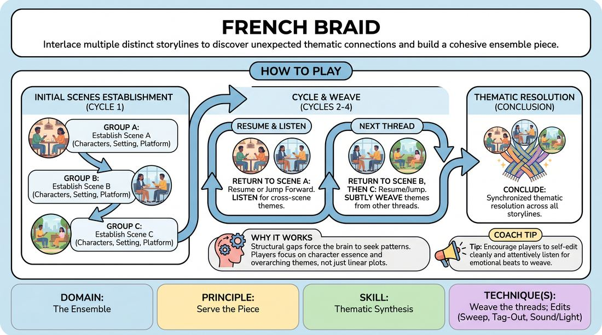

# 🎲 Drill B — under load — Braided Narratives

{ .infographic }

> Interlace multiple distinct storylines to discover unexpected thematic connections and build a cohesive ensemble piece.

`Players 3–99` · `~20 min` · `Complexity 4/5` · `Energy medium` · `Contact none` · `Props: none`

⬅️ [Back to the Week 04 run-sheet](../week-04.md)

## Why this activity, here

Week four teaches the Harold as a shape rather than a rule list. Earlier blocks built single group games and single beats. This drill puts three threads under a timer so players feel the return, not just hear it described. It feeds the full Harold attempt later in the session, where the same braid runs with group games between cycles.

## What students actually learn

- They stop treating a scene's end as its death, and start holding it in memory as something to come back to.
- They discover they cannot resume a scene they never defined — so they define faster on the way in.
- They hear a motif from another thread and let it land in their own without explaining it.
- Editing stops feeling rude. Walking on becomes an offer to the whole shape.

## Setup

Clear a playing area with a visible upstage line and two entrances players can use without crossing each other. Chairs in a rough arc for offstage groups so they can see and hear every thread. No props. Have a timer with an audible cue or a firm hand clap. Write the running order — A, B, C — somewhere everyone can see it, and leave it there.

## How to run it — 20 minutes

| Min | What you do |
|---:|---|
| 2 | Assign groups and letters. Give the rules in three sentences: one thread each, fixed order, come back and continue. Show a sample edit — walk on, others walk off, no apology. |
| 4 | Cycle one. Each thread gets roughly seventy-five seconds to establish who, where and what. Call the edit yourself if the incoming player hesitates. No returns yet. |
| 4 | Cycle two. Same order. Tell each group before they go on to either resume the exact moment or jump forward. They must state neither choice — play it. |
| 4 | Cycle three. Add the carry: before entering, each group names one thing they heard in another thread. Use it inside their scene without pointing at it. |
| 3 | Final short beats. Thirty seconds each. Tell them to land the thread, not resolve it cleverly. Cut the last scene on the strongest line you hear. |
| 3 | Debrief standing up. Two questions only. Keep it moving — the full Harold attempt is next. |

## Side-coaching script

| When | Say |
|---|---|
| First scene of cycle one, when players start explaining backstory | *"Who are you to each other. Say it in the doing."* |
| An edit is due and nobody has moved | *"Next thread. Walk on now."* |
| Players from the outgoing scene linger to finish a line | *"Clear the space. Your scene keeps existing."* |
| First return of cycle two | *"Same game, later. Don't start over."* |
| A returning scene restates what already happened | *"We were there. Skip ahead."* |
| Cycle three, before an entrance | *"Bring one word across. Don't announce it."* |
| A player tries to merge two threads by crossing characters | *"Echo it, don't visit it."* |
| Final beats | *"Land it. Last line, then out."* |

!!! success "What good looks like"
    Edits happen on their own, a beat before you would have called them. Returning players walk on already in the relationship — no re-establishing, no throat-clearing. By cycle three you can hear the same word or the same tension surfacing in two unrelated threads, and nobody has pointed at it. Offstage groups are watching, not planning. The room ends slightly ahead of your timer.

## When it goes wrong

| You see | What's causing it | The fix |
|---|---|---|
| Scenes run long because the next group is negotiating in the chairs about who goes in. | Groups treat the entrance as a shared decision rather than one person's job. | Before cycle two, have each group nominate a single edit-walker for the rest of the drill. That person goes, no consultation. |
| A thread returns and the players start a completely new scene with new characters. | They never fixed who they were the first time, so there is nothing to return to. | Pause five seconds. Ask the pair to say aloud, to the room, who they are to each other. Then send them back on with that. |
| Characters from thread A start appearing inside thread C. | Players hear 'connect the threads' as 'merge the plots'. | Restate it as an echo: same phrase, same object, same feeling, different people. Braids touch; they do not become one rope. |
| Cycle three feels flat and dutiful — everyone is correct and nothing is alive. | Players are managing the format instead of playing the scene. | Drop the carry instruction for one thread. Tell them to just play the relationship hard. The connections usually reappear on their own. |

## Scaling

| Class size | What changes |
|---|---|
| **10–13** | One braid, four threads. Pairs, with one trio if the number is odd. Everyone plays, nobody watches. Four beats per cycle at sixty seconds each. Three cycles fit comfortably. |
| **14–17** | Two braids of three threads, running simultaneously at opposite ends of the room. Each braid has its own fixed order. You call cycle changes for both at once and roam between them. Offstage groups watch their own braid only. |
| **18–20** | Two braids of four threads, simultaneous. Cut scenes to forty-five seconds and run three cycles with no final beats — the third cycle is the ending. Appoint one non-playing timekeeper per braid to call edits so you can side coach. |

## Variations

**Two threads only** — Run just A and B, ninety seconds each, four cycles.  
*Easier. Less to hold in memory, more repetitions of the return, so the 'same game later' habit gets more reps.*

**Silent edit tag** — Remove your timer calls entirely from cycle two. Groups must judge their own exit and entrance.  
*Harder. Puts the format's timing in the players' hands, which is what the full Harold requires.*

**Time-jump only** — Every return must land at least five years after the previous beat of that thread.  
*Different emphasis. Shifts the work from continuity to consequence — players play the result of the earlier scene rather than more of it.*

## Debrief

1. **What did you have to know about your scene before you could come back to it?**
   > *A good answer sounds like:* Something concrete and relational — 'I knew she was the one who owed him' — rather than plot. If they name a want or a dynamic, move on.

2. **Where did another thread show up in yours?**
   > *A good answer sounds like:* A specific, small borrowing they can point to, and an admission it happened partly by accident. Watch for the room recognising echoes it did not plan.

3. **What did the second beat give you that the first one couldn't?**
   > *A good answer sounds like:* Some version of depth without setup — 'we already knew them, so we could go straight at it'. That is the cue landing.

!!! warning "Safety & inclusion"
    No physical contact is required. Edits are made by walking into the space, never by touching the outgoing player — say this before the first edit and watch the first two. Anyone uncomfortable being edited mid-sentence can raise a hand and finish the line; do not make an example of them. Offer the timekeeper role to anyone who would rather not play a thread today; it is a real job, not a bench. If two entrances are not physically workable for a wheelchair user or anyone with limited mobility, use one entrance and have the outgoing pair exit upstage on your call.

## Why it works

Format literacy is the ability to feel where you are in a shape. You cannot get that from being told the Harold has three beats. The braid produces it mechanically: because the running order is fixed and the returns are compulsory, every player is forced to hold their own thread in working memory while attending to two others. That divided attention is the load. It does two things. First, it punishes vague openings — a scene you defined loosely is one you cannot resume, and players learn that within one cycle. Second, it makes cross-thread material arrive by contamination rather than design. You are half-listening to another scene while rehearsing your own return, so their phrase surfaces in your mouth without a decision. That is what thematic connection actually is in performance, and it is why the second beat is truer: nothing needs establishing, so the players go straight to the thing underneath.

[Open the full activity card »](../../../../games/D4_P3_S5_T2_G1085__french-braid.md){target=_blank rel=noopener}
