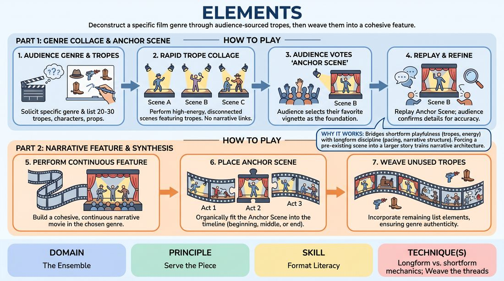

# 🎯 Scene Lab — The Genre Blueprint

{ .infographic }

> Deconstruct a specific film genre through audience-sourced tropes, then weave them into a cohesive feature.

`Players 4–99` · `~35 min` · `Complexity 4/5` · `Energy medium` · `Contact none` · `Props: required`

⬅️ [Back to the Week 04 run-sheet](../week-04.md)

## Why this activity, here

Week four has already taught beats returning inside a Harold. This block moves the same idea up a level: a whole show as first pass and second pass. Part One is the group game found; Part Two is that game placed in a story. It feeds the full Harold run later in the session, where students must recognise their own beat one and know where beat two belongs.

## What students actually learn

- They stop treating a callback as a repeat and start treating it as the same material arriving at a moment when it costs more.
- They learn a genre is a finite vocabulary, not a mood — and that naming twenty items out loud makes it playable rather than vague.
- They can look at a pile of unconnected scenes and see which one has a story attached to it.
- They get comfortable planting something before they know what it's for.

## Setup

Whiteboard or large flip pad, visible from every seat, plus a working marker and a spare. Two chairs on the playing area, nothing else. Chairs for watchers in a shallow arc facing the space. Clear enough floor for four players to move. If you have no board, use A3 sheets taped to the wall — the list must stay readable for the whole 35 minutes.

## How to run it — 35 minutes

| Min | What you do |
|---:|---|
| 3 | Frame the block. Say the cue: beat two is the same game, later and truer. Take genre suggestions from the room and pick one narrow enough to have a look, a sound and a set of stock characters. |
| 5 | Harvest the board. Fire questions at the watchers: what does the hero wear, what's on the desk, what does the villain always say, what weather is it. Write twenty to thirty items fast. Don't discuss them. |
| 8 | Part One. Send two or three players in, call scenes of roughly forty-five seconds, cut hard, rotate. Aim for eight to ten vignettes. No connections between them. Every scene must show at least one board item. |
| 3 | Vote and rebuild. Watchers name their favourite vignette; take a show of hands if two are close. Replay the Anchor once, letting watchers correct details out loud. Note the correct facts on the board's edge. |
| 12 | Part Two. Fresh cast if you like, or the same. One continuous film, start to finish, with the Anchor placed inside it. Side-coach placement and cross off board items as they land. |
| 4 | Debrief on your feet. Two questions, short answers, no speeches. Point at the crossed-off items and at where the Anchor landed. Reset the space for the next block. |

## Side-coaching script

| When | Say |
|---|---|
| During the trope harvest, when answers go abstract | *"Give me an object, not an idea."* |
| First two vignettes of Part One | *"Board item — show me which one."* |
| When a Part One scene starts building plot | *"Cut. Different world, new scene."* |
| Part One is running slow or precious | *"Land the image and get out."* |
| During the Anchor replay | *"Same words. Don't improve it."* |
| Early in Part Two | *"Story, not sketch. Who wants what."* |
| When Part Two nears the Anchor | *"You're walking into it now. Slow down."* |
| Last three minutes of Part Two | *"Board's still half full. Spend it."* |

!!! success "What good looks like"
    Part One is loud, fast and slightly silly, and the room recognises the genre without anyone naming it. The Anchor vote is quick because one scene clearly stood out. In Part Two the same scene arrives again and lands heavier than it did the first time — same beats, more at stake, because the story has told us who these people are. Half the board is crossed off by the end. Watchers make small noises of recognition when a planted item reappears.

## When it goes wrong

| You see | What's causing it | The fix |
|---|---|---|
| The trope list is full of things like 'tension', 'betrayal', 'a dark tone'. | You accepted abstractions during the harvest, so players have nothing physical to play. | Stop and ask for five concrete objects on the spot. Cross out the abstractions in front of the room. Rule: if you can't hold it, wear it or say it, it's not going up. |
| Part One scenes start sharing characters and building a plot by the third vignette. | Players default to continuity because it feels safer than starting cold. | Cut faster and change the location out loud before each scene: 'Docks. Two o'clock in the morning. Go.' Take the choice off them for two scenes, then hand it back. |
| Part Two replays the Anchor as a bigger, jokier version of itself. | Players think the return is the punchline rather than the payoff. | Call 'same size, more weight'. Remind them the audience already laughed at it once; the second time it only works if we now know what it costs the character. |
| Part Two is a competent scene in no particular genre. | Nobody is looking at the board, and the genre vocabulary has evaporated under story pressure. | Read three unused items aloud while the scene runs. Physically tap the board. Add one item as an offer from the edge if they still don't bite. |

## Scaling

| Class size | What changes |
|---|---|
| **10–13** | One group. Six to eight vignettes in Part One, casts of two. Everyone plays at least once in Part One; the Part Two cast is four, chosen from those who played least. The rest watch and vote. |
| **14–17** | One group, but keep Part One vignettes to forty seconds and run nine or ten so most people get in. Part Two cast of five, with two named as edit-callers so entrances stay clean. |
| **18–20** | Split the harvest between the whole room but split the playing into two casts of six that alternate. Cast A plays Part One and votes on Cast B's Anchor, and vice versa — run Part One at seven minutes, Part Two at ten, and drop one debrief question. |

## Variations

**Board Supplied** — You bring the twenty tropes already written, and spend the saved five minutes on a longer Part Two.  
*easier — removes the harvest, which is where nervous groups stall, and gives players more time inside the story.*

**Board Down** — Turn the whiteboard away after the Anchor vote. Part Two runs on memory only.  
*harder — forces players to have actually absorbed the vocabulary rather than reading it off a wall.*

**Anchor as Climax** — Name the Anchor's position before Part Two starts: it must be the final scene of the film.  
*different emphasis — shifts the work from placement to construction, since everything now has to be built to arrive there.*

## Debrief

1. **What was different about the Anchor the second time?**
   > *A good answer sounds like:* Someone names a specific change in stakes or knowledge — 'we knew she was lying by then', 'the gun was already established'. Not 'it was funnier'. If you get 'it was funnier', ask why.

2. **Which board item did the story actually need, and which were decoration?**
   > *A good answer sounds like:* They can point at two or three items that generated plot and several that were just flavour, and they don't treat the flavour ones as failures.

3. **When you were in Part One, did you know you were planting something?**
   > *A good answer sounds like:* Mostly no — and that's the point. A good answer notices that the Anchor was chosen for them, and that playing a scene fully is what makes it choosable later.

!!! warning "Safety & inclusion"
    No contact is required. If a scene needs closeness, players mime it at a distance. Vet the board before Part One: genres carry stereotypes, and 'the shifty foreigner' or 'the hysterical wife' goes up as easily as 'a rain-soaked trench coat'. Strike anything that makes a real group the joke, say briefly why, and move on without a lecture. Watching and voting is full participation — anyone who prefers not to play can hold the marker and run the board. Flag before you start that noir, war and horror genres carry violence; players may decline any scene by walking out of it, no explanation needed.

## Why it works

Format literacy is the ability to see a show's shape while you're inside it. This block makes that shape visible by separating it in time: Part One is pure vocabulary with no story pressure, Part Two is pure story built from that vocabulary. Because the Anchor is chosen by the room rather than by the players, nobody can pre-plan the return — they have to place material they already made into a structure they're discovering. That's the same cognitive move as beat two of a Harold, slowed down and made explicit. The cue holds because the Anchor genuinely is the same game arriving later: the words barely change, but the context now supplies weight the first pass couldn't.

[Open the full activity card »](../../../../games/D4_P3_S6_T4_G1042__elements.md){target=_blank rel=noopener}
