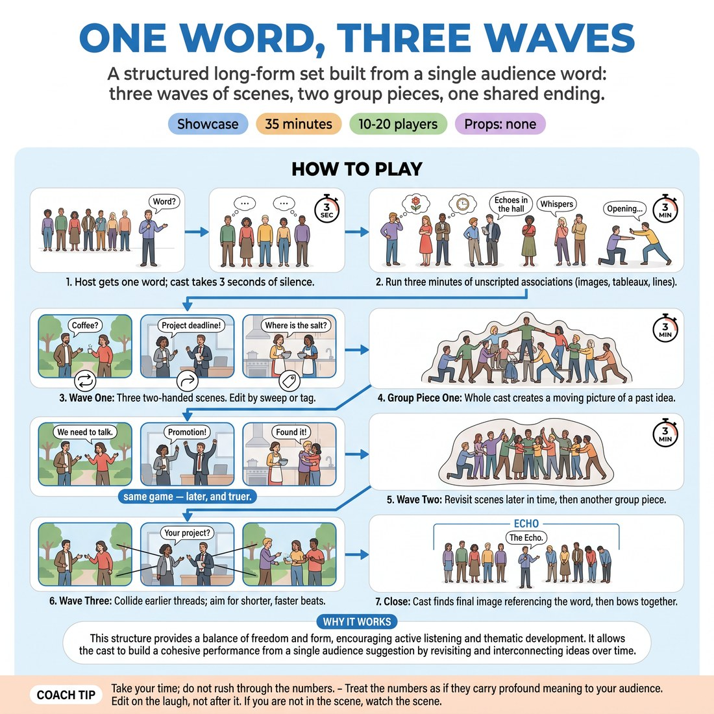

# 🏟️ Showcase round — One Word, Three Waves

{ .infographic }

> A structured long-form set built from a single audience word: three waves of scenes, two group pieces, one shared ending.

`Players 10–20` · `~40 min` · `Complexity 4/5` · `Energy medium` · `Contact negotiated` · `Props: none`

⬅️ [Back to the Week 04 run-sheet](../week-04.md)

## Why this activity, here

Week four has drilled the parts separately: second beats, group pieces, edits, callbacks. This is the first time they hold all of it in one thirty-minute shape with an audience watching. It comes last in the session because it tests format literacy — knowing where you are in the piece without anyone telling you. It feeds the week five showcase, where nobody will call the waves out loud.

## What students actually learn

- They stop asking permission to enter and start reading the piece's position instead — opening, first wave, group, return.
- They discover a second beat is not a repeat: same people, later, with the pressure grown.
- They trust that material from the opening will come back, so they stop hoarding ideas in scene one.
- They learn to edit a scene while it is still good, not when it dies.

## Setup

Clear playing space with a defined back line — tape, chairs pushed back, or just the wall. Cast stands along it. Everyone not playing sits front-on as audience, on the floor or in a row of chairs; they are the real audience and should behave like one. One chair off to the side for you. Have a watch or phone timer visible to you but not to the cast. Decide beforehand who hosts. Before you start, run the contact consent step for sweeps and tag-outs.

## How to run it — 40 minutes

| Min | What you do |
|---:|---|
| 5 | Draw the map on the board: opening, wave one, group, wave two, group, wave three, close. Name the host. Run the contact consent check for sweeps and tags. Take no questions after minute four. |
| 4 | Host asks the audience for one ordinary word and repeats it twice. Three seconds of silence. Run the opening — images, tableaux, lines, no scenes. It ends when someone steps out and starts a scene. |
| 7 | Wave one. Three unrelated two-handers, each seeded by the opening. Around two minutes each. Call the sweep yourself if a scene passes two and a half minutes. |
| 3 | Group piece one. Someone starts a place, idea or ritual already seen. Everyone joins inside ten seconds. Let it run the full three minutes even if it wobbles. |
| 9 | Wave two — the same three scenes, later in time, same characters, changed situation. Then group piece two from a different thread. Keep the second wave scenes to two minutes each. |
| 5 | Wave three. Three short collisions between threads, forty to ninety seconds each. Then the close: one final image or line on the word. Host calls the cast forward. Bow together. |
| 7 | Sit the cast down facing the watchers. Run the debrief questions. Do not give notes on individual scenes — talk only about the shape and the returns. |

## Side-coaching script

| When | Say |
|---|---|
| The three seconds after the word, if someone twitches | *"Nothing yet. Let it sit."* |
| The opening starts turning into dialogue | *"Images, not conversation."* |
| A wave-one scene has been running two and a half minutes | *"Sweep it."* |
| Group piece one, if three people are still on the back line | *"Everyone in. Now."* |
| Top of wave two | *"Same game, later, and truer."* |
| A wave-two scene resets to introductions | *"You already know each other. Skip the meeting."* |
| Wave three, when a scene settles into a normal two-hander | *"Bring the other scene's rule in."* |
| The last thirty seconds | *"Find the word. Land it and hold."* |

!!! success "What good looks like"
    The back line stays alert and faces front, so entrances come from readiness rather than panic. The opening produces three or four concrete images that you can hear surfacing again twenty minutes later. Wave two scenes start in the middle of something, with the same voices and a worse problem. Group pieces have everybody moving inside ten seconds. Wave three feels faster and slightly out of control in a way the cast is enjoying. The close is one clean image, not a scramble, and the bow is together.

## When it goes wrong

| You see | What's causing it | The fix |
|---|---|---|
| The opening becomes a scene within ninety seconds — two people talking to each other in character. | Silence feels unbearable, so someone reaches for the most familiar structure they have. | Call "images, not conversation" once. If it happens again, restart the opening with a rule: nobody speaks to anyone, all lines are said out to the audience. |
| Wave two scenes reintroduce the characters and re-explain the situation. | The cast is treating the second beat as a fresh scene rather than a later one. | Stop, name it, restart the scene from a line spoken mid-argument. Repeat the cue: same game, later, truer. |
| Scenes run four or five minutes and nobody edits. | Players on the back line are watching as an audience instead of as editors, and are afraid of cutting something good. | Assign two named sweepers for wave one only. Tell them the job is to cut a scene while it is still working. |
| Group piece is four people doing something and the rest standing watching. | Nobody wants to break an idea that is already forming. | Count ten seconds out loud. Anyone still on the line at zero enters as an object in the picture. |

## Scaling

| Class size | What changes |
|---|---|
| **10–13** | One cast, everyone on stage, one full set as timed. Assign the three wave-one scenes to six different players so nobody sits out both waves. Host plays in the piece after their intro. |
| **14–17** | One cast, but tighten: wave-one scenes go to two minutes, wave three to sixty seconds each. Require that the three wave-one pairs are six players who have not been in an opening tableau together. Two named sweepers rotate each wave. |
| **18–20** | Split into two casts of nine or ten. Each runs an abbreviated set — opening two minutes, wave one, group piece, wave two, close — in twelve minutes, with the other cast as audience. Drop wave three and group piece two. Cut setup to four minutes and debrief to six, and give each cast a two-minute changeover. |

## Variations

**Called waves** — You announce each section aloud as it begins: "wave two", "group piece". Cast only has to execute, not track.  
*easier — removes the format-reading load so a nervous group can feel the shape once before holding it themselves.*

**No sweeps** — Scenes can only be ended by a player entering and physically taking a character's place, or by the whole cast joining and turning the scene into the group piece.  
*harder — forces every edit to be an offer, and makes the back line responsible for content, not just timing.*

**Word held back** — Take the word but do not say it aloud until the close. Host writes it, shows it to the cast only, and reveals it in the final line.  
*different emphasis — shifts attention from callback-spotting to whether the whole piece actually smells of the word.*

## Debrief

1. **Where in the piece did you know what to do without thinking about it, and where did you have to guess?**
   > *A good answer sounds like:* Someone names a specific moment — "I knew to enter after the second sweep, but I had no idea whether group two had started" — rather than a general feeling about confidence.

2. **Which scene got better in wave two, and what changed to make it better?**
   > *A good answer sounds like:* They name the change in situation, not the jokes. "Same two neighbours, but now the fence is down." If they only say "it was funnier", push once for what moved.

3. **What did the opening give you that you used later?**
   > *A good answer sounds like:* Concrete: a phrase, a gesture, a place. Two or three people naming the same image is a good sign the piece cohered. Move on once you have three specifics.

!!! warning "Safety & inclusion"
    Sweeps and tag-outs can involve contact. Before the set, demonstrate both and ask anyone who prefers no touch to say so now or raise a hand — offer the alternative of a spoken "switch" from the edge of the stage, which the whole cast honours identically. Nobody explains why. Screen the audience word: if it is a slur, a real person's name or clearly aimed at someone in the room, the host says "give me another" and takes a second suggestion. Anyone can leave the back line and sit down at any point without comment; tell them this before you start. Watch for a player who takes no scene at all across three waves and give them a direct entry point in wave three rather than naming it publicly.

## Why it works

Format literacy is knowing your position in a structure without being told. The waves give the piece fixed landmarks, so a player deciding whether to enter is answering a smaller question — not "what should happen now" but "is this a first beat or a return". The second wave forces the discovery the cue names: a beat is not a repetition, it is the same relationship under later pressure, which is why the material feels truer rather than merely familiar. Group pieces sit between waves so the whole cast keeps a shared memory of the material, which is what makes wave three's collisions legible instead of random.

[Open the full activity card »](../../library/showcase-formats/SF__one-word-three-waves.md){target=_blank rel=noopener}
