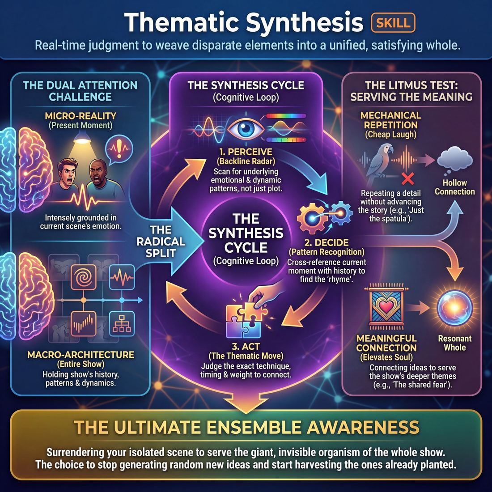

# Week 05 — Weaving — Callbacks, Mapping, Theme

> *The pleasure of a long set is watching separate things turn out to have been the same thing.*

| Course | Week | Domain | Focus | Stage | Length | Class |
|---|---|---|---|---|---|---|
| The Piece — Long-Form & Audience | 5/8 | D4 | `D4.S5` — Thematic Synthesis | Competent → Proficient | 180 min | 10–20 |

!!! note "Builds on"
    Week 4 established beats and returns inside one form; this week loosens the form and asks them to weave across it by ear.

## 🎬 The arc of this session

They arrive competent and slightly pleased with themselves — they can hold a form, hit beats, land scenes, and they think that is the job. The session pulls the scaffolding sideways: instead of executing a shape, they have to listen across twenty minutes and bring back what the piece has already told them, justifying the collision instead of nudging the audience about it. They leave able to name what a set was about, and having felt the difference between a repeated word and a returned idea.

!!! tip "Watch for"
    The confident-and-disconnected player: technically clean scenes with nothing carried between them. Also watch for the opposite failure this cohort produces — the wink, where someone says the callback line and looks at the audience for credit instead of playing it straight.

## ⏱️ Session flow (180 minutes)

| Time | Block | Activity |
|---|---|---|
| **0:00–0:05** | 🧊 Ice-breaker | *Small Hills* |
| **0:05–0:10** | 😄 Laughter Blast | *The Laugh Comes Back* |
| **0:10–0:25** | 🔥 Warm-up cluster | *Two Threads*, *One Roof*, *The Word Underneath* |
| **0:25–0:45** | 🧠 Theory | — |
| **0:45–1:05** | 🎲 Drill A — isolation | *The Lotus* |
| **1:05–1:15** | ☕ Break | — |
| **1:15–1:35** | 🎲 Drill B — under load | *The Crescendo Finale* |
| **1:35–2:10** | 🎯 Scene Lab | *Synthesis Freeze* |
| **2:10–2:50** | 🏟️ Showcase round | *Borrowed Memories* |
| **2:50–3:00** | 💭 Reflection & homework | — |

## 🎒 Before you start

- Clear a wide playing space with a clean back line. Chairs in a shallow arc for the watching half — no rows, no hiding at the back.
- Whiteboard or flipchart with a marker. You will write single words on it during Theory and leave them visible all session.
- Bring index cards and pens for Borrowed Memories. One card per person, plus spares.
- Review last week's homework: they were asked to log returns inside a form. Ask two people to name one return they spotted and hold the answers for Theory.
- Set a visible timer they can see from the stage. In Block 9 you will call time hard.
- Decide your Block 9 sequencing before class. Write the running order of monologists on the flipchart during the break so nobody is surprised.

## 1. 🧊 Ice-breaker (5 min)

*Standing circle, no bags, no phones. We are going to make a lot of small offers quickly and none of them matter yet.*

**Why here:** Gets them naming small specific things out loud with no pressure, which is the raw material the whole session will ask them to remember.

### Small Hills

> Each person names one trivial thing they are quietly firm about, and the room votes with their feet.

`Players 10–20` · `~5 min` · `Complexity 1/5` · `Energy medium` · `Contact none` · `Props: none`

**How to play**

1. Stand the group in one circle. Define a small hill: a trivial thing you are firm about. Household scale only — no politics, no beliefs about people.
2. Give your own first, in one sentence. "Milk goes in after the tea." Keep it light and specific so the bar stays low.
3. Have everyone turn left and tell that person their hill. All pairs speak at once. Call time at forty seconds. Everyone has now said theirs aloud.
4. Go round the circle. One sentence each, six to eight seconds. No stories, no justification. Move on the instant the sentence lands.
5. Tell the room: if you agree, step in one pace, then step back. The vote is silent and immediate. Keep the round rolling.
6. Name the hill that pulled the most people forward. Give that person one sentence of defence. Allow no reply, no debate, no follow-up.
7. Close the circle and move straight on. Tell them to remember two hills that were not their own.

📄 **[Full teaching notes »](week-05/advanced_w05__b1_1.md)**

**Side-coach:** *“Smaller. Give me something only you would notice.”*

## 2. 😄 Laughter Blast (5 min)

*Shake it out. This next one is loud and it is not clever — nobody has to be funny.*

**Why here:** Breaks the polite competence they walk in with and gets breath into the room before twenty minutes of listening work.

### The Laugh Comes Back

> A silly sound is planted, forgotten, then ambushes the room three times until everyone is wheezing.

`Players 10–20` · `~5 min` · `Complexity 2/5` · `Energy high` · `Contact none` · `Props: none`

**How to play**

1. Stand where everyone can see you. Demonstrate the first sound loud and ugly: a rising "WOOP-woop-woop" with both hands flapping down your sides. Commit fully — you set the ceiling.
2. Have the whole room copy it three times, bigger each time. Do not accept polite. Ask for the third one at full volume.
3. Send everyone walking the room, mumbling a shopping list aloud, ignoring each other. Tell them to sound as bored as humanly possible. Keep the mumble running underneath.
4. With no warning, shout "IT'S BACK!" Everyone stops, does the WOOP three times at full volume, then returns to bored mumbling instantly, as if nothing happened.
5. Teach a second sound the same way: a low "bmm-bmm-bmm", knees bent, hands paddling. Three copies, loud. Then straight back to walking and mumbling.
6. Call "IT'S BACK!" for either sound at random, four or five times. Shorten the gaps between calls. Overlap them — call both, and the room does both at once.
7. Final call: "BOTH, AND DON'T STOP." Room WOOPs and bmms simultaneously for fifteen seconds. Cut it dead with a raised hand.
8. Ask one question. Take thirty seconds of answers. Move straight on to the next block.

📄 **[Full teaching notes »](week-05/advanced_w05__b2_1.md)**

**Side-coach:** *“Let it build. Do not manage it.”*

## 3. 🔥 Warm-up cluster (15 min)

*Two exercises back to back. The first is about holding two things at once. The second is about finding what is under them.*

**Why here:** Two Threads, One Roof puts two unrelated streams in the same space; The Word Underneath trains them to hear the thing beneath the thing, which is exactly the skill Theory will name.

### Two Threads

> Two impulses travel opposite ways round the circle and whoever they collide on has to make them one thing.

`Players 10–20` · `~5 min` · `Complexity 3/5` · `Energy high` · `Contact none` · `Props: none`

**How to play**

1. Circle up standing, no gaps. Get everyone bouncing lightly on the balls of the feet, and tell them the bounce never stops, whatever else happens.
2. Point out the two directions by name: clockwise, anticlockwise. Say it twice. Have the room point each way with a hand so nobody is guessing later.
3. Launch thread one clockwise yourself: a stomp plus a sound. Each person copies what arrived, then passes it on slightly changed. Run it half a lap, then stop it.
4. Launch thread two anticlockwise from someone opposite you: a single word with an arm gesture, passed by free association. Run it half a lap. Stop both threads.
5. Restart both threads at once, one each way. Tell the room what happens when they meet: the person who receives both freezes for a beat.
6. Have the collision player shout one move-and-word made from both threads. The whole room copies it once, with a jump. Then that player relaunches both threads, one in each direction.
7. Keep it running for three or four fusions. Then stop. Take the last fused word, say it back once as a full room, and tell them you will want it later.

📄 **[Full teaching notes »](week-05/advanced_w05__b3_1.md)**

### One Roof

> Pairs swap a small detail from the week, name what the two have in common, then merge into fours and find one word that covers all of it.

`Players 10–20` · `~5 min` · `Complexity 2/5` · `Energy low` · `Contact none` · `Props: none`

**How to play**

1. Pair everyone up. Standing is fine. Tell each person to think of one small, concrete thing from their week — a queue, a smell, a broken kettle. Nothing confessional.
2. Give each partner thirty seconds to describe their detail. The listener says nothing back at all. Just looks and takes it in. Call the swap.
3. Tell each pair to agree one sentence, out loud, to each other: 'Both of ours are about ___.' Insist on a concrete word. Ban 'life', 'people', 'time'.
4. Join each pair to another pair. Four details now on the table. The four must land on one single word that honestly covers all four.
5. Go round the fours. Each group calls its word to the room. Name any two groups that landed near each other, then move straight on.

📄 **[Full teaching notes »](week-05/advanced_w05__b3_2.md)**

### The Word Underneath

> Three unrelated words go up, the room finds the one idea sitting under all three, and everyone whispers it at the same moment.

`Players 10–20` · `~5 min` · `Complexity 2/5` · `Energy low` · `Contact none` · `Props: none`

**How to play**

1. Stand where everyone can see you. Tell the room you will say three unrelated words, and they will privately find the single idea sitting underneath all three.
2. Tell them nobody explains, nobody debates. On your count of three, everyone whispers their one word at the same moment.
3. Say three words slowly: ladder, salt, telephone. Hold twenty seconds of silence. Count three. Everyone whispers. Name aloud any word you heard more than once.
4. Give a new trio. Allow ten seconds only. Whisper together. Ask who changed their word after hearing the room, take the show of hands, move straight on.
5. Give four words, one of them reused from round one. Ten seconds. Whisper. Point out that the repeated word bent the answer toward itself.
6. Give three final words. Five seconds only. Whisper. Tell them to take the first thought and let it be wrong.
7. Say the last shared word back to the room. Tell them to carry it into the set and stop.

📄 **[Full teaching notes »](week-05/advanced_w05__b3_3.md)**

**Side-coach:** *“Do not join the threads. Just keep both alive.”*

## 4. 🧠 Theory — Thematic Synthesis (20 min)

{ .infographic }

- **The big idea:** Reincorporation is not repetition. Repetition returns the surface — a word, a gesture, a funny name. Reincorporation returns the meaning and puts it somewhere it now costs something. The pleasure of a long set is discovering that the separate things were the same thing.
- **Where you are on the path:** They are proficient at execution and hungry for the next thing. In the room this looks like clean scenes, good listening inside a scene, and near-zero listening between scenes. They will already know the word 'callback' and will mostly mean 'quoting'.
- **The one cue to coach:** *“Reincorporation is the punchline of structure.”*

**The three beats**

1. **Say it.** Say: a long set gives you two kinds of material — what happened, and what it was about. Most of you are tracking what happened. This week you track what it was about. Say: a repeated word is a joke. A returned idea is a structure. Say the cue and write it up: reincorporation is the punchline of structure. Then say the harder half — when you bring something back, you have to justify it inside the new scene. The characters do not know it is a callback. They only know this is happening to them now.
2. **Show it.** Take two volunteers. Run a thirty-second scene: two people arguing about who left the gate open. Cut it. Run a second thirty-second scene with different players: a job interview. Then step in yourself and play a third — a wedding speech — and land the phrase 'nobody in this family closes anything' with full sincerity, as grief, not as a nudge. Stop. Ask the room what changed. Write on the board: SAME WORDS, NEW COST.
3. **Try it.** Everyone into pairs. One person tells their partner, in sixty seconds, about a small thing they lost. Swap. Then each pair plays a thirty-second scene about something entirely different — buying a fridge — and one of them must let the loss into it without naming it. Five minutes total. No sharing back. Just note who found it easy and who reached for the literal object.

!!! warning "The misunderstanding that always comes up"
    They think reincorporation means the callback must be recognisable to the audience as a callback. It does not. If the audience only feels the rhyme rather than spotting it, that is a better result. Say it out loud: you are not collecting credit.

!!! abstract "📖 Go deeper"
    Read the full write-up: [Thematic Synthesis](../../../theory/04_the-ensemble/04_S5__thematic-synthesis.md)

## 5. 🎲 Drill A — isolation (20 min)

*No scenes for twenty minutes. This is just returning, slowly, and noticing what a return does to the thing around it.*

**Why here:** Isolation: The Lotus strips out scene pressure so they can practise return purely — no plot to defend, no laugh to chase.

### The Lotus

> Weave thematic threads and emotional dynamics across three distinct, recurring stage spaces.

`Players 6–99` · `~20 min` · `Complexity 4/5` · `Energy medium` · `Contact none` · `Props: none`

**How to play**

1. Split the room into three groups. Send them to three standing areas: Left, Centre, Right. Tell them they stay at their station for the whole exercise — no swapping.
2. Tell Left to open Round 1 with a scene that establishes two or three characters, a clear place, and one emotional dynamic between them.
3. Call the edit when Left's scene peaks. Centre starts immediately. Tell Centre to take the feeling underneath Left's scene, not its plot — new characters, new place, same weather.
4. Call the edit again. Right reads what the theme has become in Centre's hands and plays it a third way, with their own people and place. Round 1 ends.
5. Run Round 2 in the same order. Each station brings back their original characters and setting and moves the story on, coloured by what the other two stations played.
6. Run Round 3 in the same order. Tell players this is the last visit to their people. Ask them to let the shared theme surface and finish their thread.
7. Keep every scene short. Cut on the peak, not the resolution. Nine scenes fit only if you are ruthless with the edit.

📄 **[Full teaching notes »](week-05/advanced_w05__b5_1.md)**

**Side-coach:** *“Bring it back changed, not repeated.”*

## ☕ Break — 10 minutes

Water, notes, informal talk. Non-negotiable at three hours — do not let it collapse into a working discussion.

## 6. 🎲 Drill B — under load (20 min)

*Same skill, now with a timer and a rising pace. Things will get dropped and that is data.*

**Why here:** Under load: The Crescendo Finale forces reincorporation on a clock, with pace and stakes, so they find out whether the skill survives adrenaline.

### The Crescendo Finale

> Weave past scenes into a fast-paced, overlapping climax that beautifully unites the entire performance.

`Players 3–99` · `~20 min` · `Complexity 4/5` · `Energy high` · `Contact none` · `Props: none`

**How to play**

1. Split the room into three casts of three or four. Give each ninety seconds to play a distinct scene with one strong line, one clear want, and one physical habit.
2. Line everyone along the back edge. Call the finale open. One player steps forward as their character and replays a key line or re-establishes the dynamic.
3. Have a player from a different scene step forward and take focus with a short beat. Focus transfers the moment a new voice starts. No permission needed.
4. Shorten every return after the first pass. Allow single lines, gestures or reactions only. Ban new plot — they may only bring back what already exists.
5. Drop the turn-taking near the peak. Let two or three threads run in the same space at once, reacting across storylines as if one world.
6. Push all threads to full volume and full movement together for four or five seconds.
7. Cut it. Raise your hand for the first run; on later runs let the ensemble find the instant themselves. Everyone freezes on the same beat.

📄 **[Full teaching notes »](week-05/advanced_w05__b7_1.md)**

**Side-coach:** *“You already have the material. Stop inventing.”*

## 7. 🎯 Scene Lab (35 min)

*Half of you play, half of you watch and keep a list. When we stop, the watchers tell us which returns earned their place.*

**Why here:** Synthesis Freeze is the first place they must reincorporate unprompted, in scene, with the group judging what landed — the maturity goal in miniature.

### Synthesis Freeze

> Weave past characters, themes, and physical shapes into a unified, high-energy tapestry of callbacks.

`Players 4–99` · `~35 min` · `Complexity 3/5` · `Energy high` · `Contact none` · `Props: none`

**How to play**

1. Line everyone along the back wall in a loose backline. Keep the playing area clear. Take one simple suggestion from the room — an object, a place, an activity.
2. Send two players out. Tell them to play physically: big shapes, movement, using the space. No two people standing still and chatting.
3. Any backline player calls "Freeze!" the moment a strong shape appears. Both players stop dead, exactly where they are, and hold without adjusting.
4. The caller walks in, taps one frozen player out, and takes that player's pose precisely — same limbs, same level, same tension.
5. Tell the new pair their opening lines must pull something from an earlier scene: a character, a location, a phrase, a relationship. Justify the shape from there.
6. Encourage mashups. Put scene one's character in scene three's location. Give new people an old rivalry. Reuse elements, never repeat a scene wholesale.
7. Keep freezes coming every sixty to ninety seconds. Write every character, place and phrase on a visible board as it appears.
8. For the final minutes call "Collect the threads." Players bring unresolved characters and elements into the last scenes and land them together.

📄 **[Full teaching notes »](week-05/advanced_w05__b8_1.md)**

**Side-coach:** *“Justify it. Play it like it is happening for the first time.”*

## 8. 🏟️ Showcase round (40 min)

*One true story, then three scenes off the back of it. Nobody plays the storyteller. Take the feeling, not the facts.*

**Why here:** Borrowed Memories runs a full monologue-fed set so the cohort sees what option B demands — one true story becoming three scenes and then becoming a theme.

### Borrowed Memories

> The audience writes down small true things that happened to them; the cohort turns two of them into scenes and then shoots one as a short film.

`Players 10–20` · `~40 min` · `Complexity 4/5` · `Energy medium` · `Contact incidental` · `Props: required`

**How to play**

1. Hand out cards and pens. Ask everyone to write one small true memory, under sixty words. No names, nothing they would mind hearing read aloud.
2. Collect the cards face down. Shuffle them in a bowl. Tell the room every card is anonymous once it enters the bowl.
3. Pick a Teller. They draw a card, read it aloud exactly as written, then add two sensory details — a smell, a sound. No jokes, no commentary. They sit.
4. Run one reel of three scenes. Each scene launches when a player steps out on an image or feeling from the card, never on plot. Edit by sweep or tap.
5. Name a Director. They call one thread from the reel — a character, a place or a want — and name the film's genre aloud. That is the feature.
6. Teach three calls. WIDE: everyone builds the location and holds. CLOSE-UP: named player freezes the others and speaks a private thought. CUT TO: instant new location, same people.
7. Shoot the feature. Director side-calls; players obey within two seconds. Add FLASHBACK — play an earlier moment — and CREDITS — freeze a final picture, lights down.
8. Give notes. Name one thing that came from the card and stayed honest. Name one moment that slid into re-enactment. Skip general praise.

📄 **[Full teaching notes »](week-05/advanced_w05__b9_1.md)**

**Side-coach:** *“Go further from the story. The theme is what stays when the details go.”*

## 9. 💭 Reflection & homework (10 min)

**Deepen your improv**
1. Name one moment tonight where someone brought something back and it cost the characters something. What made it land rather than just be recognised?
2. In the last set, what did the piece turn out to be about? Try to say it in one sentence that is not a plot summary.

**Beyond the stage**
3. Think of a conversation this week where someone circled back to something said much earlier. What did returning to it do — did it close something, or open it?

➡️ **[This week's homework](../homework/HW-ADVW05.md)**

??? note "🎓 Facilitator notes"

    **Timing risks**
    - Theory runs long because they want to debate what counts as a callback. Cap the discussion at four minutes and move to try_it; the drills settle the argument better than you can.
    - Borrowed Memories eats time if monologues drift. Cap each monologue at two minutes and say so before the first one starts.
    - Synthesis Freeze overruns when the watchers' feedback becomes a critique session. Two comments per round, then play again.

    **Failure modes this week**
    - Decorative callbacks — a repeated word delivered with a look to the audience. Name it once, kindly, then side-coach 'play it straight' every time it reappears.
    - Hoarding: a player holds a great return and waits for the perfect moment that never comes. Tell them the second-best moment is now.
    - Forced collisions that stall the scene while everyone works out how it fits. Let one die on stage, then ask the room what would have made it justifiable.
    - In Borrowed Memories, players re-enacting the storyteller's actual story. Redirect before the scene starts: take the feeling, drop the facts.

    **What good looks like by the end:** At least three unprompted reincorporations in a single set, none of them announced. Players justifying a return inside the fiction rather than commenting on it. And when you ask what the piece was about, the room gives you roughly the same answer without having agreed on it beforehand.

    **Carry into next week:** Note which two or three players are reliably reincorporating and which are still executing beats in isolation. Next week loosens form further; pair the connectors with the executors deliberately. Also carry forward one theme the group named tonight — use it as a callback of your own in the opening of Week 6.
