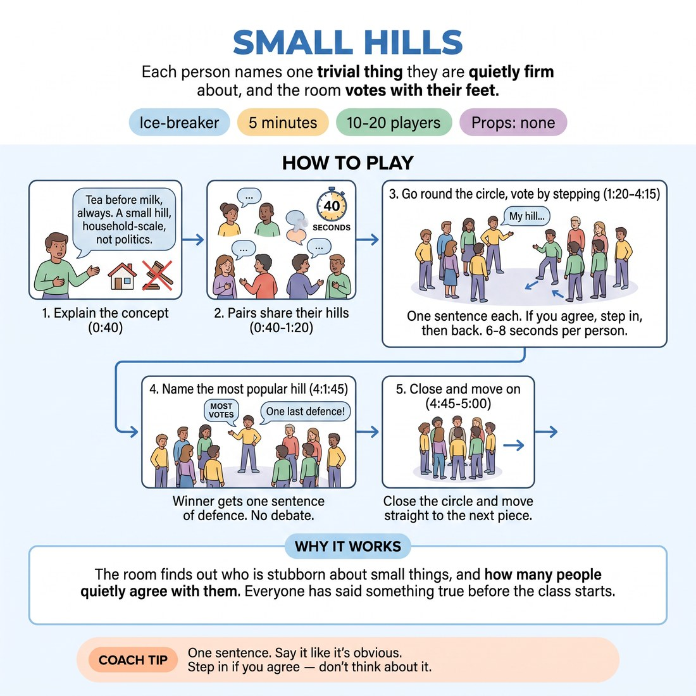

# 🧊 Ice-breaker — Small Hills

{ .infographic }

> Each person names one trivial thing they are quietly firm about, and the room votes with their feet.

`Players 10–20` · `~5 min` · `Complexity 1/5` · `Energy medium` · `Contact none` · `Props: none`

⬅️ [Back to the Week 05 run-sheet](../week-05.md)

## Why this activity, here

Week five is about weaving — callbacks, mapping, theme. Before they can reincorporate anything on stage, they need a shared pool of concrete, odd, specific detail sitting in the room's memory. This block builds that pool in five minutes and marks which items landed hardest, so later blocks have material to plant and pay off. It also warms the voice: everyone speaks twice before any scene starts.

## What students actually learn

- Specific and small beats general and large — a hill about biscuit storage lands harder than a hill about kindness.
- Their own preferences are usable material, not private business.
- A room can register agreement physically and instantly, without discussion — the same reflex that makes a callback land.

## Setup

Open floor, one circle, everyone standing with room to take a full pace inwards. No chairs in the ring. Nothing to hand out. Have your own hill ready before the room arrives — pick something domestic and mildly ridiculous. Know which door you are running the next block from so the close is clean.

## How to run it — 5 minutes

| Min | What you do |
|---:|---|
| 1 | Circle up standing. Define a small hill and give yours in one sentence. State the boundary out loud: household scale, not politics, not opinions about groups of people. Take no questions. |
| 1 | Everyone turns left and tells that person their hill. All pairs at once. Call time at forty seconds. Use the remaining twenty to reset the circle and restate the step-in rule. |
| 2 | Go round the circle. One sentence each. After each, anyone who agrees steps in one pace and steps straight back. Keep the rhythm brisk — cut anyone who starts explaining. |
| 1 | Name the hill that drew the most people. Give that person one sentence of defence, no reply from the room. Tell everyone to hold two hills that were not their own. Move on. |

## Side-coaching script

| When | Say |
|---|---|
| Setting the boundary in step one | *"Household scale. Nothing anyone could be hurt by."* |
| Pairs are talking and volume dips | *"Twenty seconds. Say it out loud, don't rehearse it."* |
| First few round-the-circle turns | *"One sentence. Then it's the next person."* |
| Someone starts justifying their hill | *"That's the hill. Next."* |
| Steps in are hesitant or half-hearted | *"Full pace in, full pace back. Commit or stay."* |
| A hill draws a big surge inwards | *"Mark that one. That's a callback."* |
| The round is dragging past pace | *"Faster. Six seconds each."* |
| Closing | *"Hold two that weren't yours. You'll want them later."* |

!!! success "What good looks like"
    The circle sounds like a metronome — sentence, step, step back, next. Hills are absurdly specific: the direction of the loo roll, the correct number of pillows, never reheating rice. People laugh in recognition, not at anyone. Two or three hills pull half the room in and the room notices it happening. Nobody has argued. You finish inside five minutes and the next block starts warm.

## When it goes wrong

| You see | What's causing it | The fix |
|---|---|---|
| Someone offers a hill about politics, religion or a group of people, and the step-in becomes a poll on beliefs. | The boundary was stated once and quietly. In a new room, people reach for what they feel strongly about rather than what is trivial. | Say "too big — give me a kitchen one" and take theirs immediately. Do not run the step-in on it. Repeat the boundary to the circle before continuing. |
| Turns stretch to twenty seconds each with anecdotes attached, and the round overruns badly. | You demonstrated with a story instead of a sentence, so the group copied the length. | Cut in with "one sentence" on the next two turns. Model the length again yourself. Consider dropping the defence step to recover the time. |
| Almost nobody steps in for anything. | The group is early-morning cold and the physical vote feels exposing without warm-up. | Step in yourself, obviously and fully, on the next two hills. Say "full pace, then back" once. Physical permission spreads faster than instruction. |
| The circle turns into cross-talk — people answering each other's hills. | A hill was contentious enough to invite reply, and you left a gap. | Name the next person immediately rather than waiting. Close gaps with "next" before anyone can fill them. |

## Scaling

| Class size | What changes |
|---|---|
| **10–13** | One circle. Full version as written — pairs, full round, defence. You will have thirty seconds spare; use it to name two hills rather than one. |
| **14–17** | One circle, but cut turns to six seconds and call "next" yourself to keep the round moving. Skip any pause between the round and naming the winner. |
| **18–20** | Split into two circles of nine or ten for the round-the-circle section, each with its own step-in vote. Run them simultaneously. Reconvene for the last minute; take one winning hill from each circle, one sentence of defence each. |

## Variations

**Hands, not feet** — Replace the step in with a raised hand. Everyone stays put.  
*Easier — works in a cramped room, and lowers the exposure for anyone who finds moving on cue uncomfortable.*

**Hill and reason** — Each person gives the hill plus a four-word reason. "Milk after. Scalds the leaves."  
*Harder — the compression forces a choice about what actually justifies the position, and gives richer callback material.*

**Steal the hill** — After the round, each person names someone else's hill they now intend to adopt.  
*Different emphasis — shifts from self-disclosure to listening and attribution, which is the skill reincorporation actually runs on.*

## Debrief

1. **Which hill do you still remember, and why that one?**
   > *A good answer sounds like:* They name someone else's, and can say what made it stick — usually a concrete detail or an unexpected surge of agreement. Not "they were all good."

2. **What made a hill pull people in?**
   > *A good answer sounds like:* Something like "it was so specific I hadn't realised I felt it too." They connect the size of the detail to the size of the response. Move on once someone says specificity.

!!! warning "Safety & inclusion"
    No contact. The step in is one pace towards the centre with space either side — check the ring is wide enough before starting. Anyone who prefers not to move can raise a hand instead; say this in the setup, not as an afterthought. Hold the household-scale boundary firmly: it exists so nobody is asked to declare a belief in front of a room they met an hour ago. Anyone who cannot think of a hill may pass and offer one later; do not chase them. Chairs stay available at the circle edge for anyone who needs to sit.

## Why it works

Reincorporation needs something to reincorporate. This block manufactures a shared inventory of concrete, specific, slightly absurd details and stamps each one with a visible measure of how much the room responded to it. When a later scene plants "milk after the tea" and pays it off in the third beat, it lands because the room already owns that detail and already knows it got a laugh. The physical vote does the marking — it converts private recognition into public data that everyone in the room can see and remember. That is the cue in miniature: structure becomes a punchline when the return arrives at something the audience already invested in.

[Open the full activity card »](../../library/icebreakers/IB__small-hills.md){target=_blank rel=noopener}
