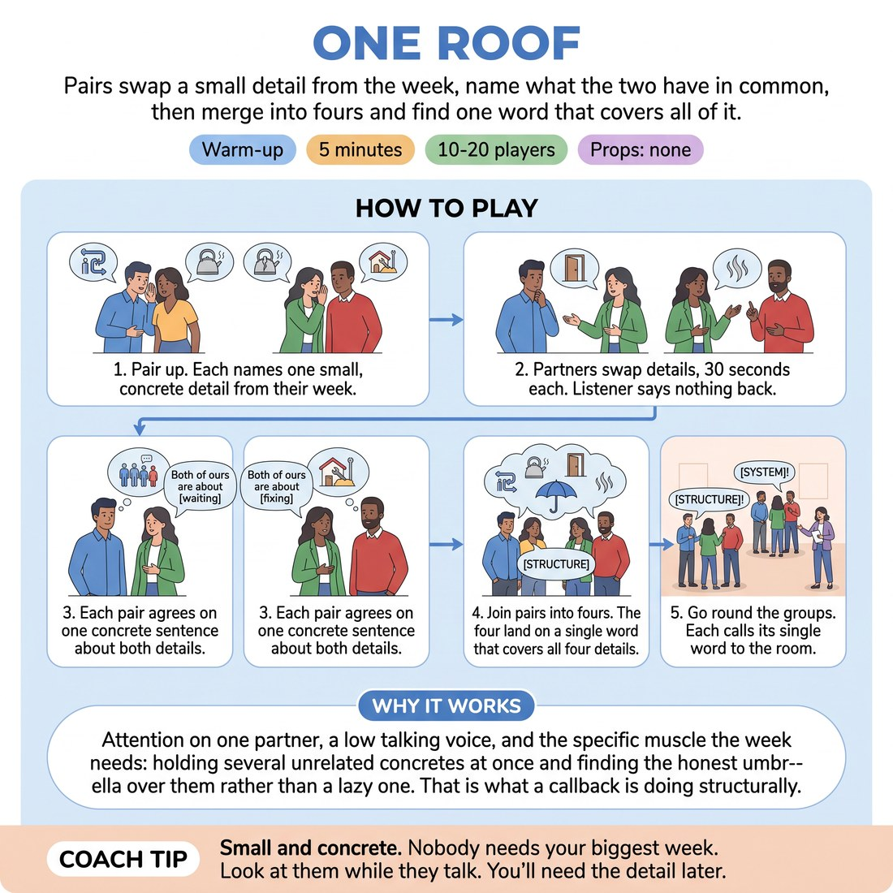

# 🔥 Warm-up cluster — One Roof

{ .infographic }

> Pairs swap a small detail from the week, name what the two have in common, then merge into fours and find one word that covers all of it.

`Players 10–20` · `~5 min` · `Complexity 2/5` · `Energy low` · `Contact none` · `Props: none`

⬅️ [Back to the Week 05 run-sheet](../week-05.md)

## Why this activity, here

Week 5 is weaving. Before they hunt callbacks and theme inside a form, they need the underlying move: holding unrelated material side by side until a covering word appears. This warm-up runs that move on their own week, where the material is free and nobody has to invent it. It feeds the mapping and theme work later in the session, and it primes the cue — reincorporation is the punchline of structure — by making the group feel a shared word arrive as a small payoff.

## What students actually learn

- They stop treating a detail as finished when it's been said, and start holding it open in case something connects.
- They find that a covering word is discovered by looking, not invented by cleverness.
- They hear how much stronger a concrete word is than an abstract one when it has to carry four things.

## Setup

No chairs, no props. Clear enough floor for pairs to stand facing each other, then merge into fours. Have a timer visible or in hand — this block only works if you cut cleanly. Know your own example in advance: two details of yours and the word that covers them.

## How to run it — 5 minutes

| Min | What you do |
|---:|---|
| 1 | Brief and pair. Give your own two-detail example and the word that covers them, in fifteen seconds. Say 'small and concrete, nothing confessional'. Pair everyone up. Odd number, make one three. |
| 1 | Thirty seconds each way. A describes their detail; B says nothing, just looks. Call 'swap' at the halfway point. Do not let listeners respond. |
| 1 | Each pair agrees one sentence out loud: 'Both of ours are about ___.' One concrete word. Reject abstractions the moment you hear them. |
| 1 | Merge pairs into fours. Four details on the table. Find one word that honestly covers all four. Push them to decide rather than debate. |
| 1 | Round the room, one word per group, no explanation. Name two groups that landed near each other. Say the cue and move to the next block. |

## Side-coaching script

| When | Say |
|---|---|
| As the first describer starts | *"Small. Not important."* |
| When listeners start nodding and replying | *"Say nothing. Just look."* |
| At thirty seconds | *"Swap."* |
| When a pair offers 'life', 'change' or 'people' | *"Too big. Something you could touch."* |
| When fours start negotiating instead of choosing | *"Don't argue it. Pick the word that covers most."* |
| When a four goes quiet with nothing | *"Say the wrong word out loud. Fix it after."* |
| During the round of words | *"Word only. No story."* |
| Straight after the last word | *"Two of you landed in the same place. Nobody planned it."* |

!!! success "What good looks like"
    The room is quiet during the thirty-second tellings, then noisy in the fours. Words called out are things like 'waiting', 'plumbing', 'Tuesday', 'noise' — concrete, slightly odd, clearly earned by all four details. At least one pair of groups lands close enough that the room notices. People are mildly pleased rather than impressed with themselves.

## When it goes wrong

| You see | What's causing it | The fix |
|---|---|---|
| Listeners keep interrupting with 'oh, same' or a story of their own. | Default social reflex; the silence feels rude. | Say it up front as a rule, not a suggestion: the listener's job is looking. Side-coach 'say nothing' on the first breach and it holds. |
| Every group returns 'connection', 'stress' or 'life'. | They're reaching for a word big enough to be safe rather than true. | Reject abstractions the moment you hear them and give a replacement on the spot. 'Not stress — is it deadlines, or is it noise?' |
| Details get long and personal; someone shares something heavy. | 'Something from your week' invites confession if you don't fence it. | Brief 'small and concrete, nothing confessional' every time and model a trivial example. If it happens, thank them briefly, keep the pace, check in at the break. |
| A four is still arguing when time is up. | They're optimising for the perfect word. | Call 'pick the word that covers most' at sixty seconds. Take whatever they have when you go round. An imperfect word is the correct outcome. |

## Scaling

| Class size | What changes |
|---|---|
| **10–13** | Six pairs into three fours. One group of five or a trio if the number is odd. All five minutes as written; the closing round takes twenty seconds. |
| **14–17** | Seven or eight pairs into four fours. Keep the same timings; run the closing round briskly and only name one pair of near-matching words. |
| **18–20** | Ten pairs into five fours. Cut the pair sentence step to forty-five seconds and give the extra fifteen to the closing round, or take words from four groups and name the fifth as 'and yours'. |

## Variations

**Given detail** — You supply the detail on slips — 'a queue', 'a locked door', 'burnt toast' — instead of asking for their week.  
*Easier. Removes the disclosure question entirely and speeds the pairs up. Good with a nervous or brand-new group.*

**Eights** — After the fours have their word, merge two fours and make them find one word covering eight details, in sixty seconds.  
*Harder. The abstraction pressure gets real and they must fight the pull towards 'life' with a much wider spread.*

**Object, not theme** — Instead of a covering word, each four names a single physical object all four details could sit in, on or near.  
*Different emphasis. Pushes them off theme-naming and towards staging — useful straight before mapping work.*

## Debrief

1. **Which word arrived first, and did it come from arguing or from looking?**
   > *A good answer sounds like:* Someone says the word appeared once they stopped trying — that a fourth detail suddenly made the other three obvious. That's the reincorporation mechanism named without jargon.

2. **What happened to the word when it had to cover four things instead of two?**
   > *A good answer sounds like:* 'It got vaguer, and worse.' Or better: 'we had to find a more specific one, not a bigger one.' Either shows they felt the abstraction trap. Move on.

!!! warning "Safety & inclusion"
    No contact in this activity. Brief 'nothing confessional' explicitly — it protects people who default to over-sharing and people who freeze at being asked about their week. Anyone who blanks can borrow a detail from the room around them: the radiator, the chairs, the light. Standing is optional; pairs can sit. If someone would rather not speak, let them join a four as the person who says the word aloud. With an odd number, make a three rather than leaving someone out.

## Why it works

Thematic synthesis is not invention, it's recognition under constraint. The activity supplies unrelated material the participants did not choose for its meaning, then forces a single covering term. Because the details are random, no clever theme can be planned in advance — the word has to be found by holding all the material at once, which is the exact cognitive move reincorporation requires in a long-form piece. The merge from two to four adds pressure at the point where abstraction becomes tempting, so the group physically experiences why a concrete covering word carries more than a large vague one. The closing round, where two groups land near each other by accident, demonstrates the cue: the payoff of structure is the moment separate things turn out to share a roof.

[Open the full activity card »](../../library/warmups/WU__one-roof.md){target=_blank rel=noopener}
