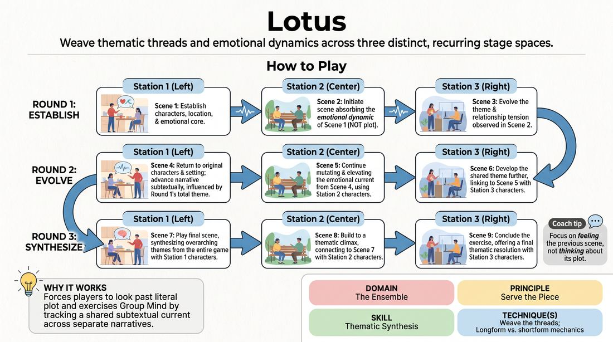

# 🎲 Drill A — isolation — The Lotus

{ .infographic }

> Weave thematic threads and emotional dynamics across three distinct, recurring stage spaces.

`Players 6–99` · `~20 min` · `Complexity 4/5` · `Energy medium` · `Contact none` · `Props: none`

⬅️ [Back to the Week 05 run-sheet](../week-05.md)

## Why this activity, here

Week 5 is about weaving. Earlier blocks in this arc taught players to notice a callback and take it. This drill isolates the harder half: extracting the theme from a scene rather than the props, names and jokes. It feeds the long-form set later in the session, where three-scene structures have to converge without anyone planning them.

## What students actually learn

- They start hearing scenes as emotional weather rather than plots, and can say what a scene was 'about' in four words.
- They stop treating a callback as a repeated object and start treating it as a returning pressure.
- They trust that a scene they left unfinished will be answered by someone else's scene — so they can leave earlier.
- They feel the difference between three separate scenes and one piece.

## Setup

Clear three playing areas with a bit of space between them — stage left, centre, stage right will do, or three corners if the room is square. Chairs pushed back. No props needed. Have three index cards and a pen: after Round 1, each station writes their character names and location on a card and leaves it at their feet. Stand where you can see all three areas and be heard over a scene. Decide your edit signal now — a single clap works better than a shout.

## How to run it — 20 minutes

| Min | What you do |
|---:|---|
| 3 | Split into three groups, send them to stations. Explain the handoff: Centre takes Left's emotional dynamic and plays it with new people. Say the cue. Take no questions about theme — they will find it by doing it. |
| 4 | Round 1. Left opens. Clap the edit at roughly eighty seconds or on the first real peak, whichever comes first. Centre, then Right, same timing. Three scenes, no discussion between them. |
| 1 | Freeze the room. Ask each station for one word for what all three scenes were about. Do not debate the words. Have each station write their character names and location on a card. |
| 4 | Round 2. Same order. Original characters and settings return, story advances. Side-coach for influence, not repetition. Keep the clap coming on the peak. |
| 5 | Round 3. Same order, slightly longer scenes. Tell them it is the last time they will see these people. Let the final Right scene run until it lands, then hold silence for three seconds. |
| 3 | Debrief standing, in the three groups. Two questions, quick answers, no notes. Move on while it still feels unfinished. |

## Side-coaching script

| When | Say |
|---|---|
| Left's opening scene, first fifteen seconds | *"Who are you to each other. Say it in the first line."* |
| Any scene building toward its top | *"Peak — and edit."* |
| Centre begins and starts reusing Left's situation | *"Different job. Same weather."* |
| A station is describing rather than relating | *"Name the feeling, not the plot."* |
| Start of Round 2 | *"Bring your people back. Something has shifted since we left them."* |
| Round 2, when a scene ignores the other stations | *"You heard the other two. Let it show, don't mention it."* |
| Round 3, opening of each scene | *"Last visit. Play the thing you've been avoiding."* |
| Final scene, before you cut | *"Land it. Then hold."* |

!!! success "What good looks like"
    Nine short scenes that feel like one thing. You can hear the same pressure — betrayal, or being outgrown, or wanting permission — arriving in three different households, and it gets heavier each round. Edits land clean; nobody talks between stations. By Round 3 the players are watching each other's scenes properly instead of rehearsing their own. The last scene finishes and the room is quiet for a second.

## When it goes wrong

| You see | What's causing it | The fix |
|---|---|---|
| Centre plays a near-copy of Left — same argument, different hats. | Players hear plot faster than they hear feeling. It is the default. | Call "different job, same weather" mid-scene. If it persists, freeze and ask Centre for one word for Left's scene, then restart Centre from that word. |
| Scenes run three minutes and you only get through Round 2. | You are waiting for a good ending before you clap. | Clap on the rise, not the resolution. Cut mid-sentence if you must. Tell the room in the setup that you will cut them early and it is not a judgement. |
| Round 2 opens and nobody remembers who they were. | Nine scenes is a lot to hold, especially for people new to long-form. | That is what the cards are for. Give five seconds before each Round 2 scene for the station to read their card aloud to themselves. |
| The theme dissolves — three unrelated scenes by Round 3. | Each station is trying to be original rather than connected. | After Round 2, take ten seconds and state the theme yourself in one sentence. Removing the guesswork is worth more than the discovery here. |

## Scaling

| Class size | What changes |
|---|---|
| **10–13** | Three stations of three to four. Everyone plays in every scene. Full three rounds as written; the timings hold comfortably. |
| **14–17** | Three stations of five or six. Only two or three from each group play any given scene — the rest of that station stand behind and watch. Rotate players each round so everybody plays at least twice. Trim Round 3 to sixty-second scenes if you are running late. |
| **18–20** | x |

## Variations

**Two Rounds, Long Scenes** — Cut Round 3. Run two rounds with two-minute scenes and spend the recovered five minutes naming themes aloud between rounds.  
*Easier — fewer transitions to track, more time inside each relationship.*

**Silent Handover** — No side-coached edit. The incoming station decides when to start and simply begins; the outgoing station must drop out mid-line.  
*Harder — the edit becomes a group listening decision, which is what the long-form set needs.*

**One Object, Three Meanings** — Give the room a single physical object at the start — a letter, a key, a coat. It must appear at every station, meaning something different each time.  
*Different emphasis — shifts the work from emotional theme to symbolic reincorporation, and gives concrete-minded players a handhold.*

## Debrief

1. **What was the piece about? One sentence, no plot.**
   > *A good answer sounds like:* "People asking for permission they don't need." Abstract, emotional, and recognisably true of all three stations. If you get a plot summary, ask again once, then move on.

2. **Which other station's scene changed what you played?**
   > *A good answer sounds like:* A specific moment — "they went quiet after the accusation, so we stopped shouting." Vague agreement means they were not watching; note it and go.

3. **What did you want to add in Round 3 that you didn't?**
   > *A good answer sounds like:* Naming a risk they saw and skipped — a confession, a departure. That is the note for the set later, and it should sting slightly.

!!! warning "Safety & inclusion"
    No contact is required at any point; if a scene reaches for a hug or a grab, coach it into words. Nobody has to invent a theme alone — the group finds it. Anyone who prefers not to play can hold the cards and watch for their station, which is real work here, and can join a later round without comment. Themes will drift toward loss and family; say up front that anyone can steer their own scene elsewhere and no one owes the room a personal story. Standing throughout — offer chairs at each station.

## Why it works

Reincorporation is the punchline of structure because the audience is quietly tracking a pattern and gets paid when it closes. This drill forces the tracking to happen out loud. By banning plot copying, it strips away the easy version of a callback — the repeated word — and leaves only the emotional pattern, which is the thing that actually accumulates. Fixed stations mean each group must return to the same people three times, so the theme has to deepen rather than restart. And because nobody controls all three threads, players learn to hand a pattern over and trust its return, which is the exact muscle a thirty-minute form runs on.

[Open the full activity card »](../../../../games/D4_P3_S5_T2_G1160__lotus.md){target=_blank rel=noopener}
