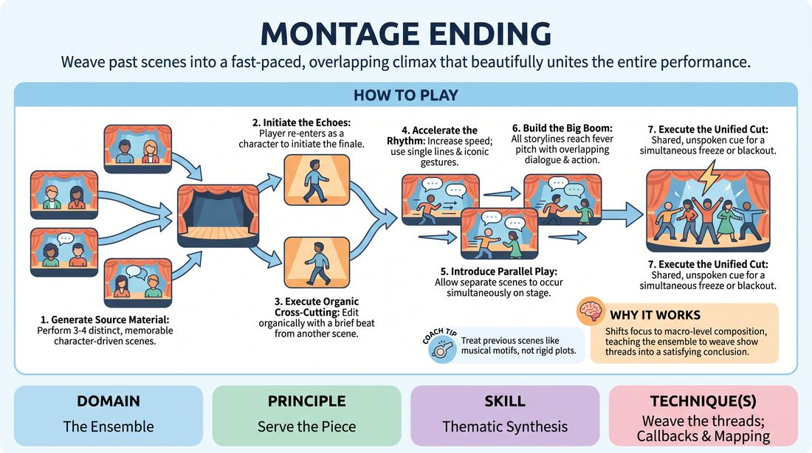

# 🎲 Drill B — under load — The Crescendo Finale

{ .infographic }

> Weave past scenes into a fast-paced, overlapping climax that beautifully unites the entire performance.

`Players 3–99` · `~20 min` · `Complexity 4/5` · `Energy high` · `Contact none` · `Props: none`

⬅️ [Back to the Week 05 run-sheet](../week-05.md)

## Why this activity, here

Week 5 has already drilled the single callback and the mapped pattern. This is the same skill under time pressure and crowd noise: not one thread returning, but every thread returning at once. It feeds the second-half run directly — most groups can find a callback but collapse at the ending, and this gives them a physical template for how a piece stops.

## What students actually learn

- That an ending is made of material the audience already owns, not new material introduced late.
- That taking focus is a physical act — step forward, start speaking — and needs no negotiation.
- That a callback shrinks as the piece accelerates: full beat, then line, then gesture, then a look.
- That an ensemble can agree on a final instant without anyone speaking, if everyone is watching the same energy.

## Setup

Clear floor with a defined back edge — a taped line, chair backs, or the wall. Everyone stands on it when not in the scene. No chairs in the playing space. You need a clear sightline to all players so you can raise a hand for the cut. Nothing else. If the room is echoey, warn the neighbours: the last thirty seconds are loud.

## How to run it — 20 minutes

| Min | What you do |
|---:|---|
| 2 | Split into three casts. Tell each to prepare nothing — they will improvise. Explain only that whatever appears in the next four minutes is the material for the ending. Send them to the back edge. |
| 4 | Run three source scenes back to back, ninety seconds each, cutting hard on time. Side-coach for one repeatable line and one physical habit per player. Do not let scenes resolve. |
| 3 | Run the echo pass at full length. One player at a time re-enters, plays eight to ten seconds of their scene, then yields when another steps forward. Circulate focus twice. |
| 3 | Run it again, faster. Single lines and gestures only, no new information. Call "shorter" every fifteen seconds until returns are two words or one movement. |
| 3 | Add parallel play. Two or three threads share the space, then all of them, then full volume for five seconds. Cut with your raised hand. Hold the freeze three seconds. |
| 3 | Reset and run the whole finale once more, unbroken, from first echo to cut. Take your hand out of it — the ensemble finds the button alone. |
| 2 | Debrief standing. Two questions, short answers, no notes. Move straight on. |

## Side-coaching script

| When | Say |
|---|---|
| During the three source scenes | *"Give me a line you could say again."* |
| First echo pass, players hesitating at the edge | *"Step out. Don't ask."* |
| Second pass, returns still too long | *"Bring the line, not the scene."* |
| Anyone starts inventing new plot | *"Nothing new. Only what we've seen."* |
| Transitions dragging | *"Cut faster. Overlap."* |
| Entering parallel play | *"Same air now. React across."* |
| At the peak | *"Everything, all of it, now."* |
| The instant before the cut on the final run | *"Together — stop."* |

!!! success "What good looks like"
    By the last run the returns are tiny — a hand gesture, three words, a repeated sigh — and the room still recognises every one of them. Threads overlap without anyone shouting over anyone. The final five seconds are loud but legible: you can pick out three storylines inside the wall of sound. The freeze lands within half a second across the whole group and holds. Someone laughs afterwards from recognition rather than relief.

## When it goes wrong

| You see | What's causing it | The fix |
|---|---|---|
| Six people step forward at once on the first echo and nobody yields. | They read "fast" as "simultaneous" and skipped the sequential pass. | Stop it. Reset to the back edge. Run twenty seconds of strict one-at-a-time, calling each name before they step out, then release it. |
| Players return as their character but say something new — a fresh joke, a new revelation. | Habit from scene work, plus the belief that repetition is boring. | Call "nothing new" and mean it. Tell them the audience's pleasure is recognition, and that repeated material gets funnier, not thinner. |
| The peak is undifferentiated shouting and nobody can hear a thread. | Volume is being used as a substitute for commitment; everyone hit maximum at once from the start. | Rerun the peak at half volume with full physical size. Then let volume rise only in the final three seconds. |
| The ending trails off — two people freeze, three keep going, someone says "is that it?" | No one is watching the group; they're all inside their own thread. | Coach peripheral vision explicitly. On the next run, tell them the cut is the only thing they must all be watching for. Reinstate your hand signal if needed. |

## Scaling

| Class size | What changes |
|---|---|
| **10–13** | Three source scenes, casts of three or four, one ensemble, everyone plays throughout. Timings as written. |
| **14–17** | Four source scenes of seventy seconds each in the generate phase. Cast sizes of four. The extra thread makes the parallel section denser — trim the second echo pass by thirty seconds and give it to the final run. |
| **18–20** | Two companies of nine or ten in opposite halves of the room. |

## Variations

**Conducted** — You point at who is up. Nobody steps forward uninvited. Point faster and faster until the pointing can't keep pace, then release it into parallel play.  
*Easier — removes the focus-taking decision so they can concentrate purely on recalling material fast.*

**Blind button** — No hand signal, no eye contact permitted during the peak. The ensemble must find the cut by sound and energy alone.  
*Harder — forces genuine group listening rather than watching one person for the signal.*

**Wordless finale** — The whole finale runs on gesture, sound and physical habit only. No dialogue after the source scenes end.  
*Different emphasis — shifts callbacks from verbal to physical, and makes weak physical choices in the source scenes immediately visible.*

## Debrief

1. **Which callback landed hardest, and how long was it?**
   > *A good answer sounds like:* They name something tiny — a two-word phrase, a shrug — and notice it landed harder than the longer returns. If they only name full beats, ask what the shortest thing was that still read.

2. **What told you it was time to stop?**
   > *A good answer sounds like:* Something physical and shared: the volume plateaued, everyone was already at maximum, there was nowhere further up. Not "the teacher raised his hand" — push past that answer.

3. **What would have been missing if you'd invented new material at the peak?**
   > *A good answer sounds like:* Recognition. They articulate that the audience's satisfaction came from already knowing everything on stage, and that new material at the end would have been noise.

!!! warning "Safety & inclusion"
    Parallel play puts bodies in shared space at speed. Say before the first parallel round: no contact, and if someone is heading for you, you give way. The peak is loud — flag it in advance, and tell anyone with noise sensitivity they can play their thread from the back edge at conversational volume, which still works. Anyone who wants out of the crowded section can take the role of watcher on the edge and call the freeze instead; that job is useful, not a sideline. Nobody needs to be funny here — recalling a line accurately is the whole task.

## Why it works

Reincorporation reads as structure because the audience did the setup work themselves without knowing it. This drill compresses the reincorporation window until it is too short to think in. When a player has two seconds to contribute, they cannot construct — they can only reach for what is already stored, which is exactly the material the audience is holding. Speed strips out invention and leaves recall. Then parallel play removes the last crutch, sequential turn-taking, so the only way to stay coherent is to track the whole room rather than your own thread. What starts as a memory task ends as a group-attention task, which is what a real ending requires.

[Open the full activity card »](../../../../games/D4_P3_S5_T2_G1186__montage-ending.md){target=_blank rel=noopener}
