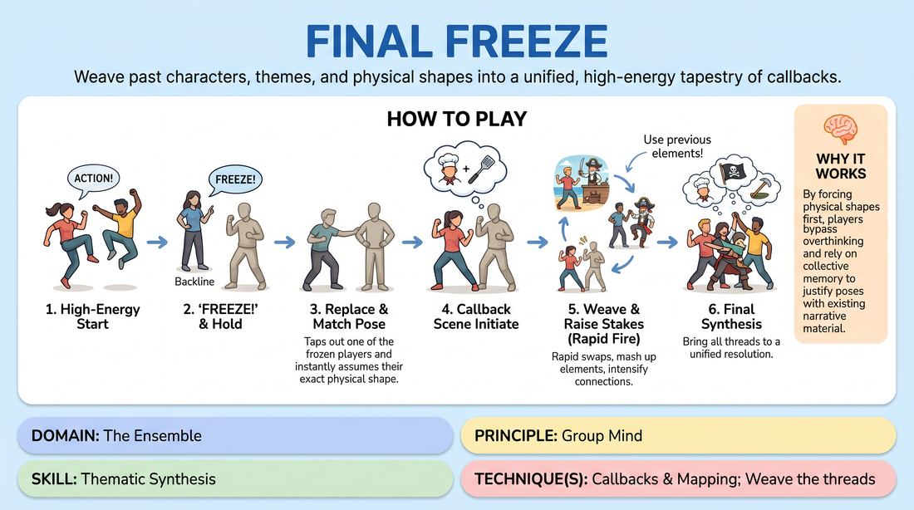

# 🎯 Scene Lab — Synthesis Freeze

{ .infographic }

> Weave past characters, themes, and physical shapes into a unified, high-energy tapestry of callbacks.

`Players 4–99` · `~35 min` · `Complexity 3/5` · `Energy high` · `Contact none` · `Props: none`

⬅️ [Back to the Week 05 run-sheet](../week-05.md)

## Why this activity, here

Week 5 has already taught them to spot a callback and to map one world onto another. Those were slow, deliberate exercises. This one puts the same demand under speed and physical pressure, so weaving stops being a decision and becomes reflex. It feeds directly into the long-form runs later in the session, where nobody has time to plan a reincorporation.

## What students actually learn

- They stop treating a callback as a joke reference and start treating it as a structural move that gives a new scene its footing.
- They learn to read a frozen body and let the shape tell them who they are, rather than deciding first and posing second.
- They build a shared memory of the run — they start tracking what the group has made, not just what they personally said.
- They feel the difference between repeating an element and raising it.

## Setup

Clear a playing area with a back wall the group can line up against. A flipchart or whiteboard on the side, visible from the stage, with a marker. Assign one person as scribe for the first run and swap them in later. No chairs in the space. Ask people to remove watches or anything sharp, and mention that shapes will be copied so nothing above shoulder height needs holding.

## How to run it — 35 minutes

| Min | What you do |
|---:|---|
| 3 | Frame it. Explain the freeze, the tag, the exact-copy rule, and the callback rule. Run the consent check for the shoulder tap and the no-touch alternative. Demo one freeze and tag with a volunteer. |
| 4 | Shapes only. Two players move, someone freezes them, the tagger copies and starts any scene. No callback requirement yet. Aim for six or seven fast tags so everyone sees the mechanic work. |
| 8 | Run A with the callback rule on. First scene from a suggestion. From the second scene onward, the opening lines must reference something already established. Scribe fills the board. |
| 3 | Stop. Read the board aloud. Ask the room which threads are still hanging and mark those with a circle. Swap the scribe. No discussion of quality. |
| 9 | Run B. Same rules, higher demand: each new scene must combine two elements from different earlier scenes. Push tag frequency up. Anyone who has not tagged yet goes first. |
| 5 | Call "Collect the threads." Final stretch. Circled items on the board must all return. Let the last scene run long and end when the room feels it land. |
| 3 | Debrief standing in the backline. Two questions, short answers, no notes. |

## Side-coaching script

| When | Say |
|---|---|
| Opening scene of any run is going static | *"Move. Give us a shape worth stealing."* |
| A freeze is called and players start shifting | *"Freeze means frozen. Hold it."* |
| The tagger takes an approximate pose | *"Copy it exactly. Feet too."* |
| New scene starts with no reference to anything prior | *"First line does the weaving."* |
| A callback is just a name-drop | *"Don't point at it. Use it."* |
| Scenes are re-running an old scene beat for beat | *"Same element, new pressure."* |
| Freezes have gone quiet and a scene is drifting past ninety seconds | *"Backline — take it."* |
| Final five minutes | *"Collect the threads. Bring them in."* |

!!! success "What good looks like"
    Freezes land on genuinely awkward shapes, not on convenient pauses. The tagger's first sentence tells you which earlier scene we are inside, and the pose gets justified in a way nobody planned. The board fills up and the room starts laughing at recognition rather than at gags. By the last three scenes, elements are arriving in pairs and threes, and the final scene contains people and places from across the whole run without anyone announcing it.

## When it goes wrong

| You see | What's causing it | The fix |
|---|---|---|
| Every callback is a line like "Hey, aren't you the pirate from before?" and then the scene goes somewhere unrelated. | Players are treating recognition as the goal. Naming the element feels like completing the task. | Ban the character's name from the first line. Make them bring the behaviour, the location or the relationship instead, and let us work out where it came from. |
| Long silences before scenes start, players scanning the board with visible effort. | The callback rule has become a puzzle to solve rather than a starting point. | Have the tagger call one word from the board aloud as they step in, then start immediately. The choice is arbitrary; the justification is the work. |
| The same three or four confident people call every freeze. | Normal. Quicker people simply get there first. | For Run B, say clearly that anyone who has not tagged yet goes first, and hold the line on it. If it persists, go round the backline in order for six tags. |
| The first two or three scenes of Run A are flat and everyone looks disappointed. | There is nothing to call back to yet. This is structural, not a failure of the players. | Say so out loud before you start. Tell them the first two scenes are raw material and the game does not really begin until scene three. |

## Scaling

| Class size | What changes |
|---|---|
| **10–13** | One backline, one playing area, both runs as written. Everyone will tag at least twice. Keep freezes at ninety seconds so the run does not exhaust the group's material. |
| **14–17** | One backline, one playing area. Tighten freezes to sixty seconds so tag count stays high enough for everyone to enter once per run. Use two scribes swapping at the midpoint — the board fills fast. |
| **18–20** | Split into two groups after the shapes drill. Group one plays Run A while group two watches and scribes, then swap for Run B, cutting each run by two minutes and folding those four minutes into the collect-the-threads stretch. Watching group calls the freezes for the playing group. |

## Variations

**Named thread** — The tagger says one item from the board out loud before stepping in, and must build the scene from that item.  
*Easier — removes the choosing paralysis and guarantees a real callback rather than a vague nod.*

**Blind weave** — Take the board away. Callbacks come from memory only, and a wrong recall stands as canon.  
*Harder — forces active listening across the whole run and stops players outsourcing memory to the wall.*

**Theme freeze** — Callbacks must repeat an idea, not an object. No returning characters, locations or phrases — only the pattern underneath them.  
*Different emphasis — moves the work from reincorporation of detail to thematic synthesis, which is where the session is heading.*

## Debrief

1. **Which callback surprised you — one you didn't plan?**
   > *A good answer sounds like:* Someone describes arriving in a pose, hearing a word, and finding the connection after they had already started speaking. They can name the moment. If answers are all about clever choices made in advance, run one more short round with a shorter freeze interval.

2. **What did the frozen shape give you that a blank start wouldn't?**
   > *A good answer sounds like:* They talk about the body deciding the character — a raised arm becoming an accusation, a crouch becoming fear. Not "it was harder", but a specific example of the pose supplying information.

3. **When did the run start to feel like one thing rather than a set of scenes?**
   > *A good answer sounds like:* They point to a specific scene, usually the fourth or fifth, and describe elements arriving together. That recognition is the whole point of the block — once someone says it, move on.

!!! warning "Safety & inclusion"
    Tagging uses a light tap on the shoulder or upper arm. Before the demo, ask whether anyone would rather not be touched; offer the alternative of stepping into their eyeline and saying "out" clearly, and use it for the whole session if anyone opts in. No player copies a pose that puts weight on another person, involves lifting, or requires kneeling on a hard floor — tell the room to scale any shape to what their body will hold, and that an approximate copy at a comfortable level is fine when the exact one isn't. Nobody has to be funny to tag in; a plain declarative first line is a complete contribution.

## Why it works

Reincorporation is the punchline of structure because the payoff comes from material the audience already owns. This exercise manufactures that condition mechanically. The frozen pose is an arbitrary physical constraint the tagger did not choose, so the mind cannot pre-plan a scene; it must reach for whatever is already available, and the board makes prior material the nearest thing to reach for. Speed removes the option of inventing something new and unrelated. Over eight or nine tags, the run accumulates a shared vocabulary, and every subsequent scene lands harder than the last for a reason that has nothing to do with wit — the group is simply cashing in what it has already deposited. That felt difference between an early flat scene and a late loaded one is the lesson.

[Open the full activity card »](../../../../games/D4_P1_S5_T1_G1065__final-freeze.md){target=_blank rel=noopener}
