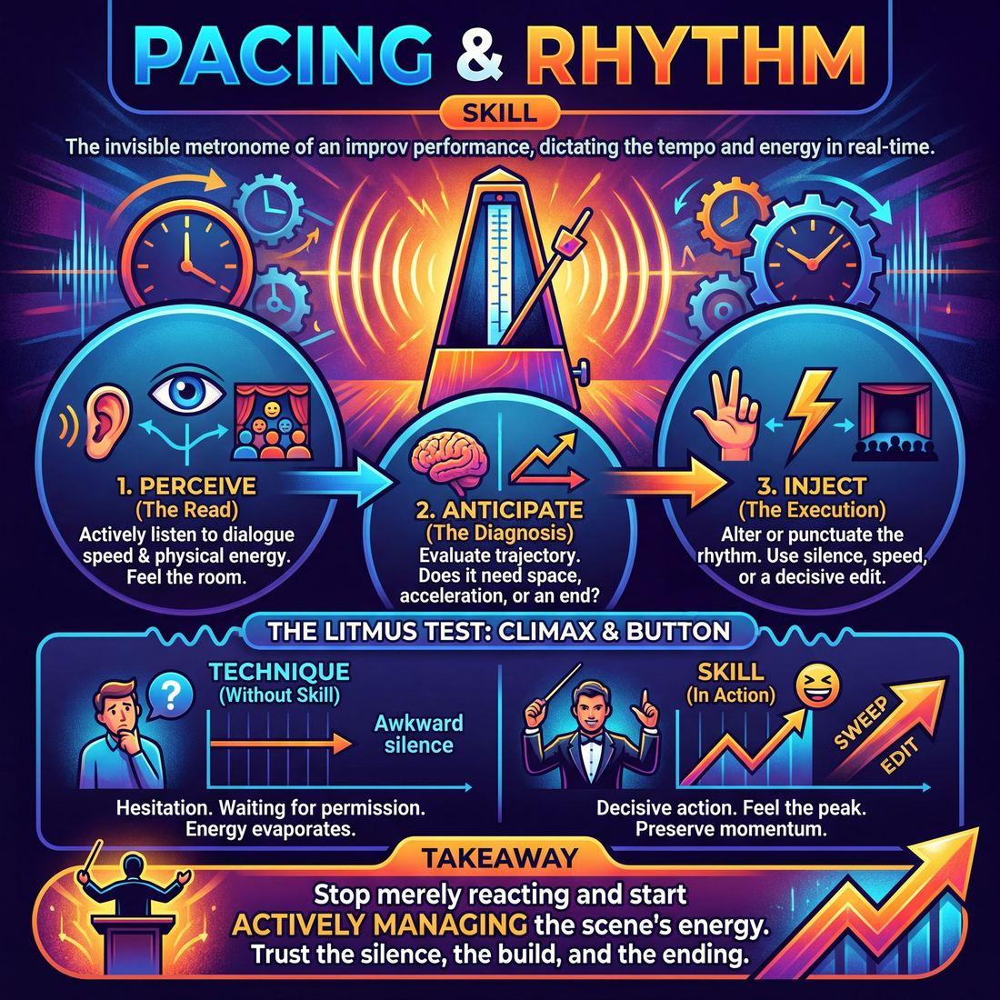

# Week 06 — Pacing, Edits & the Shape of a Set

> *When a scene ends and how long a silence lasts are the two decisions that make a set feel good.*

| Course | Week | Domain | Focus | Stage | Length | Class |
|---|---|---|---|---|---|---|
| The Piece — Long-Form & Audience | 6/8 | D4 | `D4.S4` — Pacing & Rhythm | Competent → Proficient | 180 min | 10–20 |

!!! note "Builds on"
    Week 5 gave them a woven set; this week decides how long each strand is allowed to run.

## 🎬 The arc of this session

They arrive able to build and weave material, and secretly proud of scenes that ran long last week. The session takes the decision about length out of their instincts and puts it in their hands: cut early, hold silence, treat the edit as a compositional choice rather than a rescue. They leave able to end a scene while it is still climbing, sit in five seconds of quiet without flinching, and with the form for the showcase decided by vote.

!!! tip "Watch for"
    The player who has become the group's default editor — the one who claps every time. Today make at least four other people call edits, or the cohort learns that pacing is someone else's job.

## ⏱️ Session flow (180 minutes)

| Time | Block | Activity |
|---|---|---|
| **0:00–0:05** | 🧊 Ice-breaker | *Small Heresies* |
| **0:05–0:10** | 😄 Laughter Blast | *Squabbling Hands* |
| **0:10–0:25** | 🔥 Warm-up cluster | *Redline*, *Say When*, *Count the Gaps* |
| **0:25–0:45** | 🧠 Theory | — |
| **0:45–1:05** | 🎲 Drill A — isolation | *Hold the Air* |
| **1:05–1:15** | ☕ Break | — |
| **1:15–1:35** | 🎲 Drill B — under load | *Follow the Leaver* |
| **1:35–2:10** | 🎯 Scene Lab | *Rapid Backstory Montage* |
| **2:10–2:50** | 🏟️ Showcase round | *One Word, Three Waves* |
| **2:50–3:00** | 💭 Reflection & homework | — |

## 🎒 Before you start

- Clear the floor to one wide playing area with a defined backline. Chairs in a loose arc at the back for observers — you will use observers all day.
- Two stopwatches or two phones with stopwatch apps, charged. Test the sound on any timer you plan to use out loud; you want a soft chime, not an alarm.
- Print the A/B form summaries (one page each) and pin them where everyone can read them during the break. Vote closes today — say so at the top of the session.
- Print or write on the whiteboard the two timing markers you will use all day: EARLY / ON TIME / LATE. You will call these words dozens of times.
- Reread your notes from Week 5. Have two specific examples ready of scenes that ran past their best moment — name the scene, not the person.
- Bring a tally sheet for the showcase: scene number, run time, and whether the edit was called early or late.

## 1. 🧊 Ice-breaker (5 min)

*Stand in a circle. One mildly controversial opinion each, one sentence, no defending it. Go.*

**Why here:** Gets voices in the room and rehearses saying a small thing and stopping, which is the day's muscle in miniature.

### Small Heresies

> A fast round where everyone names one thing the world overrates or underrates, flatly, with no defence allowed.

`Players 10–20` · `~5 min` · `Complexity 1/5` · `Energy medium` · `Contact none` · `Props: none`

**How to play**

1. Put everyone in a circle, standing. Say each person will name one thing that is overrated, or one thing that is underrated. Real opinion, said plainly. Jokes not required.
2. State the two rules now: no defending your choice, and no arguing with anyone else's. Say them once, firmly, so you do not have to police them later.
3. Pair everyone with the person on their right. Tell both partners to talk at the same time, giving each other one overrated and one underrated, roughly ten seconds an item.
4. Call time after a minute. Bring the circle back and pick a starting person.
5. Go clockwise. Each person says 'Overrated:' or 'Underrated:' plus one thing. Five seconds maximum. No reasons, no build-up.
6. Have the group nod once after each offer and move straight on. Allow no comment, no questions, no laughter chase. Say the next person's name if someone starts justifying.
7. Close by asking for a show of hands from anyone who heard something they violently disagreed with. Count the hands out loud. Say nothing more and move to the next block.

📄 **[Full teaching notes »](week-06/advanced_w06__b1_1.md)**

**Side-coach:** *“Full stop. Don't explain it.”*

## 2. 😄 Laughter Blast (5 min)

*Same circle. We're going to build a sound from nothing to boiling and then kill it dead — watch for where the top is.*

**Why here:** Builds a shared rise-and-peak that everyone can feel physically, so the theory block has something to point back to.

### Squabbling Hands

> Everyone turns both hands into bickering puppets and lets them shout nonsense at each other for five minutes.

`Players 10–20` · `~5 min` · `Complexity 1/5` · `Energy high` · `Contact none` · `Props: none`

**How to play**

1. Start without explaining. Make one hand talk — thumb against fingers, squeaky gibberish, full volume. Then hold both hands up and say: copy me.
2. Everyone at once. Left hand argues with right hand in gibberish. Squeaky voices. Nobody watches anybody. Keep your own two hands going the whole time.
3. Call the escalation. The hands are furious now. Louder, faster, more nonsense. They interrupt each other. Keep yours shouting throughout — you never stop to observe.
4. Call the turn. Now the hands find the argument hilarious. Both hands laugh in puppet voices, wobbling. Deliberate at first. It goes real within seconds.
5. Call: turn to the neighbour on your right. Puppets squabble across the gap in gibberish. No touching. Both people talk at once — nobody takes turns.
6. Call: the hands are exhausted. They yawn, slump, fall asleep. Shake both arms out. Ask one debrief question, take two answers, move straight on.

📄 **[Full teaching notes »](week-06/advanced_w06__b2_1.md)**

**Side-coach:** *“That was the top. Notice you all wanted three more seconds.”*

## 3. 🔥 Warm-up cluster (15 min)

*Three warm-ups back to back, five minutes each. Redline first — I'm not explaining all three now, I'll set each one up as we get to it.*

**Why here:** Three short pieces that isolate the day's components: cutting on the rise, calling time, and tolerating gaps.

### Redline

> The room builds a stamping pulse, cuts it dead at the top, and holds the silence before restarting.

`Players 10–20` · `~5 min` · `Complexity 2/5` · `Energy high` · `Contact none` · `Props: none`

**How to play**

1. Stand everyone in a loose circle. Demonstrate the engine: alternate foot stamps, hands slapping thighs on the same beat, shoulders and jaw loose.
2. Offer clapping-only, or thigh-slaps while seated, as an equal option. Say it plainly so nobody has to ask.
3. Start the room at slow walking tempo. Drive it up by degrees until it is near the edge, then clap once. Everyone stops dead.
4. Hold three seconds of silence. Restart slow. Build again, and this time vary the holds: cut and hold one second, then cut and hold eight.
5. Name nothing about the hold lengths. Let them feel the difference in their bodies rather than hear it explained.
6. Hand the cut over. Tell them anyone may clap to stop the room, and anyone may restart it at a tempo of their choosing. Aim for four or five cuts.
7. Build a final time, cut at the top, hold a long silence, then move straight into the next warm-up with no discussion.

📄 **[Full teaching notes »](week-06/advanced_w06__b3_1.md)**

### Say When

> In pairs, one person talks about something ordinary while the other decides the exact moment to cut them — and then holds the silence.

`Players 10–20` · `~5 min` · `Complexity 2/5` · `Energy medium` · `Contact none` · `Props: none`

**How to play**

1. Pair everyone up. Name one person A, one person B. Anyone left over joins a trio and rotates the listener role each round.
2. Tell talkers to speak about something dull and true: the journey in, breakfast, a queue. No stories, no jokes, just plain detail.
3. Tell listeners to watch for a rise — a lift in energy or interest — and raise a flat palm there. Cut mid-sentence, never at a full stop.
4. After the palm, the listener says exactly three words naming why they cut. "Liked that bit." "Getting good there." Then swap roles and reset.
5. Run it both directions. On the third pass, push cutters earlier than feels polite — on the lift, before the story flattens.
6. Add the held beat: after the palm goes up, both hold eye contact in silence for three slow seconds, then the three words land.
7. Finish with a silent pass. Palm only, no words, three seconds of shared quiet. Call the room to stop on the third second.
8. Do not demonstrate cleverness. A cut is a decision about timing, not a judgement about quality.

📄 **[Full teaching notes »](week-06/advanced_w06__b3_2.md)**

### Count the Gaps

> A standing circle counts upward with no leader, and no two silences between numbers may be the same length.

`Players 10–20` · `~5 min` · `Complexity 2/5` · `Energy low` · `Contact none` · `Props: none`

**How to play**

1. Stand the group in one circle, shoulders loose, everyone able to see everyone. Tell them they will count aloud from one as a group.
2. Explain the rule: anyone may say the next number, in any order, with no leader. Two voices at once, or a number out of sequence, sends the count back to one.
3. Run it plain first. Target eight. Call 'from one' the instant it breaks and go again — restarts are normal and cost nothing.
4. Shut down any out-loud strategising. No signals, no rotation systems, no agreements about who takes which number.
5. Add the gap rule: every silence between numbers must be a different length from the silence before it. Long, short, very long, short — never the same twice running.
6. Target eight with the gap rule, then raise it to twelve. Tell them a very long gap is legal and often the strongest choice available.
7. Stop mid-attempt if time runs out. Hold five seconds of shared silence before anyone speaks or the circle breaks.

📄 **[Full teaching notes »](week-06/advanced_w06__b3_3.md)**

**Side-coach:** *“Call it while it's still climbing — you're waiting for permission.”*

## 4. 🧠 Theory — Pacing & Rhythm (20 min)

{ .infographic }

- **The big idea:** An edit is not a rescue. It is a compositional decision about how long the audience is allowed to enjoy something, and the best moment to cut is while the scene is still rising, not after it has peaked.
- **Where you are on the path:** They can already start scenes cleanly and connect material across a set. What they cannot yet do is end something that is going well. Expect resistance framed as generosity — 'I didn't want to cut them off.'
- **The one cue to coach:** *“Cut on the rise. Let the quiet one breathe.”*

**The three beats**

1. **Say it.** Say: a set has a shape, and the shape is made of lengths. Two minutes, forty seconds, a silent tableau, two minutes. Every time you leave a scene running past its top laugh, you flatten the shape. Then: the second half of pacing is the low gear. If everything is loud, nothing is loud. A quiet scene held for thirty seconds buys you the next big one.
2. **Show it.** Take two volunteers. Run one scene twice with a fixed premise. First time, cut it three beats after the biggest laugh. Second time, run the same beats and cut it one beat before. Ask the room which set they would rather watch four more of. Do not explain — let them feel the difference and move on.
3. **Try it.** Everyone in pairs, standing. One partner talks continuously about something ordinary. The other says 'cut' whenever they feel the interest peak. Sixty seconds, then swap. Then run it again with one rule added: after each 'cut', both stand in silence for five seconds before restarting. Most people will break the silence at two.

!!! warning "The misunderstanding that always comes up"
    They hear 'cut early' as 'cut short' and start slamming scenes at twenty seconds. Correct it fast: the instruction is about cutting on the rise, not cutting before there is a rise. A scene needs to establish something before there is anything to cut on.

!!! abstract "📖 Go deeper"
    Read the full write-up: [Pacing & Rhythm](../../../theory/04_the-ensemble/04_S4__pacing-and-rhythm.md)

## 5. 🎲 Drill A — isolation (20 min)

*Pairs on the floor, everyone else on the backline. This one is about the gaps, not the lines — the pauses are the exercise.*

**Why here:** Isolates silence with no other demand, because they will not tolerate a pause under scene pressure until they have tolerated one without it.

### Hold the Air

> Pairs play three-line scenes with an enforced silence before every line, so students get repeated practice at holding a pause in front of watching people without filling it.

`Players 10–20` · `~20 min` · `Complexity 4/5` · `Energy low` · `Contact none` · `Props: none`

**How to play**

1. Put two chairs facing each other at the front. Everyone else sits as watchers. Announce the shape: three spoken lines per scene, shared between the pair, eight words maximum per line.
2. Set the silence rule. While your hand is raised, nobody speaks and nobody moves. A line lands only after your hand drops. Watchers stay silent the whole way through.
3. Stand the whole room up. Hold stillness for thirty seconds, twice. Name the fills out loud as they happen: shifting weight, smiling, scratching, glancing round the room.
4. Demo one scene with a volunteer. Raise your hand five seconds, drop it, take one line, raise it again. Say each urge to fill aloud as you feel it.
5. Run pass one. Pairs take the chairs. Give each pair a two-word relationship. Hold a five-second floor before every line. Cut any scene at ninety seconds.
6. Run pass two with new partners and a ten-second floor. Same three lines, same word cap, same relationship prompt from you.
7. After each pass-two scene, ask watchers to vote: thumb up if something was happening in the silence, flat hand if it was only waiting.
8. Sit everyone down for the debrief. Take answers from watchers first, players second.

📄 **[Full teaching notes »](week-06/advanced_w06__b5_1.md)**

**Side-coach:** *“Hold it. Two more seconds. Don't fill it with a face.”*

## ☕ Break — 10 minutes

Water, notes, informal talk. Non-negotiable at three hours — do not let it collapse into a working discussion.

## 6. 🎲 Drill B — under load (20 min)

*Same skill, now with a scene running and someone else's laugh on the line. Two players in, everyone else edits from the side.*

**Why here:** Puts the edit under load: players must read a scene they are inside and cut it while it is working.

### Follow the Leaver

> Edit scenes dynamically by tracking a single departing character into their next narrative world.

`Players 3–99` · `~20 min` · `Complexity 4/5` · `Energy medium` · `Contact none` · `Props: none`

**How to play**

1. Send two players out. Have them build a grounded scene: two clear characters, a named relationship, a specific place. No gimmicks, no premise games.
2. Tell the rest of the group to stand in a loose ring at the edge of the space, watching, ready to enter.
3. Let any onstage character make a physical exit that the scene justifies — walking out, going home, storming off. Not a magic disappearance.
4. The moment someone exits, have the watchers call 'Follow the leaver!' in one voice. That call is the edit.
5. On the call, everyone still onstage sweeps off immediately. Only the leaver remains, still walking, still in transit.
6. Have the leaver arrive somewhere new, keeping the same name, history and emotional temperature they walked out with.
7. Send one or two watchers in as brand-new characters in that new place. They start a fresh scene with the traveller.
8. Run the chain until you call time. Every scene must end with someone leaving, and the leaver carries the story onward.

📄 **[Full teaching notes »](week-06/advanced_w06__b7_1.md)**

**Side-coach:** *“Late. That edit was three beats late — next one, cut earlier than feels fair.”*

## 7. 🎯 Scene Lab (35 min)

*Groups now. You're building a run of short scenes across time — the note is the ratio of long to short, loud to quiet.*

**Why here:** Applies pacing across a sequence rather than a single scene, so they feel length as a shape and not just an ending.

### Rapid Backstory Montage

> Explode a character's offhand remark into a lightning-fast, chronological sequence of historical snapshots.

`Players 3–99` · `~35 min` · `Complexity 4/5` · `Energy high` · `Contact none` · `Props: none`

**How to play**

1. Send two players to the centre for an ordinary scene. Everyone else stands on the backline, facing in, watching for the moment they are needed.
2. Tell the centre pair to play honestly and slowly. No rush. One of them will drop a claim about their past; the other keeps the scene real.
3. Instruct the pair that within the first minute, one character makes a bold, unestablished claim about their own history — child star, lost fortune, twelve years at sea.
4. Tell the backline: the instant you hear that claim, edit. Sweep or tag in and drop the character at the very beginning of that history.
5. Play three to five micro-scenes, five to ten seconds each, moving forward in time in order. Backline players enter as nameless bystanders, not new storylines.
6. Keep every snapshot on the one character whose past it is. No subplots, no rival protagonists, no jumping backwards in the timeline.
7. Edit between snapshots with a clap, a sweep across the front, or a physical tag-out. The off-stage players call the edits, not the players on stage.
8. When the last snapshot touches the present, edit once more back to the original scene. Both players resume immediately, carrying the weight of what was shown.

📄 **[Full teaching notes »](week-06/advanced_w06__b8_1.md)**

**Side-coach:** *“You've had four fast ones. Give me a slow one before you lose us.”*

## 8. 🏟️ Showcase round (40 min)

*Full form, one go, two observers on stopwatches calling late edits out loud as they happen. Then we vote on A or B and the vote closes.*

**Why here:** The full form under strict timing with external timekeepers, which is the only way to prove edits have actually moved earlier.

### One Word, Three Waves

> A structured long-form set built from a single audience word: three waves of scenes, two group pieces, one shared ending.

`Players 10–20` · `~40 min` · `Complexity 4/5` · `Energy medium` · `Contact negotiated` · `Props: none`

**How to play**

1. Line the cast across the back wall, facing out. They stay visible for the whole set. Pick one host. Everyone else holds still until the form calls them forward.
2. Have the host greet the audience, ask for one ordinary word, repeat it twice, then step back into the line. Hold three full seconds of silence before anyone moves.
3. Run a three-minute opening off the word: spoken images, short physical tableaux, overheard lines. No scenes. The opening ends the moment someone steps out and starts one.
4. Play wave one: three two-handed scenes, unrelated to each other, each pulled from something the opening threw up. End each scene by sweeping across the stage or tagging a player out.
5. Run group piece one: the whole cast builds a three-minute moving picture of one place, idea or ritual already seen. Anyone may start it. Everyone joins within ten seconds.
6. Play wave two: the same three scenes, later in time. Same characters, changed situation. Then run group piece two exactly like the first, built from a different thread.
7. Play wave three: three scenes that collide the earlier threads. Characters from different scenes meet, or one scene's rule invades another. Keep the beats shorter and the edits faster.
8. Close on one final image or line that references the opening word. Host calls the cast forward. Hold the line, bow together, exit.

📄 **[Full teaching notes »](week-06/advanced_w06__b9_1.md)**

**Side-coach:** *“That's a late call — next group, one beat sooner.”*

## 9. 💭 Reflection & homework (10 min)

**Deepen your improv**
1. Think of one scene today you cut early. What did you think you were losing, and what did the set get instead?
2. Where in the set did you feel the low gear working — a quiet beat that made the next scene land harder? What made it possible to hold it?

**Beyond the stage**
3. Where in ordinary conversation do you keep talking past your best point? Name one situation this week where you will stop a beat earlier than feels comfortable.

➡️ **[This week's homework](../homework/HW-ADVW06.md)**

??? note "🎓 Facilitator notes"

    **Timing risks**
    - The warm-up cluster is three activities in fifteen minutes. Set each one up in under forty seconds and cut the third short rather than eating into theory.
    - Scene Lab at 35 minutes will not fit every group at 18-20. Run three groups of six and show two of them, not all three; the third gets side-coached in place.
    - The showcase plus the vote is 40 minutes total. Ring-fence the last eight minutes for the vote or you will not close it today.

    **Failure modes this week**
    - Panic-editing. They over-correct into twenty-second scenes with no content. Call it out the first time and re-state: cut on the rise, and a rise takes about ninety seconds to build.
    - Silence gets performed. Pauses become meaningful staring rather than real stillness. Give them something to do in the pause — a physical task — and it usually resolves.
    - One person edits everything. Assign edit rights explicitly by name in Drill B and the showcase.
    - Cutting a scene with two friends in it who are enjoying themselves. Expect apology after the edit. Ban apologising for edits from Drill B onwards.

    **What good looks like by the end:** By the showcase, edits land at or before the top of the laugh more often than after it, the observers' late-call tally is visibly lower than in Drill B, and at least one five-second silence sits in the set without anyone rushing it. The form vote is decided and recorded.

    **Carry into next week:** Bring the timing tally to next week and name the average scene length out loud. Note who called edits and who never did — next week those people go first.
