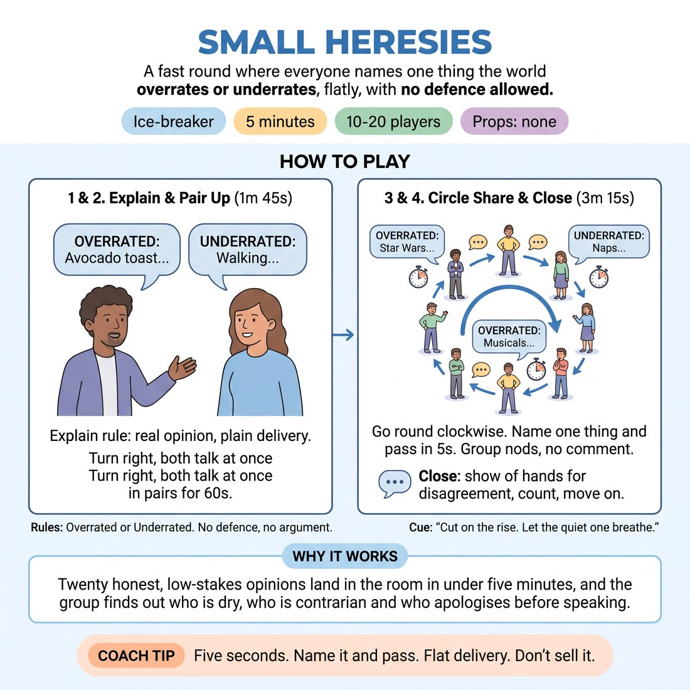

# 🧊 Ice-breaker — Small Heresies

{ .infographic }

> A fast round where everyone names one thing the world overrates or underrates, flatly, with no defence allowed.

`Players 10–20` · `~5 min` · `Complexity 1/5` · `Energy medium` · `Contact none` · `Props: none`

⬅️ [Back to the Week 06 run-sheet](../week-06.md)

## Why this activity, here

Week 6 is about pacing, edits and the shape of a set. This is the first thing they do that morning, and it puts a hard external clock on speech before anyone has to make a scene. Five seconds, nod, next. It also gets every voice into the room within ninety seconds via the simultaneous pair round, so the quieter players are not making their first sound in front of a watching circle. It feeds directly into the edit work later: the group has already felt what it is like for something to be cut while it is still interesting.

## What students actually learn

- That a contribution can end at its strongest point and nothing bad happens.
- That having an opinion in public does not require defending it.
- That a group can hold a pulse, and that a slow speaker breaks it for everyone.

## Setup

Chairs pushed back, one clear standing circle. No props. Know your starting person and your direction before you begin. If the room is over seventeen, mark out where the second circle will stand before people arrive so you are not organising space in the middle of the exercise.

## How to run it — 5 minutes

| Min | What you do |
|---:|---|
| 1 | Circle up. Frame it: one thing overrated, or one thing underrated, said flatly. No defence, no argument. Demonstrate with two of your own, five seconds each, so they hear the length. |
| 1 | Pairs, facing right. Both talk at once. Each gives their partner one overrated and one underrated, ten seconds an item. Loud room. Call time hard at sixty seconds. |
| 2 | Back to the circle. Clockwise round. 'Overrated:' or 'Underrated:' plus the thing. Five seconds. Group nods, next person. Keep it moving; do not let anyone explain. |
| 1 | Finish the lap. Ask for hands from anyone who violently disagreed with something. Count aloud. Do not open discussion. Move on. |

## Side-coaching script

| When | Say |
|---|---|
| Before the pair round | *"Both of you talk. Don't wait for a gap."* |
| Starting the circle lap | *"Two words in, then the thing. Go."* |
| Someone begins explaining why | *"That's the whole offer. Next."* |
| The pace sags mid-lap | *"Faster. Don't audition it."* |
| A quiet player hesitates | *"Take your five. We're waiting."* |
| The group starts commenting or debating | *"Nod only. Keep the wheel turning."* |
| Someone reaches for a laugh instead of an opinion | *"Say the true one."* |
| Immediately after the last person | *"Hands up if you disagreed violently. Good. Moving on."* |

!!! success "What good looks like"
    The lap has an audible pulse — offer, nod, offer, nod — and you could tap along to it. Nobody explains. A few offers get a surprised laugh and the group moves on anyway. At least one person says something genuinely unpopular and the room does not stop. The whole thing ends while people still have more they wanted to say.

## When it goes wrong

| You see | What's causing it | The fix |
|---|---|---|
| The round stalls every third person while someone hunts for a good answer. | They are trying to be interesting rather than honest, because they think the offer is being judged. | Cut in with 'Underrated: sleep. See, boring is fine.' Then restart the lap from the next person. Boring examples give permission faster than instructions do. |
| Cross-talk breaks out — people agreeing, adding, joking about someone's choice. | You stated the no-comment rule once and did not enforce it on the first breach. | Name the next person immediately over the top of the chatter. Do not explain the rule again. Two enforcements and the room self-corrects. |
| An offer lands on politics, religion or someone's body, and the room tightens. | No content boundary was set at the top. | Say 'Nothing about people in this room' as part of the frame next time. In the moment, nod once, move on fast, and do not make it a discussion. |
| The lap overruns and you are two minutes into the next block. | Twenty people at five seconds plus hesitation is more than two minutes. | With eighteen or more, split into two circles from the start. Drop the hands count to a single raised-hand sweep if you are behind. |

## Scaling

| Class size | What changes |
|---|---|
| **10–13** | One circle. The lap runs comfortably under ninety seconds, so add a second quick lap — underrated only, three seconds each — before the closing hands count. |
| **14–17** | One circle, strict five-second cap, one lap only. Start the lap the moment pairs break; do not wait for the room to settle. Cut your own demo to one example. |
| **18–20** | Two circles of nine or ten running at the same time. Nominate a timekeeper in each and stand between them. Both laps run simultaneously for two minutes, then reconvene as one group for the hands count. |

## Variations

**Category given** — Name the field before the lap — food, transport, weekends, films. Everyone's offer must sit inside it.  
*Easier. Removes the blank-page pause and speeds the lap up noticeably.*

**No repeats, three seconds** — Drop the cap to three seconds and rule out any subject already named. Anyone who stalls says 'pass' and the lap continues without them.  
*Harder. Forces listening across the whole circle while still producing under a clock.*

**Contradiction lap** — Second lap: each person must overrate something the previous person underrated, or the reverse, and still take only five seconds.  
*Different emphasis. Shifts from producing to hooking onto what was just said — useful ahead of edit work.*

## Debrief

1. **Which was harder — the pairs or the circle?**
   > *A good answer sounds like:* Someone names the circle and says why: being heard, being timed, or not being allowed to explain. If two people say the pairs were harder because of the overlap, that is also fine. Move on after three answers.

2. **What happened to the ones you cut short?**
   > *A good answer sounds like:* 'It was still fine' or 'I wanted to keep going.' You are listening for the recognition that stopping early left energy behind rather than killing it. Do not extend this — one sentence and go.

!!! warning "Safety & inclusion"
    No physical contact. Set one content boundary in the frame: nothing about anyone in the room, and nothing aimed at a group of people. Passing is allowed at any point in the lap and costs nothing — say so before you start. Nobody has to justify a pass. The pair round is loud and overlapping, which can be hard for anyone with hearing difficulty; offer those participants the option of taking turns rather than talking at once, and place them away from the noisiest corner.

## Why it works

Pacing is learned in the body before it is understood in a scene. The five-second cap moves the decision to stop out of the speaker's hands and into the structure, so ending on the rise costs nobody anything — they did not choose it, the clock did. Repeat that twenty times in a circle and the group builds a shared felt sense of when a unit is complete. The no-defence rule strips out the justifying that normally pads speech, which is the same padding that flattens scenes. And the simultaneous pair round means every voice, including the quiet one, has already been used out loud before the circle looks at anyone, so the lap runs on rhythm rather than nerve.

[Open the full activity card »](../../library/icebreakers/IB__small-heresies.md){target=_blank rel=noopener}
