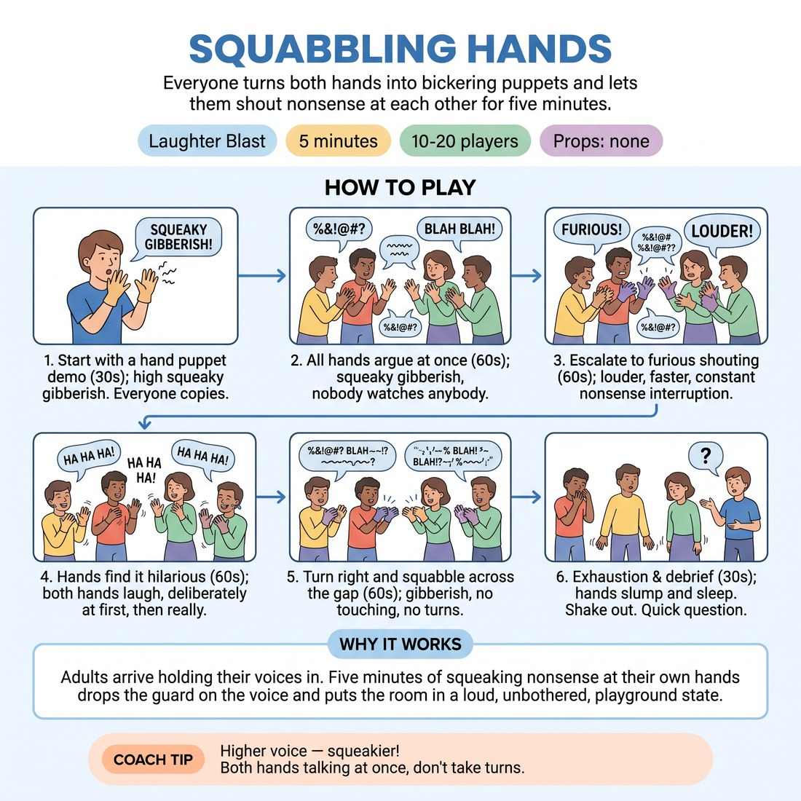

# 😄 Laughter Blast — Squabbling Hands

{ .infographic }

> Everyone turns both hands into bickering puppets and lets them shout nonsense at each other for five minutes.

`Players 10–20` · `~5 min` · `Complexity 1/5` · `Energy high` · `Contact none` · `Props: none`

⬅️ [Back to the Week 06 run-sheet](../week-06.md)

## Why this activity, here

Opens Week 6, the session about pacing, edits and where a set peaks. Everything after this is analytical — mapping a set's shape, timing edits, sitting on a slow scene. This buys you five minutes of noise and full-volume nonsense first, so the room arrives in its body before it arrives in its head. It also plants the week's cue physically: you feel the escalation rise, and then you feel it cut.

## What students actually learn

- Escalation has a felt shape — you notice the moment your own hands hit the top, which is the same moment an edit wants to land.
- Talking over someone at full volume is survivable and often warmer than taking turns.
- Nonsense at volume costs nothing. The voice loosens before anyone has to be interesting.

## Setup

No props, no chairs moved. Standing is better; seated works if the room is tight. Get everyone in a loose circle or just standing where they are, arms free, a metre of space each. You need to be visible to all of them and audible over a room of shouting puppets — stand where you can be seen, not in the middle.

## How to run it — 5 minutes

| Min | What you do |
|---:|---|
| 1 | Demonstrate with no preamble: one hand talking, squeaky, loud. Then both hands up — copy me. Everyone starts their own two hands arguing in gibberish. Nobody watches anybody. |
| 1 | Call the escalation. Furious hands. Louder, faster, interrupting. Keep calling volume up. You keep your own hands going so nobody has an audience to perform for. |
| 1 | Call the turn: the hands find it hilarious. Both hands laughing in puppet voices, wobbling. Push through the awkward deliberate laughter — it converts to real laughter fast. |
| 1 | Call: turn right, squabble across the gap. No contact. Both people talk at once, no turn-taking. Let it peak, then cut it while it is still rising. |
| 1 | Call exhaustion — yawning, slumping, hands asleep. Shake both arms out. Ask the debrief question, take two answers only, name the cue, move to the next block. |

## Side-coaching script

| When | Say |
|---|---|
| As you demonstrate, before any instruction | *"Copy me. Don't ask why."* |
| Ten seconds into the first argument, when volumes are polite | *"Twice as loud. Nobody can hear you but the room."* |
| Calling the escalation | *"Furious now. Interrupt yourself."* |
| If people slow down to look around | *"Eyes on your own hands."* |
| Calling the laughter turn | *"Fake it. It'll go real."* |
| Turning to the neighbour | *"Both at once. Nobody waits."* |
| At the peak of the pair squabble, cutting early | *"Exhausted. Yawn. Slump."* |
| Shaking out | *"Arms out. Breathe. That's the shape of a rise."* |

!!! success "What good looks like"
    The room is loud enough that you have to shout your calls. Faces are pink. Several people are laughing for real by the fourth minute, not performing laughing. Nobody has stopped to check whether they are doing it right. When you cut to exhaustion, there is an audible drop and then a settling breath. People are still holding their hands up for a second after you stop, slightly surprised.

## When it goes wrong

| You see | What's causing it | The fix |
|---|---|---|
| Polite mumbling. Hands moving but no sound above conversation level. | You explained instead of demonstrating, so they are thinking about the rules rather than copying a picture. | Stop the room. Do it yourself, absurdly loud, for five seconds. Say copy me. Restart. Do not add words. |
| People watching each other and half-smiling instead of playing. | They have decided this is a performance and are waiting to see the good version first. | Call "eyes on your own hands" and keep your own hands going at full volume the whole block. If you stop playing, you become the audience. |
| The laughter section stays hollow and stops after fifteen seconds. | Deliberate laughter feels embarrassing and people quit before it turns. | Push volume, not sincerity. "Fake it, keep going" and wobble the hands harder. It usually flips at twenty to thirty seconds. If it doesn't, cut early to the neighbour turn. |
| A pair drifts into an actual scene with words and turn-taking. | Habit — improvisers reach for dialogue. | Call "gibberish only, both at once" across the room. Do not single them out. |

## Scaling

| Class size | What changes |
|---|---|
| **10–13** | One circle. Run the timings as written. In the neighbour section everyone has a partner; if you have an odd number, take one yourself so nobody is spare. |
| **14–17** | One circle still, but stand at the edge rather than the centre so your calls carry. Add five seconds of volume-pushing to the escalation minute and take it off the exhaustion beat. |
| **18–20** | Break the standing circle — let them cluster in a loose block facing you, which keeps everyone within earshot. In the neighbour section, tell them to turn right and accept whoever is there; groups of three are fine, all three talking at once. Take two answers in debrief, not three, or you will lose a minute. |

## Variations

**One hand only** — Each person's single hand argues with an invisible opponent in the air. No second hand, no partner section — extend the escalation and laughter minutes instead.  
*Easier. Less coordination, less to think about, and no facing another person, which helps a nervous group.*

**Conductor volume** — You raise and lower a flat hand. Everyone's puppets track it exactly — whisper at the floor, full shout overhead. Take them up and down three times before the laughter turn.  
*Harder. They have to hold the nonsense and watch an external rhythm at the same time.*

**Squabble to agreement** — After the furious minute, call that the hands suddenly agree with each other — enthusiastic gibberish, nodding, same side. Then laughter, then exhaustion.  
*Different emphasis. Puts the turn on a status shift rather than volume, and previews how a scene changes gear without stopping.*

## Debrief

1. **Where did it stop being deliberate?**
   > *A good answer sounds like:* Somebody names a specific moment — "when the laughing went real", "when I stopped hearing myself". Any concrete moment is enough. Take two answers and move.

2. **What did you notice about the point I cut it?**
   > *A good answer sounds like:* Someone says it was still going up, or that they wanted more. That is the cue landing. Say the cue out loud — cut on the rise — and go straight into the next block.

!!! warning "Safety & inclusion"
    No contact at any point, including the neighbour section — say "no touching" out loud when you call the turn. This is a loud block: warn the room before you start that volume is coming, and tell anyone with sound sensitivity that they can play at their own volume or step to the edge of the room and keep their hands going there. Nobody is asked to be funny or to be watched alone. Hand or wrist pain — play with a fist, a nod, or the voice only. Seated play is fully equivalent; do not make standing a condition. Check the corridor if there are other classes nearby.

## Why it works

Pacing is usually taught as an observation skill — watch the scene, spot the peak, edit. That is slow to learn because the peak is being judged from outside. Here the escalation happens inside the participant's own hands and voice, so they feel the rise in their own breath and volume rather than assessing it. Then you cut while it is still climbing. The cut lands as a bodily sensation of interruption, not a note. That contrast — felt rise, imposed cut — is the whole of "cut on the rise", installed in five minutes before any discussion of set shape. The unison design also removes performance pressure: with twenty people shouting nonsense at once there is no audience, so the volume needed for the rise is available immediately.

[Open the full activity card »](../../library/laughter/LB__squabbling-hands.md){target=_blank rel=noopener}
