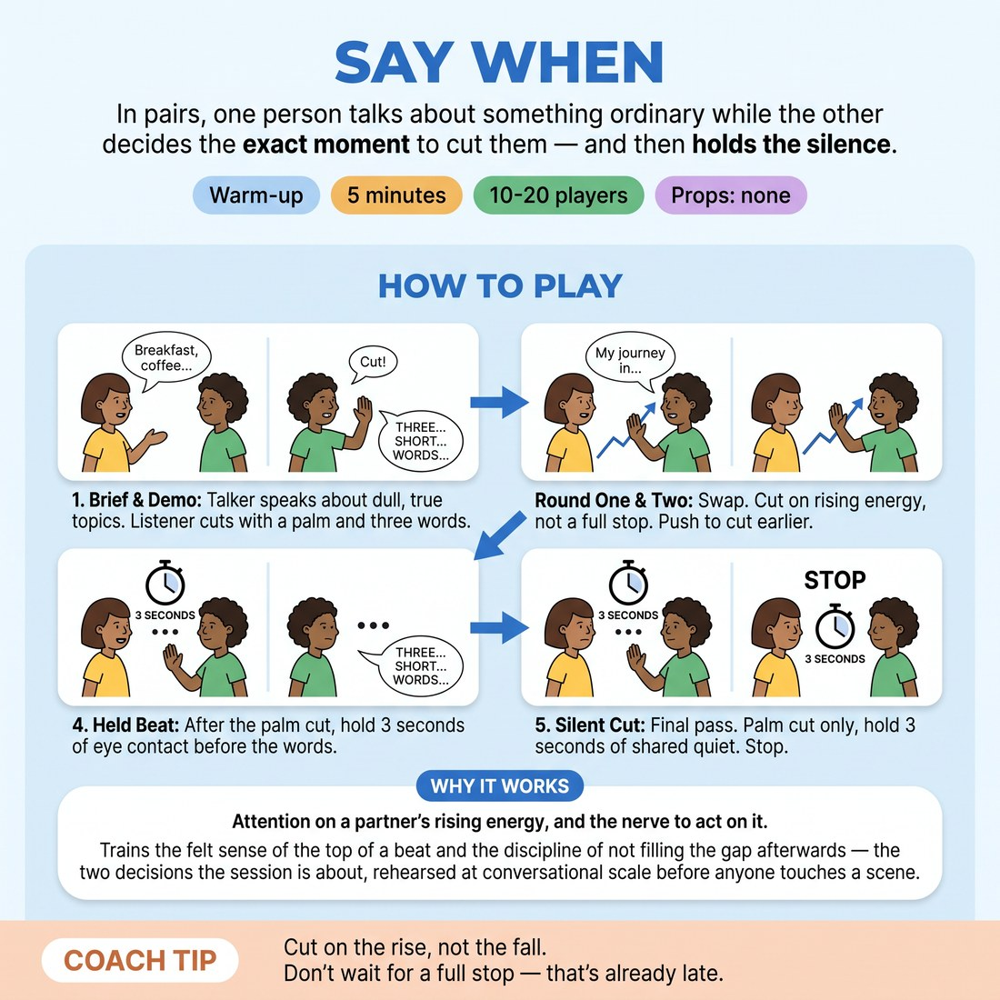

# 🔥 Warm-up cluster — Say When

{ .infographic }

> In pairs, one person talks about something ordinary while the other decides the exact moment to cut them — and then holds the silence.

`Players 10–20` · `~5 min` · `Complexity 2/5` · `Energy medium` · `Contact none` · `Props: none`

⬅️ [Back to the Week 06 run-sheet](../week-06.md)

## Why this activity, here

Week 5 gave them edits as a mechanical skill — how to step in and end a scene. This warm-up moves the decision from 'can I edit' to 'when'. It isolates the timing judgement from all scene content, so the rest of the session can spend its attention on shape. It feeds directly into the long-form runs later in the block, where they will edit each other's scenes live.

## What students actually learn

- They stop waiting for a scene to end and start choosing where to end it.
- They feel the difference between cutting on a rise and cutting on a fade — in the body, not as a note.
- Silence after a decision stops being an emergency.
- They can name a cut in three words, which makes editing discussable instead of mystical.

## Setup

Standing room, pairs spread out so voices overlap without drowning each other. No chairs, no props. Pairs face each other at conversational distance. Say up front that no one touches anyone: the palm is a signal held in the air, not a hand on a person.

## How to run it — 5 minutes

| Min | What you do |
|---:|---|
| 1 | Brief and demo. Pull one volunteer. They talk about their journey in. You raise a flat palm mid-sentence on a lift, then say three words. Pair everyone up. |
| 1 | Round one. A talks, B watches for the rise and cuts with palm plus three words. Swap at the halfway call and run it the other way. |
| 1 | Round two. Same shape, both directions. Call constantly for earlier cuts — mid-sentence, on the lift, before anything flattens out. |
| 1 | Held beat. Both directions. After the palm, three slow seconds of eye contact in silence, then the three words. Count the first one out loud for them. |
| 1 | Silent cut. One final pass, either direction, no words at all. Palm, then three seconds of quiet. Stop the whole room on the third second and move straight on. |

## Side-coaching script

| When | Say |
|---|---|
| First thirty seconds of round one | *"Duller. Tell me nothing interesting."* |
| When listeners are waiting for full stops | *"Cut mid-word. Don't wait for the sentence."* |
| When cuts arrive late | *"You felt that lift two seconds ago. Cut there."* |
| When three words become sentences | *"Three words. Count them."* |
| Start of the held beat round | *"Palm up. Now hold. One… two… three."* |
| When pairs laugh through the silence | *"Let it be awkward. Stay in it."* |
| Silent pass | *"No words. Just the palm and the quiet."* |
| Third second of the final cut | *"Stop. That's the beat. Remember it."* |

!!! success "What good looks like"
    Talkers sound genuinely boring and unbothered by it. Palms go up mid-sentence, not at pauses. The three words are flat and descriptive, not funny. By the held-beat round the silences are steady rather than nervous, and nobody fills them. The room's noise drops sharply and cleanly on your final call.

## When it goes wrong

| You see | What's causing it | The fix |
|---|---|---|
| Listeners let the talker finish a whole thought before cutting. | Politeness. They are treating the cut as an interruption to be justified. | Call "cut mid-word" and mean it. Have one pair demo a deliberately rude early cut in front of the room for ten seconds. |
| Talkers performing — funny voices, escalating stories, bidding for attention. | They think being interesting is their job. | Say "duller" three times in a row. Give them a specific mundane subject: describe your fridge. |
| The three words turn into a compliment or a joke, and the pair laughs. | Naming feels like assessment, so they defuse it. | Insist the words describe timing only: "felt it lift", "energy went up". Ban evaluative words like good, funny, great. |
| Silence collapses instantly in the held-beat round — someone giggles or talks. | Three seconds of eye contact is genuinely uncomfortable for adults who barely know each other. | Count aloud for the whole room the first time. Offer a soft focus on the forehead instead of eye contact for anyone who wants it. |

## Scaling

| Class size | What changes |
|---|---|
| **10–13** | Straight pairs. Run the sequence exactly as written. One trio if odd, with the third person rotating as listener each pass. |
| **14–17** | Straight pairs, but split the room into two halves facing away from each other so the volume doesn't force people to shout. Same five rounds, same timings. |
| **18–20** | Pairs in two clusters at opposite ends of the room. Shorten your demo to twenty seconds so the pairing-up fits in the first minute. Use a clap, not your voice, for swaps — you will not be heard otherwise. |

## Variations

**Counted cut** — Tell listeners they must cut somewhere between the fifth and fifteenth second. Nothing else changes.  
*Easier — removes the judgement entirely and just builds the physical habit of the palm and the beat.*

**Cut on the fade** — Listeners must cut at the moment the talk goes flat rather than at the rise, and say which they felt.  
*Harder — requires them to distinguish two similar sensations under time pressure, and they will get it wrong out loud.*

**Third-party cut** — Work in threes. Two people converse; the third watches and cuts. Rotate every twenty seconds.  
*Different emphasis — shifts from listening as a partner to watching from outside, which is what editing a long-form set actually is.*

## Debrief

1. **Cutters — how early did the impulse arrive before your hand went up?**
   > *A good answer sounds like:* Someone naming a real gap: "about two seconds", "I knew and then talked myself out of it". They locate the delay as hesitation, not uncertainty.

2. **Talkers — what did it feel like to be cut on a rise instead of at the end?**
   > *A good answer sounds like:* They report it felt good, or clean, or that they wanted to keep going — and recognise that wanting more is the point.

3. **What did the three seconds of silence do?**
   > *A good answer sounds like:* Something about the cut landing, or the beat becoming visible, rather than "it was awkward". If everyone only says awkward, run the silent pass once more instead of talking about it.

!!! warning "Safety & inclusion"
    No contact. The palm stays in the air at chest height, never on a partner. Say this before the demo. Anyone uncomfortable with three seconds of eye contact can look at their partner's forehead or shoulder — announce that option rather than waiting to be asked. Talkers choose their own dull subject; nobody is required to disclose anything. Anyone who wants to sit out can hold the count aloud for the room instead, which is a real job.

## Why it works

Pacing is usually taught as an aesthetic judgement, which makes it unteachable in five minutes. This strips the judgement down to a single binary decision — now or not now — and repeats it perhaps thirty times per person. The mundane subject matter removes the temptation to keep something because it is funny, so the only variable left is timing. The enforced three-second silence attacks the specific reason edits go late in performance: people cut and then immediately fill, which hides whether the cut was well-placed. Holding the beat makes the placement audible. That is the session cue in miniature — cut on the rise, let the quiet one breathe.

[Open the full activity card »](../../library/warmups/WU__say-when.md){target=_blank rel=noopener}
