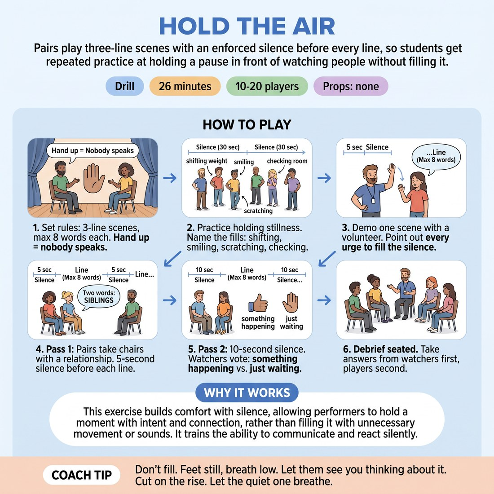

# 🎲 Drill A — isolation — Hold the Air

{ .infographic }

> Pairs play three-line scenes with an enforced silence before every line, so students get repeated practice at holding a pause in front of watching people without filling it.

`Players 10–20` · `~20 min` · `Complexity 4/5` · `Energy low` · `Contact none` · `Props: none`

⬅️ [Back to the Week 06 run-sheet](../week-06.md)

## Why this activity, here

Week 6 is about pacing, edits and the shape of a set. Before students can cut a scene on the rise, they have to survive the moment before the cut. This is the isolation drill: strip everything out except the gap. It comes after the warm-up and before the group-edit work, so that when a set is running later in the day the pause is already familiar territory rather than an emergency. It feeds directly into the second half of the cue — letting the quiet one breathe — because you cannot give someone else air if silence makes you panic.

## What students actually learn

- A five-second pause in front of watching people feels like thirty and lasts five. Once they have felt that mismatch, they stop pre-empting it.
- Silence is a place you can do something in, not a hole to be plugged.
- Fewer words, later, land harder than more words, sooner.
- Watching a pause is a skill too — they start to tell an alive silence from a stalled one.

## Setup

Two chairs facing each other, angled slightly out, at the front. Everyone else in a loose arc of chairs, close enough that the players can see faces. Clear floor space for the whole room to stand for the stillness step. You need nothing else — no music, no props. A timer or watch helps for the ninety-second cap but counting in your head is fine. Have eight or ten two-word relationships ready: 'divorcing neighbours', 'former bandmates', 'nurse, patient', 'landlord, tenant'. Keep them plain. If the relationship is clever, students play the joke instead of the gap.

## How to run it — 20 minutes

| Min | What you do |
|---:|---|
| 2 | Set the rules standing at the chairs. Three lines total per scene, shared between the pair, eight words maximum each. Hand up means silence and stillness — from players and from watchers. Say the word cap twice; it is the rule they forget. |
| 3 | Everyone stands, spread out, facing you. Hold stillness for thirty seconds. Name the fills you see out loud, flatly, without teasing: 'weight change', 'smile', 'scratch', 'looking at Dave'. Reset. Hold thirty seconds again. Most rooms are visibly quieter the second time. Say so. |
| 2 | Take a volunteer to the chairs and demo one scene yourself. Raise your hand for five seconds, drop it, take one line, raise it again. Narrate your own urges: 'I want to talk now.' 'I want to smile.' Let the volunteer take a line too. |
| 6 | Pass one. Pairs come up in turn. Give each a two-word relationship. Five-second floor before each of the three lines. Cut at ninety seconds if they overrun. Keep the changeovers brisk — next pair standing while the last pair sits down. |
| 5 | Pass two. New partners, ten-second floor. After each scene, watchers vote immediately: thumb up if something was happening in the silence, flat hand if it was just waiting. Do not discuss the votes yet. Move straight to the next pair. |
| 2 | Everyone sits. Debrief. Watchers speak first, players second. Two questions, no more. End by saying the cue aloud and hold the room silent for five seconds before you move on. |

## Side-coaching script

| When | Say |
|---|---|
| During the thirty-second stillness holds | *"Feel the itch. Don't serve it."* |
| When a player speaks before your hand drops | *"Wait for the drop."* |
| When a player smiles or shrugs through the pause | *"Face still. Eyes on your partner."* |
| When the silence looks blank rather than loaded | *"Decide something in there."* |
| Just before you drop your hand | *"Let the line cost you."* |
| When lines start creeping past eight words | *"Shorter. Cut it in half."* |
| When watchers start filling the pause with laughter or noise | *"Silent house."* |
| At the third line, or at the ninety-second cap | *"That's three. Sit down."* |

!!! success "What good looks like"
    The room gets quieter as the drill goes on. In pass one the pauses look uncomfortable and people bail early. By pass two, at least half the pairs are holding ten seconds with their eyes on each other and their faces doing something. Lines get shorter without you asking. Watchers stop shifting in their seats and start leaning in. The votes split — some thumbs, some flat hands — and the room agrees on which was which. Nobody has made a joke to escape the silence. When you say the cue at the end, the five seconds of quiet you hold feels ordinary rather than awkward.

## When it goes wrong

| You see | What's causing it | The fix |
|---|---|---|
| Watchers laugh or make noise every time the pause stretches. | The room is discharging its own discomfort on the players' behalf. It is contagious and it kills the drill. | Stop the scene. Say 'Silent house' and mean it. Tell the watchers their job is to hold the same pause the players are holding. Restart that pair from the top. |
| Lines run to twenty words and become explanations. | Students are compensating for the silence by front-loading everything they were holding in. | Enforce the cap out loud mid-scene: 'Shorter. Cut it in half.' For the next pair, count the words on your fingers where they can see you. It stings once, then the room complies. |
| Pairs hold the pause perfectly and the votes are all flat hands — nothing was happening. | They have learned to wait, not to play. Waiting is compliance, not pacing. | Before the next scene say: 'In the silence, want something from them.' Give the pair the relationship plus one word of want — 'apology', 'money', 'forgiveness'. That single word usually fills the gap. |
| Nervous pairs rush all three lines in the first twenty seconds and sit down. | Performance anxiety in front of a watching room, not misunderstanding of the rules. | Bring them straight back up. Stand beside them with your hand raised and take the count yourself, out loud: 'five, four, three...' Externalising the count removes the decision from them. |

## Scaling

| Class size | What changes |
|---|---|
| **10–13** | One playing area, everyone watches. Five or six pairs. Every pair goes in both passes. Keep pass-one scenes to sixty seconds and you will finish comfortably. |
| **14–17** | Split the watchers into two arcs and set up two playing areas at opposite ends of the room. Appoint a reliable student as hand-raiser for the second area after you have demoed. Run both simultaneously in pass one; bring everyone back to one area for pass two so the whole room votes together. Seven or eight pairs total. |
| **18–20** | Three areas, three hand-raisers — you take one, brief two students during the stillness step. All three run simultaneously for pass one. For pass two, run only five or six pairs in front of the whole room and let the rest be watchers and voters; tell them plainly they are voting, not queuing. Nobody misses out on pass one. |

## Variations

**Two lines, three seconds** — Drop to two spoken lines per scene and a three-second floor. Play it seated in simultaneous pairs with no watchers at all, everyone at once, you calling the drop for the whole room.  
*Easier. Removes the watching room, which is where most of the fear lives. Use it if the first pass collapses into rushing.*

**One line each, unpredictable floor** — Two lines total, one each, and you vary the floor between five and twenty-five seconds without telling them. Players cannot count themselves down.  
*Harder. They have to stay live in the pause instead of enduring a known quantity. Only run this after a clean pass two.*

**The watcher holds the hand** — A watcher, not you, raises and drops the hand for each scene. They decide when the pause is finished. Rotate the hand each scene.  
*Different emphasis. Moves the skill from holding a pause to reading one — which is exactly what cutting on the rise requires later in the session.*

## Debrief

1. **Watchers first — which silence had something in it, and what did you actually see?**
   > *A good answer sounds like:* Specific and physical: 'she was deciding whether to say it', 'he looked away and then came back'. Not 'it felt tense'. If the answers are all about atmosphere, push once for what the body was doing, then move on.

2. **Players — how long did the ten-second pause feel?**
   > *A good answer sounds like:* Longer than it was, and they say so with some surprise. Someone naming the exact moment they nearly bailed. When two or three people compare their internal count to the real one, you have what you need.

3. **What did you cut, and did the scene miss it?**
   > *A good answer sounds like:* 'I had a whole explanation and it turned out I didn't need it.' They notice the eight-word cap did the work for them. If nobody offers this, say it yourself and move to the next block.

!!! warning "Safety & inclusion"
    No contact in this drill. The stillness step can be done seated — say so before you start it, not after, and do not single anyone out. If someone cannot comfortably stand for thirty seconds, they hold stillness in a chair and the exercise is identical. The hand cue is visual; if anyone in the room has limited sight, replace it with a single spoken word — 'now' — for every scene, so the cue is the same for everybody. Sustained eye contact is part of the pause; tell players they can look at their partner's mouth or chin instead if held eye contact is difficult, and that this is not a lesser version. Anyone who does not want to take the chairs stays a watcher and votes; ask privately at the break rather than making them decline in front of the room. Watch for the pair who use the silence to stare each other down competitively — break that up early, it is not the drill.

## Why it works

Pacing and rhythm are usually taught as a property of the scene, so students try to control tempo by choosing different words. That does not work, because the thing setting their tempo is their own tolerance for the gap. This drill removes every variable except the gap. The word cap makes filling impossible, the raised hand takes the timing decision out of the player's hands, and the watching room supplies the exact social pressure that normally causes rushing. Held twice, at five seconds and then ten, the pause recalibrates: students learn by direct comparison that their internal clock runs fast under observation. The vote at the end does the second half of the job — it forces the room to distinguish a silence with intention inside it from dead air, which is the discrimination they need in order to cut on the rise rather than cutting on the first sign of quiet.

[Open the full activity card »](../../library/drills/DR__hold-the-air.md){target=_blank rel=noopener}
