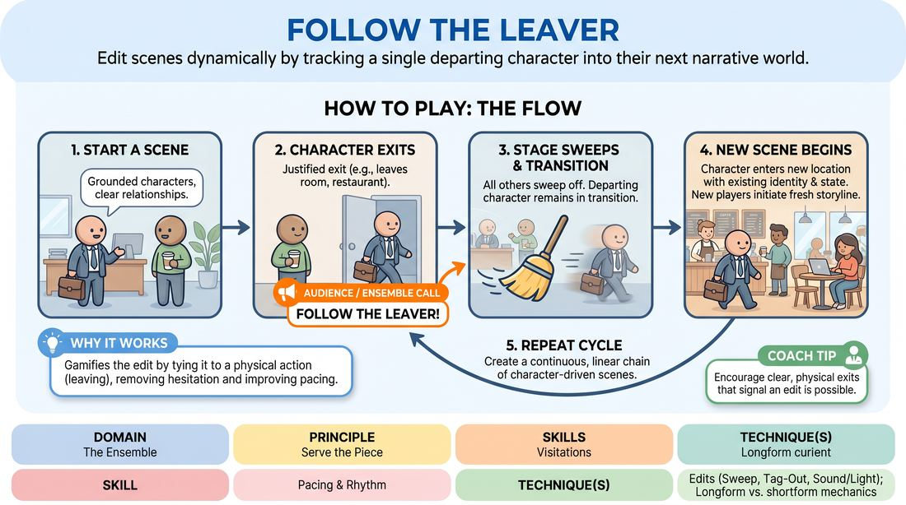

# 🎲 Drill B — under load — Follow the Leaver

{ .infographic }

> Edit scenes dynamically by tracking a single departing character into their next narrative world.

`Players 3–99` · `~20 min` · `Complexity 4/5` · `Energy medium` · `Contact none` · `Props: none`

⬅️ [Back to the Week 06 run-sheet](../week-06.md)

## Why this activity, here

Week 6 sits on pacing and edits. Drill A has already given them the sweep as a clean mechanical wipe. This one attaches the edit to a story reason — a character walks, so the scene ends — and makes them cut while energy is still climbing. It feeds the second half of the session, where they run a full set and have to decide, live, when a scene is done.

## What students actually learn

- They stop waiting for a scene to finish itself and start noticing the moment a character has a reason to go.
- They find that carrying one emotional state into a new room is easier and richer than inventing a new one.
- They get used to being edited mid-momentum without reading it as rejection.

## Setup

Clear playing space with two clean entrances. Watchers stand in a loose horseshoe on their feet, not seated — they need to enter fast. No chairs onstage. Have a timer visible to you. If the room is narrow, mark the exit line with tape so a departure reads as a departure.

## How to run it — 20 minutes

| Min | What you do |
|---:|---|
| 3 | Explain the shape and demo it. You play a character who walks out of a scene; have two volunteers sweep and two more meet you somewhere new. Cut the demo after one handover. |
| 4 | First chain. Start two players. Run four or five links. Let exits be slightly clumsy — you are only training the reflex to call 'Follow the leaver!' and sweep together. |
| 1 | Stop. One note only: the leaver keeps their name and their mood. Nothing resets at the doorway. |
| 5 | Second chain, fresh starting pair. Now insist the exit is justified in the dialogue before the feet move. Side-coach the sweep so it is instant. |
| 1 | Stop. Second note: cut on the rise, not the collapse. Ask who felt cut off — tell them that is the target. |
| 5 | Third chain. Everyone who has not yet been the traveller enters first. Push for shorter links — ninety seconds a scene, maximum. |
| 1 | Call the last exit. Let the traveller walk offstage into nothing. Shake out, re-form the ring for debrief. |

## Side-coaching script

| When | Say |
|---|---|
| A scene is establishing and nobody is committing to a place | *"Name the room."* |
| An exit is being telegraphed but the player is lingering | *"Go now. Feet first."* |
| The watchers hesitate on the call | *"Call it together — loud."* |
| Onstage players drift off slowly after the call | *"Sweep. Clean and gone."* |
| The traveller drops their emotional state on arrival | *"You brought the mood with you."* |
| A scene is climbing and everyone is enjoying it | *"Cut on the rise."* |
| A new entrant is talking over the traveller | *"Let the quiet one breathe."* |
| Links are running long in the final chain | *"Find your reason to leave."* |

!!! success "What good looks like"
    A continuous line of scenes with no dead air between them. Exits are spoken about a beat before they happen — someone says they are done, then goes. The traveller arrives in the new place still carrying the last argument in their shoulders, and the new characters play off that without asking what happened. Scenes end while they are still interesting. The watchers' call is one voice, not a ragged trickle.

## When it goes wrong

| You see | What's causing it | The fix |
|---|---|---|
| Exits happen every twenty seconds, before any relationship exists | Players have learned that leaving is the game, so they leave to get a turn | Set a floor. No exit until both characters have used each other's name and the place is established. Enforce it out loud during the chain. |
| The traveller arrives somewhere new and is suddenly cheerful and neutral | They are treating the transition as a scene wipe rather than a walk | Stop and rerun the last handover. Have them walk the whole distance in character, muttering, before anyone enters. |
| Nobody exits and the scene runs four minutes | Players are waiting for a perfect, justified reason and rejecting every ordinary one | Tell them the reason can be boring — a shift ending, a bus, a phone call. Call 'find your reason to leave' and accept the first one offered. |
| Two people sweep on and both talk immediately, burying the traveller | Eagerness plus no plan for who leads | Cap entrants at two, and rule that the traveller speaks first in every new scene. The cue is 'let the quiet one breathe'. |

## Scaling

| Class size | What changes |
|---|---|
| **10–13** | One playing group, everyone in the same watching ring. Run three chains of five or six links. Every person should travel at least once — track it on your fingers and seed the last chain with whoever has not. |
| **14–17** | Split into two rings on opposite sides of the room, each with its own playing area. Run the same clock; you float between them. Two chains each, six links apiece. Bring both together for the debrief only. |
| **18–20** | Two rings, and shorten every link — ninety seconds hard cap from the first chain onward. Add a third chain per ring by cutting your demo to two minutes and folding the second note into side-coaching instead of stopping. |

## Variations

**Named exit** — Before the chain starts, the group agrees the leaver must say a full sentence about where they are going as they leave. The new scene must be that place.  
*easier — removes the guesswork from the transition and lets nervous players plan the landing*

**Two travellers** — When a character exits, a second character may follow them out. Both carry forward, arriving in the new place together, and the ensemble enters around them.  
*harder — the pair must maintain their relationship across the cut while absorbing new people*

**Same room, later** — Instead of a new location, the traveller arrives in the same location at a different time. Entrants play whoever is there now.  
*different emphasis — moves the work from character continuity to time and consequence*

## Debrief

1. **When you were the traveller, what did you actually carry across the cut?**
   > *A good answer sounds like:* Something concrete and small — a grudge, a sore foot, the sentence they never got to finish — rather than 'my character'. If they name a feeling and a physical trace, move on.

2. **Which cut felt too early?**
   > *A good answer sounds like:* Someone names a scene they wanted to keep playing, and someone else says that scene was the best thing in the set. That pairing is the lesson; do not explain it further.

3. **What made an exit believable versus arbitrary?**
   > *A good answer sounds like:* They point at dialogue — the leaving was set up in the talk a beat before the feet moved. Weak answers say 'they just went'.

4. **How did it feel to be swept off mid-sentence?**
   > *A good answer sounds like:* Honest irritation, then recognition that the set moved better for it. You want the irritation named out loud rather than politely skipped.

!!! warning "Safety & inclusion"
    No contact is required. If a scene drifts towards grabbing or blocking an exit, call the edit early. Anyone can stay in the watching ring and only make the call — say this at the top and mean it. Exits involving storming out can carry real charge for some people; keep the emotional register at everyday conflict, not violence, and cut anything that heats past that. Watchers stand, but a chair at the edge is fine for anyone who needs it.

## Why it works

Pacing fails when players wait for a natural ending, because scenes rarely produce one before they sag. This drill removes the decision from taste and hands it to a physical event: someone walks, so the scene is over. The edit becomes visible and shared rather than a private judgement. Because the traveller continues, the cut costs nothing narratively — nothing is lost, only relocated — which lowers the fear of cutting early. Repeat that under a clock and players stop grieving scenes and start trusting the rise.

[Open the full activity card »](../../../../games/D4_P3_S4_T1_G1073__follow-the-leaver.md){target=_blank rel=noopener}
