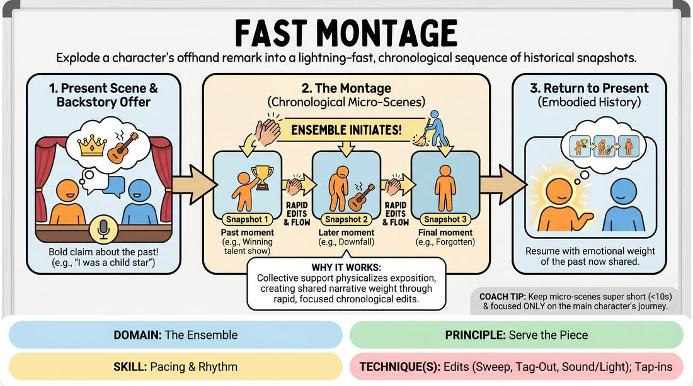

# 🎯 Scene Lab — Rapid Backstory Montage

{ .infographic }

> Explode a character's offhand remark into a lightning-fast, chronological sequence of historical snapshots.

`Players 3–99` · `~35 min` · `Complexity 4/5` · `Energy high` · `Contact none` · `Props: none`

⬅️ [Back to the Week 06 run-sheet](../week-06.md)

## Why this activity, here

Week 6 is about where a set breathes and where it cuts. The earlier blocks built edit hygiene and single-scene stamina. This one puts edits under time pressure while keeping one throughline intact, so the ensemble learns that speed is a rhythm choice rather than panic. It feeds the second-half set work, where montages will need to open and close without a facilitator counting.

## What students actually learn

- They stop treating an edit as an interruption and start hearing it as punctuation.
- They find out that a character's throwaway line is usable material, not decoration.
- They learn to enter a scene as furniture — useful, brief, unattached to being noticed.
- They feel the difference between a snapshot that lands and one that explains itself.

## Setup

Clear a playing space with a defined backline — a wall, a taped line, or a row of chairs pushed back. Everyone stands; no seats during play. You need nothing else. Before the first round, run the consent step: demonstrate the shoulder tag-out and the no-contact clap edit, then ask anyone who prefers not to be touched to raise a hand now or say "clap" at any point. Note who raised a hand and use clap edits with them throughout. Nobody explains why.

## How to run it — 35 minutes

| Min | What you do |
|---:|---|
| 3 | Frame it: one scene, one claim about the past, then a fast run of snapshots in order, then back. Demonstrate the three edit types — clap, sweep, shoulder tag. Run the consent step. |
| 4 | Dry-run the mechanics with no scene. You call a claim ("I used to run a lighthouse"). Backline builds four five-second snapshots, editing between each. Run it twice with different backlines. |
| 7 | First full cycle. Two players start a scene; you side-coach the claim if it does not arrive by sixty seconds. Backline montages, returns, scene resumes. Run two cycles, new pairs. |
| 7 | Second round. No prompting from you — the pair must find their own claim. Two cycles. Between them, name one snapshot that worked and say why in a sentence. |
| 6 | Tighten. Cap it at three snapshots. Tell the backline to cut on the rise — edit while the moment is still climbing, never after it settles. Two fast cycles. |
| 5 | Final round. The claim must belong to the quieter of the two characters. Give the return scene thirty seconds of near-silence before anyone speaks. One cycle, maybe two. |
| 3 | Gather in. Debrief standing. Two questions maximum, then move on. |

## Side-coaching script

| When | Say |
|---|---|
| Backline hesitates after a claim lands | *"Edit now. Don't check with anyone."* |
| A micro-scene starts explaining itself | *"One image. Cut."* |
| Snapshots are drifting off the main character | *"Whose past is this? Back to them."* |
| A snapshot is peaking | *"Cut on the rise."* |
| Supporting players start naming themselves and building relationships | *"You're scenery. Two lines and out."* |
| The timeline jumps around | *"Forward only. Next year."* |
| The pair resumes the original scene too brightly | *"Carry it. You know now."* |
| The quiet character's scene restarts | *"Let the quiet one breathe."* |

!!! success "What good looks like"
    A claim drops and the backline is already moving — no glance around, no negotiation. Snapshots are pictures, not conversations: a boy at an audition, a poster peeling, a man at a bus stop. Each edit arrives half a second before the room is ready. The return to the original scene is quieter than it was, and both players are playing a history rather than referring to one. The whole cycle takes under ninety seconds.

## When it goes wrong

| You see | What's causing it | The fix |
|---|---|---|
| Long pause after the claim; backline players look at each other. | Nobody has taken responsibility for the first edit, and the group is waiting for permission. | Assign a named first-edit player for the next two cycles. After that, remove the assignment — the hesitation usually does not return. |
| Micro-scenes running twenty or thirty seconds and turning into dialogue. | Players are trying to make each snapshot funny or complete instead of showing one moment. | Stand at the edge and clap the edit yourself for one full cycle. Then hand it back. Tell them: one image, one shift, out. |
| Supporting players inventing names, backstories and ongoing relationships. | Habit from two-person scene work — everyone wants a character. | Cap entries at two lines. Anyone entering must be defined only by function: the teacher, the buyer, the nurse. |
| The original scene resumes exactly as before, history ignored. | The pair mentally left the scene during the montage and are restarting from memory of the last line. | Tell the two centre players to watch every snapshot from the edge of the space, not the backline. Give the return three seconds of silence before speech. |

## Scaling

| Class size | What changes |
|---|---|
| **10–13** | One backline, one playing space. Run six to seven full cycles total across the block so most people play centre once. Everyone stays standing throughout. |
| **14–17** | Split into two groups in opposite corners for the dry-run and the first round, each with its own backline and its own edits. Bring them together for the tighten and final rounds — one stage, the other group watches. |
| **18–20** | Two permanent groups, two spaces, running in parallel for everything except the final round. You circulate, side-coaching each in turn. For the last round, both groups watch one cycle each — four cycles total, two per group. |

## Variations

**Fed claim** — You supply the claim on a slip to one player before the scene starts. They must work it in naturally within the first minute.  
*Easier — removes the pressure of inventing a strong claim under scene pressure, so the group can focus purely on edit speed.*

**Two histories** — After the first montage returns, the second character makes a claim of their own. The backline montages that too, then returns to a scene now carrying both.  
*Harder — doubles the material the pair must hold and tests whether the return can absorb two weights without collapsing.*

**Silent montage** — Every micro-scene is played without speech. Snapshots are physical images only, held for three seconds, then edited.  
*Different emphasis — moves the work from dialogue economy to physical clarity and forces the backline to trust an image.*

## Debrief

1. **When did an edit come too late?**
   > *A good answer sounds like:* Someone names a specific snapshot and says the moment had already peaked — the extra seconds added information but drained energy. Not a general observation about speed.

2. **What changed in the original scene when you came back?**
   > *A good answer sounds like:* A player describes something concrete: their voice dropped, they stopped defending, they suddenly understood what the other character meant. Not "it felt deeper".

3. **What was it like entering as nobody?**
   > *A good answer sounds like:* Relief, usually — someone says it was easier than they expected once they stopped trying to be interesting. Move on quickly if the room agrees.

!!! warning "Safety & inclusion"
    Tag-outs involve a hand on the shoulder. Run the consent step before the first round and offer the clap edit as a full equivalent, not a lesser option. Anyone may say "clap" mid-activity with no explanation. Sweeps mean bodies crossing the space fast — set a walking pace limit and keep the backline clear of chairs and bags. Standing is default; anyone who needs to sit takes a chair on the backline and edits by clap from there, which works fine. Claims about the past can drift towards real trauma; if a player's claim lands close to something real, side-coach the montage towards the external events rather than the interior, and do not press it in the debrief.

## Why it works

Pacing is a group decision made in fractions of a second, and it cannot be taught by discussion. This block removes the choice of *whether* to edit — the claim obliges the backline to move — so the only remaining variable is *when*. That isolates timing from courage. Because the montage is chronological and single-focus, the group cannot solve a late edit by adding content; a slow snapshot simply feels slow, and everyone in the room registers it at once. The return to the original scene supplies the reason for the discipline: the faster and cleaner the montage, the more weight arrives back in the scene. That is the session cue in practice — cut on the rise, and let the scene you return to hold the quiet.

[Open the full activity card »](../../../../games/D4_P3_S4_T1_G1063__fast-montage.md){target=_blank rel=noopener}
